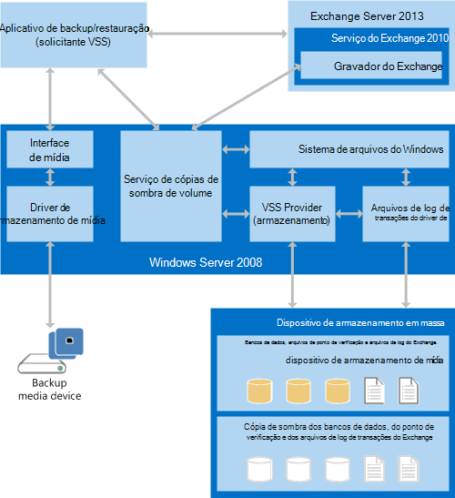

# Criar aplicativos de backup e restauração para o Exchange 2013Build backup and restore applications for Exchange 2013

Encontre informações sobre os componentes e arquitetura de aplicativos de backup e restauração para o Exchange 2013 e os requisitos do sistema para a criação de um aplicativo de backup e restauração.Find information about the components and architecture of backup and restore applications for Exchange 2013, and the system requirements for creating a backup and restore application.
  
**Aplica-se a:** Exchange Server 2013**Applies to:** Exchange Server 2013 
  
Você pode usar o [serviço de cópias de sombra de volume (VSS)](https://msdn.microsoft.com/library/bb968832%28VS.85%29.aspx) em versões do Windows Server começando com o windows Server 2008 para criar aplicativos que façam backup e restauração de dados do Exchange Server 2013.You can use the [Volume Shadow Copy Service (VSS)](https://msdn.microsoft.com/library/bb968832%28VS.85%29.aspx) in versions of Windows Server starting with Windows Server 2008 to create applications that back up and restore Exchange Server 2013 data. O VSS fornece uma infraestrutura que permite que você crie e gerencie cópias de sombra em sistemas de gerenciamento de armazenamento, aplicativos de negócios e hardware de terceiros.VSS provides an infrastructure that enables you to create and manage shadow copies across third-party storage management systems, business applications, and hardware. Você pode criar soluções baseadas na infraestrutura VSS que usam cópias de sombra para fazer backup e restaurar um ou mais bancos de dados do Exchange 2013.You can create solutions based on the VSS infrastructure that use shadow copies to back up and restore one or more Exchange 2013 databases. 
  
## Pré-requisitos de backup e restauração do aplicativoBackup and restore application prerequisites

Para seu aplicativo de backup e restauração personalizado e o VSS para fazer backup e restaurar os bancos de dados do Exchange 2013, seu ambiente deve incluir o seguinte:In order for your custom backup and restore application and VSS to back up and restore Exchange 2013 databases, your environment must include the following:
  
- Uma versão do Windows Server começando com o Windows Server 2008A version of Windows Server starting with Windows Server 2008 
    
- Exchange 2013Exchange 2013
    
Além disso, se você estiver criando um aplicativo de backup e restauração, você deve estar ciente das seguintes restrições no ambiente de desenvolvimento:In addition, if you are creating a backup and restore application, you should be aware of the following restrictions on the development environment:
  
- VSS é uma API COM não gerenciada que pode ser acessada a partir do código gerenciado do .NET Framework por meio de um assembly de interoperabilidade COM.VSS is an unmanaged COM API that can be accessed from .NET Framework managed code via a COM Interop Assembly.
    
- O Shell de gerenciamento do Exchange é um aplicativo gerenciado que é acessado por meio do código gerenciado do .NET Framework.The Exchange Management Shell is a managed application that is accessed via .NET Framework managed code.
    
- A API CHKSGFILES fornecida com o Exchange 2013 é uma DLL de código nativo de 64 bits.The CHKSGFILES API that is supplied with Exchange 2013 is a native-code 64-bit DLL. O uso da DLL de CHKSGFILES de bits do Exchange 2007 32 com bancos de dados do Exchange 2013 não é suportado.Use of the Exchange 2007 32-bit CHKSGFILES DLL with Exchange 2013 databases is not supported.
    
## Visão geral do aplicativo de backup e restauraçãoBackup and restore application overview

O VSS coordena a comunicação entre os seguintes componentes:VSS coordinates communication between the following components: 
  
- O solicitante VSS, que é seu aplicativo de backupThe VSS requester, which is your backup application
    
- O gravador VSSThe VSS writer
    
- O VSS Provider, que é o sistema, software ou componentes de hardware que criam cópias de sombraThe VSS provider, which is the system, software, or hardware components that create the shadow copies
    
Para usar o VSS para fazer o backup dos dados do Exchange 2013, seu aplicativo de backup deve ser um solicitador de VSS com reconhecimento de 2013 do Exchange.To use VSS to back up Exchange 2013 data, your backup application must be an Exchange 2013-aware VSS requester. O Exchange 2013 inclui um gravador VSS, chamado Microsoft Exchange Writer, para o programa de backup do Windows Server; no entanto, o gravador do Exchange apenas faz o backup de volumes inteiros.Exchange 2013 includes a VSS writer, called the Microsoft Exchange Writer, for the Windows Server backup program; however, the Exchange writer only backs up whole volumes. Não faz backup de bancos de dados individuais do Exchange 2013.It does not back up individual Exchange 2013 databases. Se você precisar de mais flexibilidade, pode usar um aplicativo de backup de terceiros que tenha um gravador VSS com reconhecimento do Exchange que possa funcionar com bancos de dados individuais do Exchange ou pode criar um solicitante VSS personalizado.If you need more flexibility, you can use a third-party backup application that has an Exchange-aware VSS writer that can work with individual Exchange databases, or you can create a custom VSS requester.
  
Antes que o aplicativo chame o VSS para iniciar um backup, ele deve obter informações sobre a configuração de armazenamento para o sistema do Exchange 2013 em que está fazendo o backup.Before your application calls VSS to initiate a backup, it must obtain information about the storage configuration for the Exchange 2013 system that it is backing up. Essas informações são armazenadas nos serviços de domínio do Active Directory (AD DS).That information is stored in Active Directory Domain Services (AD DS). O aplicativo de backup pode obter dados de configuração de armazenamento do Exchange usando os comandos do Shell de gerenciamento do Exchange.Your backup application can get Exchange storage configuration data by using Exchange Management Shell commands. Para obter mais informações, consulte [Exchange Server PowerShell (Shell de gerenciamento do Exchange)](https://docs.microsoft.com/powershell/exchange/exchange-server/exchange-management-shell?view=exchange-ps).For more information, see [Exchange Server PowerShell (Exchange Management Shell)](https://docs.microsoft.com/powershell/exchange/exchange-server/exchange-management-shell?view=exchange-ps). 
  
Os aplicativos de backup do Exchange 2013 chamam as APIs COM VSS para criar backups completos, de cópia, diferencial e incremental dos bancos de dados do Exchange; Eles não interagem diretamente com o gravador VSS.Exchange 2013 backup applications call the VSS COM APIs to create full, copy, differential and incremental backups of Exchange databases; they do not interact directly with the VSS writer. A funcionalidade do DAG (grupo de disponibilidade de banco de dados) no Exchange também permite que o aplicativo crie um backup totalmente consistente, mesmo que o backup completo inicial e os backups incrementais mais recentes sejam provenientes de servidores diferentes no DAG.The Database Availability Group (DAG) functionality in Exchange also enables your application to create a fully consistent backup, even if the initial full backup and later incremental backups come from different servers in the DAG. Depois que o VSS cria a cópia dos dados do Exchange, o aplicativo de backup armazena os dados na mídia pretendida.After VSS creates the copy of the Exchange data, your backup application stores the data onto the intended media.
  
Para restaurar um banco de dados do Exchange 2013, o aplicativo de restauração recupera o banco de dados e os arquivos de log da mídia de backup e os armazena no armazenamento em disco ativo de um servidor Exchange.To restore an Exchange 2013 database, your restore application retrieves the database and log files from the backup media, and stores them on the active disk storage of an Exchange server. Bancos de dados individuais não são associados a um servidor Exchange específico.Individual databases are not associated with a particular Exchange server. 
  
Os aplicativos de backup e restauração devem especificar vários parâmetros específicos do Exchange 2013 para controlar e gerenciar corretamente as operações executadas pelo VSS em bancos de dados do Exchange 2013.Backup and restore applications must specify a number of Exchange 2013-specific parameters to correctly control and manage operations run by VSS against Exchange 2013 databases. Por exemplo, como o Exchange 2013 suporta até 100 bancos de dados ativos simultaneamente, o aplicativo de backup deve especificar corretamente e processar o arquivo de banco de dados, os arquivos de log de transações e os componentes de banco de dados de arquivos de ponto de verificação.For example, because Exchange 2013 supports up to 100 simultaneously active databases, the backup application must correctly specify and process the database file, transaction log files, and checkpoint file database components.
  
Para reconstruir um banco de dados que tinha alterações desde o último backup completo, o aplicativo de restauração requer bancos de dados e arquivos de log de diferentes backups.To reconstruct a database that had changes since the last full back, your restore application requires database and log files from different backups. Por exemplo, pode exigir um backup completo semanal e um ou mais backups incrementais diários.For example, it might require a weekly full backup and one or more daily incremental backups. Nos sistemas Exchange 2013 que usam o DAGs, o aplicativo de restauração pode recriar um banco de dados usando backups de diferentes cópias de banco de dados em diferentes servidores no mesmo DAG.In Exchange 2013 systems that use DAGs, your restore application can rebuild a database by using backups from different database copies on different servers in the same DAG. No entanto, a única maneira compatível de restaurar um banco de dados do DAG do backup é restaurar todas as cópias ativas e passivas do banco de dados usando os mesmos dados.However, the only supported way to restore a DAG database from backup is to restore all active and passive copies of the database by using the same data.
  
Depois que todos os dados estiverem no local, o aplicativo de restauração sinalizará o Exchange para verificar a integridade dos arquivos de banco de dados e de log.After all the data is in place, your restore application signals Exchange to check the integrity of the database and log files. Se o banco de dados e os arquivos de log tiverem sido restaurados corretamente, o servidor do Exchange poderá repetir os arquivos de log do banco de dados para atualizar o banco de dados e montá-lo.If the database and log files have been restored correctly, the Exchange server can then replay the database log files to bring the database up to date and mount it. Se o banco de dados tiver sido recuperado para um servidor que já tenha uma cópia ativa do banco de dados montado, o banco de dados será tratado como um banco de dados de recuperação.If the database has been recovered to a server that already has an active copy of the database mounted, the database is treated as a recover database. Se o banco de dados tiver sido recuperado em um servidor diferente, o banco de dados pode ser montado independentemente, ou essa réplica pode ser adicionada ao DAG.If the database has been recovered onto a different server, the database can either be independently mounted, or that replica can then be added into the DAG.
  
## Arquitetura do sistema de backup e restauraçãoBackup and restore system architecture

O VSS se comunica com o sistema de arquivos do Windows Server e com o driver de dispositivo de armazenamento em massa por meio de um provedor de terceiros (ou personalizado).VSS communicates with the Windows Server file system and with the mass storage device driver through a third-party (or custom) provider. O provedor de hardware determina onde a cópia de sombra será criada.The hardware provider determines where the shadow copy will be created. O VSS abstrai a cópia de sombra específica de hardware para que seu aplicativo de backup e restauração possa acessar a cópia de sombra sem informações sobre os detalhes de implementação de hardware.VSS abstracts the hardware-specific shadow copy so that your backup and restore application can access the shadow copy without information about the hardware implementation details. A figura a seguir mostra como o aplicativo de backup e restauração interage com o Exchange 2013 e o Windows Server.The following figure shows how your backup and restore application interacts with Exchange 2013 and Windows Server.
  
**Figura 1. Arquitetura do sistema de backup e restauração****Figure 1. Backup and restore system architecture**

  
O aplicativo de backup e restauração funciona como o solicitante VSS.The backup and restore application functions as the VSS requester. O solicitante se comunica com o VSS para obter informações sobre o Exchange 2013, para iniciar a criação de cópias de sombra e para obter acesso aos dados do backup.The requester communicates with VSS to obtain information about Exchange 2013, to initiate the creation of shadow copies, and to gain access to the data for backup. 
  
O repositório do Exchange é um componente do Exchange 2013 e acessa os bancos de dados do Exchange 2013 por meio do sistema de arquivos do Windows Server.The Exchange store is a component of Exchange 2013 and accesses Exchange 2013 databases through the Windows Server file system. No sistema de arquivos, cada servidor do Exchange pode montar simultaneamente até 100 bancos de dados com os arquivos de banco de dados (. edb) que o acompanham, os arquivos de log de transações e um arquivo de ponto de verificação.Within the file system, each Exchange server can simultaneously mount up to 100 databases with their accompanying database (.edb) files, transaction log files, and a checkpoint file.
  
Para oferecer suporte ao VSS, o Exchange 2013 inclui um gravador do Exchange que é integrado ao repositório do Exchange.To support VSS, Exchange 2013 includes an Exchange writer that is built in to the Exchange store. O gravador do Exchange coordena com o repositório do Exchange (operando em nome do solicitante) para congelar e desmontar o banco de dados antes de fazer o backup e depois descongelar e montar o banco de dados após a conclusão do backup.The Exchange writer coordinates with the Exchange store (operating on behalf of the requester) to freeze and dismount the database before backing it up, and then to unfreeze and mount the database after the backup is complete. Durante uma restauração, o aplicativo de backup e restauração instrui o gravador do Exchange a coordenar com o repositório do Exchange para desmontar o banco de dados, substituir os arquivos de banco de dados, montar o banco de dados e repetir os logs de transação (conforme necessário).During a restore, your backup and restore application instructs the Exchange writer to coordinate with the Exchange store to dismount the database, replace the database files, mount the database, and then replay the transaction logs (as needed).
  
Durante uma restauração, o solicitante também se comunica com o VSS para preparar o sistema para a restauração e, em seguida, colocá-los novamente no dispositivo de armazenamento em massa.During a restore, the requester also communicates with VSS to prepare the system for the restore, and then to put the data back onto the mass storage device. O aplicativo de backup e restauração também é responsável por trabalhar com o Windows Server para ler e gravar dados na mídia de armazenamento de backup, seja um arquivo morto em fita, uma rede de área de armazenamento ou outra mídia de backup.Your backup and restore application is also responsible for working with Windows Server to read data from and write data to the backup storage media, whether a tape archive, a storage area network, or other backup medium.
  
O banco de dados restaurado pode ser montado como um banco de dados ativo normal ou como o banco de dados de recuperação do Exchange 2013.The restored database can be mounted either as a regular, active database, or as the Exchange 2013 recovery database. Apenas um banco de dados montado pode ser designado como um banco de dados de recuperação em cada servidor Exchange.Only one mounted database can be designated as a recovery database on each Exchange server.
  
As informações necessárias para concluir com êxito as operações de backup e restauração entre o Exchange 2013, VSS e o aplicativo de backup e restauração são transferidas como parte dos metadados do gravador do Exchange.Information required to successfully complete backup and restore operations among Exchange 2013, VSS, and your backup and restore application is transferred as part of the Exchange writer metadata.
  
## Nesta seçãoIn this section

- [Tipos de operações de backup para o Exchange 2013Types of backup operations for Exchange 2013](types-of-backup-operations-for-exchange-2013.md)
    
- [Restauração de bancos de dados do Exchange 2013Restoring Exchange 2013 databases](restoring-exchange-2013-databases.md)
    
- [Validar a integridade do backup usando a API CHKSGFILES no Exchange 2013Validate backup integrity by using the CHKSGFILES API in Exchange 2013](how-to-validate-backup-integrity-by-using-the-chksgfiles-api-in-exchange.md)
    
- [Validar a integridade do backup usando a ferramenta Eseutil no Exchange 2013Validate backup integrity by using the Eseutil tool in Exchange 2013](how-to-validate-backup-integrity-by-using-the-eseutil-tool-in-exchange-2013.md)
    
## Também consulteSee also

- [Backup e restauração para o ExchangeBackup and restore for Exchange](backup-and-restore-for-exchange-2013.md) 
- [Referência de classe função cchksgfilesCChkSGFiles class reference](cchksgfiles-class-reference.md) 
- [Serviço de cópias de sombra de volumeVolume Shadow Copy Service](https://msdn.microsoft.com/library/bb968832%28VS.85%29.aspx) 
- [Windows PowerShellWindows PowerShell](https://msdn.microsoft.com/library/dd835506%28v=vs.85%29.aspx)
    

