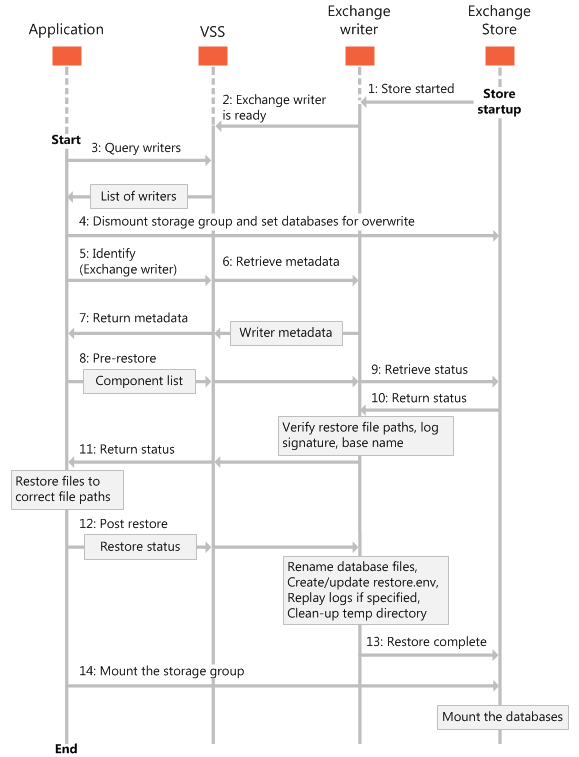

# Restauração de bancos de dados do Exchange 2013Restoring Exchange 2013 databases

Encontre informações sobre as diferentes maneiras de restaurar os bancos de dados do Exchange 2013.Find information about the different ways that you can restore your Exchange 2013 databases. 
  
**Aplica-se a:** Exchange Server 2013**Applies to:** Exchange Server 2013 
  
O gravador do Exchange incluído no Exchange Server 2013 permite alguma flexibilidade na forma como você restaura os bancos de dados do Exchange.The Exchange writer that is included in Exchange Server 2013 allows for some flexibility in how you restore your Exchange databases. Usando o gravador do Exchange no Exchange 2013, você pode restaurar seus backups de cópia de sombra para os seguintes locais:By using the Exchange writer in Exchange 2013, you can restore your shadow copy backups to the following locations:
  
- O banco de dados original, independentemente se a configuração de caminho do arquivo de log de transações ou banco de dados foi modificada.The original database, regardless of whether the database or transaction log file path configuration has been modified.
    
- Um banco de dados de recuperação.A recovery database.
    
- Qualquer banco de dados de produção, independentemente se o nome de exibição do banco de dados corresponder ao nome em um conjunto de backup VSS.Any production database, regardless of whether the database display name matches the name in a VSS backup set.
    
Quando o aplicativo de restauração restaura informações para o banco de dados original, os arquivos de log devem ser restaurados para o caminho de diretório especificado nos serviços de domínio do Active Directory (AD DS) desse banco de dados.When your restore application restores information to the original database, the log files must be restored to the directory path specified in Active Directory Domain Services (AD DS) for that database. Se o aplicativo restaura um banco de dados para um local diferente, os arquivos de log devem ser restaurados para uma pasta chamada **_restoredLogs** que esteja localizada dentro do diretório do arquivo de log do banco de dados.If your application restores a database to a different location, the log files must be restored to a folder named **_restoredLogs** that is located inside the database log file directory. 
  
Ao restaurar para um servidor ou banco de dados que é diferente do banco de dados original, o aplicativo de restauração deve garantir que os caminhos de diretório de banco de dados fornecidos ao VSS correspondam aos do AD DS.When restoring to a server or database that is different than the original database, your restore application must make sure that the database directory paths provided to VSS match those in AD DS. Você pode usar o cmdlet [Get-MailboxDatabase](https://technet.microsoft.com/library/bb124924%28v=exchg.150%29.aspx)do Shell de gerenciamento do Exchange para obter informações sobre os bancos de dados existentes.You can use the [get-MailboxDatabase](https://technet.microsoft.com/library/bb124924%28v=exchg.150%29.aspx)Exchange Management Shell cmdlet to get information about existing databases. Para obter mais informações sobre o Shell de gerenciamento do Exchange, consulte [Exchange Server PowerShell (Shell de gerenciamento do Exchange)](https://docs.microsoft.com/powershell/exchange/exchange-server/exchange-management-shell?view=exchange-ps).For more information about the Exchange Management Shell, see [Exchange Server PowerShell (Exchange Management Shell)](https://docs.microsoft.com/powershell/exchange/exchange-server/exchange-management-shell?view=exchange-ps). 
  
A figura a seguir mostra a sequência de eventos em uma restauração típica de um banco de dados do Exchange que é gerenciado pelo serviço de cópias de sombra de volume (VSS).The following figure shows the sequence of events in a typical restore of an Exchange database that is managed by the Volume Shadow Copy Service (VSS).
  
**Figura 1. Sequência de eventos para restauração de bancos de dados****Figure 1. Sequence of events for restoring databases**

  
## Restaurar os bancos de dados do Exchange para o local originalRestoring Exchange databases to the original location

O gravador do Exchange permite que os aplicativos restaurem os bancos de dados e os arquivos de log de transações em seus locais originais no servidor Exchange.The Exchange writer enables applications to restore databases and transaction log files to their original locations on the Exchange server. Por padrão, o gravador do Exchange repete os arquivos de log de transações depois que o solicitante confirmar que a restauração foi concluída durante a operação [OnPostRestore](https://msdn.microsoft.com/library/windows/desktop/aa381566%28v=vs.85%29.aspx) .By default, the Exchange writer replays the transaction log files after the requester confirms that the restore is complete during the [OnPostRestore](https://msdn.microsoft.com/library/windows/desktop/aa381566%28v=vs.85%29.aspx) operation. O aplicativo de restauração deve usar o método VSS [SetAdditionalRestores](https://msdn.microsoft.com/library/windows/desktop/aa382829%28v=vs.85%29.aspx) para evitar que os arquivos de log sejam reproduzidos.The restore application must use the VSS [SetAdditionalRestores](https://msdn.microsoft.com/library/windows/desktop/aa382829%28v=vs.85%29.aspx) method to prevent having the log files replayed. Os arquivos de log podem ser repetidos posteriormente quando o administrador do Exchange ou seu aplicativo remonta o banco de dados restaurado.The log files can be replayed at a later time when the Exchange administrator or your application remounts the restored database. 
  
Ao restaurar bancos de dados de volta para seus objetos de banco de dados originais (de modo que os GUIDs de destino do banco de dados correspondam àqueles no conjunto de backup), mas a caminhos de arquivo diferentes, o aplicativo deve determinar os caminhos de arquivo atuais e restaurar os arquivos de backup para os caminhos de arquivo correspondentes especificados nas propriedades do banco de dados.When restoring databases back to their original database objects (such that the target GUIDs in the database match those in the backup set) but to different file paths, the application must determine the current file paths and restore the backup files to the corresponding file paths specified in the database properties. O solicitante deve chamar o método [AddNewTarget](https://msdn.microsoft.com/library/windows/desktop/aa382648%28v=vs.85%29.aspx) para se comunicar com o gravador do Exchange o local onde os arquivos são restaurados antes que o gravador possa continuar com o restante do processo de restauração.The requester must call the [AddNewTarget](https://msdn.microsoft.com/library/windows/desktop/aa382648%28v=vs.85%29.aspx) method to communicate to the Exchange writer the location where the files are restored before the writer can continue with the rest of the restore process. Se **AddNewTarget** não for chamado, o gravador do Exchange assumirá que os backups são restaurados para os caminhos de arquivo especificados no documento de metadados de backup.If **AddNewTarget** is not called, the Exchange writer assumes that the backups are restored to the file paths specified in the backup metadata document. 
  
Normalmente, o aplicativo não precisa especificar um novo caminho para backups executados de uma cópia do DAG (grupo de disponibilidade de banco de dados).Typically, your application does not have to specify a new path for backups that are performed from a Database Availability Group (DAG) copy. Os administradores do Exchange normalmente não alteram os caminhos do arquivo de log ou do banco de dados.Exchange administrators do not usually change database or log file paths. No entanto, em uma configuração do DAG, o aplicativo de backup pode ter que especificar o banco de dados ativo e os caminhos de log, porque os caminhos de cópia do DAG são sempre diferentes desses caminhos.In a DAG configuration, however, the backup application might have to specify the active database and log paths, because DAG copy paths are always different from those paths.
  
Observe que o Exchange 2013 não oferece suporte à restauração de cópias de banco de dados inativas do DAG.Note that Exchange 2013 does not support restoring inactive DAG database copies. As cópias do DAG podem ser restauradas de dados de backup somente quando a cópia do banco de dados ativo é restaurada.DAG copies can be restored from backup data only when the active database copy is restored. O uso de conjuntos de dados de backup diferentes ou a tentativa de restaurar um subconjunto das cópias de banco de dados pode fazer com que o banco de dados se torne não montável.Using different backup data sets or attempting to restore a subset of the database copies can cause the database to become unmountable. Os aplicativos de backup não precisam chamar a função [Setrestore](https://msdn.microsoft.com/library/windows/desktop/aa382856%28v=vs.85%29.aspx) , neste caso, porque os backups são restaurados para os objetos de banco de dados originais para os quais foram criados.Backup applications do not have to call the [SetRestoreOptions](https://msdn.microsoft.com/library/windows/desktop/aa382856%28v=vs.85%29.aspx) function in this case, because the backups are restored to the original database objects they were created from. No entanto, se o aplicativo de backup chamar **setrestore** e o documento de metadados XML tiver os parâmetros corretos, o resultado não será um erro.However, if the backup application calls **SetRestoreOptions** and the XML metadata document has the correct parameters, the result is not an error. 
  
## Restaurar bancos de dados do Exchange para um banco de dados de recuperaçãoRestoring Exchange databases to a recovery database

O gravador do Exchange permite que você restaure os dados diretamente para um banco de dados de recuperação.The Exchange writer enables you to restore data directly to a recovery database. A montagem dos dados recuperados como um banco de dados de recuperação permite que o administrador do Exchange restaure caixas de correio individuais e até mesmo itens individuais em uma caixa de correio.Mounting the recovered data as a recovery database allows the Exchange administrator to restore individual mailboxes, and even individual items in a mailbox.
  
Se um banco de dados de recuperação já existir, seu aplicativo pode desmontar o banco de dados, restaurar os dados para o banco de dados de recuperação e arquivos de log e, em seguida, remontar o banco de dados.If a recovery database already exists, your application can dismount the database, restore the data onto the recovery database and log files, and then remount the database.
  
Cada servidor Exchange 2013 permite que apenas um banco de dados de recuperação seja montado por vez.Each Exchange 2013 server allows for only one recovery database to be mounted at a time. O servidor pode conter tantos bancos de dados recuperados quanto o espaço em disco permite, mas apenas um pode ser montado como o banco de dados de recuperação.The server can contain as many recovered databases as disk space allows, but only one can be mounted as the recovery database. O banco de dados montado como o banco de dados de recuperação é contado no número máximo de bancos de dados que podem ser montados de cada vez.The database mounted as the recovery database is counted in the maximum number of databases that can be mounted at a time. Um banco de dados recuperado montado como um banco de dados de recuperação do servidor não está associado à caixa de correio original de nenhuma forma.A recovered database mounted as a server's recovery database is not associated with the original mailbox in any way.
  
Para recuperar para um banco de dados de recuperação, seu aplicativo deve chamar o método [setrestore](https://msdn.microsoft.com/library/windows/desktop/aa382856%28v=vs.85%29.aspx) e fornecer um documento XML que indica os GUIDs de banco de dados de origem e destino.To recover to a recovery database, your application must call the [SetRestoreOptions](https://msdn.microsoft.com/library/windows/desktop/aa382856%28v=vs.85%29.aspx) method and provide an XML document that indicates the source and target database GUIDs. Os GUIDs de origem devem corresponder àqueles do conjunto de backup e os GUIDs de destino devem corresponder às entradas do banco de dados de destino no AD DS.The source GUIDs must match those from the backup set, and the target GUIDs must match the destination database entries in AD DS. O aplicativo de backup também deve chamar o método [AddNewTarget](https://msdn.microsoft.com/library/windows/desktop/aa382648%28v=vs.85%29.aspx) para especificar o caminho do diretório no qual os arquivos são restaurados.The backup application must also call the [AddNewTarget](https://msdn.microsoft.com/library/windows/desktop/aa382648%28v=vs.85%29.aspx) method to specify the directory path where the files are restored to. Se os arquivos de banco de dados precisam ser renomeados, o gravador do Exchange renomeará o banco de dados durante a operação [OnPostRestore](https://msdn.microsoft.com/library/windows/desktop/aa381566%28v=vs.85%29.aspx) .If the database files need to be renamed, the Exchange writer will rename the database during the [OnPostRestore](https://msdn.microsoft.com/library/windows/desktop/aa381566%28v=vs.85%29.aspx) operation. O Exchange exige que os arquivos de log de transações sejam restaurados para uma subpasta ( **_restoredLogs**) no caminho do arquivo de log de transações atual.Exchange requires the transaction log files to be restored to a subfolder ( **_restoredLogs**) under the current transaction log file path. Se os arquivos de log forem restaurados para qualquer outro local, o gravador do Exchange retornará um erro.If the log files are restored to any other location, the Exchange writer will return an error. Como os bancos de dados que estão sendo montados como o banco de dados de recuperação não são restaurados para o local original, eles precisam ser colocados no estado de desligamento normal antes de serem montados.Because databases being mounted as the recovery database are not restored to their original location, they need to be brought into clean-shutdown state before they can be mounted. Por padrão, o gravador do Exchange trará todos os bancos de dados restaurados para um estado de desligamento normal durante o post-Restore.By default, the Exchange writer will bring all the restored databases into a clean-shutdown state during post-restore. Se o aplicativo de backup chamar o método [SetAdditionalRestores](https://msdn.microsoft.com/library/windows/desktop/aa382829%28v=vs.85%29.aspx) , o gravador do Exchange não repetirá os arquivos de log e o administrador ou o aplicativo de backup precisará trazer o banco de dados para um estado de desligamento normal antes de montar o banco de dados.If your backup application calls the [SetAdditionalRestores](https://msdn.microsoft.com/library/windows/desktop/aa382829%28v=vs.85%29.aspx) method, the Exchange writer will not replay the log files, and either the administrator or your backup application needs to bring the database into a clean-shutdown state prior to mounting the database. 
  
## Restaurar os bancos de dados do Exchange para um servidor de recuperaçãoRestoring Exchange databases to a recovery server

Em alguns cenários, talvez seja necessário recuperar um conjunto de backup para outro servidor; Por exemplo, talvez você precise se recuperar de uma falha catastrófica no servidor ao portar o banco de dados de caixa de correio para outro servidor Exchange 2013 na mesma organização do Exchange ou restaurar para um servidor dedicado fora do ambiente de produção para recuperar os dados de caixa de correio e pasta pública.In some scenarios, you might need to recover a backup set to another server; For example, you might need to recover from a catastrophic server failure by porting the mailbox database to another Exchange 2013 server in the same Exchange organization, or restore to a dedicated server outside the production environment to recover mailbox and public folder data. 
  
Nesses cenários, os caminhos de arquivo para o banco de dados de destino, bem como seus GUIDs de objeto, são diferentes daqueles para o banco de dados original.In these scenarios, the file paths for the target database as well as its object GUIDs are different than those for the original database. Portanto, o aplicativo deve chamar o método [setrestore](https://msdn.microsoft.com/library/windows/desktop/aa382856%28v=vs.85%29.aspx) com um documento XML que indica as informações de banco de dados de origem e destino e chamar o método [AddNewTarget](https://msdn.microsoft.com/library/windows/desktop/aa382648%28v=vs.85%29.aspx) para especificar os caminhos de diretório para os quais os arquivos de backup serão restaurados.Therefore, your application has to call the [SetRestoreOptions](https://msdn.microsoft.com/library/windows/desktop/aa382856%28v=vs.85%29.aspx) method with an XML document that indicates the source and target database information, and call the [AddNewTarget](https://msdn.microsoft.com/library/windows/desktop/aa382648%28v=vs.85%29.aspx) method to specify the directory paths to restore the backup files to. Para o gravador do Exchange, essa restauração é a mesma que a restauração para um banco de dados de recuperação.For the Exchange writer, this restore is the same as restoring to a recovery database. Para obter mais informações, consulte [restaurando bancos de dados do Exchange para um banco de dados de recuperação](restoring-exchange-2013-databases.md#bk_RecoveryDatabase) , anteriormente neste artigo.For more information, see [Restoring Exchange databases to a recovery database](restoring-exchange-2013-databases.md#bk_RecoveryDatabase) earlier in this article. 
  
## Confira tambémSee also

- [Tipos de operações de backup para o Exchange 2013Types of backup operations for Exchange 2013](types-of-backup-operations-for-exchange-2013.md)
    
- [Criar aplicativos de backup e restauração para o Exchange 2013Build backup and restore applications for Exchange 2013](build-backup-and-restore-applications-for-exchange-2013.md)
    
- [Conceitos de backup e restauração para o Exchange 2013Backup and restore concepts for Exchange 2013](backup-and-restore-concepts-for-exchange-2013.md)
    
- [Referência de classe função cchksgfilesCChkSGFiles class reference](cchksgfiles-class-reference.md)
    

