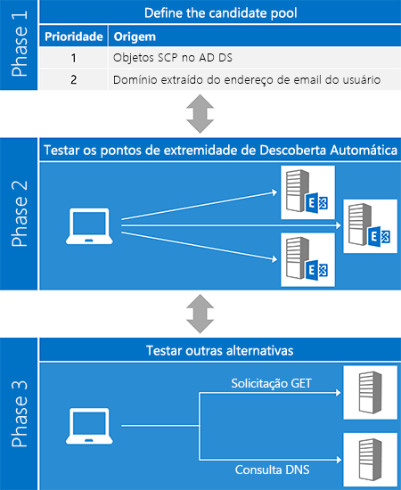
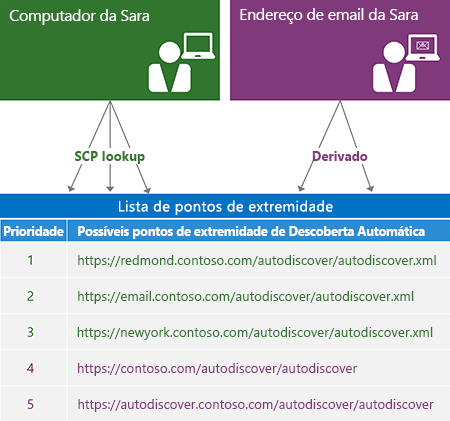
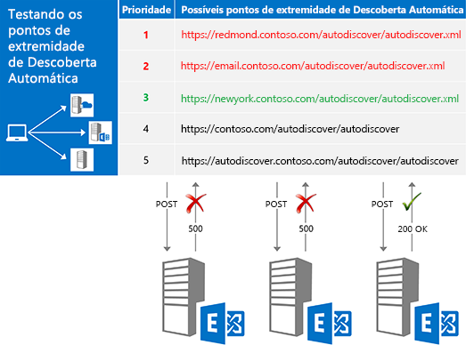
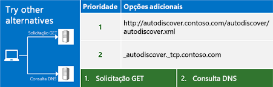

# Descoberta Automática do Exchange

Saiba mais sobre o serviço Descoberta Automática do Exchange.
  
O serviço Descoberta Automática do Exchange oferece uma maneira fácil de seu aplicativo cliente se configurar com entrada mínima do usuário. A maioria dos usuários sabe seu endereço de email e sua senha e, com esses dois tipos de informação, você pode recuperar todos os outros detalhes de que precisa para começar. Para clientes do Serviços Web do Exchange (EWS), Descoberta Automática é geralmente usada para localizar a URL de ponto de extremidade EWS, mas a Descoberta Automática também pode fornecer informações para configurar os clientes que usam outros protocolos. A Descoberta Automática funciona para aplicativos cliente dentro ou fora de firewalls e que funcionarão na floresta de recursos e em cenários de várias florestas.
  
## Visão geral do processo de Descoberta Automática

Essencialmente, o processo de Descoberta Automática tem três fases. Na fase 1, você gera uma lista de potenciais servidores de Descoberta Automática e, na fase dois, experimenta cada servidor em sua lista até obter uma resposta bem-sucedida. Se nenhum dos seus candidatos funcionar, passe para a fase 3, que representa uma "última tentativa" de localizar um ponto de extremidade de Descoberta Automática.
  
O método [ExchangeService.AutodiscoverUrl](http://msdn.microsoft.com/pt-BR/library/microsoft.exchange.webservices.data.exchangeservice.autodiscoverurl%28v=exchg.80%29.aspx) da API gerenciada do EWS implementa todas as três fases desse processo e, portanto, se você estiver usando a API gerenciada do EWS, não precisará se preocupar em como implementar a Descoberta Automática. A figura a seguir mostra as três fases do processo de Descoberta Automática. 
  
**Figura 1. Três fases do processo de Descoberta Automática**

  
### Fase 1: Definindo o pool candidato

Antes de poder usar a Descoberta Automática, você precisa localizar o servidor de Descoberta Automática correto para o usuário. Felizmente, a Descoberta Automática define um número limitado de locais para procurar. No caso em que vários candidatos são encontrados, a Descoberta Automática também define [uma forma para gerar e priorizar a lista](how-to-generate-a-list-of-autodiscover-endpoints.md).
  
**Tabela 1: Fontes de candidatos a ponto de extremidade de Descoberta Automática**

|**Local para pesquisar**|**O que você encontrará**|
|:-----|:-----|
|Serviços de Domínio Active Directory (AD DS)    |Para clientes de domínio, é o primeiro local a ser pesquisado. O Exchange publica os objetos SCP (ponto de conexão de serviço) no AD DS, o que permite que as solicitações de Descoberta Automática sejam roteadas para servidores baseados em sites do Active Directory. Os resultados de uma [pesquisa de SCP](how-to-find-autodiscover-endpoints-by-using-scp-lookup-in-exchange.md) devem ficar na parte superior da sua lista de candidatos.    **OBSERVAÇÃO**: a pesquisa de SCP não está disponível para clientes que não fazem parte de um domínio ou que não têm acesso aos servidores do Active Directory. Nesse caso, você deve ignorar a pesquisa SCP.  |
|O domínio de endereço de email do usuário    | A Descoberta Automática define duas formas de URL padrão do ponto de extremidade derivadas da parte de domínio do endereço de email do usuário:   `"https://" + domain + "/autodiscover/autodiscover" +  *fileExtension*`   `"https://autodiscover." + domain + "/autodiscover/autodiscover" +  *fileExtension*`    O valor de  *extensãodeArquivo*  depende de qual método de acesso de Descoberta Automática você está usando, [SOAP ](http://msdn.microsoft.com/library/61c21ea9-7fea-4f56-8ada-bf80e1e6b074%28Office.15%29.aspx) ou [POX ](http://msdn.microsoft.com/library/877152f0-f4b1-4f63-b2ce-924f4bdf2d20%28Office.15%29.aspx). O serviço SOAP usa uma extensão de arquivo ".svc"; POX usa ".xml".    |
   
A figura a seguir mostra como gerar uma lista de pontos de extremidade da Descoberta Automática.
  
**Figura 2. Processo para gerar uma lista de pontos de extremidade da Descoberta Automática**

  
### Fase 2: Experimentando cada candidato

Depois de gerar uma lista ordenada de potenciais candidatos, a próxima etapa será experimentar cada um na lista ao [enviar uma solicitação para a URL](how-to-get-user-settings-from-exchange-by-using-autodiscover.md) e validar os resultados, como mostrado na Figura 3. Quando você receber uma resposta bem-sucedida, sua busca estará terminada. 
  
**Figura 3. Experimentando cada ponto de extremidade candidato em ordem**

  
Antes de enviar uma solicitação para um candidato, verifique se ele é confiável. Lembre-se de que você está enviando as credenciais do usuário e, portanto, é importante certificar-se de que você as esteja compartilhando apenas com um servidor em que pode confiar. No mínimo, deve-se verificar:
  
- Se o ponto de extremidade é um ponto de extremidade HTTPS. Os aplicativos cliente não devem se autenticar ou enviar dados para um ponto de extremidade não SSL.
    
- Se o certificado SSL apresentado pelo servidor é válido e de uma autoridade confiável.
    
> [!NOTE]
> Esses são apenas sugestões básicas de segurança. Sempre que você estiver trabalhando com autenticação, certifique-se de que seu código atenda aos requisitos de segurança da sua organização. 
  
O tipo de solicitação enviada depende de como você está acessando o serviço Descoberta Automática.
  
**Tabela 2. Tipos de solicitações de Descoberta Automática**

|**Se você estiver usando...**|**Envie uma solicitação usando...**|
|:-----|:-----|
|A API gerenciada do EWS    |O método [GetUserSettings](http://msdn.microsoft.com/pt-BR/library/microsoft.exchange.webservices.autodiscover.autodiscoverservice.getusersettings%28v=exchg.80%29.aspx).    |
|O serviço Descoberta Automática SOAP    |A operação [GetUserSettings](http://msdn.microsoft.com/library/758d965c-ef63-4de4-9120-e293abf14ff8%28Office.15%29.aspx).    |
|O serviço Descoberta Automática POX    |Um HTTP POST com um [corpo da solicitação de Descoberta Automática](http://msdn.microsoft.com/library/75671b1d-f35b-497b-8d8c-706f3f2535fd%28Office.15%29.aspx).    |
   
### Fase 3: Experimentando outras alternativas

Em alguns casos, você pode experimentar os pontos de extremidade em sua lista, apenas para descobrir que todas elas retornarão um erro. Antes de lançar desistir, você pode tentar algumas coisas mais: você pode enviar uma solicitação GET não autenticada ou consultam o DNS para um registro SRV. Se essas tentativas também não produzem resultados, você não pode contatar o serviço Descoberta Automática.
  
**Figura 4. Experimentando outras alternativas**

  
#### Enviando uma solicitação GET não autenticada

A primeira coisa a ser experimentada é o envio de uma solicitação GET não autenticada para um ponto de extremidade derivado do endereço de email do usuário. O formato desse ponto de extremidade é "http://autodiscover." + domínio + "/ /autodiscover/autodiscover.xml". Observe que isso NÃO é um ponto de extremidade SSL. Se o servidor retornar uma resposta de redirecionamento 302, você poderá tentar [reenviar a solicitação de Descoberta Automática ](handling-autodiscover-error-messages.md#bk_ResendRequest) para a URL do ponto de extremidade no cabeçalho Localização da resposta. 
  
#### Consultando um registro SRV no DNS

Se a solicitação GET não autenticada não funcionar, a última tentativa será consultar registros SRV no DNS em busca do serviço de Descoberta Automática. O registro terá o formato "_autodiscover._tcp." + domínio. Essa consulta pode retornar vários registros, mas você só deverá usar os registros que apontem para um ponto de extremidade SSL e que tenha a maior prioridade e o maior peso.
  
## Opções para usar a Descoberta Automática

Você pode acessar a Descoberta Automática usando o serviço Web SOAP ou POX. O método utilizado dependerá de suas necessidades e do ambiente. No entanto, recomendamos o uso do serviço Web SOAP, se possível. A API gerenciada do EWS também é uma opção. Ela implementa a parte do cliente de serviços SOAP e de Descoberta Automática POX.
  
**Tabela 3: Opções de acesso de Descoberta Automática**

|**Opção**|**Vantagens**|**Desvantagens**|
|:-----|:-----|:-----|
|[API gerenciada do EWS](get-started-with-ews-managed-api-client-applications.md)   | Implementa o processo de Descoberta Automática para você.  Usa os serviços SOAP e de Descoberta Automática POX.  Funciona com o Exchange Online, com o Exchange Online como parte do Office 365 ou com uma versão do Exchange a partir do Exchange 2007 SP1.  Fácil de usar.    | Limitado às configurações do usuário disponíveis na enumeração [Microsoft.Exchange.WebServices.Autodiscover.UserSettingName](http://msdn.microsoft.com/pt-BR/library/microsoft.exchange.webservices.autodiscover.usersettingname%28v=EXCHG.80%29.aspx).  Disponível apenas para aplicativos do .NET Framework.    |
|[Descoberta Automática SOAP](http://msdn.microsoft.com/library/61c21ea9-7fea-4f56-8ada-bf80e1e6b074%28Office.15%29.aspx)   | Independente de plataforma.  Permite que você solicite apenas as configurações em que está interessado.    | Não está disponível no Exchange 2007.    |
|[Descoberta Automática POX](http://msdn.microsoft.com/library/877152f0-f4b1-4f63-b2ce-924f4bdf2d20%28Office.15%29.aspx)   | Independente de plataforma.  Compatível com o Exchange Online e com todas as versões do Exchange a partir do Exchange 2007 SP1.    | Não permite que você solicite configurações específicas.    |
   
## Nesta seção

- [Localizar os pontos de extremidade de Descoberta Automática usando pesquisa do SCP no Exchange](how-to-find-autodiscover-endpoints-by-using-scp-lookup-in-exchange.md)
    
- [Gerar uma lista de pontos de extremidade de Descoberta Automática](how-to-generate-a-list-of-autodiscover-endpoints.md)
    
- [Usar a Descoberta Automática para localizar os pontos de conexão](how-to-use-autodiscover-to-find-connection-points.md)
    
- [Obter as configurações de usuário do Exchange usando a Descoberta Automática](how-to-get-user-settings-from-exchange-by-using-autodiscover.md)
    
- [Obter as configurações de domínio de um servidor do Exchange](how-to-get-domain-settings-from-an-exchange-server.md)
    
- [Atualizar as informações de configuração usando a Descoberta Automática](how-to-refresh-configuration-information-by-using-autodiscover.md)
    
- [Manipulação de mensagens de erro de Descoberta Automática](handling-autodiscover-error-messages.md)
    
- [Melhorar o desempenho ao usar a Descoberta Automática do Exchange](improving-performance-when-using-autodiscover-for-exchange.md)
    
## Confira também

- [Introdução ao uso dos serviços Web no Exchange](start-using-web-services-in-exchange.md)    
- [Exchange 2013: Obter configurações do usuário com a Descoberta Automática](http://code.msdn.microsoft.com/Exchange-2013-Get-user-7e22c86e)
- [Exemplo do Autodiscover Checker](http://code.msdn.microsoft.com/exchange/Autodiscover-Checker-e1ebca42)  
- [Develop web service clients for Exchange](develop-web-service-clients-for-exchange.md)
    

