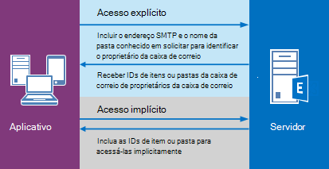

# <a name="delegate-access-and-ews-in-exchange"></a><span data-ttu-id="56f9c-103">Acesso de representante e EWS no Exchange</span><span class="sxs-lookup"><span data-stu-id="56f9c-103">Delegate access and EWS in Exchange</span></span>

<span data-ttu-id="56f9c-104">Descubra como usar a API gerenciada de EWS e EWS no Exchange para fornecer acesso de representante para caixas de correio dos usuários.</span><span class="sxs-lookup"><span data-stu-id="56f9c-104">Find out how to use the EWS Managed API and EWS in Exchange to provide delegate access to users' mailboxes.</span></span>
  
<span data-ttu-id="56f9c-105">Você pode permitir que os usuários acessem caixas de correio de outros usuários em uma destas três formas:</span><span class="sxs-lookup"><span data-stu-id="56f9c-105">You can enable users to access other users' mailboxes in one of three ways:</span></span> 
  
- <span data-ttu-id="56f9c-106">Adicionando representantes e especificando permissões para cada delegado.</span><span class="sxs-lookup"><span data-stu-id="56f9c-106">By adding delegates and specifying permissions for each delegate.</span></span>
    
- <span data-ttu-id="56f9c-107">Modificando permissões da pasta diretamente.</span><span class="sxs-lookup"><span data-stu-id="56f9c-107">By modifying folder permissions directly.</span></span>
    
- <span data-ttu-id="56f9c-108">Usando representação.</span><span class="sxs-lookup"><span data-stu-id="56f9c-108">By using impersonation.</span></span>
    
<span data-ttu-id="56f9c-109">Permissões de pasta e delegação são recomendadas quando somente você está concedendo acesso para alguns usuários, porque você precisou para adicionar permissões individualmente para cada caixa de correio.</span><span class="sxs-lookup"><span data-stu-id="56f9c-109">Delegation and folder permissions are best when you're only granting access to a few users, because you have to add permissions individually to each mailbox.</span></span> <span data-ttu-id="56f9c-110">Representação é a melhor escolha quando você está lidando com as quantidades de caixas de correio, pois você pode facilmente habilitar uma conta de serviço acessar cada caixa de correio em um banco de dados.</span><span class="sxs-lookup"><span data-stu-id="56f9c-110">Impersonation is the best choice when you're dealing with quantities of mailboxes, because you can easily enable one service account to access every mailbox in a database.</span></span> <span data-ttu-id="56f9c-111">A Figura 1 mostra algumas das diferenças entre cada tipo de acesso.</span><span class="sxs-lookup"><span data-stu-id="56f9c-111">Figure 1 shows some of the differences between each type of access.</span></span>
  
<span data-ttu-id="56f9c-112">**Figura 1. Maneiras de acessar caixas de correio de outros usuários**</span><span class="sxs-lookup"><span data-stu-id="56f9c-112">**Figure 1. Ways to access other users' mailboxes**</span></span>


  
<span data-ttu-id="56f9c-116">Quando se trata de enviar um email ou agendar reuniões, delegados podem receber permissões "Enviar em nome de", para que o destinatário de um email ou uma solicitação de reunião que foi enviada por um representante veja " *Delegar* em nome do *proprietário da caixa de correio* " quando eles receiv f a solicitação de reunião ou de email no Outlook.</span><span class="sxs-lookup"><span data-stu-id="56f9c-116">When it comes to sending mail or scheduling meetings, delegates can be given "send on behalf of" permissions, so the recipient of an email or a meeting request that was sent by a delegate will see " *delegate*  on behalf of  *mailbox owner*  " when they receive the email or meeting request in Outlook.</span></span> <span data-ttu-id="56f9c-117">Incluindo o texto "Enviar em nome de" é um detalhe da implementação de cliente - e podem ser criado usando o "from" e "remetente" valores.</span><span class="sxs-lookup"><span data-stu-id="56f9c-117">Including the "send on behalf of" text is a client implementation detail - and can be created by using the "from" and "sender" values.</span></span> <span data-ttu-id="56f9c-118">O valor "de" indica o proprietário da caixa de correio e o valor de "remetente" indica que o delegado que enviou um email.</span><span class="sxs-lookup"><span data-stu-id="56f9c-118">The "from" value indicates the mailbox owner, and the "sender" value indicates the delegate that sent the mail.</span></span> <span data-ttu-id="56f9c-119">Se uma conta de serviço representando um usuário envia um email ou agenda uma reunião para o proprietário da caixa de correio, a mensagem é "enviada como" o proprietário da caixa de correio.</span><span class="sxs-lookup"><span data-stu-id="56f9c-119">If a service account impersonating a user sends an email or schedules a meeting for the mailbox owner, the message is "sent as" the mailbox owner.</span></span> <span data-ttu-id="56f9c-120">Não há um meio para o destinatário saber que o email foi enviado pela conta de serviço.</span><span class="sxs-lookup"><span data-stu-id="56f9c-120">There is no way for the recipient to know the mail was sent by the service account.</span></span> <span data-ttu-id="56f9c-121">Os usuários que são concedidos com permissões de pasta e não o acesso de representante não são capazes de "Enviar como" ou "Enviar em nome de" de um proprietário de caixa de correio.</span><span class="sxs-lookup"><span data-stu-id="56f9c-121">Users who are granted folder permissions and not delegate access are not able to "send as" or "send on behalf of" of a mailbox owner.</span></span> <span data-ttu-id="56f9c-122">Eles têm acesso às pastas de caixa de correio e podem ser capazes de criar itens nas pastas, mas não podem enviar os itens.</span><span class="sxs-lookup"><span data-stu-id="56f9c-122">They have access to the mailbox folders, and might be able to create items in the folders, but they cannot send the items.</span></span> 
  
<span data-ttu-id="56f9c-123">Quando ele é adequado modificar as permissões da pasta diretamente?</span><span class="sxs-lookup"><span data-stu-id="56f9c-123">When is it appropriate to modify folder permissions directly?</span></span> <span data-ttu-id="56f9c-124">Em geral, quando você deseja fornecer um acesso de usuário para uma pasta, mas não deseja conceder ao usuário permissões "Enviar em nome de", quando seus requisitos de permissões não forem mapeados para os valores de enumeração [DelegateFolderPermissionLevel](http://msdn.microsoft.com/en-us/library/microsoft.exchange.webservices.data.delegatefolderpermissionlevel%28v=exchg.80%29.aspx) EWS Managed API ou o [PermissionLevel](http://msdn.microsoft.com/library/87978600-3523-451e-a725-ef092c543e2a%28Office.15%29.aspx) Valores de elemento do EWS, ou quando você deseja fornecer um acesso de usuário para uma única pasta personalizada.</span><span class="sxs-lookup"><span data-stu-id="56f9c-124">Generally, when you want to provide a user access to a folder, but do not want to grant the user "send on behalf of" permissions, when your permissions requirements do not map to the [DelegateFolderPermissionLevel](http://msdn.microsoft.com/en-us/library/microsoft.exchange.webservices.data.delegatefolderpermissionlevel%28v=exchg.80%29.aspx) EWS Managed API enumeration values or the [PermissionLevel](http://msdn.microsoft.com/library/87978600-3523-451e-a725-ef092c543e2a%28Office.15%29.aspx) EWS element values, or when you want to provide a user access to a single custom folder.</span></span> 
  
<span data-ttu-id="56f9c-125">Se você precisar modificar permissões de pasta para atingir seu objetivo e não é necessário adicionar um representante (ou seja, se você não precisará permissões "Enviar em nome de"), consulte [definir permissões da pasta para outro usuário usando o EWS no Exchange](how-to-set-folder-permissions-for-another-user-by-using-ews-in-exchange.md).</span><span class="sxs-lookup"><span data-stu-id="56f9c-125">If you only need to modify folder permissions to achieve your goal, and do not need to add a delegate (that is, you don't need "send on behalf of" permissions), see [Set folder permissions for another user by using EWS in Exchange](how-to-set-folder-permissions-for-another-user-by-using-ews-in-exchange.md).</span></span> 
  
<span data-ttu-id="56f9c-126">Observe que você também pode usar [o Outlook](http://office.microsoft.com/en-us/outlook-help/allow-someone-else-to-manage-your-mail-and-calendar-HA102749417.aspx) ou o [Exchange Server PowerShell (Shell de gerenciamento do Exchange)](https://docs.microsoft.com/en-us/powershell/exchange/exchange-server/exchange-management-shell?view=exchange-ps) para configurar o acesso de representante.</span><span class="sxs-lookup"><span data-stu-id="56f9c-126">Note that you can also use [Outlook](http://office.microsoft.com/en-us/outlook-help/allow-someone-else-to-manage-your-mail-and-calendar-HA102749417.aspx) or the [Exchange Server PowerShell (Exchange Management Shell)](https://docs.microsoft.com/en-us/powershell/exchange/exchange-server/exchange-management-shell?view=exchange-ps) to set up delegate access.</span></span> 
  
## <a name="how-does-delegate-access-work"></a><span data-ttu-id="56f9c-127">Como delegar acesso trabalho?</span><span class="sxs-lookup"><span data-stu-id="56f9c-127">How does delegate access work?</span></span>

<span data-ttu-id="56f9c-128">Acesso de representante permite que os usuários acessem algumas ou todas as pastas do proprietário da caixa de correio e agir em nome do proprietário da caixa de correio.</span><span class="sxs-lookup"><span data-stu-id="56f9c-128">Delegate access enables users to access some or all of the mailbox owner's folders and act on behalf of the mailbox owner.</span></span> <span data-ttu-id="56f9c-129">O proprietário da caixa de correio pode ser um usuário ou um recurso, como uma sala de conferência.</span><span class="sxs-lookup"><span data-stu-id="56f9c-129">The mailbox owner can be a user, or a resource, like a conference room.</span></span> <span data-ttu-id="56f9c-130">Por exemplo, um recepcionista pode receber permissões de representante à pasta de calendário de uma sala de conferência, lidar com as solicitações de reserva.</span><span class="sxs-lookup"><span data-stu-id="56f9c-130">For example, a receptionist can be granted delegate permissions to a conference room's calendar folder, to handle booking requests.</span></span> <span data-ttu-id="56f9c-131">Você pode usar a API gerenciada de EWS ou o EWS para permitir que o proprietário da caixa de correio ou um administrador adicione um representante, especifique quais pastas delegado pode acessar e especifique permissões para essa pasta.</span><span class="sxs-lookup"><span data-stu-id="56f9c-131">You can use the EWS Managed API or EWS to enable the mailbox owner or an administrator to add a delegate, specify what folders the delegate can access, and then specify permissions for that folder.</span></span> <span data-ttu-id="56f9c-132">Os representantes podem conceder acesso às seguintes pastas:</span><span class="sxs-lookup"><span data-stu-id="56f9c-132">Delegates can be granted access to the following folders:</span></span> 
  
- <span data-ttu-id="56f9c-133">Calendário</span><span class="sxs-lookup"><span data-stu-id="56f9c-133">Calendar</span></span>
    
- <span data-ttu-id="56f9c-134">Tarefas</span><span class="sxs-lookup"><span data-stu-id="56f9c-134">Tasks</span></span>
    
- <span data-ttu-id="56f9c-135">Caixa de Entrada</span><span class="sxs-lookup"><span data-stu-id="56f9c-135">Inbox</span></span>
    
- <span data-ttu-id="56f9c-136">Contatos</span><span class="sxs-lookup"><span data-stu-id="56f9c-136">Contacts</span></span>
    
- <span data-ttu-id="56f9c-137">Observações</span><span class="sxs-lookup"><span data-stu-id="56f9c-137">Notes</span></span>
    
- <span data-ttu-id="56f9c-138">Diário</span><span class="sxs-lookup"><span data-stu-id="56f9c-138">Journal</span></span>
    
<span data-ttu-id="56f9c-139">Quando um usuário tem acesso de representante a uma ou mais dessas pastas, eles podem criar, obter, atualizar, excluir, copiar e procurar itens na pasta e todas as pastas filho, dependendo das [permissões](#bk_delegateperms) definidas na pasta.</span><span class="sxs-lookup"><span data-stu-id="56f9c-139">When a user has delegate access to one or more of these folders, they can create, get, update, delete, copy, and search for items in that folder and any child folders, depending on the [permissions](#bk_delegateperms) set on the folder.</span></span> <span data-ttu-id="56f9c-140">A maneira na qual o aplicativo executa essas ações depende se é necessário acesso de [explícitas](#bk_explicit) ou [implícitas](#bk_implicit) .</span><span class="sxs-lookup"><span data-stu-id="56f9c-140">The way in which the application performs these actions depends on whether [explicit](#bk_explicit) or [implicit](#bk_implicit) access is required.</span></span> 
  
## <a name="delegate-permissions"></a><span data-ttu-id="56f9c-141">Delegar permissões</span><span class="sxs-lookup"><span data-stu-id="56f9c-141">Delegate permissions</span></span>
<span data-ttu-id="56f9c-142"><a name="bk_delegateperms"> </a></span><span class="sxs-lookup"><span data-stu-id="56f9c-142"></span></span>

<span data-ttu-id="56f9c-143">Quando um administrador ou o proprietário da caixa de correio adiciona um representante para uma caixa de correio, eles também podem definir o nível de permissão para uma ou mais pastas.</span><span class="sxs-lookup"><span data-stu-id="56f9c-143">When an administrator or mailbox owner adds a delegate to a mailbox, they can also set the permission level for one or more folders.</span></span> <span data-ttu-id="56f9c-144">Se um nível de permissão não estiver definido para uma pasta, o valor de permissão padrão como nenhum.</span><span class="sxs-lookup"><span data-stu-id="56f9c-144">If a permission level is not set for a folder, the permission value defaults to None.</span></span> <span data-ttu-id="56f9c-145">Vários usuários podem ter o mesmo nível de permissão em uma pasta e os usuários podem ter diferentes níveis de permissão para pastas diferentes.</span><span class="sxs-lookup"><span data-stu-id="56f9c-145">Multiple users can have the same permission level on a folder, and users can have different permission levels for different folders.</span></span> <span data-ttu-id="56f9c-146">Se você estiver usando o EWS Managed API, use a propriedade [DelegateUser.Permissions](http://msdn.microsoft.com/en-us/library/microsoft.exchange.webservices.data.delegateuser.permissions%28v=exchg.80%29.aspx) , que contém um dos valores de enumeração [DelegateFolderPermissionLevel](http://msdn.microsoft.com/en-us/library/microsoft.exchange.webservices.data.delegatefolderpermissionlevel%28v=exchg.80%29.aspx) para cada pasta, para definir permissões de representante em pastas.</span><span class="sxs-lookup"><span data-stu-id="56f9c-146">If you're using the EWS Managed API, you use the [DelegateUser.Permissions](http://msdn.microsoft.com/en-us/library/microsoft.exchange.webservices.data.delegateuser.permissions%28v=exchg.80%29.aspx) property, which contains one of the [DelegateFolderPermissionLevel](http://msdn.microsoft.com/en-us/library/microsoft.exchange.webservices.data.delegatefolderpermissionlevel%28v=exchg.80%29.aspx) enumeration values for each folder, to set delegate permissions on folders.</span></span> <span data-ttu-id="56f9c-147">Se você estiver usando o EWS, use o elemento [DelegatePermissions](http://msdn.microsoft.com/library/292badc7-bab3-4368-9d7c-9a8b7edb279b%28Office.15%29.aspx) para definir permissões de representante e o elemento de [PermissionLevel](http://msdn.microsoft.com/library/87978600-3523-451e-a725-ef092c543e2a%28Office.15%29.aspx) para definir o nível de permissão.</span><span class="sxs-lookup"><span data-stu-id="56f9c-147">If you're using EWS, you use the [DelegatePermissions](http://msdn.microsoft.com/library/292badc7-bab3-4368-9d7c-9a8b7edb279b%28Office.15%29.aspx) element to set delegate permissions, and the [PermissionLevel](http://msdn.microsoft.com/library/87978600-3523-451e-a725-ef092c543e2a%28Office.15%29.aspx) element to define the permission level.</span></span> 
  
<span data-ttu-id="56f9c-148">**Tabela 2. Níveis de permissão de representante**</span><span class="sxs-lookup"><span data-stu-id="56f9c-148">**Table 2. Delegate permission levels**</span></span>

|<span data-ttu-id="56f9c-149">**Nível de permissão**</span><span class="sxs-lookup"><span data-stu-id="56f9c-149">**Permission level**</span></span>|<span data-ttu-id="56f9c-150">**Descrição**</span><span class="sxs-lookup"><span data-stu-id="56f9c-150">**Description**</span></span>|
|:-----|:-----|
|<span data-ttu-id="56f9c-151">None</span><span class="sxs-lookup"><span data-stu-id="56f9c-151">None</span></span>  <br/> |<span data-ttu-id="56f9c-152">Este é o valor padrão para todas as pastas.</span><span class="sxs-lookup"><span data-stu-id="56f9c-152">This is the default value for all folders.</span></span>  <br/> |
|<span data-ttu-id="56f9c-153">Autor</span><span class="sxs-lookup"><span data-stu-id="56f9c-153">Author</span></span>  <br/> |<span data-ttu-id="56f9c-154">Um representante pode ler e criar itens, modificar e excluir itens que criam por eles.</span><span class="sxs-lookup"><span data-stu-id="56f9c-154">A delegate can read and create items, and modify and delete items they create.</span></span> <span data-ttu-id="56f9c-155">Por exemplo, um representante pode criar solicitações de tarefa e solicitações de reunião diretamente na pasta de calendário ou de tarefa do proprietário da caixa de correio e, em seguida, enviar esses itens em nome do proprietário da caixa de correio.</span><span class="sxs-lookup"><span data-stu-id="56f9c-155">For example, a delegate can create task requests and meeting requests directly in the mailbox owner's Task or Calendar folder, and then send either item on the mailbox owner's behalf.</span></span>  <br/> |
|<span data-ttu-id="56f9c-156">Editor</span><span class="sxs-lookup"><span data-stu-id="56f9c-156">Editor</span></span>  <br/> |<span data-ttu-id="56f9c-157">Um representante pode fazer tudo um autor pode fazer e também modificar e excluir os itens que o proprietário da caixa de correio criado.</span><span class="sxs-lookup"><span data-stu-id="56f9c-157">A delegate can do everything an Author can do, and also modify and delete the items the mailbox owner created.</span></span>  <br/> |
|<span data-ttu-id="56f9c-158">Reviewer</span><span class="sxs-lookup"><span data-stu-id="56f9c-158">Reviewer</span></span>  <br/> |<span data-ttu-id="56f9c-159">Um representante pode ler itens; Por exemplo, um representante com essa permissão pode ler mensagens na caixa de entrada de outra pessoa.</span><span class="sxs-lookup"><span data-stu-id="56f9c-159">A delegate can read items; for example a delegate with Reviewer permission can read messages in another person's Inbox.</span></span>  <br/> |
|<span data-ttu-id="56f9c-160">Personalizado</span><span class="sxs-lookup"><span data-stu-id="56f9c-160">Custom</span></span>  <br/> |<span data-ttu-id="56f9c-161">O proprietário da caixa de correio tiver concedido a um conjunto de permissões personalizado ao delegado.</span><span class="sxs-lookup"><span data-stu-id="56f9c-161">The mailbox owner has granted a custom set of permissions to the delegate.</span></span>  <br/> |
   
<span data-ttu-id="56f9c-162">A propriedade [DelgateUser.ViewPrivateItems](http://msdn.microsoft.com/en-us/library/microsoft.exchange.webservices.data.delegateuser.viewprivateitems%28v=exchg.80%29.aspx) EWS Managed API e o elemento do EWS [ViewPrivateItems](http://msdn.microsoft.com/library/80b949ac-440c-4a01-b428-ebafb5b1b802%28Office.15%29.aspx) é uma configuração global que afeta pastas de todas as caixas de correio do proprietário, incluindo todos os email, contatos, calendário, tarefas, notas e pastas de diário.</span><span class="sxs-lookup"><span data-stu-id="56f9c-162">The [DelgateUser.ViewPrivateItems](http://msdn.microsoft.com/en-us/library/microsoft.exchange.webservices.data.delegateuser.viewprivateitems%28v=exchg.80%29.aspx) EWS Managed API property and the [ViewPrivateItems](http://msdn.microsoft.com/library/80b949ac-440c-4a01-b428-ebafb5b1b802%28Office.15%29.aspx) EWS element is a global setting that affects all the mailbox owner's folders, including all Mail, Contacts, Calendar, Tasks, Notes, and Journal folders.</span></span> <span data-ttu-id="56f9c-163">Você não pode permitir o acesso aos itens particulares no apenas uma pasta.</span><span class="sxs-lookup"><span data-stu-id="56f9c-163">You cannot allow access to private items in only one folder.</span></span> 
  
## <a name="explicit-access"></a><span data-ttu-id="56f9c-164">Acesso explícitos</span><span class="sxs-lookup"><span data-stu-id="56f9c-164">Explicit access</span></span>
<span data-ttu-id="56f9c-165"><a name="bk_explicit"> </a></span><span class="sxs-lookup"><span data-stu-id="56f9c-165"></span></span>

<span data-ttu-id="56f9c-166">Acesso explícito simplesmente colocar é a maneira de entrada para os representantes para executar ações em itens ou pastas de um proprietário de caixa de correio.</span><span class="sxs-lookup"><span data-stu-id="56f9c-166">Simply put, explicit access is the entry way for delegates to perform actions on a mailbox owner's folders or items.</span></span> <span data-ttu-id="56f9c-167">Acesso explícitos recebe a um delegado quando eles incluem o nome da pasta conhecido para a pasta do proprietário de uma caixa de correio, juntamente com o endereço de SMTP do proprietário da caixa de correio em uma solicitação ao servidor.</span><span class="sxs-lookup"><span data-stu-id="56f9c-167">Explicit access is granted to a delegate when they include the well-known folder name for a mailbox owner's folder along with the mailbox owner's SMTP address in a request to the server.</span></span> <span data-ttu-id="56f9c-168">O acesso é explícito porque a solicitação do representante explicitamente afirma que o contexto para o método ou a operação é a caixa de correio do proprietário da caixa de correio e não caixa de correio do representante.</span><span class="sxs-lookup"><span data-stu-id="56f9c-168">The access is explicit because the delegate's request explicitly states that the context for the method or operation is the mailbox owner's mailbox, and not the delegate's mailbox.</span></span>
  
<span data-ttu-id="56f9c-169">Acesso explícitos define o contexto de todos os métodos ou operações executadas em pastas ou itens no futuro.</span><span class="sxs-lookup"><span data-stu-id="56f9c-169">Explicit access defines the context for all methods or operations performed on the folders or items moving forward.</span></span> <span data-ttu-id="56f9c-170">Todas as identificações de item e pasta retornadas quando o acesso explícitos é definido exclusivamente se identificam como pertencentes ao proprietário da caixa de correio (embora não em qualquer formato legíveis humano).</span><span class="sxs-lookup"><span data-stu-id="56f9c-170">All item and folder IDs returned when the explicit access is set uniquely identify themselves as belonging to the mailbox owner (although not in any human readable format).</span></span> <span data-ttu-id="56f9c-171">Dessa forma, o aplicativo não precisa especificar o endereço de SMTP do proprietário da caixa de correio repetidamente; o contexto fica oculto nos identificadores.</span><span class="sxs-lookup"><span data-stu-id="56f9c-171">This way, the application doesn't need to specify the mailbox owner's SMTP address again and again; the context is hidden in the identifiers.</span></span> <span data-ttu-id="56f9c-172">Depois que um item ou pasta for identificada, um representante realmente usa [acesso implícito](#bk_implicit) para modificar o item.</span><span class="sxs-lookup"><span data-stu-id="56f9c-172">After an item or folder is identified, a delegate actually uses [implicit access](#bk_implicit) to modify the item.</span></span> <span data-ttu-id="56f9c-173">A figura a seguir mostra o processo de obtenção de acesso explícito e implícito.</span><span class="sxs-lookup"><span data-stu-id="56f9c-173">The following figure shows the process of getting explicit and implicit access.</span></span> 
  
<span data-ttu-id="56f9c-174">**Figura 2. Solicitando acesso explícito e implícito para um item ou pasta**</span><span class="sxs-lookup"><span data-stu-id="56f9c-174">**Figure 2. Requesting explicit and implicit access to an item or folder**</span></span>


  
<span data-ttu-id="56f9c-176">Você pode definir o acesso explícitos em diversos cenários.</span><span class="sxs-lookup"><span data-stu-id="56f9c-176">You can set explicit access in many different scenarios.</span></span> <span data-ttu-id="56f9c-177">Basicamente, sempre que você está enviando um ID de pasta em um método ou a operação, você pode definir acesso explícitos.</span><span class="sxs-lookup"><span data-stu-id="56f9c-177">Essentially, any time you're sending a folder ID in a method or operation, you can set explicit access.</span></span> <span data-ttu-id="56f9c-178">Isso pode incluir a localização de pastas, Localizando compromissos, obtendo itens, localizar conversas e assim por diante.</span><span class="sxs-lookup"><span data-stu-id="56f9c-178">This can include finding folders, finding appointments, getting items, finding conversations, and so on.</span></span>
  
### <a name="explicit-access-and-the-ews-managed-api"></a><span data-ttu-id="56f9c-179">Acesso explícito e a API gerenciada de EWS</span><span class="sxs-lookup"><span data-stu-id="56f9c-179">Explicit access and the EWS Managed API</span></span>
<span data-ttu-id="56f9c-180"><a name="bk_explicitewsma"> </a></span><span class="sxs-lookup"><span data-stu-id="56f9c-180"></span></span>

<span data-ttu-id="56f9c-181">É possível iniciar o acesso de representante explícitas usando qualquer um dos seguintes métodos sobrecarregados que recebem um parâmetro de entrada [FolderId](http://msdn.microsoft.com/en-us/library/microsoft.exchange.webservices.data.folderid%28v=exchg.80%29.aspx) para identificar a pasta de destino:</span><span class="sxs-lookup"><span data-stu-id="56f9c-181">You can initiate explicit delegate access by using any of the following overloaded methods that take a [FolderId](http://msdn.microsoft.com/en-us/library/microsoft.exchange.webservices.data.folderid%28v=exchg.80%29.aspx) input parameter to identify the target folder:</span></span> 
  
- [<span data-ttu-id="56f9c-182">Folder.Bind</span><span class="sxs-lookup"><span data-stu-id="56f9c-182">Folder.Bind</span></span>](http://msdn.microsoft.com/en-us/library/microsoft.exchange.webservices.data.folder.bind%28v=exchg.80%29.aspx)
    
- [<span data-ttu-id="56f9c-183">ExchangeService.FindItems</span><span class="sxs-lookup"><span data-stu-id="56f9c-183">ExchangeService.FindItems</span></span>](http://msdn.microsoft.com/en-us/library/microsoft.exchange.webservices.data.exchangeservice.finditems%28v=exchg.80%29.aspx)
    
- [<span data-ttu-id="56f9c-184">ExchangeService.FindAppointments</span><span class="sxs-lookup"><span data-stu-id="56f9c-184">ExchangeService.FindAppointments</span></span>](http://msdn.microsoft.com/en-us/library/microsoft.exchange.webservices.data.exchangeservice.findappointments%28v=exchg.80%29.aspx)
    
- [<span data-ttu-id="56f9c-185">ExchangeService.FindFolders</span><span class="sxs-lookup"><span data-stu-id="56f9c-185">ExchangeService.FindFolders</span></span>](http://msdn.microsoft.com/en-us/library/microsoft.exchange.webservices.data.exchangeservice.findfolders%28v=exchg.80%29.aspx)
    
- <span data-ttu-id="56f9c-186">E muito mais!</span><span class="sxs-lookup"><span data-stu-id="56f9c-186">And more!</span></span>
    
<span data-ttu-id="56f9c-187">Você pode usar o parâmetro **FolderId** em cada um desses métodos para identificar a pasta de destino do proprietário da caixa de correio, da seguinte maneira.</span><span class="sxs-lookup"><span data-stu-id="56f9c-187">You can use the **FolderId** parameter in each of these methods to identify the mailbox owner's target folder, as follows.</span></span> 
  
```cs
new FolderId(WellKnownFolderName.Calendar, "primary@contoso.com");
```

<span data-ttu-id="56f9c-188">Por exemplo, para associar a pasta de calendário, o **FolderId** neste método **vincular** Especifica o nome da pasta conhecido e endereço de SMTP do proprietário da caixa de correio.</span><span class="sxs-lookup"><span data-stu-id="56f9c-188">For example, to bind to the Calendar folder, the **FolderId** in this **Bind** method specifies the well-known folder name, and the mailbox owner's SMTP address.</span></span> 
  
```cs
CalendarFolder calendar = CalendarFolder.Bind(service, new FolderId(WellKnownFolderName.Calendar, "primary@contoso.com"), new PropertySet());
```

<span data-ttu-id="56f9c-189">Especificando o nome da pasta conhecido e o endereço SMTP, o representante pode vincular a pasta de calendário do proprietário da caixa de correio — ganhando explícito acesso à pasta.</span><span class="sxs-lookup"><span data-stu-id="56f9c-189">By specifying the well-known folder name and the SMTP address, the delegate can bind to the mailbox owner's Calendar folder — thereby gaining explicit access to the folder.</span></span> <span data-ttu-id="56f9c-190">Todas as solicitações subsequentes para [acesso implícito](#bk_implicit) a itens na pasta depois contam com o contexto retornado no item identificações e pasta.</span><span class="sxs-lookup"><span data-stu-id="56f9c-190">All subsequent requests for [implicit access](#bk_implicit) to items in the folder then rely on the context returned in the item IDs and folder IDs.</span></span> <span data-ttu-id="56f9c-191">Basicamente, os identificadores contêm o contexto para as chamadas de acesso de representante implícitas.</span><span class="sxs-lookup"><span data-stu-id="56f9c-191">Essentially, the identifiers contain the context for the implied delegate access calls.</span></span> <span data-ttu-id="56f9c-192">Ou, para recuperar a ID de item de um item que atenda a critérios específicos, use o seguinte.</span><span class="sxs-lookup"><span data-stu-id="56f9c-192">Or, to retrieve the item ID of an item that meets specific criteria, use the following.</span></span> 
  
```cs
FindItemsResults<Item> results = service.FindItems(new FolderId(WellKnownFolderName.Calendar, "primary@contoso.com"), filter, view);
```

<span data-ttu-id="56f9c-193">Nesse caso a ID do item é retornada e, em seguida, o representante pode use acesso implícito para fazer alterações no item usando a ID do item.</span><span class="sxs-lookup"><span data-stu-id="56f9c-193">In this case the item ID is returned, and then the delegate can then use implicit access to make changes to the item by using the item ID.</span></span>
  
<span data-ttu-id="56f9c-194">Você não precisa iniciar acesso explícitos novamente até que você precise de uma ID de item ou uma ID de pasta que não podem ser acessados via o acesso explícitos existente.</span><span class="sxs-lookup"><span data-stu-id="56f9c-194">You don't have to initiate explicit access again until you require an item ID or a folder ID that you didn't access via the existing explicit access.</span></span> 
  
### <a name="explicit-access-and-ews"></a><span data-ttu-id="56f9c-195">Acesso explícitos e EWS</span><span class="sxs-lookup"><span data-stu-id="56f9c-195">Explicit access and EWS</span></span>
<span data-ttu-id="56f9c-196"><a name="bk_explicitewsma"> </a></span><span class="sxs-lookup"><span data-stu-id="56f9c-196"></span></span>

<span data-ttu-id="56f9c-197">Você pode iniciar o acesso explícitos usando as operações [GetFolder](http://msdn.microsoft.com/library/355bcf93-dc71-4493-b177-622afac5fdb9%28Office.15%29.aspx), [FindItem](http://msdn.microsoft.com/library/ebad6aae-16e7-44de-ae63-a95b24539729%28Office.15%29.aspx)ou [FindFolder](http://msdn.microsoft.com/library/7a9855aa-06cc-45ba-ad2a-645c15b7d031%28Office.15%29.aspx) .</span><span class="sxs-lookup"><span data-stu-id="56f9c-197">You can initiate explicit access by using the [GetFolder](http://msdn.microsoft.com/library/355bcf93-dc71-4493-b177-622afac5fdb9%28Office.15%29.aspx), [FindItem](http://msdn.microsoft.com/library/ebad6aae-16e7-44de-ae63-a95b24539729%28Office.15%29.aspx), or [FindFolder](http://msdn.microsoft.com/library/7a9855aa-06cc-45ba-ad2a-645c15b7d031%28Office.15%29.aspx) operations.</span></span> <span data-ttu-id="56f9c-198">Essas operações fornecem a opção de usar o elemento [DistinguishedFolderId](http://msdn.microsoft.com/library/50018162-2941-4227-8a5b-d6b4686bb32f%28Office.15%29.aspx) para identificar a pasta de destino.</span><span class="sxs-lookup"><span data-stu-id="56f9c-198">These operations provide the option to use the [DistinguishedFolderId](http://msdn.microsoft.com/library/50018162-2941-4227-8a5b-d6b4686bb32f%28Office.15%29.aspx) element to identify the target folder.</span></span> <span data-ttu-id="56f9c-199">O elemento **DistinguishedFolderId** tem um elemento filho opcionais único, o elemento de [caixa de correio](http://msdn.microsoft.com/library/befc70fd-51cb-4258-884c-80c9050f0e82%28Office.15%29.aspx) .</span><span class="sxs-lookup"><span data-stu-id="56f9c-199">The **DistinguishedFolderId** element has a single optional child element, the [Mailbox](http://msdn.microsoft.com/library/befc70fd-51cb-4258-884c-80c9050f0e82%28Office.15%29.aspx) element.</span></span> <span data-ttu-id="56f9c-200">O elemento de **caixa de correio** , quando usado como um filho do elemento **DistinguishedFolderId** , especifica o representante acessar a caixa de correio.</span><span class="sxs-lookup"><span data-stu-id="56f9c-200">The **Mailbox** element, when used as a child of the **DistinguishedFolderId** element, specifies the mailbox for the delegate to access.</span></span> <span data-ttu-id="56f9c-201">Se o usuário chamador tiver permissão para acessar a pasta do proprietário da caixa de correio, a resposta conterá uma coleção de identificadores aos itens ou pastas nessa caixa de correio.</span><span class="sxs-lookup"><span data-stu-id="56f9c-201">If the calling user has permission to access the mailbox owner's folder, the response will contain a collection of identifiers to items or folders in that mailbox.</span></span> <span data-ttu-id="56f9c-202">Os identificadores de item e pasta que são retornados na resposta podem ser usados para acesso de representante implícita.</span><span class="sxs-lookup"><span data-stu-id="56f9c-202">The item and folder identifiers that are returned in the response can be used for implicit delegate access.</span></span> 
  
## <a name="implicit-access"></a><span data-ttu-id="56f9c-203">Acesso implícito</span><span class="sxs-lookup"><span data-stu-id="56f9c-203">Implicit access</span></span>
<span data-ttu-id="56f9c-204"><a name="bk_implicit"> </a></span><span class="sxs-lookup"><span data-stu-id="56f9c-204"></span></span>

<span data-ttu-id="56f9c-205">Acesso implícito é usado depois que um representante recuperou a ID de um item ou a pasta na caixa de correio do proprietário da caixa de correio e o delegado deseja atualizar, excluir ou copiar o item.</span><span class="sxs-lookup"><span data-stu-id="56f9c-205">Implicit access is used after a delegate has retrieved the ID for an item or folder in the mailbox owner's mailbox and the delegate wants to update, delete, or copy the item.</span></span> <span data-ttu-id="56f9c-206">Quando o delegado usa esse ID de item ou uma pasta em uma solicitação, as alterações são feitas para o item da caixa de correio do proprietário da caixa de correio.</span><span class="sxs-lookup"><span data-stu-id="56f9c-206">When the delegate uses that item or folder ID in a request, the changes are made to the item in the mailbox owner's mailbox.</span></span> <span data-ttu-id="56f9c-207">O representante não precisa incluir o endereço de SMTP do proprietário da caixa de correio.</span><span class="sxs-lookup"><span data-stu-id="56f9c-207">The delegate does not have to include the mailbox owner's SMTP address.</span></span> 
  
<span data-ttu-id="56f9c-208">Por exemplo, quando um delegado tem a identificação de uma das pastas do proprietário da caixa de correio, o delegado pode executar uma operação **FindItem** dessa pasta usando o ID de pasta, sem explicitamente que identifica a caixa de correio do proprietário da caixa de correio.</span><span class="sxs-lookup"><span data-stu-id="56f9c-208">For example, when a delegate has the ID of one of the mailbox owner's folders, the delegate can perform a **FindItem** operation on that folder by using the folder ID, without explicitly identifying the mailbox owner's mailbox.</span></span> <span data-ttu-id="56f9c-209">Nesse momento, o representante pode executar ações na pasta do proprietário da caixa de correio usando os IDs que são retornados nas respostas.</span><span class="sxs-lookup"><span data-stu-id="56f9c-209">At that point, the delegate can perform actions on the mailbox owner's folder by using the IDs that are returned in the responses.</span></span> 
  
### <a name="implicit-access-and-the-ews-managed-api"></a><span data-ttu-id="56f9c-210">Acesso implícito e a API gerenciada de EWS</span><span class="sxs-lookup"><span data-stu-id="56f9c-210">Implicit access and the EWS Managed API</span></span>

<span data-ttu-id="56f9c-211">Se uma ID de item foi recuperada pelo método [FindItems](http://msdn.microsoft.com/en-us/library/microsoft.exchange.webservices.data.exchangeservice.finditems%28v=exchg.80%29.aspx) , a ID do item que pode ser usada em uma chamada de método [Item.Bind](http://msdn.microsoft.com/en-us/library/microsoft.exchange.webservices.data.item.bind%28v=exchg.80%29.aspx) subsequente para vincular ao item.</span><span class="sxs-lookup"><span data-stu-id="56f9c-211">If an item ID was retrieved by the [FindItems](http://msdn.microsoft.com/en-us/library/microsoft.exchange.webservices.data.exchangeservice.finditems%28v=exchg.80%29.aspx) method, that item ID can be used in a subsequent [Item.Bind](http://msdn.microsoft.com/en-us/library/microsoft.exchange.webservices.data.item.bind%28v=exchg.80%29.aspx) method call to bind to the item.</span></span> <span data-ttu-id="56f9c-212">Você pode chamar o método [Item.Update](http://msdn.microsoft.com/en-us/library/office/microsoft.exchange.webservices.data.item.update%28v=exchg.80%29.aspx), [item](http://msdn.microsoft.com/en-us/library/office/microsoft.exchange.webservices.data.item.delete%28v=exchg.80%29.aspx)ou [Item.Copy](http://msdn.microsoft.com/en-us/library/office/microsoft.exchange.webservices.data.item.copy%28v=exchg.80%29.aspx) — ou qualquer chamada de método que requer uma ID de item — conforme necessário para concluir a tarefa.</span><span class="sxs-lookup"><span data-stu-id="56f9c-212">You can then call the [Item.Update](http://msdn.microsoft.com/en-us/library/office/microsoft.exchange.webservices.data.item.update%28v=exchg.80%29.aspx), [Item.Delete](http://msdn.microsoft.com/en-us/library/office/microsoft.exchange.webservices.data.item.delete%28v=exchg.80%29.aspx), or [Item.Copy](http://msdn.microsoft.com/en-us/library/office/microsoft.exchange.webservices.data.item.copy%28v=exchg.80%29.aspx) method — or any method call that requires an item ID — as needed to complete your task.</span></span> <span data-ttu-id="56f9c-213">Desde que o delegado tem permissões apropriadas para a pasta que contém o item (e, se aplicável, a pasta o item está mudando para), o representante pode fazer alterações de acordo com seus níveis de permissão.</span><span class="sxs-lookup"><span data-stu-id="56f9c-213">As long as the delegate has appropriate permissions to the folder that contains the item (and, if applicable, the folder the item is moving to), the delegate can make changes according to their permission levels.</span></span> 
  
### <a name="implicit-access-and-ews"></a><span data-ttu-id="56f9c-214">Acesso implícito e EWS</span><span class="sxs-lookup"><span data-stu-id="56f9c-214">Implicit access and EWS</span></span>

<span data-ttu-id="56f9c-215">Se uma ID de item foi recuperada pela operação de [FindItem](http://msdn.microsoft.com/library/ebad6aae-16e7-44de-ae63-a95b24539729%28Office.15%29.aspx) , a ID do item que pode ser usada em operações de [GetItem](http://msdn.microsoft.com/library/e3590b8b-c2a7-4dad-a014-6360197b68e4%28Office.15%29.aspx) subsequentes para vincular ao item.</span><span class="sxs-lookup"><span data-stu-id="56f9c-215">If an item ID was retrieved by the [FindItem](http://msdn.microsoft.com/library/ebad6aae-16e7-44de-ae63-a95b24539729%28Office.15%29.aspx) operation, that item ID can be used in subsequent [GetItem](http://msdn.microsoft.com/library/e3590b8b-c2a7-4dad-a014-6360197b68e4%28Office.15%29.aspx) operations to bind to the item.</span></span> <span data-ttu-id="56f9c-216">Você pode chamar a operação [UpdateItem](http://msdn.microsoft.com/library/5d027523-e0bc-4da2-b60b-0cb9fc1fdfe4%28Office.15%29.aspx), [DeleteItem](http://msdn.microsoft.com/library/3e26c416-fa12-476e-bfd2-5c1f4bb7b348%28Office.15%29.aspx)ou [CopyItem](http://msdn.microsoft.com/library/bcc68f9e-d511-4c29-bba6-ed535524624a%28Office.15%29.aspx) — ou qualquer operação que exija uma ID de item — conforme necessário para concluir a tarefa.</span><span class="sxs-lookup"><span data-stu-id="56f9c-216">You can then call the [UpdateItem](http://msdn.microsoft.com/library/5d027523-e0bc-4da2-b60b-0cb9fc1fdfe4%28Office.15%29.aspx), [DeleteItem](http://msdn.microsoft.com/library/3e26c416-fa12-476e-bfd2-5c1f4bb7b348%28Office.15%29.aspx), or [CopyItem](http://msdn.microsoft.com/library/bcc68f9e-d511-4c29-bba6-ed535524624a%28Office.15%29.aspx) operation — or any operation that requires an item ID — as needed to complete your task.</span></span> <span data-ttu-id="56f9c-217">Desde que o delegado tem permissões apropriadas para a pasta que contém o item (e, se aplicável, a pasta o item está mudando para), o representante pode fazer alterações de acordo com seus níveis de permissão.</span><span class="sxs-lookup"><span data-stu-id="56f9c-217">As long as the delegate has appropriate permissions to the folder that contains the item (and, if applicable, the folder the item is moving to), the delegate can make changes according to their permission levels.</span></span> 
  
## <a name="in-this-section"></a><span data-ttu-id="56f9c-218">Nesta seção</span><span class="sxs-lookup"><span data-stu-id="56f9c-218">In this section</span></span>
<span data-ttu-id="56f9c-219"><a name="bk_implicit"> </a></span><span class="sxs-lookup"><span data-stu-id="56f9c-219"></span></span>

- [<span data-ttu-id="56f9c-220">Adicionar e remover representantes usando o EWS no Exchange</span><span class="sxs-lookup"><span data-stu-id="56f9c-220">Add and remove delegates by using EWS in Exchange</span></span>](how-to-add-and-remove-delegates-by-using-ews-in-exchange.md)
    
- [<span data-ttu-id="56f9c-221">Acessar um calendário como um representante, usando o EWS no Exchange</span><span class="sxs-lookup"><span data-stu-id="56f9c-221">Access a calendar as a delegate by using EWS in Exchange</span></span>](how-to-access-a-calendar-as-a-delegate-by-using-ews-in-exchange.md)
    
- [<span data-ttu-id="56f9c-222">Contatos de acesso como um representante, usando o EWS no Exchange</span><span class="sxs-lookup"><span data-stu-id="56f9c-222">Access contacts as a delegate by using EWS in Exchange</span></span>](how-to-access-contacts-as-a-delegate-by-using-ews-in-exchange.md)
    
- [<span data-ttu-id="56f9c-223">Email de acesso como um representante, usando o EWS no Exchange</span><span class="sxs-lookup"><span data-stu-id="56f9c-223">Access email as a delegate by using EWS in Exchange</span></span>](how-to-access-email-as-a-delegate-by-using-ews-in-exchange.md)
    
- [<span data-ttu-id="56f9c-224">Definir permissões de pasta para outro usuário usando o EWS no Exchange</span><span class="sxs-lookup"><span data-stu-id="56f9c-224">Set folder permissions for another user by using EWS in Exchange</span></span>](how-to-set-folder-permissions-for-another-user-by-using-ews-in-exchange.md)
    
- [<span data-ttu-id="56f9c-225">Tratando erros relacionados a delegação no EWS no Exchange</span><span class="sxs-lookup"><span data-stu-id="56f9c-225">Handling delegation-related errors in EWS in Exchange</span></span>](handling-delegation-related-errors-in-ews-in-exchange.md)
    
## <a name="see-also"></a><span data-ttu-id="56f9c-226">Confira também</span><span class="sxs-lookup"><span data-stu-id="56f9c-226">See also</span></span>


- [<span data-ttu-id="56f9c-227">Develop web service clients for Exchange</span><span class="sxs-lookup"><span data-stu-id="56f9c-227">Develop web service clients for Exchange</span></span>](develop-web-service-clients-for-exchange.md)
    
- [<span data-ttu-id="56f9c-228">Permitir que outra pessoa gerencie seu email e calendário</span><span class="sxs-lookup"><span data-stu-id="56f9c-228">Allow someone else to manage your mail and calendar</span></span>](http://office.microsoft.com/en-us/outlook-help/allow-someone-else-to-manage-your-mail-and-calendar-HA102749417.aspx)
    
- [<span data-ttu-id="56f9c-229">Adicionar-MailboxPermission</span><span class="sxs-lookup"><span data-stu-id="56f9c-229">Add- MailboxPermission</span></span>](http://technet.microsoft.com/en-us/library/bb124097%28v=exchg.150%29.aspx)
    

