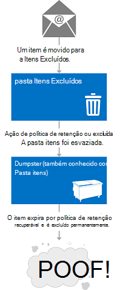
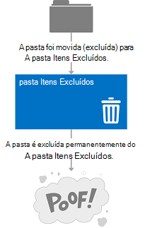
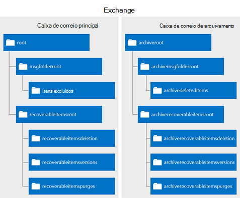

# Excluindo itens usando o EWS no ExchangeDeleting items by using EWS in Exchange

Descubra como você pode usar a API gerenciada de EWS ou EWS no Exchange para excluir itens por movê-los para a pasta Itens excluídos ou para o dumpster.Find out how you can use the EWS Managed API or EWS in Exchange to delete items either by moving them to the Deleted Items folder or to the dumpster.
  
Você nunca solicitaram si mesmo o que é a diferença entre mover itens para a pasta Itens excluídos e movê-los para o dumpster?Have you ever asked yourself what the difference is between moving items to the Deleted Items folder, and moving them to the dumpster? Você pode estar curioso para saber as diferentes opções de itens excluída de manipulação e como implementar essas opções em seu aplicativo.You might be curious about the different options for handling deleted items and how to implement those options in your application. Serviços Web do Exchange (EWS) inclui três opções para itens excluído de tratamento.Exchange Web Services (EWS) includes three options for handling deleted items. Este artigo esperamos limpará qualquer confusão, que você pode ter sobre as diferenças entre elas.This article will hopefully clear up any confusion you might have about the differences between them.
  
## Excluindo itens - quais são minhas opções?Deleting items - what are my options?

Antes que você possa compreender o cenário geral para excluir itens, é importante reconhecer a diferença entre o seguinte:Before you can understand the overall landscape for deleting items, it's important to recognize the difference between the following:
  
- A pasta Itens excluídos - quando você exclui os itens em uma caixa de correio, isso é onde eles ir.The Deleted Items folder - When you delete items in a mailbox, this is where they go.
    
- O dumpster (também conhecido como a pasta itens recuperáveis) - quando você remove itens de uma caixa de correio, isso é onde eles ir.The dumpster (aka the Recoverable Items folder) - When you remove items from a mailbox, this is where they go.
    
Figuras 1 e 2 mostram a aparência do processo de exclusão de itens e pastas em uma caixa de correio.Figures 1 and 2 show what the deletion process looks like for items and folders in a mailbox. 

**Figura 1. Processo para exclusão de itens de uma caixa de correio****Figure 1. Process for deleting items from a mailbox**

 

**Figura 2. Processo para exclusão de pastas de uma caixa de correio****Figure 2. Process for deleting folders from a mailbox**

   
Você pode excluir itens e pastas de três maneiras diferentes, dependendo de como "permanente" você gostaria de ser a exclusão.You can delete items and folders three different ways, depending on how "permanent" you would like the deletion to be.
  
**Tabela 1: Opções de exclusão de itens usando o EWS****Table 1: Options for deleting items by using EWS**

|**Opção****Option**|**O que acontece****What happens**|
|:-----|:-----|
|Mover para a pasta Itens excluídosMove to the Deleted Items folder    |Essa é a maneira permanente mínimos para excluir itens.This is the least permanent way to delete items.  Isso é como colocar uma folha de papel na Lixeira por sua mesa de trabalho.This is like putting a piece of paper in the recycle bin by your desk. Você pode capturá-la facilmente se você precisar novamente.You can easily grab it if you need it again.  Você pode usar qualquer [operação de exclusão](deleting-items-by-using-ews-in-exchange.md#bk_howdoIdeleteitems) que implementa a mudança para a opção de pasta de itens excluídos para executar essa ação.You can use any [deletion operation](deleting-items-by-using-ews-in-exchange.md#bk_howdoIdeleteitems) that implements the move to the Deleted Items folder option to perform this action.  Você também pode usar a [operação MoveItem](http://msdn.microsoft.com/library/dcf40fa7-7796-4a5c-bf5b-7a509a18d208%28Office.15%29.aspx) ( [Item.Move()](http://msdn.microsoft.com/en-us/library/microsoft.exchange.webservices.data.item.move%28v=exchg.80%29.aspx)) ou a [operação MoveFolder](http://msdn.microsoft.com/library/c7233966-6c87-4a14-8156-b1610760176d%28Office.15%29.aspx) ( [Folder.Move()](http://msdn.microsoft.com/en-us/library/microsoft.exchange.webservices.data.folder.move%28v=exchg.80%29.aspx)) para mover um item ou pasta para a pasta Itens excluídos.You can also use the [MoveItem operation](http://msdn.microsoft.com/library/dcf40fa7-7796-4a5c-bf5b-7a509a18d208%28Office.15%29.aspx) ( [Item.Move()](http://msdn.microsoft.com/en-us/library/microsoft.exchange.webservices.data.item.move%28v=exchg.80%29.aspx)) or the [MoveFolder operation](http://msdn.microsoft.com/library/c7233966-6c87-4a14-8156-b1610760176d%28Office.15%29.aspx) ( [Folder.Move()](http://msdn.microsoft.com/en-us/library/microsoft.exchange.webservices.data.folder.move%28v=exchg.80%29.aspx)) to move an item or folder to the Deleted Items folder.    |
|Exclusão reversívelSoft delete    |O item é movido para a pasta de exclusões no dumpster.The item is moved to the Deletions folder in the dumpster.  Isso é como esvaziar a Lixeira em seu contêiner de curbside.This is like emptying your recycle bin into your curbside container. Você ainda pode acessar o item se for necessário, é um pouco mais difícil.You can still access the item if you need to, it's just a little harder.    Para obter mais informações sobre o dumpster (também chamado de pasta itens recuperáveis) e cenários como isenções de descoberta eletrônica ou litígios, consulte a [Pasta itens recuperáveis](http://technet.microsoft.com/en-us/library/ee364755%28v=exchg.150%29.aspx) no TechNet.For more about the dumpster (also called the Recoverable Items folder) and scenarios such as eDiscovery or litigation holds, see [Recoverable Items Folder](http://technet.microsoft.com/en-us/library/ee364755%28v=exchg.150%29.aspx) on TechNet.  Exclusões suaves não são recomendadas para aplicativos destino Exchange 2007.Soft deletions aren't recommended for applications that target Exchange 2007. No Exchange 2007, exclusões suaves são tratadas por configuração um pouco no item para indicar que ela será movida para o dumpster momento não especificado.In Exchange 2007, soft deletions are handled by setting a bit on the item to indicate that it will be moved to the dumpster at an unspecified time.  Exclusão reversível traversais ou pesquisas de itens que tenham sido suaves excluídos por meio da [operação FindItem](http://msdn.microsoft.com/library/ebad6aae-16e7-44de-ae63-a95b24539729%28Office.15%29.aspx), não são suportadas no Exchange Online, Exchange Online como parte do Office 365 e versões do Exchange, começando com o Exchange 2010.Soft delete traversals, or searches of items that have been soft deleted via the [FindItem operation](http://msdn.microsoft.com/library/ebad6aae-16e7-44de-ae63-a95b24539729%28Office.15%29.aspx), are not supported in Exchange Online, Exchange Online as part of Office 365, and versions of Exchange starting with Exchange 2010.    **Observação**: pastas não podem ser excluídas soft.**NOTE**:  Folders cannot be soft deleted.           |
|Exclusão duraHard delete    |O item ou a pasta é excluída permanentemente.The item or folder is permanently deleted.  Itens excluídos de disco rígido são colocados na pasta limpezas do dumpster.Hard-deleted items are placed in the Purges folder of the dumpster. Isso é como quando o reciclagem caminhão esvazia seu contêiner de reciclagem curbside.This is like when the recycling truck empties your curbside recycle container. Os itens não podem ser acessados a partir de um cliente de email como o Outlook ou o Outlook Web App e, a menos que haja uma isenção definido na caixa de correio, os itens serão excluídos permanentemente após um período definido de tempo.The items cannot be accessed from an email client like Outlook or Outlook Web App, and, unless there is a hold set on the mailbox, the items will be permanently deleted after a set period of time.  Você pode ler mais sobre a retenção de item no artigo [Configurar retenção de Item excluído e cotas de itens recuperáveis](http://technet.microsoft.com/en-us/library/ee364752%28v=exchg.150%29.aspx).You can read more about item retention in the article [Configure Deleted Item Retention and Recoverable Items Quotas](http://technet.microsoft.com/en-us/library/ee364752%28v=exchg.150%29.aspx).  **Observação**: pastas não são colocadas na pasta limpezas quando eles grave são excluídos.**NOTE**:  Folders are not placed in the Purges folder when they are hard deleted. Pastas de disco rígido excluído serão removidas da caixa de correio.Hard-deleted folders are removed from the mailbox.  |
   
A mudança para a pasta Itens excluídos e as opções de exclusão dura são transacional, o que significa que no momento em que a chamada de serviço da web estiver concluída, o item foi movido para a pasta Itens excluídos ou o dumpster.The move to the Deleted Items folder and the hard delete options are transactional, which means that by the time the web service call finishes, the item has been moved to the Deleted Items folder or the dumpster.
  
Para ajudá-lo a compreender melhor o ecossistema das pastas que são usadas para armazenar itens excluídos, a figura a seguir mostra a hierarquia de pastas que pode conter os itens excluídos.To help you better understand the ecosystem of folders that are used to store deleted items, the following figure shows the hierarchy of folders that can contain deleted items. Os nomes de pasta são como aparecem no tipo de esquema **DistinguishedFolderIdNameType** ou a enumeração **WellKnownFolderName** na API gerenciada do EWS.The folder names are as they appear in the **DistinguishedFolderIdNameType** schema type, or the **WellKnownFolderName** enumeration in the EWS Managed API. 
  
**Figura 3. Hierarquia de pastas que contêm os itens excluídos****Figure 3. Hierarchy of folders that contain deleted items**

  
**Tabela 2: Pastas que contêm os itens excluídos****Table 2: Folders that contain deleted items**

|**Nome da pasta****Folder name**|**Introduzido no****Introduced in**|**Descrição****Description**|
|:-----|:-----|:-----|
|deleteditemsdeleteditems    |Exchange 2007Exchange 2007    |A pasta de itens excluídos do padrão.The default Deleted Items folder. Os itens permanecem nessa pasta até que estejam ou disco rígido-excluída ou até que um período de retenção foi excedido.Items remain in this folder until they are soft- or hard-deleted or until a retention period has been exceeded. Em seguida, eles serão movidos para uma pasta no dumpster.Then they are moved to a folder in the dumpster. Deleted pastas são colocadas na pasta Itens excluídos, e quando estiverem ou disco rígido-excluída, eles são permanentemente removidos da caixa de correio e não podem ser recuperados.Deleted folders are placed in the Deleted Items folder, and when they are soft- or hard-deleted, they are permanently removed from the mailbox and are not recoverable.    |
|recoverableitemsrootrecoverableitemsroot    |Exchange 2010Exchange 2010    |Da raiz do dumpster, ou a pasta itens recuperáveis.The root of the dumpster, or the Recoverable Items folder. Acesso do Dumpster foi implementado no EWS no Exchange 2010.Dumpster access was implemented in EWS in Exchange 2010. O nome de exibição para essa pasta é "Itens recuperáveis".The display name for this folder is "Recoverable Items".    |
|recoverableitemsdeletionsrecoverableitemsdeletions    |Exchange 2010Exchange 2010    |Principal dumpster pasta para uma caixa de correio.The main dumpster folder for a mailbox. Itens excluída e itens movidos da pasta Itens excluídos por uma política de retenção são colocados nessa pasta.Soft-deleted items and items moved from the Deleted Items folder by a retention policy are placed in this folder. O nome de exibição para essa pasta é "Exclusões".The display name for this folder is "Deletions".    |
|recoverableitemsversionsrecoverableitemsversions    |Exchange 2010Exchange 2010    |Onde as versões mais antigas de um item são armazenadas.Where older versions of an item are stored. Versões antigas de um item são criadas quando um item é atualizado.Old versions of an item are created when an item is updated. Versões de itens de rascunho não são salvos nessa pasta.Draft item versions are not saved to this folder. O nome para exibição dessa pasta é "Versões".The display name of this folder is "Versions".    |
|recoverableitemspurgesrecoverableitemspurges    |Exchange 2010Exchange 2010    |Onde os itens que são removidos da pasta exclusões são armazenados.Where items that are removed from the Deletions folder are stored. Todos os itens de armazenamento de disco rígido excluído são movidos para essa pasta.All store hard-deleted items are moved to this folder. O nome de exibição para essa pasta é "Limpa".The display name for this folder is "Purges".    |
|archiveddeletedtitemsarchiveddeletedtitems    |Exchange 2010Exchange 2010    |A pasta Itens excluídos do padrão para uma caixa de correio de arquivo morto.The default Deleted Items folder for an archive mailbox.    |
|archiverecoverablesitemsrootarchiverecoverablesitemsroot    |Exchange 2010Exchange 2010    |A raiz do dumpster pasta para uma caixa de correio de arquivo morto.The root dumpster folder for an archive mailbox. Itens que estão excluída arquivados são movidos para uma subpasta nesta pasta.Archived items that are soft-deleted are moved to a subfolder in this folder.    |
|archiverecoverableitemsdeletionsarchiverecoverableitemsdeletions    |Exchange 2010Exchange 2010    |Principal dumpster pasta para uma caixa de correio de arquivo morto.The main dumpster folder for an archive mailbox. Arquivadas itens movidos para o dumpster são colocados aqui.Archived items moved to the dumpster are placed here.    |
|archiverecoverableitemsversionsarchiverecoverableitemsversions    |Exchange 2010Exchange 2010    |Onde as versões mais antigas do itens arquivados estão armazenadas.Where older versions of archived items are stored.    |
|archiverecoverableitemspurgesarchiverecoverableitemspurges    |Exchange 2010Exchange 2010    |Onde os itens que estão excluídos do arquivo morto exclusões de pasta no dumpster são armazenados.Where items that are hard-deleted from the archive Deletions folder in the dumpster are stored. Todos os itens do repositório rígido excluído arquivado são movidos para essa pasta.All store hard-deleted archived items are moved to this folder.    |
   
## Como faço para excluir itens?How do I delete items?

Utilize um dos procedimentos a seguir para indicar se deseja mover um item para a pasta Itens excluídos ou executar um reversível excluir ou excluir um disco rígido:Use one of the following to indicate whether to move an item to the Deleted Items folder or perform a soft delete or a hard delete:
  
- O **DisposalType** tipo simples, se você usar o EWS para acessar o Exchange.The **DisposalType** simple type, if you use EWS to access Exchange. 
    
- A [enumeração DeleteMode](http://msdn.microsoft.com/en-us/library/exchange/microsoft.exchange.webservices.data.deletemode%28v=exchg.80%29.aspx), se você usar a API gerenciada de EWS.The [DeleteMode enumeration](http://msdn.microsoft.com/en-us/library/exchange/microsoft.exchange.webservices.data.deletemode%28v=exchg.80%29.aspx), if you use the EWS Managed API.
    
Você pode usar um número de diferentes operações de EWS ou os métodos de API gerenciada de EWS para excluir pastas e itens de uma caixa de correio.You can use a number of different EWS operations or EWS Managed API methods to delete items and folders from a mailbox.
  
**Tabela 3: Operações do EWS e métodos de API gerenciada de EWS para excluir itens****Table 3: EWS operations and EWS Managed API methods for deleting items**

|**Operação do EWS****EWS operation**|**Método API gerenciada de EWS****EWS Managed API method**|**Introduzido no****Introduced in**|**O que ele faz****What it does**|
|:-----|:-----|:-----|:-----|
|[Operação DeleteFolderDeleteFolder operation](http://msdn.microsoft.com/library/b0f92682-4895-4bcf-a4a1-e4c2e8403979%28Office.15%29.aspx)   |[Método Folder.DeleteFolder.Delete method](http://msdn.microsoft.com/en-us/library/exchange/microsoft.exchange.webservices.data.folder.delete%28v=exchg.80%29.aspx)   |Exchange 2007Exchange 2007    |Exclui pastas de uma caixa de correio.Deletes folders from a mailbox. Com o EWS, você pode lote excluir pastas.With EWS, you can batch delete folders. Com a API gerenciada de EWS, você só pode excluir uma única pasta por chamada.With the EWS Managed API, you can only delete a single folder per call.    |
|[Operação DeleteItemDeleteItem operation](http://msdn.microsoft.com/library/3e26c416-fa12-476e-bfd2-5c1f4bb7b348%28Office.15%29.aspx)   |[Método itemItem.Delete method](http://msdn.microsoft.com/en-us/library/exchange/microsoft.exchange.webservices.data.item.delete%28v=exchg.80%29.aspx)  [Método ExchangeService.DeleteItemsExchangeService.DeleteItems method](http://msdn.microsoft.com/en-us/library/exchange/microsoft.exchange.webservices.data.exchangeservice.deleteitems%28v=exchg.80%29.aspx)   |Exchange 2007Exchange 2007    |Exclui os itens de uma caixa de correio.Deletes items from a mailbox.    |
|[Operação EmptyFolderEmptyFolder operation](http://msdn.microsoft.com/library/98161486-e2f2-480f-8d5d-708ba81b208a%28Office.15%29.aspx)   |[Método Folder.EmptyFolder.Empty method](http://msdn.microsoft.com/en-us/library/exchange/microsoft.exchange.webservices.data.folder.empty%28v=exchg.80%29.aspx)   |Exchange 2010Exchange 2010    |Exclui todos os itens em uma pasta e, opcionalmente, exclui todas as subpastas em uma pasta.Deletes all the items in a folder, and, optionally, deletes all subfolders in a folder.    |
|[Operação ApplyConversationActionApplyConversationAction operation](http://msdn.microsoft.com/library/73d7943d-d361-4f8b-9948-d85f886efa1a%28Office.15%29.aspx)   |[Método Conversation.EnableAlwaysDeleteItemsConversation.EnableAlwaysDeleteItems method](http://msdn.microsoft.com/en-us/library/exchange/microsoft.exchange.webservices.data.conversation.enablealwaysdeleteitems%28v=exchg.80%29.aspx)  [Método Conversation.DeleteItemsConversation.DeleteItems method](http://msdn.microsoft.com/en-us/library/exchange/microsoft.exchange.webservices.data.conversation.deleteitems%28v=exchg.80%29.aspx)   |Exchange 2010Exchange 2010    |Define uma exclusão processamento ação em mensagens de email em uma conversa de modo que eles são excluídos.Sets a delete processing action on email messages in a conversation so that they are deleted.    |
|[Operação DeleteUserConfigurationDeleteUserConfiguration operation](http://msdn.microsoft.com/library/93e44690-be2d-4fdb-96a8-4ded3c193aed%28Office.15%29.aspx)   |[Método UserConfiguration.DeleteUserConfiguration.Delete method](http://msdn.microsoft.com/en-us/library/exchange/microsoft.exchange.webservices.data.userconfiguration.delete%28v=exchg.80%29.aspx)   |Exchange 2010Exchange 2010    |Exclui uma pasta associada item e o move para o dumpster.Deletes a folder associated item and moves it to the dumpster.    |
|[Operação CreateItemCreateItem operation](http://msdn.microsoft.com/library/78a52120-f1d0-4ed7-8748-436e554f75b6%28Office.15%29.aspx)   |[Método Appointment.AcceptAppointment.Accept method](http://msdn.microsoft.com/en-us/library/microsoft.exchange.webservices.data.appointment.accept%28v=exchg.80%29.aspx)   [Método Appointment.AcceptTentativelyAppointment.AcceptTentatively method](http://msdn.microsoft.com/en-us/library/microsoft.exchange.webservices.data.appointment.accepttentatively%28v=exchg.80%29.aspx)  [Método Appointment.CancelMeetingAppointment.CancelMeeting method](http://msdn.microsoft.com/en-us/library/microsoft.exchange.webservices.data.appointment.cancelmeeting%28v=exchg.80%29.aspx)  [Appointment.DeclineAppointment.Decline](http://msdn.microsoft.com/en-us/library/microsoft.exchange.webservices.data.appointment.decline%28v=exchg.80%29.aspx)  [Método MeetingRequest.AcceptMeetingRequest.Accept method](http://msdn.microsoft.com/en-us/library/microsoft.exchange.webservices.data.meetingrequest.accept%28v=exchg.80%29.aspx)  [Método MeetingRequest.AcceptTentativelyMeetingRequest.AcceptTentatively method](http://msdn.microsoft.com/en-us/library/microsoft.exchange.webservices.data.meetingrequest.accepttentatively%28v=exchg.80%29.aspx)  [Método MeetingRequest.DeclineMeetingRequest.Decline method](http://msdn.microsoft.com/en-us/library/microsoft.exchange.webservices.data.meetingrequest.decline%28v=exchg.80%29.aspx)   |Exchange 2007Exchange 2007    |Move um item para a pasta Itens excluídos indiretamente sempre que uma resposta a uma solicitação de reunião é enviada ou a resposta foi definida no compromisso.Indirectly moves an item to the Deleted Items folder whenever a response to a meeting request is sent or the response is set on the appointment.  O tipo de exclusão não está definida nessa operação.The deletion type is not set on this operation. As mensagens de reunião são movidas para a pasta Itens excluídos quando um objeto de resposta com êxito é processado pelo serviço.The meeting messages are moved to the Deleted Items folder when a response object is successfully processed by the service.    |
   
Você também pode mover itens para a pasta Itens excluídos usando regras de caixa de entrada.You can also move items to the Deleted Items folder by using Inbox rules. Por exemplo, você pode [criar regras](inbox-management-and-ews-in-exchange.md) que tenham uma ação de excluir.For example, you can [create rules](inbox-management-and-ews-in-exchange.md) that have a delete action. 
  
Alguns pontos a serem observados sobre a exclusão de itens:Some points to note about deleting items:
  
- Excluir uma ocorrência de um item recorrente não aciona uma movimentação para a pasta Itens excluídos ou o dumpster.Deleting an occurrence of a recurring item does not trigger a move to the Deleted Items folder or the dumpster. Isso resulta em uma atualização para o item mestre recorrente da série recorrente.This results in an update to the recurring master item of the recurring series.
    
- Você não pode excluir pastas padrão da caixa de correio.You cannot delete default folders from the mailbox.
    
- Evite a exclusão de reuniões ou mensagens de reunião, solicitações de reunião e/ou atualizações de reunião.Avoid deleting meetings or meeting messages, such as meeting requests and or meeting updates. Em vez disso, responda a estes itens usando objetos de resposta.Instead, respond to these items by using response objects. Dessa forma, os itens de calendário associadas são atualizados para refletir do organizador ou do Respondente ações.This way, the associated calendar items are updated to reflect the responder's or organizer's actions.
    
- Alterar chave de um item não será atualizado quando o item é movido para a pasta Itens excluídos ou exclusões.An item's change key is not updated when the item is moved to the Deleted Items or Deletions folder.
    
- Se você executar um disco rígido excluir em um item e chamar uma [operação SyncFolderHierarchy](http://msdn.microsoft.com/library/b31916b1-bc6c-4451-a475-b7c5417f752d%28Office.15%29.aspx) ou método de API gerenciada de EWS [SyncFolderHierarchy](http://msdn.microsoft.com/en-us/library/microsoft.exchange.webservices.data.exchangeservice.syncfolderhierarchy%28v=exchg.80%29.aspx) ou um método [SyncFolderItems operação](http://msdn.microsoft.com/library/7f0de089-8876-47ec-a871-df118ceae75d%28Office.15%29.aspx) ou [SyncFolderItems](http://msdn.microsoft.com/en-us/library/microsoft.exchange.webservices.data.exchangeservice.syncfolderitems%28v=exchg.80%29.aspx) , uma alteração de **Excluir** entrada será retornada.If you perform a hard delete on an item and then call a [SyncFolderHierarchy operation](http://msdn.microsoft.com/library/b31916b1-bc6c-4451-a475-b7c5417f752d%28Office.15%29.aspx) or [SyncFolderHierarchy](http://msdn.microsoft.com/en-us/library/microsoft.exchange.webservices.data.exchangeservice.syncfolderhierarchy%28v=exchg.80%29.aspx) EWS Managed API method, or a [SyncFolderItems operation](http://msdn.microsoft.com/library/7f0de089-8876-47ec-a871-df118ceae75d%28Office.15%29.aspx) or [SyncFolderItems](http://msdn.microsoft.com/en-us/library/microsoft.exchange.webservices.data.exchangeservice.syncfolderitems%28v=exchg.80%29.aspx) method, a **Delete** change entry will be returned. Se você mover um item para a pasta Itens excluídos, uma entrada de alteração de **atualização** será retornada.If you move an item to the Deleted Items folder, an **Update** change entry is returned. Isso ocorre porque o item ou a pasta terá um novo valor da propriedade [ParentFolderId](http://msdn.microsoft.com/library/258f4b1f-367e-4c7d-9c29-eb775a2398c7%28Office.15%29.aspx) .This is because the item or folder will have a new [ParentFolderId](http://msdn.microsoft.com/library/258f4b1f-367e-4c7d-9c29-eb775a2398c7%28Office.15%29.aspx) property value. [Leia mais sobre sincronização](mailbox-synchronization-and-ews-in-exchange.md) se sincronizando itens excluídos faz parte do seu cenário.[Read more about synchronization](mailbox-synchronization-and-ews-in-exchange.md) if synchronizing deleted items is part of your scenario. 
    
## Saiba mais sobre a exclusão de itensFind out more about deleting items

- [Receber notificações de eventos de caixa de correio relacionadas a exclusão do EWS no ExchangePull notifications for EWS deletion-related mailbox events in Exchange](pull-notifications-for-ews-deletion-related-mailbox-events-in-exchange.md)
    
- [Tratando erros relacionados a exclusão no EWS no ExchangeHandling deletion-related errors in EWS in Exchange](handling-deletion-related-errors-in-ews-in-exchange.md)
    
## Confira tambémSee also

- [Pastas e itens no EWS no ExchangeFolders and items in EWS in Exchange](folders-and-items-in-ews-in-exchange.md)    
- [Develop web service clients for ExchangeDevelop web service clients for Exchange](develop-web-service-clients-for-exchange.md)    
- [Pasta itens recuperáveisRecoverable Items Folder](http://technet.microsoft.com/en-us/library/ee364755.aspx)    
- [Recuperação de Item único no Exchange Server 2010Single Item Recovery in Exchange Server 2010](http://blogs.technet.com/b/exchange/archive/2009/09/25/3408389.aspx#_Single_Item_Recovery)    
- [Exchange 2013: Excluir uma série recorrente programaticamente dos servidores do ExchangeExchange 2013: Delete a recurring series programmatically from Exchange servers](http://code.msdn.microsoft.com/exchange/Exchange-2013-Delete-a-e1c7b89d)    
- [Exchange 2013: Excluir tarefas de uma conta em servidores Exchange programaticamenteExchange 2013: Delete tasks from an account on Exchange servers programmatically](http://code.msdn.microsoft.com/exchange/Exchange-2013-Delete-tasks-13824637)    
- [Exchange 2013: Esvaziar pastas em servidores Exchange programaticamenteExchange 2013: Empty folders on Exchange servers programmatically](http://code.msdn.microsoft.com/exchange/Exchange-2013-Empty-6487df37)    
- [Exchange 2013: Exclua pastas programaticamente dos servidores do ExchangeExchange 2013: Delete folders programmatically from Exchange servers](http://code.msdn.microsoft.com/exchange/Exchange-2013-Delete-aa1a5823)    
- [Exchange 2013: Excluir muitos itens programaticamente dos servidores do ExchangeExchange 2013: Delete many items programmatically from Exchange servers](http://code.msdn.microsoft.com/exchange/Exchange-2013-Delete-many-064f8760)    
- [Exchange 2013: Excluir contatos programaticamente dos servidores do ExchangeExchange 2013: Delete contacts programmatically from Exchange servers](http://code.msdn.microsoft.com/exchange/Exchange-2013-Delete-3b8b0640)    
- [Excluir compromissos e cancelar reuniões usando o EWS no ExchangeDelete appointments and cancel meetings by using EWS in Exchange](how-to-delete-appointments-and-cancel-meetings-by-using-ews-in-exchange.md)    
- [Gerenciar configurações de aplicativo persistente usando o EWS no ExchangeManage persistent application settings by using EWS in Exchange](how-to-manage-persistent-application-settings-by-using-ews-in-exchange.md)
    

