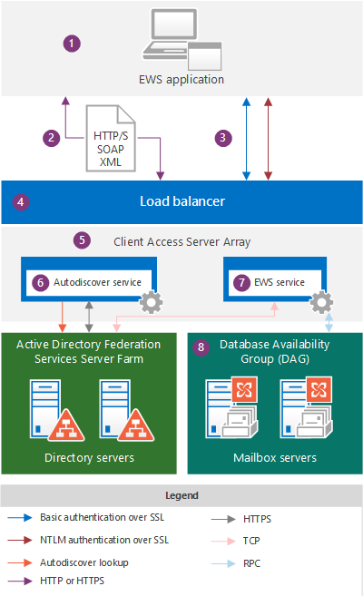
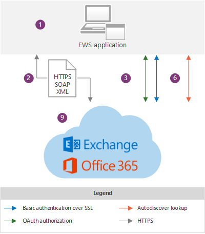

# Aplicativos do EWS e arquitetura do ExchangeEWS applications and the Exchange architecture

Saiba mais sobre o funcionamento do EWS dentro da arquitetura do Exchange e descubra quais protocolos depende do EWS.Learn about how EWS works within the Exchange architecture, and find out which protocols EWS relies on.
  
Serviços Web do Exchange (EWS) é uma API de plataforma cruzada que permite aos aplicativos acessar itens de caixa de correio, como mensagens de email, reuniões e contatos do Exchange Online, Exchange Online como parte do Office 365, ou versões do Exchange começando com local Exchange Server 2007.Exchange Web Services (EWS) is a cross-platform API that enables applications to access mailbox items such as email messages, meetings, and contacts from Exchange Online, Exchange Online as part of Office 365, or on-premises versions of Exchange starting with Exchange Server 2007. [Aplicativos do EWS](ews-application-types.md) podem acessar os itens de caixa de correio local ou remotamente enviando uma solicitação em uma mensagem SOAP com base em XML.[EWS applications](ews-application-types.md) can access mailbox items locally or remotely by sending a request in a SOAP-based XML message. A mensagem SOAP está incorporada em uma mensagem de HTTP enviadas entre o aplicativo e servidor, o que significa que seu aplicativo pode postar XML via HTTP, desde que ela pode usar o EWS para acessar o Exchange.The SOAP message is embedded in an HTTP message when sent between the application and the server, which means that as long as your application can post XML through HTTP, it can use EWS to access Exchange. 
  
## Visão geral da arquitetura do ExchangeExchange architecture overview

Os diagramas a seguir mostram os métodos de autenticação e os caminhos de comunicação usados pelos aplicativos do EWS durante a comunicação com o Exchange 2013 e Exchange Online.The following diagrams show the authentication methods and communication paths used by EWS applications when communicating with Exchange 2013 and Exchange Online. Da perspectiva de aplicativos do EWS, os caminhos de comunicação são idênticos e os métodos de autenticação apenas variam; a principal diferença é que a visibilidade que você tem o back-end do Exchange.From the EWS application perspective, the communication paths are identical and the authentication methods only vary slightly; the main difference is the visibility you have into the Exchange backend.
  
**Figura 1. Aplicativos do EWS e a arquitetura do Exchange local****Figure 1. EWS application and the Exchange on-premises architecture**

  
A Figura 2 mostra os mesmos caminhos de comunicação mostrados na Figura 1, conforme usado pelos aplicativos do EWS durante a comunicação com o Exchange Online.Figure 2 shows the same communication paths shown in Figure 1, as used by EWS applications when communicating with Exchange Online.
  
**Figura 2. Aplicativos do EWS e a arquitetura do Exchange Online****Figure 2. EWS application and the Exchange Online architecture**

  
Estes são os componentes que são mostrados nos diagramas a:The following are the components that are shown in the diagrams:
  
1. Aplicativos do EWS — isso pode ser um [cliente, o portal ou o aplicativo de serviço](ews-application-types.md) e pode ser instalado em um cliente ou em um servidor de acesso para cliente do Exchange local.EWS application — This can be a [client, portal, or service application](ews-application-types.md) and it can be installed on a client or on an Exchange on-premises Client Access server. Se você usar a API gerenciada de EWS para desenvolver o aplicativo do EWS, os assemblies de API gerenciada de EWS precisam ser instalado no cliente e [redistribuídos pelo seu aplicativo](redistribution-requirements-for-the-ews-managed-api.md).If you use the EWS Managed API to develop the EWS application, the EWS Managed API assemblies have to be installed on the client and [redistributed by your application](redistribution-requirements-for-the-ews-managed-api.md).
    
2. A mensagem SOAP XML — mensagem An XML, em um envelope SOAP, incorporado em uma mensagem HTTP/S que está em conformidade com o arquivo Services.wsdl no servidor de acesso para cliente.The SOAP XML message — An XML message, in a SOAP envelope, embedded in an HTTP/S message that conforms to the Services.wsdl file on the Client Access server. HTTPS é recomendado para o Exchange local e é necessário para o Exchange Online.HTTPS is recommended for Exchange on-premises and is required for Exchange Online. 
    
3. Métodos de autenticação — mensagens EWS incluem básica, as informações de autenticação NTLM (autenticação integrada do Windows) ou OAuth como parte da carga do HTTP.Authentication methods — EWS messages include basic, NTLM (Windows Integrated authentication), or OAuth authentication information as part of the HTTP payload. 
    
4. Balanceador de carga — o balanceador de carga distribui a mensagem para um servidor de acesso para cliente pela matriz de servidores de acesso para cliente.Load balancer — The load balancer distributes the message to a Client Access server in the Client Access server array. Esse componente só estará visível na arquitetura de local do Exchange.This component is only visible in the Exchange on-premises architecture.
    
5. Matriz de servidores de acesso do cliente — servidores de acesso para cliente são organizados em um grupo com balanceamento de carga chamado uma matriz de servidores de acesso para cliente.Client Access server array — Client Access servers are organized into a load-balanced group called a Client Access server array. Servidores de acesso para cliente individuais fornecem autenticação, limitado de redirecionamento e proxy serviços.Individual Client Access servers provide authentication, limited redirection, and proxy services. Os próprios servidores de acesso para cliente não fazem qualquer processamento de dados e nenhum dado é colocada em fila ou armazenado em um servidor de acesso para cliente - é fina e estado; ele simplesmente autentica a solicitação, executa uma pesquisa de descoberta automática e, em seguida, proxies a solicitação para o servidor de caixa de correio.The Client Access servers themselves don't do any data rendering, and no data is queued or stored on a Client Access server - it is thin and stateless; it simply authenticates the request, performs an Autodiscover lookup, and then proxies the request to the Mailbox server. O servidor de acesso para cliente manter uma relação de 1:1 com o servidor de caixa de correio que hospeda os dados do usuário.The Client Access server does maintain a 1:1 relationship with the Mailbox server that hosts the user's data. O protocolo HTTP (protegido por meio de SSL usando um certificado autoassinado) é usado entre o servidor de acesso para cliente e o servidor de caixa de correio.The HTTP protocol (secured via SSL using a self-signed certificate) is used between the Client Access server and Mailbox server. Esse componente só estará visível na arquitetura de local do Exchange.This component is only visible in the Exchange on-premises architecture.
    
6. Serviço de descoberta automática — serviço de descoberta automática a executa uma descoberta de serviço acessando os serviços de domínio Active Directory (AD DS) para recuperar a versão de caixa de correio e o local do servidor de caixa de correio que está hospedando a cópia ativa dos dados do usuário.Autodiscover service — The Autodiscover service performs a service discovery by accessing Active Directory Domain Services (AD DS) to retrieve the mailbox version and the location of the Mailbox server that is hosting the active copy of the user's data.
    
7. Serviço EWS — serviço o EWS é descrito por três arquivos: Services.wsdl, Messages.xsd e Types.xsd, bem como os assemblies de API gerenciada de EWS.EWS service —The EWS service is described by three files: Services.wsdl, Messages.xsd, and Types.xsd, as well as the EWS Managed API assemblies. Services.WSDL descreve o contrato entre o cliente e servidor, Messages.xsd define as mensagens de solicitação e resposta SOAP e Types.xsd define os elementos usados nas mensagens SOAP.Services.wsdl describes the contract between the client and server, Messages.xsd defines the request and response SOAP messages, and Types.xsd defines the elements used in the SOAP messages. Messages.xsd e Types.xsd sempre contenham as versões mais recentes do esquema, embora existam de versões anteriores do esquema.Messages.xsd and Types.xsd always contain the latest versions of the schema, although earlier versions of the schema exist. Observe que Services.wsdl, Messages.xsd e Types.xsd são disponibilizados no servidor de acesso para cliente, mas não são usados para a validação de esquema realmente — eles são fornecidos apenas para referência.Note that Services.wsdl, Messages.xsd, and Types.xsd are made available on the Client Access server, but are not actually used for schema validation — they are provided for reference only. Os assemblies de API gerenciada de EWS são fornecidos para aplicativos de cliente do EWS do servidor e são implantados em todas as funções do Exchange Server, não apenas os servidores de acesso para cliente.The EWS Managed API assemblies are provided for server-side EWS client applications and are deployed on all Exchange Server roles, not just the Client Access servers. Esse componente só estará visível na arquitetura de local do Exchange.This component is only visible in the Exchange on-premises architecture.
    
    Disponibilidade de recurso baseia-se na versão do esquema de EWS que suas metas de aplicativo.Feature availability is based on the EWS schema version that your application targets. Como os esquemas EWS são e encaminhar-compatível, se você criar um aplicativo que tem como destino uma versão anterior do esquema, como o Exchange 2007 SP1, seu aplicativo também funcionará em relação a uma versão posterior do esquema, como o serviço do Exchange 2010 SP2, bem como Exchange Online.Because EWS schemas are backward- and forward-compatible, if you create an application that targets an earlier schema version, such as Exchange 2007 SP1, your application will also work against a later schema version, such as the Exchange 2010 SP2 service, as well as Exchange Online. Porque os recursos e as atualizações de recurso são acionadas pelo esquema, recomendamos que você use a base de código comum primeira voltado para os recursos do EWS que você deseja implementar no seu aplicativo cliente.Because features and feature updates are driven by the schema, we recommend that you use the earliest common code base that targets the EWS features that you want to implement in your client application. Muitos aplicativos podem direcionar a versão Exchange2007_SP1, porque o esquema do Exchange 2007 SP1 contém quase todas a funcionalidade básica do Exchange para trabalhar com itens e pastas do Exchange Store.Many applications can target the Exchange2007_SP1 version, because the Exchange 2007 SP1 schema contains almost all the core Exchange functionality for working with items and folders in the Exchange store. Para obter mais informações, consulte [recursos do cliente EWS](ews-client-design-overview-for-exchange.md#EWSFeatures).For more information, see [EWS client features](ews-client-design-overview-for-exchange.md#EWSFeatures).
    
8. Grupo de disponibilidade de banco de dados (DAG) — Servidores de caixa de correio são organizados em um DAG altamente disponível, que pode ser implantado em um ou mais centros de dados.Database Availability Group (DAG) — Mailbox servers are organized into a highly available DAG, which can be deployed in one or more datacenters. O servidor de caixa de correio contém o banco de dados de caixa de correio e lida com todas as atividades para as caixas de correio ativas no servidor.The Mailbox server contains the mailbox database and handles all activity for the active mailboxes on that server. Todos os componentes que processam, renderizam e armazenam os dados estão no servidor de caixa de correio.All components that process, render, and store data are on the Mailbox server. Os clientes não são conectadas diretamente ao servidor de caixa de correio; todas as conexões são manipuladas pelo servidor de acesso para cliente.Clients do not connect directly to the Mailbox server; all connections are handled by the Client Access server. Esse componente só estará visível na arquitetura de local do Exchange.This component is only visible in the Exchange on-premises architecture.
    
9. O Exchange Online e o Exchange Online como parte do Office 365 — a solução de mensagens hospedada que fornece recursos do Exchange como um serviço baseado em nuvem.Exchange Online and Exchange Online as part of Office 365 — The hosted messaging solution that delivers Exchange features as a cloud-based service.
    
Quando uma aplicativo da EWS solicitar informações do armazenamento do Exchange, uma mensagem de solicitação XML em conformidade com o SOAP padrão é criada e enviada ao servidor do Exchange.When an EWS application requests information from the Exchange store, an XML request message that complies with the SOAP standard is created and sent to the Exchange server. Quando o Exchange server recebe a solicitação, ele verifica as credenciais que são fornecidas pelo cliente e analisa automaticamente o XML para os dados solicitados.When the Exchange server receives the request, it verifies the credentials that are provided by the client and automatically parses the XML for the requested data. O servidor, em seguida, cria uma resposta SOAP que contém os dados XML que representa os objetos fortemente tipados solicitados e suas propriedades.The server then builds a SOAP response that contains XML data that represents the requested strongly typed objects and their properties. Os dados XML serão enviados para o aplicativo em uma resposta HTTP.The XML data is sent back to the application in an HTTP response. Em seguida, o aplicativo desserializa o XML e usa os dados para os objetos fortemente tipados a reforma.The application then deserializes the XML and uses the data to reform the strongly typed objects.
  
## Protocolos e padrões que devem oferecer suporte a aplicativos de EWSProtocols and standards that EWS applications must support

Para se comunicar com um servidor Exchange, aplicativos de EWS devem suportar os seguintes protocolos e padrões.To communicate with an Exchange server, EWS applications must support the following protocols and standards.
  
**Tabela 1. Protocolos****Table 1. Protocols**

|**Protocolo****Protocol**|**Como ele é usado****How it's used**|
|:-----|:-----|
|HTTP/SHTTP/S    |Permite que aplicativos de EWS acessar o banco de dados do Exchange na rede, independentemente se o cliente está na Internet ou intranet.Enables EWS applications to access Exchange database data over the network, regardless of whether the client is on the Internet or intranet.    |
|SOAP 1.0SOAP 1.0    |Um envelope ao redor da carga de mensagens de formulários.Forms an envelope around the messaging payload. EWS implementa o protocolo SOAP com o uso de diferentes partes do envelope SOAP para habilitar a funcionalidade de diferente.EWS implements the SOAP protocol by using different parts of the SOAP envelope to enable different functionality. O cabeçalho SOAP é usado para representação e fornecer dados de controle de versão.The SOAP header is used for impersonation and to provide versioning data. O corpo SOAP fornece informações sobre a operação a ser executada e os dados que serão enviados para a operação.The SOAP body provides information about the operation to run and the data that is submitted to the operation. Depende do SOAP WSDL para descrever as operações para chamar.SOAP relies on WSDL to describe the operations to call.    |
|WSDL 1.0WSDL 1.0    |Descreve as propriedades que são usadas para chamar operações EWS, no arquivo Services.wsdl, as operações e as associações.Describes the bindings, the operations, and the properties that are used to call EWS operations, in the Services.wsdl file. Esse arquivo, junto com os arquivos de esquema referenciado, compreende o contrato entre um aplicativo do EWS e Exchange server e é frequentemente usado juntamente com as ferramentas específicas de fornecedor para criar aplicativos específicos de plataforma.This file, along with the referenced schema files, comprises the contract between an EWS application and the Exchange server, and is often used along with vendor-specific tools to create platform-specific applications. O arquivo WSDL está localizado no diretório virtual EWS, que está na raiz do site.The WSDL file is located in the EWS virtual directory, which is at the root of the website.    |
|Transport Layer Security (TLS) / SSLTransport Layer Security (TLS)/SSL    |Fornece comunicações seguras na web na Internet ou na intranet.Provides secure web communications on the Internet or on intranet. O TLS permite que os aplicativos autenticar servidores ou, opcionalmente, para autenticar os aplicativos do EWS.TLS enables applications to authenticate servers or, optionally, servers to authenticate EWS applications. Ele também fornece um canal de segurança ao criptografar as comunicações.It also provides a security channel by encrypting communications. O TLS é a versão mais recente do protocolo Secure Sockets Layer (SSL).TLS is the latest version of the Secure Sockets Layer (SSL) protocol.    |
|XSD/XMLXML/XSD    |Fornece um formato de mensagem universal para a troca de informações entre o Exchange server e o cliente.Provides a universal message format for the exchange of information between the Exchange server and the client. XML fornece dados de banco de dados do Exchange complexos para aplicativos clientes, mas em uma estrutura definida.XML provides complex Exchange database data to client applications, but in a defined structure. A vantagem do XML é que ele permite que o intercâmbio de dados para o mesmo quando um aplicativo do EWS e o servidor não compartilharem uma plataforma comum.The beauty of XML is that it allows for the exchange of data even when an EWS application and server do not share a common platform.    |
   
Além disso, os aplicativos do EWS devem suportar os padrões de autenticação a seguir:In addition, EWS applications must support the following authentication standards:
  
- Autenticação básica sobre SSL, para aplicativos que visam o Exchange Online ou Exchange local.Basic authentication over SSL, for applications that target Exchange Online or Exchange on-premises.
    
- Autenticação NTLM sobre SSL, para aplicativos que suportam o Exchange local.NTLM authentication over SSL, for applications that support Exchange on-premises.
    
- OAuth 2.0 autenticação de token, para aplicativos de parceiros confiáveis e interoperabilidade com o Lync Server 2013 e SharePoint Server 2013.OAuth 2.0 token authentication, for trusted partner applications and interoperability with Lync Server 2013 and SharePoint Server 2013.
    
## Confira tambémSee also

- [Start using web services in ExchangeStart using web services in Exchange](start-using-web-services-in-exchange.md)
    
- [Tipos de aplicativos do EWSEWS application types](ews-application-types.md)
    
- [Visão geral de design de cliente do EWS do ExchangeEWS client design overview for Exchange](ews-client-design-overview-for-exchange.md)
    

