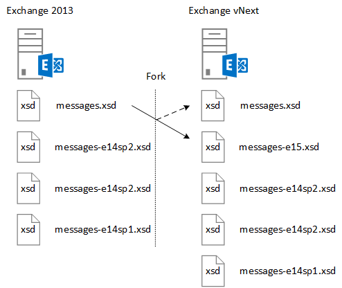

# <a name="ews-schema-versions-in-exchange"></a>Versões de esquema do EWS no Exchange

Aprenda sobre o EWS esquema e como projetar seu aplicativo para trabalhar com ele, bem como os recursos que estão disponíveis com cada versão do esquema e como o esquema se relaciona com a versão de serviço do Exchange.
  
O esquema do EWS define as estruturas de dados que podem ser enviadas para e retornadas pelo Exchange. Cada nova versão do Exchange que contém uma alteração significativa à funcionalidade do EWS conterá um novo esquema. O esquema do EWS e o EWS são com versões anteriores e em alguns casos, compatível com o sequencial - aplicativos projetados em relação a versões anteriores do EWS funcione, na maioria dos casos, com versões posteriores do EWS, e aplicativos que visam versões posteriores do EWS funcionará se o mesmo a funcionalidade foi incluída em uma versão anterior. Este artigo ajudará você a compreender a função do esquema do EWS, como controle de versão do esquema funciona, a relação entre a versão do esquema e a versão de serviço e como projetar seu aplicativo para trabalhar com o esquema do EWS. 
  
## <a name="role-of-the-ews-schema"></a>Função do esquema do EWS

O esquema do EWS faz o seguinte:
  
- Define o conjunto de recursos que está disponível para um cliente. Um cliente pode obter a lista das versões suportadas do esquema usando o [serviço de descoberta automática](autodiscover-for-exchange.md)do SOAP. O cliente pode determinar quais recursos ele pode acessar, porque cada versão de esquema que representa um [conjunto de recursos do EWS](ews-schema-versions-in-exchange.md#bk_features). Cada novo esquema lançada para o EWS contém as entidades de esquema da versão anterior plus as definições de esquema para qualquer funcionalidade nova. Dessa forma, o EWS suporta aplicativos que têm como alvo uma versão anterior do EWS.
    
- Fornece uma descrição geral do contrato de API. Você pode usar este contrato para determinar as estruturas de dados que podem ser enviadas e recebidas do Exchange.
    
- Oferece um mecanismo de controle de versão para enviar solicitações. O Exchange server contém todas as versões de esquema do EWS com suporte em seu diretório virtual. 
    
## <a name="designing-your-application-with-schema-version-in-mind"></a>Projetar o aplicativo com a versão do esquema em mente

Tenha os seguintes pontos em mente ao projetar seu aplicativo para trabalhar com diferentes versões do esquema do EWS:
  
- Ativar/desativar a funcionalidade de acordo com a versão do esquema. Você vai querer mapear a funcionalidade do cliente para a versão do esquema e, em alguns casos, para a versão do serviço. O exemplo a seguir retornará que um [PropertySet](http://msdn.microsoft.com/en-us/library/office/microsoft.exchange.webservices.data.propertyset%28v=exchg.80%29.aspx) com base na versão do serviço de esquema e. 
    
  ```cs
  private static PropertySet InitPropertySetByVersion(ExchangeService service)
  {
      PropertySet props;
      // The schema version to target to access the NormalizedBody property 
      // is Exchange2013 or later. The server version to target to access the 
      // NormalizedBody property on an email is 15 or later, which 
      // equates to Exchange 2013.
      if (service.RequestedServerVersion >= ExchangeVersion.Exchange2013 &amp;&amp;
          service.ServerInfo.MajorVersion >= 15)
      {
          props = new PropertySet(EmailMessageSchema.NormalizedBody);
      }
      else
      {
          props = new PropertySet(EmailMessageSchema.Body);
      }
      return props;
  }
  ```

- Versão suas solicitações com a versão mais antiga do esquema do EWS que suporta a funcionalidade que você deseja usar. Isso tornará seu cliente aplicável a um número maior de servidores do Exchange possíveis. Isso é menos importante se você estiver desenvolvendo um aplicativo de linha de negócios para direcionar somente para servidores da sua organização, mas é muito importante se você estiver criando um aplicativo para um público variado do Exchange.
    
## <a name="features-by-schema-version"></a>Recursos por versão do esquema
<a name="bk_features"> </a>

As versões de esquema que estão disponíveis para um cliente são identificadas na **ExchangeVersionType** digite simple localizado no esquema types.xsd. O **ExchangeVersionType** é implementado pelo elemento [RequestServerVersion](http://msdn.microsoft.com/library/af4032d5-42b3-463e-9d0a-8236d78e5b75%28Office.15%29.aspx) . O elemento **RequestServerVersion** é enviado em todas as solicitações EWS para indicar ao servidor qual versão do esquema, os destinos de cliente. Por sua vez, isso identifica o conjunto de recursos que está disponível para o cliente. 
  
**Tabela 1: Recursos EWS pela versão do produto e do esquema**

|**Versão do produto**|**Versão do esquema associado**|**Recursos**|
|:-----|:-----|:-----|
|Exchange Online  |A versão mais recente do esquema.  |Inclui todos os recursos na versão atual do Exchange além de quaisquer recursos novos que são adicionadas aos clientes online. |
|Exchange 2013 SP1 |Exchange2013_SP1 | Inclui todos os recursos no Exchange 2013.<br/><br/>Os seguintes recursos foram introduzidos no Exchange 2013 SP1: <ul><li>[Política de retenção de caixa de correio](http://msdn.microsoft.com/en-us/library/office/microsoft.exchange.webservices.data.exchangeservice.setholdonmailboxes%28v=exchg.80%29.aspx) </li><li> [Propor novo horário](how-to-propose-a-new-meeting-time-by-using-ews-in-exchange.md) </li><li>  Leia as atualizações de recebimento para [Atualizar](http://msdn.microsoft.com/EN-US/library/office/dn600559%28v=exchg.80%29.aspx) e [Excluir](http://msdn.microsoft.com/EN-US/library/office/dn600557%28v=exchg.80%29.aspx) itens  </li><li> Atualização de [informações de IRM](http://msdn.microsoft.com/EN-US/library/office/microsoft.exchange.webservices.data.conversation.hasirm%28v=exchg.80%29.aspx) para conversas  </li></ul> |
|Exchange 2013   |Exchange2013   | Inclui todos os recursos introduzidos no Exchange 2007 e Exchange 2010. <br/><br/>Os seguintes recursos foram introduzidos no Exchange 2013:<ul><li>Arquivamento  </li><li>  Descoberta eletrônica  </li><li>  Personagens  </li><li>  Políticas de retenção  </li><li>  Repositório unificado de contatos  </li><li>  Fotos dos usuários  </li></ul> |
|Exchange 2010 SP3   |Exchange2010_SP2 | Inclui todos os recursos introduzidos no Exchange 2010 SP1. <br/><br/>Os seguintes recursos foram introduzidos no Exchange 2010 SP2:<ul><li>Obtenha a validade da senha  </li><li>  Precisão de DateTime  </li><li>  Identificadores de propriedade atualizados para contatos  </li><li>  Novos cenários de representação  </li></ul> |
|Exchange 2010 SP1  |Exchange2010_SP1   | Inclui todos os recursos introduzidos no Exchange 2010. <br/><br/>Os seguintes recursos foram introduzidos no Exchange 2010 SP1:<ul><li>Criar, recuperar e modificar as regras de caixa de entrada  </li><li>  Acesso programático à caixa de correio de arquivo morto  </li><li>  Ações de conversas  </li><li>  Atravessando notificações de firewall  </li><li>  Recursos de administração aprimorado  </li><li>  Versão mista suporte aprimorado  </li><li>  Suporte à proteção de limitação  </li><li>  Controle de acesso do aplicativo a EWS  </li><li>  Suporte à autenticação de certificado de cliente  </li></ul> |
|Exchange 2010  |Exchange2010   | Inclui todos os recursos introduzidos no Exchange 2007 SP1. <br/><br/>Os seguintes recursos introduzidos na versão inicial do Exchange 2010:<ul><li>Lista completa de distribuição particular  </li><li>  Objetos de configuração do usuário  </li><li>  Itens associados de pasta  </li><li>  Acompanhamento de mensagens  </li><li>  Unificação de Mensagens  </li><li>  Descoberta Automática SOAP  </li><li>  Suporte aprimorado de fuso horário  </li><li>  Informações de disponibilidade de recurso de sala  </li><li>  Pesquisa indexada  </li><li>  Acesso do Dumpster  </li><li>  Informações de dicas de email  </li></ul> |
|Exchange 2007 SP1   |Exchange2007_SP1  | Inclui todos os recursos introduzidos no Exchange 2007. <br/><br/>Os seguintes recursos foram introduzidos no Exchange 2007 SP1:<ul><li>Gerenciamento de representante  </li><li>  Permissões de pasta  </li><li>  Pastas públicas  </li><li>  Postar itens  </li><li>  Conversão de ID  </li></ul>|
|Exchange 2007  |Exchange2007 | Os seguintes recursos introduzidos na versão inicial do Exchange 2007:<ul><li>Acesso total a itens, pastas e anexos (criar, obter, atualizar, excluir)  </li><li>  Availability  </li><li>  Sem configurações do Office  </li><li>  Notificações  </li><li>  Sincronização  </li><li>  Resolução de nomes  </li><li>  Expansão de lista (DL) de distribuição  </li><li>  Pesquisar  </li></ul> |
   
## <a name="relationship-between-the-ews-schema-and-the-service-version"></a>Relação entre o esquema do EWS e a versão do service
<a name="bk_features"> </a>

A versão do esquema EWS está relacionada à versão do serviço EWS que o servidor está executando. O padrão de nomeação para o esquema do EWS está relacionado às versões locais do Exchange. Por exemplo, a versão inicial do Exchange 2013 tem uma versão de serviço do 15.00.0516.032 e o nome do esquema **Exchange2013**. Porque o esquema foi atualizado para o Exchange 2013, Exchange 2013 e Exchange Online com uma versão de serviço do 15.00.0516.032 e posterior têm o mesmo nome de versão do esquema mais recente. Em versões anteriores do Exchange, o esquema do EWS não foi atualizado com as atualizações cumulativas (anteriormente denominada resumos). Mas como Exchange é atualizada com mais frequência para suportar o Exchange Online, atualizações cumulativas agora contém atualizações de esquema para o EWS. Os nomes de arquivo de esquema e o nome da versão de esquema associado, só são atualizadas com os service packs ou versões principais do Exchange local.
  
Enquanto o esquema do EWS define o contrato, em alguns cenários, a versão de serviço é a única maneira de um cliente determinar como ele deve para interagir com o serviço. Mudanças de comportamento de serviço que não sejam refletidas no esquema somente podem ser determinadas pela versão serviço retornado em todas as respostas do EWS. Por exemplo, quando [as pastas públicas](public-folder-access-with-ews-in-exchange.md) foram reprojetada no Exchange 2013, as operações que são usados para mover e copiar pastas públicas alteradas. Se você tiver criado um cliente para copiar pastas públicas no Exchange 2010, você precisaria atualizá-lo para usar operações diferentes para obter o mesmo resultado no Exchange 2013. 
  
## <a name="how-the-ews-schema-is-updated"></a>Como o esquema EWS é atualizado
<a name="bk_features"> </a>

Servidores Exchange executando versões do Exchange, começando com o Exchange 2007 incluem o esquema do EWS no diretório virtual que hospeda o serviço do EWS. A versão atual do esquema é sempre representada pelos arquivos types.xsd e messages.xsd. A Figura 1 mostra como o esquema de messages.xsd é bifurcado quando uma nova versão do esquema foi desenvolvida. Antes de é adicionada a nova funcionalidade, uma cópia do esquema original messages.xsd é incluída e renomeada para representar a versão anterior do esquema. O arquivo messages.xsd, em seguida, é atualizado com a descrição do serviço para a nova versão.
  
**Figura 1. Como o esquema EWS é atualizado**


  
Antes do esquema do EWS for atualizado para uma nova versão, a versão atual do esquema é bifurcada e renomeado usando a seguinte convenção:
  
`<schemaname>-<majorserverversion><servicepack>.xsd`
  
O nome do arquivo original, em seguida, representa o esquema mais recente. Todos os novos recursos são adicionados ao esquema do mais recente, com exceção de atualizações e correções para as versões anteriores do esquema. 
  
## <a name="see-also"></a>Confira também

- [Versões de esquema do EWS no Exchange](ews-schema-versions-in-exchange.md) 
- [Descoberta Automática do Exchange](autodiscover-for-exchange.md) 
- [Develop web service clients for Exchange](develop-web-service-clients-for-exchange.md)
    

