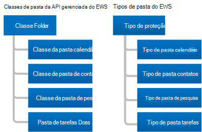

# Pastas e itens no EWS no ExchangeFolders and items in EWS in Exchange

Saiba mais sobre pastas e itens de caixa de correio e como a API gerenciada EWS ou o cliente EWS as representa.Learn about folders and mailbox items and how your EWS Managed API or EWS client represents them.
  
As pastas são o elemento de organização de uma caixa de correio do Exchange.Folders are the organizing element of an Exchange mailbox. As pastas podem conter itens de caixa de correio, como mensagens de email, contatos, compromissos, reuniões e tarefas, ou podem conter outras pastas.Folders can contain mailbox items, such as email messages, contacts, appointments, meetings, and tasks, or they can contain other folders. O Exchange inclui diferentes tipos de pastas, mas os tipos de pasta são semelhantes uns dos outros.Exchange includes different types of folders, but the folder types are similar to each other. A principal diferença entre eles é o tipo de item que eles contêm.The main difference between them is the type of item they contain.
  
No entanto, os itens têm tipos exclusivos.Items, however, have unique types. Cada tipo de item tem um conjunto diferente de propriedades ou esquema para defini-lo.Each item type has a different set of properties or schema to define it. Neste artigo, discutiremos os tipos de pastas e itens que estão disponíveis e as diferenças entre eles.In this article, we'll discuss the types of folders and items that are available and the differences between them.

## FoldersFolders

Todas as pastas derivam da mesma classe base ou tipo base, a classe [Folder](https://msdn.microsoft.com/library/microsoft.exchange.webservices.data.folder%28v=EXCHG.80%29.aspx) na API gerenciada do EWS ou o tipo de [pasta](https://msdn.microsoft.com/library/812948d8-c7db-45ce-bb3a-77233a53a974%28Office.15%29.aspx) no EWS.Folders all derive from the same base class or base type, the [Folder](https://msdn.microsoft.com/library/microsoft.exchange.webservices.data.folder%28v=EXCHG.80%29.aspx) class in the EWS Managed API, or the [Folder](https://msdn.microsoft.com/library/812948d8-c7db-45ce-bb3a-77233a53a974%28Office.15%29.aspx) type in EWS. A figura a seguir mostra as classes da API gerenciada do EWS e os tipos de EWS.The following figure shows the EWS Managed API classes and EWS types. 
  
**Figura 1. Classes de pasta de API gerenciada por EWS e tipos de pasta do EWS****Figure 1. EWS Managed API folder classes and EWS folder types**

  
A principal diferença entre cada uma das classes de pasta e os tipos de pasta é que você só pode criar um determinado tipo de item em cada tipo de pasta.The primary difference between each of the folder classes and folder types is that you can only create a certain type of item in each type of folder. Outra diferença é como o cliente exibe informações em uma pasta.One other difference is in how the client displays information in a folder. Por exemplo, o Exchange permite que você crie compromissos na pasta calendário.For example, Exchange allows you to create appointments in the Calendar folder. Você pode mover outros tipos de itens para a pasta calendário depois de criá-los, mas o Outlook não os exibirá.You can move other types of items into the Calendar folder after you create them, but Outlook won't display them. O Outlook exibe apenas itens de calendário, como compromissos e reuniões na pasta calendário, [mesmo se outro tipo de item existir na pasta](folders-and-items-in-ews-in-exchange.md#bk_item).Outlook only displays calendar items such as appointments and meetings in the Calendar folder, [even if another type of item exists in the folder](folders-and-items-in-ews-in-exchange.md#bk_item). 
  
**Tabela 1. Classes de pasta de API gerenciada por EWS e tipos de pasta do EWS****Table 1. EWS Managed API folder classes and EWS folder types**

|**Classe de API gerenciada do EWS****EWS Managed API class**|**Tipo de EWS****EWS type**|**Valor FolderClass****FolderClass value**|**Contém****Contains**|**Anotações****Notes**|
|:-----|:-----|:-----|:-----|:-----|
|[FolderFolder](https://msdn.microsoft.com/library/microsoft.exchange.webservices.data.folder%28v=exchg.80%29.aspx)   |[FolderFolder](https://msdn.microsoft.com/library/812948d8-c7db-45ce-bb3a-77233a53a974%28Office.15%29.aspx)   |IPF. ObservaçãoIPF.Note    |Pastas ou mensagens de email.Email messages or folders.    | Esta é a classe de pasta genérica ou o tipo das seguintes pastas do EWS Managed API [WellKnownFolderName](https://msdn.microsoft.com/library/microsoft.exchange.webservices.data.wellknownfoldername%28v=exchg.80%29.aspx) e pastas EWS [DistinguishedFolderId](https://msdn.microsoft.com/library/50018162-2941-4227-8a5b-d6b4686bb32f%28Office.15%29.aspx) :This is the generic folder class or type for the following EWS Managed API [WellKnownFolderName](https://msdn.microsoft.com/library/microsoft.exchange.webservices.data.wellknownfoldername%28v=exchg.80%29.aspx) folders and EWS [DistinguishedFolderId](https://msdn.microsoft.com/library/50018162-2941-4227-8a5b-d6b4686bb32f%28Office.15%29.aspx) folders: <ul><li>  Raiz (sub-árvore IPM)Root (IPM subtree)</li><li>NonIpmSubtreeNonIpmSubtree</li><li>Caixa de EntradaInbox</li><li>Itens excluídosDeleted Items</li><li>RascunhosDrafts</li><li>DiárioJournal</li><li>ObservaçõesNotes  </li><li>EnviadaOutbox</li><li>Itens enviadosSent Items</li><li>Pasta de mensagensMessage Folder</li><li>Lixo eletrônicoJunk Email</li><li>Caixa PostalVoice Mail</li></ul> |
|[CalendarFolderCalendarFolder](https://msdn.microsoft.com/library/microsoft.exchange.webservices.data.calendarfolder%28v=exchg.80%29.aspx)   |[CalendarFolderCalendarFolder](https://msdn.microsoft.com/library/48687a78-e757-4c04-9641-bf4302c6b565%28Office.15%29.aspx)   |IPF. CompromissoIPF.Appointment    |Compromissos e reuniões.Appointments and meetings.    |Quando um usuário responde a uma solicitação de reunião, o compromisso é adicionado à API gerenciada do EWS [WellKnownFolderName. Calendar](https://msdn.microsoft.com/library/microsoft.exchange.webservices.data.wellknownfoldername%28v=exchg.80%29.aspx) ou somente ao EWS [DistinguishedFolderId. CalendarFolder](https://msdn.microsoft.com/library/50018162-2941-4227-8a5b-d6b4686bb32f%28Office.15%29.aspx) .When a user responds to a meeting request, the appointment is added to the EWS Managed API [WellKnownFolderName.Calendar](https://msdn.microsoft.com/library/microsoft.exchange.webservices.data.wellknownfoldername%28v=exchg.80%29.aspx) or the EWS [DistinguishedFolderId.CalendarFolder](https://msdn.microsoft.com/library/50018162-2941-4227-8a5b-d6b4686bb32f%28Office.15%29.aspx) only. Estas são as únicas pastas que dão suporte à interação automática com solicitações de reunião e respostas.These are the only folders that support automatic interaction with meeting requests and responses.    Essa classe de pasta ou tipo de pasta suporta o uso de modos de exibição de calendário para retornar compromissos e reuniões com base em uma data de início e uma data de término usando o método Folder de API gerenciada do EWS [. FindItem](https://msdn.microsoft.com/library/microsoft.exchange.webservices.data.folder.finditems%28v=EXCHG.80%29.aspx) e a classe [CalendarView](https://msdn.microsoft.com/library/microsoft.exchange.webservices.data.calendarview%28v=exchg.80%29.aspx) ou a operação do EWS [FindItem](https://msdn.microsoft.com/library/ebad6aae-16e7-44de-ae63-a95b24539729%28Office.15%29.aspx) e o elemento [CalendarView](https://msdn.microsoft.com/library/a4a953b8-0710-416c-95ef-59e51eba9982%28Office.15%29.aspx) .This folder class or folder type supports the use of calendar views to return appointments and meetings based on a start date and an end date by using the EWS Managed API [Folder.FindItem](https://msdn.microsoft.com/library/microsoft.exchange.webservices.data.folder.finditems%28v=EXCHG.80%29.aspx) method and the [CalendarView](https://msdn.microsoft.com/library/microsoft.exchange.webservices.data.calendarview%28v=exchg.80%29.aspx) class, or the EWS [FindItem](https://msdn.microsoft.com/library/ebad6aae-16e7-44de-ae63-a95b24539729%28Office.15%29.aspx) operation and the [CalendarView](https://msdn.microsoft.com/library/a4a953b8-0710-416c-95ef-59e51eba9982%28Office.15%29.aspx) element.    |
|[ContactsFolderContactsFolder](https://msdn.microsoft.com/library/microsoft.exchange.webservices.data.contactsfolder%28v=exchg.80%29.aspx)   |[ContactsFolderContactsFolder](https://msdn.microsoft.com/library/6c299de8-2087-4aeb-8e66-2bc7586509a6%28Office.15%29.aspx)   |IPF. AmostraIPF.Contact    |Contatos e listas de distribuição.Contacts and distribution lists.    |NenhumNone.    |
|[SearchFolderSearchFolder](https://msdn.microsoft.com/library/microsoft.exchange.webservices.data.searchfolder%28v=exchg.80%29.aspx)   |[SearchFolderSearchFolder](https://msdn.microsoft.com/library/1a7d408b-2e98-4391-8834-085ed6d5757c%28Office.15%29.aspx)   |IPF. ObservaçãoIPF.Note    |O conteúdo é determinado por uma restrição ou filtro.Contents are determined by a restriction or filter. As pastas de pesquisa não têm subpastas.Search folders do not have subfolders.    |Os itens que atendem aos critérios de pesquisa não estão realmente contidos na pasta de pesquisa; em vez disso, eles estão localizados em qualquer lugar na caixa de correio.The items that meet the search criteria are not actually contained in the search folder; instead, they are located elsewhere in the mailbox.    Para garantir que as pastas de pesquisa estejam disponíveis no Outlook, crie-as na pasta localizador.To ensure that Search folders are available in Outlook, create them in the Finder folder.    |
|[TasksFolderTasksFolder](https://msdn.microsoft.com/library/microsoft.exchange.webservices.data.tasksfolder%28v=exchg.80%29.aspx)   |[TasksFolderTasksFolder](https://msdn.microsoft.com/library/5a9a4612-8064-4986-b467-c44f268c64df%28Office.15%29.aspx)   |IPF. TarefaIPF.Task    |Contém itens de trabalho para concluir.Contains work items to complete.    |NenhumNone.    |
   
### Estrutura de pastasFolder structure

As pastas fornecem uma estrutura de caixa de correio.Folders provide a mailbox structure. Isso inclui a sub-árvore IPM, conhecida como a parte superior do armazenamento de informações no EWS, onde a maioria dos usuários interagem com a caixa de correio, bem como as pastas do sistema que a maioria dos usuários nunca vê, que estão na raiz não-IPM ou na raiz do EWS.This includes the IPM Subtree, known as the Top of Information Store in EWS, where most users interact with their mailbox, as well as system folders that most users never see, which are in the Non-IPM Subtree or Root in EWS. A figura a seguir mostra a estrutura de pastas de um usuário e indica quais pastas são para os itens do usuário e quais são pastas de sistema.The following figure shows the folder structure for a user and indicates which folders are for the user's items and which are system folders.
  
**Figura 2. Pastas de item e de sistema em uma caixa de correio****Figure 2. Item and system folders in a mailbox**

  
### Pastas conhecidasWell-known folders

Das pastas em uma caixa de correio, algumas são pastas especiais.Of the folders in a mailbox, some are special folders. Eles são equivalentes a pastas conhecidas na API gerenciada do EWS ou pastas diferenciadas no EWS.These equate to well-known folders in the EWS Managed API, or distinguished folders in EWS. Algumas dessas pastas têm restrições no nome da pasta, onde elas estão localizadas na estrutura de pastas e se podem ser excluídas.Some of these folders have restrictions on the folder name, where they are located in the folder structure, and whether they can be deleted. Outras pastas "genéricas" (não especiais) não têm as mesmas restrições.Other "generic" (non-special) folders do not have the same restrictions. É importante que você esteja familiarizado com as seguintes pastas conhecidas ou diferenciadas, pois elas são o sistema raiz, o usuário e as pastas de pesquisa e são aplicáveis à maioria das implementações.It is important for you to be familiar with the following well-known or distinguished folders because they are the root system, user, and search folders, and are applicable to most implementations. 
  
**Tabela 2. Principais pastas conhecidas e diferenciadas****Table 2. Primary well-known and distinguished folders**

|**Nome amigável****Friendly name**|**Valores de **WellKnownFolderName** da API gerenciada do EWS****EWS Managed API **WellKnownFolderName** values**|\*\*Valores do EWS \*\*DistinguishedFolderId\*\*\*\***EWS **DistinguishedFolderId** values**|**Descrição****Description**|
|:-----|:-----|:-----|:-----|
|Raiz (sub-árvore não-IPM)Root (Non-IPM Subtree)    |WellKnownFolderName. rootWellKnownFolderName.Root    |DistinguishedFolderId. rootDistinguishedFolderId.root    |Contém a pasta raiz de uma caixa de correio, também conhecida como subárvore não-IPM.Contains the root folder of a mailbox, also known as the Non-IPM Subtree. Esta pasta não tem pai e você não pode movê-la, copiá-la, renomear ou excluí-la.This folder has no parent, and you cannot move, copy, rename, or delete it. Cada repositório de mensagens contém apenas uma pasta raiz.Each message store contains only one root folder.    |
|Início do repositório de informações (sub-árvore IPM)Top of Information Store (IPM Subtree)    |WellKnownFolderName.MsgFolderRootWellKnownFolderName.MsgFolderRoot    |DistinguishedFolderId.msgfolderrootDistinguishedFolderId.msgfolderroot    |Contém a caixa de entrada e outras pastas de usuário.Contains the Inbox and other user folders.    |
|Localizador (pastas de pesquisa)Finder (Search folders)    |WellKnownFolderName. SearchFoldersWellKnownFolderName.SearchFolders    |DistinguishedFolderId. SearchFolders.DistinguishedFolderId.searchfolders.    |Contém pastas de pesquisa que estão visíveis no Outlook.Contains search folders that are visible in Outlook.    |
   
Para obter uma lista completa dos valores da propriedade [WellKnownFolderName](https://msdn.microsoft.com/library/microsoft.exchange.webservices.data.folder.wellknownfoldername%28v=exchg.80%29.aspx) da API gerenciada do EWS, consulte a enumeração [WellKnownFolderName](https://msdn.microsoft.com/library/microsoft.exchange.webservices.data.wellknownfoldername%28v=EXCHG.80%29.aspx) .For a complete list of the EWS Managed API [WellKnownFolderName](https://msdn.microsoft.com/library/microsoft.exchange.webservices.data.folder.wellknownfoldername%28v=exchg.80%29.aspx) property values, see the [WellKnownFolderName](https://msdn.microsoft.com/library/microsoft.exchange.webservices.data.wellknownfoldername%28v=EXCHG.80%29.aspx) enumeration. Para obter uma lista completa dos valores do EWS **DistinguishedFolderId** , consulte [DistinguishedFolderId](https://msdn.microsoft.com/library/50018162-2941-4227-8a5b-d6b4686bb32f%28Office.15%29.aspx).For a complete list of the EWS **DistinguishedFolderId** values, see [DistinguishedFolderId](https://msdn.microsoft.com/library/50018162-2941-4227-8a5b-d6b4686bb32f%28Office.15%29.aspx).
  
### Propriedades de pastaFolder properties

Na API gerenciada do EWS, as [Propriedades da pasta](https://msdn.microsoft.com/library/microsoft.exchange.webservices.data.folder_properties%28v=exchg.80%29.aspx) são derivadas da classe de [pasta](https://msdn.microsoft.com/library/microsoft.exchange.webservices.data.folder%28v=EXCHG.80%29.aspx) base.In the EWS Managed API, the [folder properties](https://msdn.microsoft.com/library/microsoft.exchange.webservices.data.folder_properties%28v=exchg.80%29.aspx) are all derived from the base [Folder](https://msdn.microsoft.com/library/microsoft.exchange.webservices.data.folder%28v=EXCHG.80%29.aspx) class. E no EWS, todas as pastas usam os elementos de pasta que estão disponíveis no tipo de [pasta](https://msdn.microsoft.com/library/812948d8-c7db-45ce-bb3a-77233a53a974%28Office.15%29.aspx) .And in EWS, all folders use the folder elements that are available on the [Folder](https://msdn.microsoft.com/library/812948d8-c7db-45ce-bb3a-77233a53a974%28Office.15%29.aspx) type. A maioria das propriedades e dos elementos relacionados à pasta é direta (ID da pasta pai, nome de exibição e assim por diante), mas alguns precisam de uma explicação um pouco mais.Most of the folder-related properties and elements are straightforward (parent folder ID, display name, and so on), but a few require a little more explanation. 
  
As seguintes advertências se aplicam à propriedade [Folder. FolderClass](https://msdn.microsoft.com/library/microsoft.exchange.webservices.data.folder.folderclass%28v=EXCHG.80%29.aspx) da API gerenciada do EWS ou ao elemento EWS [FolderClass](https://msdn.microsoft.com/library/0041d135-2869-4612-89a5-d1aa86aa1093%28Office.15%29.aspx) :The following caveats apply to the EWS Managed API [Folder.FolderClass](https://msdn.microsoft.com/library/microsoft.exchange.webservices.data.folder.folderclass%28v=EXCHG.80%29.aspx) property or the EWS [FolderClass](https://msdn.microsoft.com/library/0041d135-2869-4612-89a5-d1aa86aa1093%28Office.15%29.aspx) element: 
  
- Se definido, o valor da propriedade ou elemento deve concordar com a classe derivada ou tipo da pasta.If set, the value of the property or element must agree with the derived class or type of the folder. Por exemplo, a propriedade **FolderClass** ou o elemento não indica que a pasta é uma pasta de contatos enquanto a classe ou o tipo da pasta indica que a pasta é uma pasta de calendário.For example, the **FolderClass** property or element can't indicate that the folder is a Contacts folder while the class or type of the folder indicates the folder is a Calendar folder. 
    
- Você pode [criar pastas](how-to-work-with-folders-by-using-ews-in-exchange.md#bk_createfolderewsma) de um tipo específico sem definir o elemento ou a propriedade **FolderClass** , ou você pode criar uma pasta com o tipo de pasta genérico e especificar o elemento ou a propriedade **FolderClass** .You can either [create folders](how-to-work-with-folders-by-using-ews-in-exchange.md#bk_createfolderewsma) of a specific type without setting the **FolderClass** property or element, or you can create a folder with the generic folder type and specify the **FolderClass** property or element. Ambas as opções criam o mesmo resultado.Both options create the same result. 
    
- Depois de definir o valor **FolderClass** criando um tipo específico de pasta ou definindo a propriedade **FolderClass** ou o próprio elemento, você não pode alterá-lo.After you set the **FolderClass** value by creating a specific type of folder or by setting the **FolderClass** property or element itself, you cannot change it. Por exemplo, não é possível alterar um IPF. Pasta de anotações para um IPF. Pasta de contatos.For example, you cannot change an IPF.Note folder to an IPF.Contact folder. No entanto, você pode alterá-lo para um IPF. Pasta note. contoso.You can, however, change it to an IPF.Note.Contoso folder. 
    
- Qualquer valor **FolderClass** que não use um dos prefixos predefinidos é tratado como um IPF. Pasta de anotações.Any **FolderClass** value that does not use one of the predefined prefixes is treated as an IPF.Note folder. Por exemplo, um valor de **FolderClass** de IAmAFolderClass é tratado como um IPF. Pasta de anotações.For example, a **FolderClass** value of IAmAFolderClass is treated as an IPF.Note folder. 
    
O valor da classe Folder é extensível.The folder class value is extensible. Isso significa que os valores padrão de **FolderClass** listados na tabela 1 são tratados como prefixos e você pode adicionar valores personalizados.This means that the default **FolderClass** values listed in Table 1 are treated as prefixes and you can add custom values. Por exemplo, você pode criar uma pasta com um valor **FolderClass** de IPF. Contact. contoso e ele é tratado como uma pasta de contatos.For example, you can create a folder with a **FolderClass** value of IPF.Contact.Contoso, and it is treated as a Contacts folder. 
  
Você pode determinar quais permissões o cliente tem nas pastas, como excluir, ler e modificar, usando a propriedade [Folder. EffectiveRights](https://msdn.microsoft.com/library/microsoft.exchange.webservices.data.folder.effectiverights%28v=EXCHG.80%29.aspx) da API gerenciada do EWS ou o elemento EWS [EffectiveRights](https://msdn.microsoft.com/library/bf5278eb-3a1a-4d27-9d16-b8be043bb023%28Office.15%29.aspx) .You can determine what permissions the client has on the folders, such as delete, read, and modify, by using the EWS Managed API [Folder.EffectiveRights](https://msdn.microsoft.com/library/microsoft.exchange.webservices.data.folder.effectiverights%28v=EXCHG.80%29.aspx) property or the EWS [EffectiveRights](https://msdn.microsoft.com/library/bf5278eb-3a1a-4d27-9d16-b8be043bb023%28Office.15%29.aspx) element. 
  
### Pastas públicasPublic folders

As pastas públicas são feitas para acesso compartilhado e oferecem um jeito fácil e eficaz de coletar, organizar e compartilhar informações com outros pessoas no seu grupo de trabalho ou organização.Public folders are designed for shared access and provide an easy and effective way to collect, organize, and share information with other people in your workgroup or organization. Você também pode usar pastas públicas para arquivar o conteúdo do grupo de distribuição.You can also use public folders to archive distribution group content. Para obter informações detalhadas sobre pastas públicas, consulte [acesso a pastas públicas com o EWS no Exchange](public-folder-access-with-ews-in-exchange.md).For in-depth information about public folders, see [Public folder access with EWS in Exchange](public-folder-access-with-ews-in-exchange.md).

### Pastas ocultasHidden folders

Todas as pastas que o Exchange cria na raiz da caixa de correio estão ocultas e você pode usar a API gerenciada do EWS ou o EWS para ocultar pastas adicionais na parte superior do repositório de informações.All the folders that Exchange creates at the root of the mailbox are hidden, and you can use the EWS Managed API or EWS to hide additional folders under the Top of Information Store. Para obter mais informações sobre pastas ocultas, consulte [trabalhar com pastas ocultas usando o EWS no Exchange](how-to-work-with-hidden-folders-by-using-ews-in-exchange.md).For more information about hidden folders, see [Work with hidden folders by using EWS in Exchange](how-to-work-with-hidden-folders-by-using-ews-in-exchange.md). 

### Pastas de pesquisaSearch folders

Pastas de pesquisa são exatamente como pastas normais, exceto pelo fato de terem uma propriedade ou elemento que define o filtro de pesquisa.Search folders are just like regular folders, except that they have a property or element that defines the search filter. Você pode criar pastas de pesquisa em qualquer pasta de uma caixa de correio do Exchange e criá-las da mesma maneira que você cria qualquer outra pasta.You can create search folders in any folder in an Exchange mailbox, and you create them in the same way that you create any other folder. No entanto, para que uma pasta de pesquisa apareça no Outlook, no Outlook Web App ou no Outlook Live, os objetos do [SearchFolder](https://msdn.microsoft.com/library/microsoft.exchange.webservices.data.searchfolder%28v=exchg.80%29.aspx) que você cria usando a API gerenciada do EWS devem estar localizados na pasta [WellKnownFolderName. SearchFolders](https://msdn.microsoft.com/library/microsoft.exchange.webservices.data.wellknownfoldername%28v=exchg.80%29.aspx) e os tipos [SearchFolder](https://msdn.microsoft.com/library/1a7d408b-2e98-4391-8834-085ed6d5757c%28Office.15%29.aspx) que você cria usando o EWS devem estar localizados na pasta [DistinguishedFolderId. SearchFolders](https://msdn.microsoft.com/library/50018162-2941-4227-8a5b-d6b4686bb32f%28Office.15%29.aspx) .However, for a search folder to appear in Outlook, Outlook Web App, or Outlook Live, [SearchFolder](https://msdn.microsoft.com/library/microsoft.exchange.webservices.data.searchfolder%28v=exchg.80%29.aspx) objects that you create by using the EWS Managed API must be located in the [WellKnownFolderName.SearchFolders](https://msdn.microsoft.com/library/microsoft.exchange.webservices.data.wellknownfoldername%28v=exchg.80%29.aspx) folder, and [SearchFolder](https://msdn.microsoft.com/library/1a7d408b-2e98-4391-8834-085ed6d5757c%28Office.15%29.aspx) types that you create by using EWS must be located in the [DistinguishedFolderId.SearchFolders](https://msdn.microsoft.com/library/50018162-2941-4227-8a5b-d6b4686bb32f%28Office.15%29.aspx) folder. Se a pasta de pesquisa for criada em um local diferente, ela ainda estará disponível e você poderá exibi-la em aplicativos cliente personalizados.If the search folder is created in a different location, it is still available and you can view it in custom client applications. 

## ItensItems

O EWS no Exchange usa **itens** para representar mensagens de email, compromissos, reuniões, contatos, listas de distribuição, tarefas, postagens e outros itens individuais em uma caixa de correio.EWS in Exchange uses **Items** to represent individual email messages, appointments, meetings, contacts, distribution lists, tasks, posts, and other items, in a mailbox. Os itens têm rigidez de tipos, o que significa que eles têm uma classe ou esquema associado específico ou não digitados de forma alta, também conhecidas como itens genéricos.Items are either strongly typed, which means that they have a specific associated class or schema, or not strongly typed, also known as generic items. Os itens genéricos são objetos de [Item](https://msdn.microsoft.com/library/microsoft.exchange.webservices.data.item%28v=exchg.80%29.aspx) na API gerenciada do EWS e nos tipos de [Item](https://msdn.microsoft.com/library/4dfe8f48-e7b4-444d-bdf9-a34e180f598b%28Office.15%29.aspx) do EWS.Generic items are [Item](https://msdn.microsoft.com/library/microsoft.exchange.webservices.data.item%28v=exchg.80%29.aspx) objects in the EWS Managed API and [Item](https://msdn.microsoft.com/library/4dfe8f48-e7b4-444d-bdf9-a34e180f598b%28Office.15%29.aspx) types in EWS. Itens comuns como mensagens de email, contatos, listas de distribuição, postagens e tarefas são digitados com rigidez, e você pode definir propriedades ou elementos específicos do esquematizado.Common items like email messages, contacts, distribution lists, posts, and tasks are strongly typed, and you can set specific schematized properties or elements on them. 
  
**Tabela 3. Itens fortemente tipados****Table 3. Strongly typed items**

|**Tipo de item de API gerenciada do EWS****EWS Managed API item type**|**Elemento de item do EWS****EWS item element**|
|:-----|:-----|
|[CompromissoAppointment](https://msdn.microsoft.com/library/microsoft.exchange.webservices.data.appointment%28v=exchg.80%29.aspx)   |[CalendarItemCalendarItem](https://msdn.microsoft.com/library/b0c1fd27-b6da-46e5-88b8-88f00c71ba80%28Office.15%29.aspx)   |
|[ContatoContact](https://msdn.microsoft.com/library/microsoft.exchange.webservices.data.contact%28v=exchg.80%29.aspx)   |[ContatoContact](https://msdn.microsoft.com/library/66bfff50-7a91-4d81-b6a0-610b9962f677%28Office.15%29.aspx)   |
|[ContatoContactGroup](https://msdn.microsoft.com/library/microsoft.exchange.webservices.data.contactgroup%28v=exchg.80%29.aspx)   |[DistributionListDistributionList](https://msdn.microsoft.com/library/f65aea01-e870-44a2-8571-fa6c001341cc%28Office.15%29.aspx)   |
|[EmailMessageEmailMessage](https://msdn.microsoft.com/library/microsoft.exchange.webservices.data.emailmessage%28v=exchg.80%29.aspx)   |[MensagemMessage](https://msdn.microsoft.com/library/2400b33c-43b2-4fc2-b6fb-275a99e0e810%28Office.15%29.aspx)   |
|[Item de postagemPostItem](https://msdn.microsoft.com/library/microsoft.exchange.webservices.data.postitem%28v=exchg.80%29.aspx)   |[Item de postagemPostItem](https://msdn.microsoft.com/library/7727ed84-9591-4a1c-bb04-12129926499b%28Office.15%29.aspx)   |
|[TarefaTask](https://msdn.microsoft.com/library/microsoft.exchange.webservices.data.task%28v=exchg.80%29.aspx)   |[TarefaTask](https://msdn.microsoft.com/library/7c84927e-db28-4c5d-b0b5-cbcc2b88d869%28Office.15%29.aspx)   |
   
Os itens fortemente tipados da API gerenciada do EWS derivam da classe de [Item](https://msdn.microsoft.com/library/microsoft.exchange.webservices.data.item%28v=EXCHG.80%29.aspx) base.EWS Managed API strongly typed items derive from the base [Item](https://msdn.microsoft.com/library/microsoft.exchange.webservices.data.item%28v=EXCHG.80%29.aspx) class. No entanto, geralmente você trabalha com um dos tipos derivados listados na tabela 3 e não com a classe de **Item** diretamente.However, you usually work with one of the derived types listed in Table 3, and not with the **Item** class directly. No entanto, quando você trabalha com a classe [ItemCollection](https://msdn.microsoft.com/library/dd634001%28v=EXCHG.80%29.aspx) , pode trabalhar diretamente com instâncias da classe **Item** .When you work with the [ItemCollection](https://msdn.microsoft.com/library/dd634001%28v=EXCHG.80%29.aspx) class, however, you might work directly with instances of the **Item** class. Nesse caso, você deve implementar a lógica que determina o tipo de item no repositório que a instância da classe de **Item** representa.In that case, you should implement logic that determines the type of item in the store that the instance of the **Item** class represents. Para trabalhar com esse item, você deve associar ao item usando uma instância da classe que representa o item.To work with that item, you should bind to the item by using an instance of the class that represents the item. 
  
### Itens em pastasItems in folders

Algumas pastas têm restrições sobre os tipos de itens que podem conter.Some folders have restrictions about the types of items that they can contain. Essas são as restrições que o banco de dados de caixa de correio do Exchange aplica às pastas, não às limitações de exibição do cliente.These are restrictions that the Exchange mailbox database applies to folders, not client view limitations. 
  
**Tabela 4. Restrições de itens para pastas****Table 4. Item restrictions for folders**

|**Classe de pasta de API gerenciada do EWS****EWS Managed API Folder class**|**Tipo de pasta do EWS****EWS Folder type**|**Restriction****Restriction**|
|:-----|:-----|:-----|
|[Classe de pasta baseBase Folder class](https://msdn.microsoft.com/library/microsoft.exchange.webservices.data.folder%28v=exchg.80%29.aspx)   |[FolderFolder](https://msdn.microsoft.com/library/812948d8-c7db-45ce-bb3a-77233a53a974%28Office.15%29.aspx)   |Você só pode criar novos objetos de [EmailMessage](https://msdn.microsoft.com/library/microsoft.exchange.webservices.data.emailmessage%28v=exchg.80%29.aspx) de API gerenciada do EWS e objetos [PostItem](https://msdn.microsoft.com/library/microsoft.exchange.webservices.data.postitem%28v=exchg.80%29.aspx) ou tipos de [mensagem](https://msdn.microsoft.com/library/2400b33c-43b2-4fc2-b6fb-275a99e0e810%28Office.15%29.aspx) do EWS ou tipos de **Item** , nas pastas genéricas.You can only create new EWS Managed API [EmailMessage](https://msdn.microsoft.com/library/microsoft.exchange.webservices.data.emailmessage%28v=exchg.80%29.aspx) objects and [PostItem](https://msdn.microsoft.com/library/microsoft.exchange.webservices.data.postitem%28v=exchg.80%29.aspx) objects, or EWS [Message](https://msdn.microsoft.com/library/2400b33c-43b2-4fc2-b6fb-275a99e0e810%28Office.15%29.aspx) types or **PostItem** types, in the generic folders. Você pode mover outros tipos de item para pastas genéricas, mas o cliente pode não exibi-los.You can move other item types into generic folders, but the client might not display them.    |
|[CalendarFolderCalendarFolder](https://msdn.microsoft.com/library/microsoft.exchange.webservices.data.calendarfolder%28v=exchg.80%29.aspx)   |[CalendarFolderCalendarFolder](https://msdn.microsoft.com/library/48687a78-e757-4c04-9641-bf4302c6b565%28Office.15%29.aspx)   |Você só pode criar novos objetos de [compromisso](https://msdn.microsoft.com/library/microsoft.exchange.webservices.data.appointment%28v=exchg.80%29.aspx) da API gerenciada do EWS e tipos do EWS [CalendarItem](https://msdn.microsoft.com/library/b0c1fd27-b6da-46e5-88b8-88f00c71ba80%28Office.15%29.aspx) na pasta calendário.You can only create new EWS Managed API [Appointment](https://msdn.microsoft.com/library/microsoft.exchange.webservices.data.appointment%28v=exchg.80%29.aspx) objects and EWS [CalendarItem](https://msdn.microsoft.com/library/b0c1fd27-b6da-46e5-88b8-88f00c71ba80%28Office.15%29.aspx) types in the Calendar folder. Você pode mover outros tipos de item para a pasta calendário, mas o cliente pode não exibi-los.You can move other item types into the Calendar folder, but the client might not display them.    |
|[ContactsFolderContactsFolder](https://msdn.microsoft.com/library/microsoft.exchange.webservices.data.contactsfolder%28v=exchg.80%29.aspx)   |[ContactsFolderContactsFolder](https://msdn.microsoft.com/library/6c299de8-2087-4aeb-8e66-2bc7586509a6%28Office.15%29.aspx)   |Você só pode criar [novos objetos](https://msdn.microsoft.com/library/microsoft.exchange.webservices.data.contactgroup%28v=exchg.80%29.aspx) [de contato da API](https://msdn.microsoft.com/library/microsoft.exchange.webservices.data.contact%28v=exchg.80%29.aspx) gerenciada do EWS e os tipos de [contato](https://msdn.microsoft.com/library/66bfff50-7a91-4d81-b6a0-610b9962f677%28Office.15%29.aspx) do EWS ou tipos de [distribuiçãolist](https://msdn.microsoft.com/library/f65aea01-e870-44a2-8571-fa6c001341cc%28Office.15%29.aspx) na pasta contatos.You can only create new EWS Managed API [Contact](https://msdn.microsoft.com/library/microsoft.exchange.webservices.data.contact%28v=exchg.80%29.aspx) and [ContactGroup](https://msdn.microsoft.com/library/microsoft.exchange.webservices.data.contactgroup%28v=exchg.80%29.aspx) objects, or EWS [Contact](https://msdn.microsoft.com/library/66bfff50-7a91-4d81-b6a0-610b9962f677%28Office.15%29.aspx) types or [DistributionList](https://msdn.microsoft.com/library/f65aea01-e870-44a2-8571-fa6c001341cc%28Office.15%29.aspx) types in the Contacts folder. Você pode mover outros tipos de item para a pasta contatos, mas o cliente pode não exibi-losYou can move other item types into the Contacts folder, but the client might not display them    |
|[SearchFolderSearchFolder](https://msdn.microsoft.com/library/microsoft.exchange.webservices.data.searchfolder%28v=exchg.80%29.aspx)   |[SearchFolderSearchFolder](https://msdn.microsoft.com/library/1a7d408b-2e98-4391-8834-085ed6d5757c%28Office.15%29.aspx)   |Sem restrições.No restrictions. Na verdade, os itens não estão localizados na pasta de pesquisa; Eles estão localizados em qualquer lugar na caixa de correio.Items are not actually located in the Search folder; they are located elsewhere in the mailbox.    |
|[TasksFolderTasksFolder](https://msdn.microsoft.com/library/microsoft.exchange.webservices.data.tasksfolder%28v=exchg.80%29.aspx)   |[TasksFolderTasksFolder](https://msdn.microsoft.com/library/5a9a4612-8064-4986-b467-c44f268c64df%28Office.15%29.aspx)   |Você só pode criar novos objetos [Task](https://msdn.microsoft.com/library/microsoft.exchange.webservices.data.task%28v=exchg.80%29.aspx) do EWS Managed API ou tipos de [tarefa](https://msdn.microsoft.com/library/7c84927e-db28-4c5d-b0b5-cbcc2b88d869%28Office.15%29.aspx) do EWS na pasta tarefas.You can only create new EWS Managed API [Task](https://msdn.microsoft.com/library/microsoft.exchange.webservices.data.task%28v=exchg.80%29.aspx) objects or EWS [Task](https://msdn.microsoft.com/library/7c84927e-db28-4c5d-b0b5-cbcc2b88d869%28Office.15%29.aspx) types in the Tasks folder. Você pode mover outros tipos de item para a pasta tarefas, mas o cliente pode não exibi-losYou can move other item types into the Tasks folder, but the client might not display them    |

## Atualizando de versões anteriores do produtoUpgrading from earlier product versions

As pastas têm a maior parte permaneceram inalteradas nas versões anteriores e atuais do produto.Folders have for the most part remained unchanged in earlier and current product versions. No entanto, observe que as versões anteriores do Exchange usam pastas gerenciadas para executar o gerenciamento de registros de mensagens (MRM).Note, however, that earlier versions of Exchange use managed folders to perform messaging records management (MRM). O Exchange Online, o Exchange Online como parte do Office 365 e versões do Exchange a partir do Exchange 2013 usam políticas de retenção para o MRM.Exchange Online, Exchange Online as part of Office 365, and versions of Exchange starting with Exchange 2013 use retention policies for MRM. Você pode [Atualizar pastas gerenciadas para usar políticas de retenção](https://technet.microsoft.com/library/dd298032%28v=exchg.150%29.aspx).You can [upgrade managed folders to use retention policies](https://technet.microsoft.com/library/dd298032%28v=exchg.150%29.aspx). 
  
Os itens não foram alterados nas versões anteriores e atuais do produto.Items have not changed in earlier and current product versions.

## Nesta seçãoIn this section

- [Trabalhar com pastas usando o EWS no ExchangeWork with folders by using EWS in Exchange](how-to-work-with-folders-by-using-ews-in-exchange.md)
    
- [Trabalhar com pastas ocultas usando o EWS no ExchangeWork with hidden folders by using EWS in Exchange](how-to-work-with-hidden-folders-by-using-ews-in-exchange.md)
    
- [Trabalhar com itens de caixa de correio do Exchange usando o EWS no ExchangeWork with Exchange mailbox items by using EWS in Exchange](how-to-work-with-exchange-mailbox-items-by-using-ews-in-exchange.md)
    
- [Excluir itens usando o EWS no ExchangeDelete items by using EWS in Exchange](deleting-items-by-using-ews-in-exchange.md)
    
- [Exportar e importar itens usando o EWS no ExchangeExport and import items by using EWS in Exchange](exporting-and-importing-items-by-using-ews-in-exchange.md)
    
## Confira tambémSee also

- [Develop web service clients for ExchangeDevelop web service clients for Exchange](develop-web-service-clients-for-exchange.md)   
- [Introdução ao uso dos serviços Web no ExchangeStart using web services in Exchange](start-using-web-services-in-exchange.md)   
- [Visão geral do design de cliente do EWS para ExchangeEWS client design overview for Exchange](ews-client-design-overview-for-exchange.md)
    

