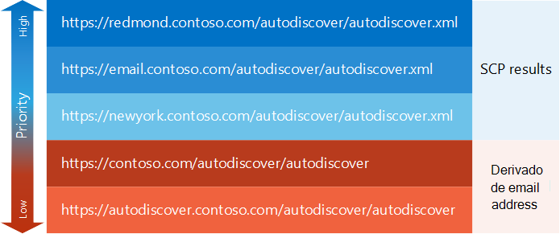

# Gerar uma lista de pontos de extremidade de descoberta automáticaGenerate a list of Autodiscover endpoints

Descubra como gerar uma lista de prioridades de pontos de extremidade de descoberta automática.Find out how to generate a prioritized list of Autodiscover endpoints.
  
A primeira tarefa no [processo de descoberta automática](autodiscover-for-exchange.md) é gerar uma lista de pontos de extremidade de descoberta automática para seu aplicativo de teste.The first task in the [Autodiscover process](autodiscover-for-exchange.md) is to generate a list of Autodiscover endpoints for your application to try. Esses pontos de extremidade de descoberta automática podem ser provenientes de uma [pesquisa de SCP](how-to-find-autodiscover-endpoints-by-using-scp-lookup-in-exchange.md) ou podem ser derivados do endereço de email do usuário.These Autodiscover endpoints can come from an [SCP lookup](how-to-find-autodiscover-endpoints-by-using-scp-lookup-in-exchange.md) or can be derived from the user's email address. No final, você pode terminar com um grande número de pontos de extremidade.In the end, you can end up with a large number of endpoints. Vamos analisar como você pode organizá-los por prioridade.Let's take a look at how you can organize them by priority. 
  
## Comece com a pesquisa do SCPStart with SCP lookup

Pontos de extremidade de descoberta automática que vêm de uma [pesquisa de SCP](how-to-find-autodiscover-endpoints-by-using-scp-lookup-in-exchange.md) devem ter prioridade mais alta na sua lista.Autodiscover endpoints that come from an [SCP lookup](how-to-find-autodiscover-endpoints-by-using-scp-lookup-in-exchange.md) should have top priority in your list. Os administradores podem configurar os objetos de SCP para rotear seu cliente à empresa de descoberta automática mais próximos ou mais eficiente, portanto, é uma boa ideia iniciar com esses pontos de extremidade.Administrators can configure SCP objects to route your client to the closest or most efficient Autodiscover endpoint, so it is a good idea to start with these endpoints. Como o processo de pesquisa do SCP tem seu próprio esquema priorização, os resultados da pesquisa SCP são já priorizados, da seguinte maneira:Because the SCP lookup process has its own prioritization scheme, the results of an SCP lookup are already prioritized, as follows: 
  
1. Pontos de extremidade de descoberta automática de objetos SCP no escopo do site do Active Directory ao qual pertence o computador cliente.Autodiscover endpoints from SCP objects scoped to the Active Directory site that the client computer belongs to.
    
2. Pontos de extremidade de descoberta automática de objetos SCP não escopo qualquer site do Active Directory.Autodiscover endpoints from SCP objects not scoped to any Active Directory site.
    
3. Pontos de extremidade de descoberta automática de objetos SCP com escopo para um site diferente do Active Directory que o site ao qual pertence o computador cliente.Autodiscover endpoints from SCP objects scoped to a different Active Directory site than the site that the client computer belongs to.
    
Depois que os resultados do processo de pesquisa de SCP, você pode adicionar pontos de extremidade que derivam do endereço de email do usuário.After you have the results of the SCP lookup process, you can add endpoints that derive from the user's email address. Eles podem servir como definir um padrão de pontos de extremidade e de fallback, caso nenhum resultado SCP ou os pontos de extremidade retornados da pesquisa SCP não são suficientes.These can serve as a default set of endpoints and a fallback in case there are no SCP results or the endpoints returned from the SCP lookup are not sufficient.
  
## Adicionar pontos de extremidade derivados do endereço de email do usuárioAdd endpoints derived from the user's email address

Quando a pesquisa do SCP não funciona ou os pontos de extremidade retornados pela pesquisa SCP não retornam uma resposta bem-sucedida, você pode derivar um conjunto de pontos de extremidade de descoberta automática de padrão de endereço de email do usuário.When SCP lookup doesn't work, or the endpoints returned by the SCP lookup don't return a successful response, you can derive a set of default Autodiscover endpoints from the user's email address. Esses pontos de extremidade devem ser uma prioridade mais baixa que qualquer um que vêm de uma pesquisa de SCP, mas você pode precisá-los se a pesquisa de SCP não foi bem-sucedida.These endpoints should be a lower priority than any that come from an SCP lookup, but you might need them if the SCP lookup was not successful.
  
### Para derivar os pontos de extremidade de descoberta automáticaTo derive Autodiscover endpoints

1. Extraia o nome de domínio do endereço de email do usuário.Extract the domain name from the user's email address. Por exemplo, se o endereço de email do usuário for Sadie.Daniels@contoso.com, o nome de domínio seria contoso.com.For example, if the user's email address is Sadie.Daniels@contoso.com, the domain name would be contoso.com.
    
2. Construa URLs de ponto de extremidade sem extensões de arquivo nos seguintes formatos:Construct endpoint URLs without file extensions in the following formats:
    
  - "https://" + domínio + "/ autodiscover/autodiscover""https://" + domain + "/autodiscover/autodiscover"
    
  - "https://autodiscover." + domínio + "/ autodiscover/autodiscover"+ domain + "/autodiscover/autodiscover"
    
Após compilar a lista de URLs de ponto de extremidade que derive de pesquisa do SCP e o endereço de email do usuário, você pode precisar revisar as extensões de nome de arquivo dessas URLs, dependendo se você estiver usando o [serviço web de descoberta automática do SOAP](http://msdn.microsoft.com/library/61c21ea9-7fea-4f56-8ada-bf80e1e6b074%28Office.15%29.aspx) ou o [POX Serviço web de descoberta automática](http://msdn.microsoft.com/library/877152f0-f4b1-4f63-b2ce-924f4bdf2d20%28Office.15%29.aspx).After you compile the list of endpoint URLs that derive from both SCP lookup and the user's email address, you might need to revise file name extensions in those URLs, depending on whether you're using the [SOAP Autodiscover web service](http://msdn.microsoft.com/library/61c21ea9-7fea-4f56-8ada-bf80e1e6b074%28Office.15%29.aspx) or the [POX Autodiscover web service](http://msdn.microsoft.com/library/877152f0-f4b1-4f63-b2ce-924f4bdf2d20%28Office.15%29.aspx).
  
## Adicione ou substitua as extensões de nome de arquivo no ponto de extremidade URLsAdd or replace file name extensions in endpoint URLs

Você pode acessar o serviço Descoberta automática usando o serviço web de descoberta automática do SOAP ou o serviço web de descoberta automática de POX.You can access the Autodiscover service by using either the SOAP Autodiscover web service or the POX Autodiscover web service. Cada serviço usa URLs semelhantes de ponto de extremidade, com a única diferença é a extensão de nome de arquivo.Each service uses similar endpoint URLs, with the only difference being the file name extension. O serviço web de descoberta automática do SOAP usa a extensão de nome de arquivo ". svc" e o serviço web de descoberta automática de POX usa a extensão de nome de arquivo ". xml".The SOAP Autodiscover web service uses the ".svc" file name extension, and the POX Autodiscover web service uses the ".xml" file name extension.
  
Por padrão, o ponto de extremidade de descoberta automática URLs retornados de uma pesquisa de SCP são POX URLs.By default, the Autodiscover endpoint URLs returned from an SCP lookup are POX URLs. No entanto, se você estiver usando a descoberta automática do SOAP, você pode simplesmente alterar a extensão de nome de arquivo de ". xml" para ". svc" e tente uma solicitação SOAP.However, if you are using SOAP Autodiscover, you can simply change the file name extension from ".xml" to ".svc" and try a SOAP request.
  
Para os URLs derivados de ponto de extremidade de descoberta automática, a extensão de arquivo é omitida.For the derived Autodiscover endpoint URLs, the file extension is omitted. Adicione a extensão de arquivo apropriado para o serviço web de descoberta automática que estiver usando antes de tentar a URL.Add the appropriate file extension for the Autodiscover web service you are using prior to trying the URL.
  
## Exemplo: Gerar uma lista de pontos de extremidade de descoberta automáticaExample: Generating a list of Autodiscover endpoints

Vamos dar uma olhada em um exemplo.Let's take a look at an example. Sadie Daniels (Sadie.Daniels@contoso.com) está usando um aplicativo de serviços Web do Exchange (EWS) pela primeira vez.Sadie Daniels (Sadie.Daniels@contoso.com) is using an Exchange Web Services (EWS) application for the first time. O aplicativo usa a descoberta automática para configurar em si.The application uses Autodiscover to configure itself. Computador de Sadie está unido ao domínio contoso.com e está no site do Active Directory de Redmond.Sadie's computer is joined to the contoso.com domain and is in the Redmond Active Directory site. O aplicativo gera a lista de pontos de extremidade de descoberta automática mostrado na Figura 1.The application generates the list of Autodiscover endpoints shown in Figure 1.
  
**Figura 1: Lista de amostra de pontos de extremidade de descoberta automática****Figure 1: Sample list of Autodiscover endpoints**

  
Os aplicativos do EWS neste exemplo prefere o serviço web de descoberta automática do SOAP, para que ele altera a extensão de nome de arquivo para os resultados do SCP para ". svc" antes de enviar solicitações SOAP para acessá-los.The EWS application in this example prefers the SOAP Autodiscover web service, so it changes the file name extension for the SCP results to ".svc" before sending SOAP requests to them.
  
## Próximas etapasNext steps

Depois que você gera uma lista de pontos de extremidade de descoberta automática, tente-los ao [Enviar solicitações para os pontos de extremidade](how-to-get-user-settings-from-exchange-by-using-autodiscover.md).After you generate a list of Autodiscover endpoints, try them by [sending requests to those endpoints](how-to-get-user-settings-from-exchange-by-using-autodiscover.md).
  
## Confira tambémSee also

- [Descoberta Automática do ExchangeAutodiscover for Exchange](autodiscover-for-exchange.md)
    
- [Encontrar os pontos de extremidade de descoberta automática usando pesquisa do SCP no ExchangeFind Autodiscover endpoints by using SCP lookup in Exchange](how-to-find-autodiscover-endpoints-by-using-scp-lookup-in-exchange.md)
    
- [Manipulação de mensagens de erro de descoberta automáticaHandling Autodiscover error messages](handling-autodiscover-error-messages.md)
    

