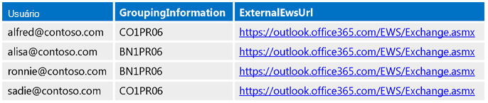
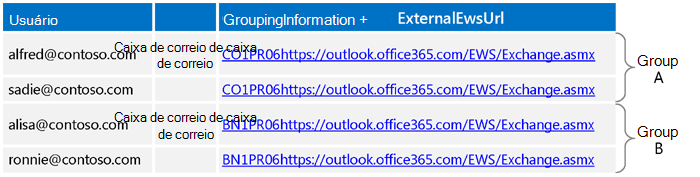
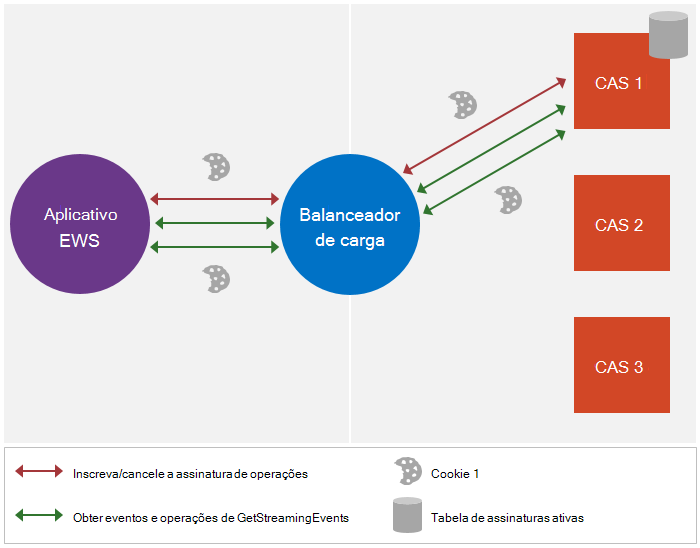
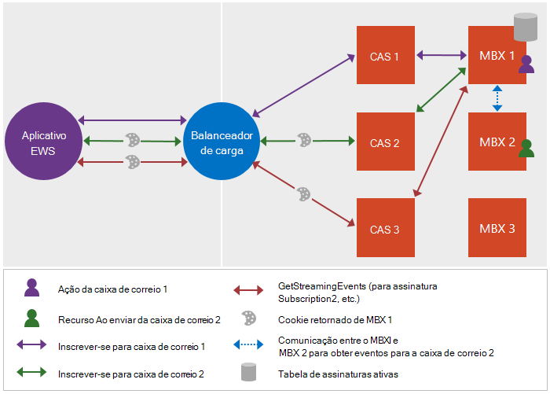

# <a name="maintain-affinity-between-a-group-of-subscriptions-and-the-mailbox-server-in-exchange"></a>Manter a afinidade entre um grupo de assinaturas e o servidor de caixa de correio no Exchange

Saiba como manter a afinidade entre um grupo de assinaturas e o servidor de caixa de correio.
  
A afinidade é a associação de uma sequência de mensagens de solicitação e resposta a um servidor de caixa de correio específico. Para a maioria das funcionalidades no Exchange, a afinidade é manipulada pelo servidor. No entanto, as notificações são uma exceção. O cliente é responsável por manter a afinidade com o servidor de caixa de correio para assinaturas de notificação. Essa afinidade permite que o balanceador de carga e os servidores de acesso para cliente entre o cliente e o servidor direcionem as assinaturas de notificação e as solicitações relacionadas para o servidor de caixa de correio que mantém a assinatura. Sem a afinidade, a solicitação pode ser roteada para um servidor de caixa de correio diferente que não inclua as assinaturas do cliente, o que pode causar o retorno de um erro [ErrorSubscriptionNotFound](https://msdn.microsoft.com/library/4b84d670-74c9-4d6d-84e7-f0a9f76f0d93%28Office.15%29.aspx) . 
  
## <a name="how-is-affinity-maintained"></a>Como a afinidade é mantida?
<a name="bk_howmaintained"> </a>

A afinidade no Exchange é baseada em cookies. O cliente dispara a criação do cookie incluindo cabeçalhos específicos na solicitação de assinatura e, em seguida, a resposta de assinatura contém o cookie. O cliente, em seguida, envia esse cookie em solicitações subsequentes para garantir que a solicitação seja encaminhada para o servidor de caixa de correio certo.
  
Mais especificamente, a afinidade no Exchange é manipulada pelo seguinte: 
  
- X-AnchorMailbox — um cabeçalho HTTP incluído na solicitação de assinatura inicial. Ele identifica a primeira caixa de correio em um grupo de caixas de correio que compartilham a afinidade com o mesmo servidor de caixa de correio.
    
- X-PreferServerAffinity — um cabeçalho HTTP que é incluído na solicitação de assinatura inicial com o cabeçalho X-AnchorMailbox e é definido como true para indicar que o cliente está solicitando que a afinidade seja mantida com o servidor de caixa de correio.
    
- X-BackEndOverrideCookie — um cookie incluído na resposta inicial da assinatura e contém um cookie que o balanceador de carga e o servidor de acesso para cliente usam para rotear as solicitações subsequentes para o mesmo servidor de caixa de correio.
    
## <a name="how-do-i-maintain-affinity-by-using-the-ews-managed-api-or-ews"></a>Como faço para manter a afinidade usando a API gerenciada do EWS ou o EWS?
<a name="bk_howdoimaintain"> </a>

Você pode usar as mesmas etapas para manter a afinidade para várias assinaturas de caixa de correio e seus servidores de caixa de correio, independentemente de você estar usando o streaming, pull ou notificações por push, e independente se você está direcionando um servidor local do Exchange ou o Exchange Online.
  
1. Para cada caixa de correio, [ligue para descoberta automática](how-to-get-user-settings-from-exchange-by-using-autodiscover.md) e obtenha as configurações de usuário do GroupingInformation e do ExternalEwsUrl. Para descoberta automática SOAP, você usa o elemento [Setting](https://msdn.microsoft.com/library/43db26e1-f7be-49fd-b26b-fc1b10bd3458%28Office.15%29.aspx) e a descoberta automática do Pox, você usa o elemento [GroupingInformation](https://msdn.microsoft.com/library/2d8a007f-d79c-43c8-90e3-2c6d883f3a7c%28Office.15%29.aspx) . 
    
2. Usando as configurações do GroupingInformation e do ExternalEwsUrl das respostas da descoberta automática, coloque as caixas de correio com o mesmo valor concatenado ExternalEwsUrl e GroupingInformation no mesmo grupo. Se qualquer grupo tiver mais de 200 caixas de correio, quebre os grupos para baixo, de modo que cada grupo não tenha mais de 200 caixas de correio.
    
3. Crie e use um objeto [ExchangeService](https://msdn.microsoft.com/library/microsoft.exchange.webservices.data.exchangeservice%28v=EXCHG.80%29.aspx) para o restante do procedimento. Quando você usa o mesmo objeto **ExchangeService** , cookies e cabeçalhos (quando são definidos) são mantidos automaticamente. Observe que, se você não pretende agrupar assinaturas de streaming em uma única conexão, você tem liberdade para criar um objeto **ExchangeService** diferente para cada usuário representado. 
    
4. [Envie uma](notification-subscriptions-mailbox-events-and-ews-in-exchange.md) solicitação de assinatura para o usuário cujo nome de usuário aparece primeiro quando todos os usuários no grupo são classificados alfabeticamente (faremos referência a esse usuário como o usuário de caixa de correio de ancoragem). Faça o seguinte: 
    
  - Inclua o cabeçalho X-AnchorMailbox com um valor definido para o endereço SMTP do usuário da caixa de correio de âncora.
    
  - Inclua o cabeçalho X-PreferServerAffinity com um valor definido como true.
    
  - Use a função [ApplicationImpersonation](https://technet.microsoft.com/library/dd776119%28v=exchg.150%29.aspx) (o tipo [ExchangeImpersonation](https://msdn.microsoft.com/library/d8cbac49-47d0-4745-a2a7-545d33f8da93%28Office.15%29.aspx) ). 
    
5. Na resposta de assinatura, obtenha o valor X-BackEndOverrideCookie. Inclua esse valor em cada uma das solicitações de assinatura subsequentes para os usuários desse grupo.
    
6. Para cada usuário adicional no grupo, envie uma solicitação de assinatura e faça o seguinte:
    
  - Inclua o cabeçalho X-AnchorMailbox com um valor definido para o endereço SMTP do usuário de caixa de correio de âncora do grupo.
    
  - Inclua o cabeçalho X-PreferServerAffinity com um valor definido como true.
    
  - Inclua o X-BackEndOverrideCookie retornado na resposta de assinatura do usuário da caixa de correio de ancoragem.
    
  - Use a função [ApplicationImpersonation](https://technet.microsoft.com/library/dd776119%28v=exchg.150%29.aspx) (o tipo [ExchangeImpersonation](https://msdn.microsoft.com/library/d8cbac49-47d0-4745-a2a7-545d33f8da93%28Office.15%29.aspx) ). 
    
    Observe que o servidor usa os valores X-PreferServerAffinity e X-BackendOverrideCookie juntos para executar o roteamento para o servidor de caixa de correio. O cabeçalho X-AnchorMailbox também é necessário, mas é ignorado pelo servidor se os outros dois valores forem válidos. Se X-AnchorMailbox e X-PreferServerAffinity estiverem em uma solicitação e X-BackendOverrideCookie não for incluído, o valor X-AnchorMailbox será usado para encaminhar as solicitações.
    
    Como os valores X-PreferServerAffinity e X-BackendOverrideCookie executam o roteamento, se a caixa de correio de ancoragem for movida para outro grupo ou servidor, a lógica não será alterada porque o X-BackendOverrideCookie encaminhará a solicitação para o servidor correto para o grupo.
    
7. Envie uma única solicitação de [GetStreamingEvents](https://msdn.microsoft.com/library/dbe83857-c4f8-4d98-813f-e03c289697a1%28Office.15%29.aspx) ou [GetEvents](https://msdn.microsoft.com/library/22d4da6b-d8a8-484f-82c4-3e4b8f5431cd%28Office.15%29.aspx) para o grupo e faça o seguinte: 
    
  - Inclua os valores [SubscriptionId](https://msdn.microsoft.com/library/3f86c178-2311-4844-82db-c2a0e469d116%28Office.15%29.aspx) retornados em cada uma das respostas de assinatura individuais para caixas de correio no grupo. 
    
  - Se houver mais de 200 assinaturas para o grupo, crie várias solicitações. O número máximo de valores de [SubscriptionId](https://msdn.microsoft.com/library/3f86c178-2311-4844-82db-c2a0e469d116%28Office.15%29.aspx) a serem incluídos em uma solicitação é 200. 
    
  - Se você precisar de mais conexões do que as disponíveis para a caixa de correio de destino, use a conta de serviço para representar a caixa de correio de ancoragem para o grupo; caso contrário, não use representação. O ideal é que você queira representar uma caixa de correio exclusiva por solicitação [GetStreamingEvents](https://msdn.microsoft.com/library/dbe83857-c4f8-4d98-813f-e03c289697a1%28Office.15%29.aspx) ou [GetEvents](https://msdn.microsoft.com/library/22d4da6b-d8a8-484f-82c4-3e4b8f5431cd%28Office.15%29.aspx) para que você nunca encontre limites de limitação. 
    
  - Use ApplicationImpersonation se você precisar [de mais conexões do que estão disponíveis para a caixa de correio de destino](how-to-maintain-affinity-between-group-of-subscriptions-and-mailbox-server.md#bk_throttling); caso contrário, não use ApplicationImpersonation.
    
  - Inclua o cabeçalho X-PreferServerAffinity e defina-o como true. Esse valor será incluído automaticamente se você estiver usando o objeto **ExchangeService** que você criou na etapa 2. 
    
  - Inclua o X-BackEndOverrideCookie para o grupo (o X-BackEndOverrideCookie que foi retornado na resposta de assinatura do usuário da caixa de correio de ancoragem). Esse valor será incluído automaticamente se você estiver usando o objeto **ExchangeService** que você criou na etapa 2. 
    
8. Passe os eventos retornados para um thread separado para processamento.
    
## <a name="what-throttling-values-do-i-need-to-take-into-consideration"></a>Que valores de limitação Eu preciso considerar?
<a name="bk_throttling"> </a>

Ao planejar sua implementação de notificação, você deverá levar em consideração dois valores: o número de conexões e o número de assinaturas. A tabela a seguir lista os valores padrão para cada configuração de [limitação](ews-throttling-in-exchange.md) e como as configurações são usadas. Para cada valor, o orçamento é alocado para a caixa de correio de destino. Por esse motivo, usar a representação para obter conexões adicionais é uma etapa obrigatória em muitos cenários. 
  
**Tabela 1. Valores de limitação padrão**

|**Área de consideração**|**Configuração de limitação**|**Valor padrão**|**Descrição**|
|:-----|:-----|:-----|:-----|
|Conexões de streaming  <br/> |Limite de conexão deslocada padrão  <br/> |10 para o Exchange Online  <br/> 3 para o Exchange 2013  <br/> |O número máximo de conexões de fluxo simultâneos que uma conta pode ter aberto no servidor de uma só vez. Para trabalhar dentro desse limite, use uma conta de serviço com a função ApplicationImpersonation atribuída às caixas de correio de destino e represente o primeiro usuário em cada grupo de ID de assinatura ao obter eventos em fluxo.  <br/> |
|Conexões pull ou push  <br/> |EWSMaxConcurrency  <br/> |27  <br/> |O número máximo de conexões simultâneas de pull ou push (solicitações que foram recebidas, mas que ainda não responderam a) que uma conta pode ter aberto no servidor ao mesmo tempo.  <br/> |
|Assinaturas  <br/> |EWSMaxSubscriptions  <br/> |20 para o Exchange Online  <br/> 5000 para o Exchange 2013  <br/> |O número máximo de assinaturas não expiradas que uma conta pode ter ao mesmo tempo. Esse valor é decrementado quando a assinatura é criada no servidor.  <br/> |
   
O exemplo a seguir mostra como os orçamentos são tratados entre qualquer caixa de correio de destino e a conta de serviço que tem a função [ApplicationImpersonation](https://technet.microsoft.com/library/dd776119%28v=exchg.150%29.aspx) atribuída às caixas de correio de destino. 
  
- ServiceAccount1 (SA1) representa muitos usuários (M1, m2, M3 e assim por diante) e cria assinaturas para cada caixa de correio. Observe que, quando as assinaturas são criadas, o proprietário da assinatura é SA1, portanto, quando SA1 abre uma conexão com as assinaturas, o EWS impõe que as assinaturas sejam de Propriedade do SA1.
    
- O Sa1 pode abrir a conexão das seguintes maneiras:
    
1. Sem representação, portanto, a conexão é cobrada em relação ao SA1.
    
2. Ao representar qualquer um dos usuários — M1, por exemplo, para que a conexão seja cobrada por uma cópia do orçamento do m1's. (O próprio M1 pode abrir dez conexões usando o Exchange Online e todas as contas de serviço que estão representando M1 podem abrir dez conexões usando o orçamento copiado.)
    
- Se o limite de conexão for atingido, as seguintes soluções alternativas estarão disponíveis:
    
  - Se a opção 1 for usada, o administrador pode criar várias contas de serviço para representar usuários adicionais.
    
  - Se a opção 2 for usada, o código pode representar outro usuário, m2, por exemplo.
    
## <a name="example-maintaining-affinity-between-a-group-of-subscriptions-and-the-mailbox-server"></a>Exemplo: manutenção da afinidade entre um grupo de assinaturas e o servidor de caixa de correio
<a name="bk_ce"> </a>

Ok, vamos vê-lo em ação. O exemplo de código a seguir mostra como agrupar usuários e usar os cabeçalhos x-AnchorMailbox e X-PreferServerAffinity e o cookie X-BackendOverrideCookie para manter a afinidade com o servidor de caixa de correio. Como os cabeçalhos e o cookie são de importância principal na história da afinidade, este exemplo se concentra nas solicitações e respostas XML do EWS. Para usar a API gerenciada do EWS para criar o corpo das solicitações de assinatura e respostas, consulte [Stream notifications about Mailbox Events by using EWS in Exchange](how-to-stream-notifications-about-mailbox-events-by-using-ews-in-exchange.md) and [pull notifications about Mailbox Events by using the EWS in Exchange](how-to-pull-notifications-about-mailbox-events-by-using-ews-in-exchange.md). Esta seção inclui etapas adicionais específicas para manter a afinidade e adicionar os cabeçalhos às suas solicitações.
  
Este exemplo tem quatro usuários: alfred@contoso.com, alisa@contoso.com, ronnie@contoso.com e sadie@contoso.com. A figura a seguir mostra as configurações de [descoberta automática](how-to-get-user-settings-from-exchange-by-using-autodiscover.md) do GroupingInformation e do ExternalEwsUrl para os usuários. 
  
**Figura 1. Configurações de descoberta automática usadas para agrupar caixas de correio**


  
Usando as configurações das respostas de descoberta automática, as caixas de correio são agrupadas pelo valor concatenado das configurações GroupingInformation e ExternalEwsUrl. Neste exemplo, Alfred e Sadie têm os mesmos valores, portanto, estão em um grupo, e alisa e Ronnie compartilham os mesmos valores, portanto, estão em outro grupo.
  
**Figura 2. Criando grupos de caixa de correio**


  
Para o objetivo deste exemplo, vamos nos concentrar no grupo A. Devemos usar as mesmas etapas para o grupo B, mas usar um valor X-AnchorMailbox diferente para esse grupo.
  
Usando o [ApplicationImpersonation](https://technet.microsoft.com/library/dd776119%28v=exchg.150%29.aspx), crie a solicitação de assinatura da caixa de correio de âncora (Alfred@contoso.com), com o cabeçalho X-AnchorMailbox definido para o endereço de email e um valor de cabeçalho x-PreferServerAffinity de true. A definição desses dois valores de cabeçalho disparará o servidor para criar um X-BackEndOverrideCookie para a resposta.
  
Se você estiver usando a API gerenciada do EWS, use o método[Add](https://msdn.microsoft.com/library/cy7xta5e) [HttpHeaders](https://msdn.microsoft.com/library/microsoft.exchange.webservices.data.exchangeservice_members%28v=exchg.80%29.aspx)para adicionar os dois cabeçalhos à sua solicitação de assinatura, conforme mostrado. 
  
```cs
service.HttpHeaders.Add("X-AnchorMailbox", Mailbox.SMTPAddress);
service.HttpHeaders.Add("X-PreferServerAffinity", "true");
```

Portanto, a solicitação de assinatura do Alfred tem a seguinte aparência.
  
```XML
POST https://outlook.office365.com/EWS/Exchange.asmx HTTP/1.1
Content-Type: text/xml; charset=utf-8
Accept: text/xml
User-Agent: ExchangeServicesClient/15.00.0516.014
X-AnchorMailbox: alfred@contoso.com
X-PreferServerAffinity: true
Host: outlook.office365.com
<?xml version="1.0" encoding="utf-8"?>
<soap:Envelope xmlns:xsi="http://www.w3.org/2001/XMLSchema-instance" xmlns:m="https://schemas.microsoft.com/exchange/services/2006/messages" xmlns:t="https://schemas.microsoft.com/exchange/services/2006/types" xmlns:soap="https://schemas.xmlsoap.org/soap/envelope/">
  <soap:Header>
    <t:RequestServerVersion Version="Exchange2013" />
    <t:ExchangeImpersonation>
      <t:ConnectingSID>
        <t:SmtpAddress>alfred@contoso.com</t:SmtpAddress>
      </t:ConnectingSID>
    </t:ExchangeImpersonation>
  </soap:Header>
  <soap:Body>
    <m:Subscribe>
      <m:StreamingSubscriptionRequest>
        <t:FolderIds>
          <t:DistinguishedFolderId Id="inbox" />
        </t:FolderIds>
        <t:EventTypes>
          <t:EventType>NewMailEvent</t:EventType>
        </t:EventTypes>
      </m:StreamingSubscriptionRequest>
    </m:Subscribe>
  </soap:Body>
</soap:Envelope>
```

A seguinte mensagem XML é a resposta à solicitação de assinatura do Alfred e inclui o X-BackEndOverrideCookie. Reenvie este cookie para todas as solicitações subsequentes para os usuários deste grupo. Observe que a resposta também contém cookies adicionais, como o cookie exchangecookie usado pelo Exchange 2010. Exchange Online, Exchange Online como parte do Office 365 e versões do Exchange a partir do Exchange 2013, ignore exchangecookie se estiver incluído em solicitações de assinatura subsequentes.
  
```XML
HTTP/1.1 200 OK
Content-Type: text/xml; charset=utf-8
Set-Cookie: exchangecookie=ddb8c383aef34c7694132aa679744feb; expires=Thu, 25-Sep-2014 18:42:45 GMT; path=/;
    HttpOnly
Set-Cookie: X-BackEndOverrideCookie=CO1PR06MB222.namprd06.prod.outlook.com~1941996295; path=/; secure; HttpOnly
Set-Cookie: X-BackEndCookie=alfred@contoso.com=Ox8XKzcXLxg==; 
    expires=Wed, 25-Sep-2013 18:52:49 GMT; path=/EWS; secure; HttpOnly
<?xml version="1.0" encoding="utf-8"?>
<s:Envelope xmlns:s="https://schemas.xmlsoap.org/soap/envelope/">
  <s:Header>
    <h:ServerVersionInfo MajorVersion="15"
                         MinorVersion="0"
                         MajorBuildNumber="775"
                         MinorBuildNumber="7"
                         Version="V2_4"
                         xmlns:h="https://schemas.microsoft.com/exchange/services/2006/types"
                         xmlns="https://schemas.microsoft.com/exchange/services/2006/types"
                         xmlns:xsd="http://www.w3.org/2001/XMLSchema"
                         xmlns:xsi="http://www.w3.org/2001/XMLSchema-instance"/>
  </s:Header>
  <s:Body xmlns:xsi="http://www.w3.org/2001/XMLSchema-instance"
          xmlns:xsd="http://www.w3.org/2001/XMLSchema">
    <m:SubscribeResponse xmlns:m="https://schemas.microsoft.com/exchange/services/2006/messages"
                         xmlns:t="https://schemas.microsoft.com/exchange/services/2006/types">
      <m:ResponseMessages>
        <m:SubscribeResponseMessage ResponseClass="Success">
          <m:ResponseCode>NoError</m:ResponseCode>
          <m:SubscriptionId>JgBjbzFwcjA2bWIyMjIubmFtcHJkMDYucHJvZC5vdXRsb29rLmNvbRAAAAAUeGk+7JFdSaFM8/NI/gQQpVdgZX6H0Ag=</m:SubscriptionId>
        </m:SubscribeResponseMessage>
      </m:ResponseMessages>
    </m:SubscribeResponse>
  </s:Body>
</s:Envelope>
```

Usando o X-BackEndOverrideCookie da resposta de Alfred e o cabeçalho X-AnchorMailbox, a solicitação de assinatura é criada para o Sadie, o outro membro da solicitação de assinatura de grupo A. Sadie tem a seguinte aparência.
  
```XML
POST https://outlook.office365.com/EWS/Exchange.asmx HTTP/1.1
Content-Type: text/xml; charset=utf-8
Accept: text/xml
User-Agent: ExchangeServicesClient/15.00.0516.014
X-AnchorMailbox: alfred@contoso.com
X-PreferServerAffinity: true
Host: outlook.office365.com
Cookie: X-BackEndOverrideCookie=CO1PR06MB222.namprd06.prod.outlook.com~1941996295
<?xml version="1.0" encoding="utf-8"?>
<soap:Envelope xmlns:xsi="http://www.w3.org/2001/XMLSchema-instance" xmlns:m="https://schemas.microsoft.com/exchange/services/2006/messages" xmlns:t="https://schemas.microsoft.com/exchange/services/2006/types" xmlns:soap="https://schemas.xmlsoap.org/soap/envelope/">
  <soap:Header>
    <t:RequestServerVersion Version="Exchange2013" />
    <t:ExchangeImpersonation>
      <t:ConnectingSID>
        <t:SmtpAddress>sadie@contoso.com </t:SmtpAddress>
      </t:ConnectingSID>
    </t:ExchangeImpersonation>
  </soap:Header>
  <soap:Body>
    <m:Subscribe>
      <m:StreamingSubscriptionRequest>
        <t:FolderIds>
          <t:DistinguishedFolderId Id="inbox" />
        </t:FolderIds>
        <t:EventTypes>
          <t:EventType>NewMailEvent</t:EventType>
        </t:EventTypes>
      </m:StreamingSubscriptionRequest>
    </m:Subscribe>
  </soap:Body>
</soap:Envelope>

```

A resposta de assinatura do Sadie tem a seguinte aparência. Observe que ele não inclui o X-BackEndOverrideCookie. O cliente é responsável por armazenar em cache esse valor para solicitações futuras.
  
```XML
HTTP/1.1 200 OK
Content-Type: text/xml; charset=utf-8
Set-Cookie: exchangecookie=640ea858f69d47ff8cce8b44c337f6d9; path=/
Set-Cookie: X-BackEndCookie=alfred@contoso.com=Ox8XKzcXLxg==; 
   expires= Wed, 25-Sep-2013 18:53:06 GMT; path=/EWS; secure; HttpOnly
<?xml version="1.0" encoding="utf-8"?>
<s:Envelope xmlns:s="https://schemas.xmlsoap.org/soap/envelope/">
  <s:Header>
    <h:ServerVersionInfo MajorVersion="15"
                         MinorVersion="0"
                         MajorBuildNumber="775"
                         MinorBuildNumber="7"
                         Version="V2_4"
                         xmlns:h="https://schemas.microsoft.com/exchange/services/2006/types"
                         xmlns="https://schemas.microsoft.com/exchange/services/2006/types"
                         xmlns:xsd="http://www.w3.org/2001/XMLSchema"
                         xmlns:xsi="http://www.w3.org/2001/XMLSchema-instance"/>
  </s:Header>
  <s:Body xmlns:xsi="http://www.w3.org/2001/XMLSchema-instance"
          xmlns:xsd="http://www.w3.org/2001/XMLSchema">
    <m:SubscribeResponse xmlns:m="https://schemas.microsoft.com/exchange/services/2006/messages"
                         xmlns:t="https://schemas.microsoft.com/exchange/services/2006/types">
      <m:ResponseMessages>
        <m:SubscribeResponseMessage ResponseClass="Success">
          <m:ResponseCode>NoError</m:ResponseCode>
          <m:SubscriptionId>JgBjbzFwcjA2bWIyMjIubmFtcHJkMDYucHJvZC5vdXRsb29rLmNvbRAAAAB4EQOy2pfrQJfM3hzs/nZJIZssan6H0Ag=</m:SubscriptionId>
        </m:SubscribeResponseMessage>
      </m:ResponseMessages>
    </m:SubscribeResponse>
  </s:Body>
</s:Envelope>
```

Usando os valores [SubscriptionId](https://msdn.microsoft.com/library/3f86c178-2311-4844-82db-c2a0e469d116%28Office.15%29.aspx) das respostas de assinatura, uma solicitação de operação [GetStreamingEvents](https://msdn.microsoft.com/library/dbe83857-c4f8-4d98-813f-e03c289697a1%28Office.15%29.aspx) foi criada para todas as assinaturas do grupo. Como há menos de 200 assinaturas nesse grupo, todas elas são enviadas em uma solicitação. O cabeçalho X-PreferServerAffinity é definido como true e o X-BackEndOverrideCookie está incluído. 
  
```XML
POST https://outlook.office365.com/EWS/Exchange.asmx HTTP/1.1
Content-Type: text/xml; charset=utf-8
Accept: text/xml
User-Agent: ExchangeServicesClient/15.00.0516.014
X-AnchorMailbox: alfred@contoso.com
X-PreferServerAffinity: true
Host: outlook.office365.com
Cookie: X-BackEndOverrideCookie=CO1PR06MB222.namprd06.prod.outlook.com~1941996295
<?xml version="1.0" encoding="utf-8"?>
<soap:Envelope xmlns:xsi="http://www.w3.org/2001/XMLSchema-instance" xmlns:m="https://schemas.microsoft.com/exchange/services/2006/messages" xmlns:t="https://schemas.microsoft.com/exchange/services/2006/types" xmlns:soap="https://schemas.xmlsoap.org/soap/envelope/">
  <soap:Header>
    <t:RequestServerVersion Version="Exchange2013" />
    <t:ExchangeImpersonation>
      <t:ConnectingSID>
        <t:SmtpAddress>sadie@contoso.com</t:SmtpAddress>
      </t:ConnectingSID>
    </t:ExchangeImpersonation>
  </soap:Header>
  <soap:Body>
    <m:GetStreamingEvents>
      <m:SubscriptionIds>
        <t:SubscriptionId>JgBjbzFwcjA2bWIyMjIubmFtcHJkMDYucHJvZC5vdXRsb29rLmNvbRAAAAB4EQOy2pfrQJfM3hzs/nZJIZssan6H0Ag=</t:SubscriptionId>
        <t:SubscriptionId>JgBjbzFwcjA2bWIyMjIubmFtcHJkMDYucHJvZC5vdXRsb29rLmNvbRAAAAAUeGk+7JFdSaFM8/NI/gQQpVdgZX6H0Ag=</t:SubscriptionId>
      </m:SubscriptionIds>
      <m:ConnectionTimeout>10</m:ConnectionTimeout>
    </m:GetStreamingEvents>
  </soap:Body>
</soap:Envelope>
```

Os eventos retornados são passados para um thread separado para processamento.
  
## <a name="how-has-affinity-changed"></a>Como a afinidade foi alterada?
<a name="bk_howchanged"> </a>

No Exchange 2010, as assinaturas são mantidas no servidor de acesso para cliente, conforme mostrado na Figura 3. Nas versões do Exchange posteriores ao Exchange 2010, as assinaturas são mantidas no servidor de caixa de correio, conforme mostrado na Figura 4.
  
**Figura 3. Processo de manutenção da afinidade no Exchange 2010**


  
**Figura 4. Processo para manter a afinidade no Exchange Online e no Exchange 2013**


  
No Exchange 2010, o cliente só conhece o endereço do balanceador de carga e o exchangecookie retornado pelo servidor garante que a solicitação seja encaminhada para o servidor de acesso para cliente certo. No entanto, em versões posteriores, as funções de servidor de acesso para cliente e o balanceador de carga devem rotear as solicitações apropriadamente antes de chegarem ao servidor de caixa de correio. Para fazer isso, são necessárias informações adicionais, que é o motivo pelo qual os novos cabeçalhos e cookie foram introduzidos. O artigo [inscrições de notificação, eventos de caixa de correio e EWS no Exchange](notification-subscriptions-mailbox-events-and-ews-in-exchange.md) explica como as assinaturas são mantidas no Exchange 2013. 
  
Você pode notar que o exchangecookie que o Exchange 2010 usa ainda é retornado por versões posteriores. Não há danos em incluir esse cookie em solicitações, mas as versões posteriores do Exchange o ignoram.
  
## <a name="see-also"></a>Confira também

- [Assinaturas de notificação, eventos de caixa de correio e EWS no Exchange](notification-subscriptions-mailbox-events-and-ews-in-exchange.md)
- [Transmitir notificações sobre eventos de caixa de correio usando o EWS no Exchange](how-to-stream-notifications-about-mailbox-events-by-using-ews-in-exchange.md)
- [Receber notificações sobre eventos de caixa de correio usando o EWS no Exchange](how-to-pull-notifications-about-mailbox-events-by-using-ews-in-exchange.md)
- [Tratamento de erros relacionados à notificação no EWS no Exchange](handling-notification-related-errors-in-ews-in-exchange.md)
- [Alterações no gerenciamento da afinidade de assinaturas do EWS...](https://blogs.msdn.com/b/mstehle/archive/2013/04/17/changes-in-managing-affinity-for-ews-subscriptions.aspx)
- [Limitação do EWS no Exchange](ews-throttling-in-exchange.md)
    

