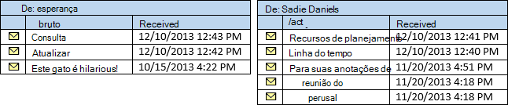
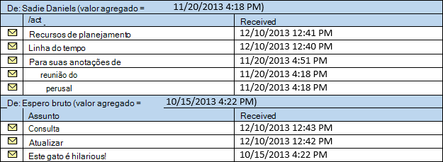

# <a name="perform-grouped-searches-by-using-ews-in-exchange"></a><span data-ttu-id="e6c98-103">Realizar pesquisas de agrupadas usando o EWS no Exchange</span><span class="sxs-lookup"><span data-stu-id="e6c98-103">Perform grouped searches by using EWS in Exchange</span></span>

<span data-ttu-id="e6c98-104">Descubra como realizar pesquisas agrupadas no seu aplicativo de EWS que tem como destino o Exchange ou a API gerenciada de EWS.</span><span class="sxs-lookup"><span data-stu-id="e6c98-104">Find out how to perform grouped searches in your EWS Managed API or EWS application that targets Exchange.</span></span>
  
<span data-ttu-id="e6c98-105">Pesquisas agrupadas são úteis, pois permite que você controle como os resultados de pesquisa são organizadas.</span><span class="sxs-lookup"><span data-stu-id="e6c98-105">Grouped searches are useful in that they gives you control over how search results are organized.</span></span> <span data-ttu-id="e6c98-106">Os resultados da pesquisa organizada podem facilitar para seu aplicativo para processar resultados ou exibi-los para um usuário final de uma maneira fácil de gerenciar.</span><span class="sxs-lookup"><span data-stu-id="e6c98-106">Organized search results can make it easier for your application to process results or display them to an end user in a manageable way.</span></span>
  
<span data-ttu-id="e6c98-107">O agrupamento funciona colocando todos os itens dentro do conjunto de resultados que têm o mesmo valor de um campo específico em um grupo.</span><span class="sxs-lookup"><span data-stu-id="e6c98-107">Grouping works by putting all items within the result set that have the same value of a specific field into a group.</span></span> <span data-ttu-id="e6c98-108">Por exemplo, você pode agrupar os resultados pelo remetente e todos os itens da mesma pessoa será em um grupo separado e serão classificados os itens dentro de cada grupo de acordo com a ordem em que você especificar o modo de exibição.</span><span class="sxs-lookup"><span data-stu-id="e6c98-108">For example, you can group your results by the sender, and all items from the same person will be in a separate group, and the items within each group will be sorted according to the order you specify on the view.</span></span> <span data-ttu-id="e6c98-109">Os próprios grupos são classificados por um valor agregado com base em um campo que você escolher.</span><span class="sxs-lookup"><span data-stu-id="e6c98-109">The groups themselves are sorted by an aggregate value based on a field you choose.</span></span>
  
<span data-ttu-id="e6c98-110">**Tabela 1. Métodos de API gerenciada de EWS e operações de EWS para organizar os resultados da pesquisa**</span><span class="sxs-lookup"><span data-stu-id="e6c98-110">**Table 1. EWS Managed API methods and EWS operations for organizing search results**</span></span>

|<span data-ttu-id="e6c98-111">**Se você quiser …**</span><span class="sxs-lookup"><span data-stu-id="e6c98-111">**If you want to…**</span></span>|<span data-ttu-id="e6c98-112">**Na API gerenciada do EWS, use …**</span><span class="sxs-lookup"><span data-stu-id="e6c98-112">**In the EWS Managed API, use…**</span></span>|<span data-ttu-id="e6c98-113">**No EWS, use …**</span><span class="sxs-lookup"><span data-stu-id="e6c98-113">**In EWS, use…**</span></span>|
|:-----|:-----|:-----|
|<span data-ttu-id="e6c98-114">Organizar itens com o mesmo valor em uma propriedade específica em seus resultados em grupos</span><span class="sxs-lookup"><span data-stu-id="e6c98-114">Organize items with the same value in a specific property in your results into groups</span></span>  <br/> |[<span data-ttu-id="e6c98-115">Grouping.GroupOn</span><span class="sxs-lookup"><span data-stu-id="e6c98-115">Grouping.GroupOn</span></span>](http://msdn.microsoft.com/pt-br/library/microsoft.exchange.webservices.data.grouping.groupon%28v=exchg.80%29.aspx) <br/> |<span data-ttu-id="e6c98-116">Elemento [FieldURI](http://msdn.microsoft.com/library/24af8e3b-3074-4c8c-8d0a-52446508d044%28Office.15%29.aspx) como um filho do elemento [GroupBy](http://msdn.microsoft.com/library/9728619b-4674-4b9d-9f6c-e75c6165966c%28Office.15%29.aspx)</span><span class="sxs-lookup"><span data-stu-id="e6c98-116">[FieldURI](http://msdn.microsoft.com/library/24af8e3b-3074-4c8c-8d0a-52446508d044%28Office.15%29.aspx) element as a child of the [GroupBy](http://msdn.microsoft.com/library/9728619b-4674-4b9d-9f6c-e75c6165966c%28Office.15%29.aspx) element</span></span>  <br/> |
|<span data-ttu-id="e6c98-117">Classifique os itens dentro de cada grupo pelo valor em uma propriedade específica</span><span class="sxs-lookup"><span data-stu-id="e6c98-117">Sort items within each group by the value in a specific property</span></span>  <br/> |[<span data-ttu-id="e6c98-118">ItemView.OrderBy</span><span class="sxs-lookup"><span data-stu-id="e6c98-118">ItemView.OrderBy</span></span>](http://msdn.microsoft.com/pt-br/library/microsoft.exchange.webservices.data.itemview.orderby%28v=exchg.80%29.aspx) <br/> |<span data-ttu-id="e6c98-119">Elemento [SortOrder](http://msdn.microsoft.com/library/c2413f0b-8c03-46ae-9990-13338b3c53a6%28Office.15%29.aspx)</span><span class="sxs-lookup"><span data-stu-id="e6c98-119">[SortOrder](http://msdn.microsoft.com/library/c2413f0b-8c03-46ae-9990-13338b3c53a6%28Office.15%29.aspx) element</span></span>  <br/> |
|<span data-ttu-id="e6c98-120">Classificar os grupos</span><span class="sxs-lookup"><span data-stu-id="e6c98-120">Sort the groups</span></span>  <br/> |[<span data-ttu-id="e6c98-121">Grouping.AggregateOn</span><span class="sxs-lookup"><span data-stu-id="e6c98-121">Grouping.AggregateOn</span></span>](http://msdn.microsoft.com/pt-br/library/microsoft.exchange.webservices.data.grouping.aggregateon%28v=exchg.80%29.aspx) <br/><br/> [<span data-ttu-id="e6c98-122">Grouping.AggregateType</span><span class="sxs-lookup"><span data-stu-id="e6c98-122">Grouping.AggregateType</span></span>](http://msdn.microsoft.com/pt-br/library/microsoft.exchange.webservices.data.grouping.aggregatetype%28v=exchg.80%29.aspx) <br/><br/> [<span data-ttu-id="e6c98-123">Grouping.SortDirection</span><span class="sxs-lookup"><span data-stu-id="e6c98-123">Grouping.SortDirection</span></span>](http://msdn.microsoft.com/pt-br/library/microsoft.exchange.webservices.data.grouping.sortdirection%28v=exchg.80%29.aspx) <br/> |<span data-ttu-id="e6c98-124">Elemento **FieldURI** como um filho do elemento [AggregateOn](http://msdn.microsoft.com/library/9b0a03f2-3282-46e1-b1a0-cbb9a0fbe9bb%28Office.15%29.aspx)</span><span class="sxs-lookup"><span data-stu-id="e6c98-124">**FieldURI** element as a child of the [AggregateOn](http://msdn.microsoft.com/library/9b0a03f2-3282-46e1-b1a0-cbb9a0fbe9bb%28Office.15%29.aspx) element</span></span><br/><br/> <span data-ttu-id="e6c98-125">Atributo **agregadas** no elemento **AggregateOn**</span><span class="sxs-lookup"><span data-stu-id="e6c98-125">**Aggregate** attribute on the **AggregateOn** element</span></span><br/><br/><span data-ttu-id="e6c98-126">**Ordem** de atributo no elemento **GroupBy**</span><span class="sxs-lookup"><span data-stu-id="e6c98-126">**Order** attribute on the **GroupBy** element</span></span>  <br/> |
   
<span data-ttu-id="e6c98-127">Vamos passo a passo.</span><span class="sxs-lookup"><span data-stu-id="e6c98-127">Let's take it step by step.</span></span>
  
## <a name="group-results-by-a-specific-property"></a><span data-ttu-id="e6c98-128">Resultados de grupo por uma propriedade específica</span><span class="sxs-lookup"><span data-stu-id="e6c98-128">Group results by a specific property</span></span>
<span data-ttu-id="e6c98-129"><a name="bk_GroupResults"> </a></span><span class="sxs-lookup"><span data-stu-id="e6c98-129"></span></span>

<span data-ttu-id="e6c98-130">A primeira etapa ao uso de agrupamento é selecione uma propriedade ou atributo nos itens no armazenamento do Exchange, para agrupar por.</span><span class="sxs-lookup"><span data-stu-id="e6c98-130">The first step to using grouping is to select a property, or attribute on the items in the Exchange store, to group by.</span></span> <span data-ttu-id="e6c98-131">A API gerenciada de EWS expõe essas áreas como as propriedades de classe nas classes de correspondente, enquanto o EWS expõe-los como elementos XML.</span><span class="sxs-lookup"><span data-stu-id="e6c98-131">The EWS Managed API exposes these as class properties on the corresponding classes, while EWS exposes them as XML elements.</span></span> <span data-ttu-id="e6c98-132">Você pode escolher qualquer propriedade, incluindo propriedades personalizadas ou estendidas, mas é útil compreender como os itens são agrupados com base no valor da propriedade que você escolher.</span><span class="sxs-lookup"><span data-stu-id="e6c98-132">You can choose any property, including custom or extended properties, but it is helpful to understand how items are grouped based on the value of the property you choose.</span></span> 

<span data-ttu-id="e6c98-133">Todos os itens que têm o mesmo valor na propriedade por que você optar por agrupar serão agrupados juntos.</span><span class="sxs-lookup"><span data-stu-id="e6c98-133">All items that have the same value in the property you choose to group by will be grouped together.</span></span> <span data-ttu-id="e6c98-134">Isso pode parecer óbvio, mas é um detalhe importante.</span><span class="sxs-lookup"><span data-stu-id="e6c98-134">This might seem obvious, but it is an important detail.</span></span> <span data-ttu-id="e6c98-135">Considere o que aconteceria se você agrupa por uma propriedade de data/hora, como [Item.DateTimeReceived](http://msdn.microsoft.com/pt-br/library/microsoft.exchange.webservices.data.item.datetimereceived%28v=exchg.80%29.aspx) na API gerenciada do EWS ou o elemento [DateTimeReceived](http://msdn.microsoft.com/library/8f489bd4-2434-4d0a-91fe-1b5ba7eb5765%28Office.15%29.aspx) no EWS.</span><span class="sxs-lookup"><span data-stu-id="e6c98-135">Consider what happens if you group by a date/time property, such as [Item.DateTimeReceived](http://msdn.microsoft.com/pt-br/library/microsoft.exchange.webservices.data.item.datetimereceived%28v=exchg.80%29.aspx) in the EWS Managed API, or the [DateTimeReceived](http://msdn.microsoft.com/library/8f489bd4-2434-4d0a-91fe-1b5ba7eb5765%28Office.15%29.aspx) element in EWS.</span></span> <span data-ttu-id="e6c98-136">A intenção pode ser a organizar os resultados em grupos, com cada grupo que contém itens no mesmo dia.</span><span class="sxs-lookup"><span data-stu-id="e6c98-136">The intent might be to organize the results into groups, with each group containing items from the same day.</span></span> <span data-ttu-id="e6c98-137">No entanto, o agrupamento examina o valor inteiro, que inclui o tempo.</span><span class="sxs-lookup"><span data-stu-id="e6c98-137">However, grouping looks at the entire value, which includes the time.</span></span> 

<span data-ttu-id="e6c98-138">O resultado final é que os itens serão agrupados para que itens recebidos ao mesmo tempo, para baixo até a segunda, estão em seus próprios grupos.</span><span class="sxs-lookup"><span data-stu-id="e6c98-138">The end result is that the items will be grouped so that items received at the same time, down to the second, are in their own groups.</span></span> <span data-ttu-id="e6c98-139">Os resultados mais provável serão classificados em um grande número de grupos com um pequeno número de itens em cada grupo.</span><span class="sxs-lookup"><span data-stu-id="e6c98-139">The results will most likely be sorted into a large number of groups with a small number of items in each group.</span></span> 
  
<span data-ttu-id="e6c98-140">Para obter um conjunto com um número menor de grupos e um número maior de itens em cada grupo de resultados, escolha uma propriedade que provavelmente terá um número menor de valores, como [EmailMessage.From](http://msdn.microsoft.com/pt-br/library/microsoft.exchange.webservices.data.emailmessage.from%28v=exchg.80%29.aspx) ou [Item.Categories](http://msdn.microsoft.com/pt-br/library/microsoft.exchange.webservices.data.item.categories%28v=exchg.80%29.aspx) na API gerenciada de EWS, ou [de](http://msdn.microsoft.com/library/5a52d644-3677-4049-874c-12bd5c3080dc%28Office.15%29.aspx) ou [categorias](http://msdn.microsoft.com/library/d84d4927-b524-4e62-bf3d-1f12fec8c21a%28Office.15%29.aspx) no EWS.</span><span class="sxs-lookup"><span data-stu-id="e6c98-140">To get a results set with a smaller number of groups and a larger number of items in each group, choose a property that is likely to have a smaller number of values, such as [EmailMessage.From](http://msdn.microsoft.com/pt-br/library/microsoft.exchange.webservices.data.emailmessage.from%28v=exchg.80%29.aspx) or [Item.Categories](http://msdn.microsoft.com/pt-br/library/microsoft.exchange.webservices.data.item.categories%28v=exchg.80%29.aspx) in the EWS Managed API, or [From](http://msdn.microsoft.com/library/5a52d644-3677-4049-874c-12bd5c3080dc%28Office.15%29.aspx) or [Categories](http://msdn.microsoft.com/library/d84d4927-b524-4e62-bf3d-1f12fec8c21a%28Office.15%29.aspx) in EWS.</span></span> <span data-ttu-id="e6c98-141">A figura a seguir mostra uma lista de emails que aparecem em uma caixa de entrada.</span><span class="sxs-lookup"><span data-stu-id="e6c98-141">The following figure shows a list of emails that appear in an Inbox.</span></span> 
  
<span data-ttu-id="e6c98-142">**Figura 1. Mensagens em uma caixa de entrada**</span><span class="sxs-lookup"><span data-stu-id="e6c98-142">**Figure 1. Messages in an Inbox**</span></span>


  
<span data-ttu-id="e6c98-144">Se você agrupar os itens na Figura 1 pela propriedade **EmailMessage.From** , o resultado será dois grupos, um para mensagens enviadas por bruta de expectativa e outro para mensagens enviadas por Sadie Daniels.</span><span class="sxs-lookup"><span data-stu-id="e6c98-144">If you group the items in Figure 1 by the **EmailMessage.From** property, the result will be two groups, one for messages sent by Hope Gross, and one for messages sent by Sadie Daniels.</span></span> 
  
<span data-ttu-id="e6c98-145">**Figura 2. Mensagens separados em grupos com base na propriedade From**</span><span class="sxs-lookup"><span data-stu-id="e6c98-145">**Figure 2. Messages separated into groups based on the From property**</span></span>


  
## <a name="sort-the-items-within-groups"></a><span data-ttu-id="e6c98-147">Classifique os itens dentro de grupos</span><span class="sxs-lookup"><span data-stu-id="e6c98-147">Sort the items within groups</span></span>
<span data-ttu-id="e6c98-148"><a name="bk_SortItems"> </a></span><span class="sxs-lookup"><span data-stu-id="e6c98-148"></span></span>

<span data-ttu-id="e6c98-149">Você pode controlar como os itens são classificados dentro de cada grupo, usando a propriedade [ItemView.OrderBy](http://msdn.microsoft.com/pt-br/library/microsoft.exchange.webservices.data.itemview.orderby%28v=exchg.80%29.aspx) na API gerenciada do EWS ou o elemento de [SortOrder](http://msdn.microsoft.com/library/c2413f0b-8c03-46ae-9990-13338b3c53a6%28Office.15%29.aspx) no EWS.</span><span class="sxs-lookup"><span data-stu-id="e6c98-149">You can control how items are sorted within each group by using the [ItemView.OrderBy](http://msdn.microsoft.com/pt-br/library/microsoft.exchange.webservices.data.itemview.orderby%28v=exchg.80%29.aspx) property in the EWS Managed API, or the [SortOrder](http://msdn.microsoft.com/library/c2413f0b-8c03-46ae-9990-13338b3c53a6%28Office.15%29.aspx) element in EWS.</span></span> <span data-ttu-id="e6c98-150">A ordenação mesmo se aplica a cada grupo.</span><span class="sxs-lookup"><span data-stu-id="e6c98-150">The same ordering applies to each group.</span></span> <span data-ttu-id="e6c98-151">Por exemplo, se você classificar os itens da Figura 1 pela propriedade **Item.DateTimeReceived** , em ordem decrescente, o item mais recentemente recebido de bruta de espero será a primeiro no grupo bruta de expectativa e o item mais recentemente recebido de Sadie Daniels será primeiro, no grupo Sadie Daniels.</span><span class="sxs-lookup"><span data-stu-id="e6c98-151">For example, if you sort the items from Figure 1 by the **Item.DateTimeReceived** property, in descending order, the item most recently received from Hope Gross will be first in the Hope Gross group, and the item most recently received from Sadie Daniels will be first in the Sadie Daniels group.</span></span> <span data-ttu-id="e6c98-152">Convenientemente, os grupos na Figura 2 já são classificados dessa maneira.</span><span class="sxs-lookup"><span data-stu-id="e6c98-152">Conveniently, the groups in Figure 2 are already sorted this way.</span></span> 
  
## <a name="sort-the-groups"></a><span data-ttu-id="e6c98-153">Classificar os grupos</span><span class="sxs-lookup"><span data-stu-id="e6c98-153">Sort the groups</span></span>
<span data-ttu-id="e6c98-154"><a name="bk_SortGroups"> </a></span><span class="sxs-lookup"><span data-stu-id="e6c98-154"></span></span>

<span data-ttu-id="e6c98-155">Agora que você tem seus grupos definidos, a etapa final é classificando os próprios grupos.</span><span class="sxs-lookup"><span data-stu-id="e6c98-155">Now that you have your groups settled, the final step is sorting the groups themselves.</span></span> <span data-ttu-id="e6c98-156">Porque os próprios grupos obrigatórios sem valores específicos, o processo de agrupamento deve atribuir um valor de classificação a cada grupo.</span><span class="sxs-lookup"><span data-stu-id="e6c98-156">Because the groups themselves have no specific values, the grouping process has to assign a sort value to each group.</span></span> <span data-ttu-id="e6c98-157">Isso é feito agregação dos valores de uma propriedade específica dentro de cada grupo especificado pela propriedade [Grouping.AggregateOn](http://msdn.microsoft.com/pt-br/library/microsoft.exchange.webservices.data.grouping.aggregateon%28v=exchg.80%29.aspx) no elemento [FieldURI](http://msdn.microsoft.com/library/24af8e3b-3074-4c8c-8d0a-52446508d044%28Office.15%29.aspx) ou a API gerenciada de EWS como um filho do elemento [AggregateOn](http://msdn.microsoft.com/library/9b0a03f2-3282-46e1-b1a0-cbb9a0fbe9bb%28Office.15%29.aspx) no EWS.</span><span class="sxs-lookup"><span data-stu-id="e6c98-157">This is done by aggregation of the values of a specific property within each group, specified by the [Grouping.AggregateOn](http://msdn.microsoft.com/pt-br/library/microsoft.exchange.webservices.data.grouping.aggregateon%28v=exchg.80%29.aspx) property in the EWS Managed API, or the [FieldURI](http://msdn.microsoft.com/library/24af8e3b-3074-4c8c-8d0a-52446508d044%28Office.15%29.aspx) element as a child of the [AggregateOn](http://msdn.microsoft.com/library/9b0a03f2-3282-46e1-b1a0-cbb9a0fbe9bb%28Office.15%29.aspx) element in EWS.</span></span> <span data-ttu-id="e6c98-158">A propriedade [Grouping.AggregateType](http://msdn.microsoft.com/pt-br/library/microsoft.exchange.webservices.data.grouping.aggregatetype%28v=exchg.80%29.aspx) no EWS Managed API (ou o atributo **agregadas** no elemento **AggregateOn** no EWS) especifica qual valor dos itens dentro de cada grupo é atribuído com o valor de classificação para o grupo — ambos os valor maior ou menor valor.</span><span class="sxs-lookup"><span data-stu-id="e6c98-158">The [Grouping.AggregateType](http://msdn.microsoft.com/pt-br/library/microsoft.exchange.webservices.data.grouping.aggregatetype%28v=exchg.80%29.aspx) property in the EWS Managed API (or the **Aggregate** attribute on the **AggregateOn** element in EWS) specifies which value from the items within each group is assigned to the sort value for the group — either the largest value or the smallest value.</span></span> <span data-ttu-id="e6c98-159">Finalmente, a ordem de classificação (crescente ou decrescente) é especificada pela propriedade [Grouping.SortDirection](http://msdn.microsoft.com/pt-br/library/microsoft.exchange.webservices.data.grouping.sortdirection%28v=exchg.80%29.aspx) no EWS Managed API ou o atributo de **ordem** no elemento [GroupBy](http://msdn.microsoft.com/library/9728619b-4674-4b9d-9f6c-e75c6165966c%28Office.15%29.aspx) EWS.</span><span class="sxs-lookup"><span data-stu-id="e6c98-159">Finally, the sort order (descending or ascending) is specified by the [Grouping.SortDirection](http://msdn.microsoft.com/pt-br/library/microsoft.exchange.webservices.data.grouping.sortdirection%28v=exchg.80%29.aspx) property in the EWS Managed API, or the **Order** attribute on the [GroupBy](http://msdn.microsoft.com/library/9728619b-4674-4b9d-9f6c-e75c6165966c%28Office.15%29.aspx) element in EWS.</span></span> 
  
<span data-ttu-id="e6c98-160">Por exemplo, se os grupos da Figura 2 são classificados por agregar na propriedade **Item.DateTimeReceived** , usando o menor valor e classificar em ordem decrescente, os itens são retornados na ordem em que mostra a Figura 3.</span><span class="sxs-lookup"><span data-stu-id="e6c98-160">For example, if the groups from Figure 2 are sorted by aggregating on the **Item.DateTimeReceived** property, using the smallest value, and sorting in descending order, the items are returned in the order in shown Figure 3.</span></span> 
  
<span data-ttu-id="e6c98-161">**Figura 3. Resultados de pesquisa agrupada com os grupos classificados pela propriedade DateTimeReceived**</span><span class="sxs-lookup"><span data-stu-id="e6c98-161">**Figure 3. Grouped search results with the groups sorted by the DateTimeReceived property**</span></span>


  
<span data-ttu-id="e6c98-163">As seções a seguir mostram como você pode recepção de agrupamento e classificação juntos no código.</span><span class="sxs-lookup"><span data-stu-id="e6c98-163">The next sections show you how you might pull grouping and sorting together in code.</span></span>
  
## <a name="example-perform-a-grouped-search-by-using-the-ews-managed-api"></a><span data-ttu-id="e6c98-164">Exemplo: Executar uma pesquisa agrupada usando a API gerenciada de EWS</span><span class="sxs-lookup"><span data-stu-id="e6c98-164">Example: Perform a grouped search by using the EWS Managed API</span></span>
<span data-ttu-id="e6c98-165"><a name="bk_GroupSearchEWSMA"> </a></span><span class="sxs-lookup"><span data-stu-id="e6c98-165"></span></span>

<span data-ttu-id="e6c98-166">Os seguintes métodos de API gerenciada de EWS podem usar o agrupamento:</span><span class="sxs-lookup"><span data-stu-id="e6c98-166">The following EWS Managed API methods can use grouping:</span></span>
  
- [<span data-ttu-id="e6c98-167">ExchangeService.FindItems</span><span class="sxs-lookup"><span data-stu-id="e6c98-167">ExchangeService.FindItems</span></span>](http://msdn.microsoft.com/pt-br/library/microsoft.exchange.webservices.data.exchangeservice.finditems%28v=exchg.80%29.aspx)
    
- [<span data-ttu-id="e6c98-168">Folder.FindItems</span><span class="sxs-lookup"><span data-stu-id="e6c98-168">Folder.FindItems</span></span>](http://msdn.microsoft.com/pt-br/library/microsoft.exchange.webservices.data.folder.finditems%28v=exchg.80%29.aspx)
    
<span data-ttu-id="e6c98-169">O exemplo a seguir usa o método **ExchangeService.FindItems** ; No entanto, as mesmas regras e conceitos se aplicam ao método **Folder.FindItems** .</span><span class="sxs-lookup"><span data-stu-id="e6c98-169">The following example uses the **ExchangeService.FindItems** method; however, the same rules and concepts apply to the **Folder.FindItems** method.</span></span> <span data-ttu-id="e6c98-170">Neste exemplo, um método chamado **GroupItemsByFrom** é definido.</span><span class="sxs-lookup"><span data-stu-id="e6c98-170">In this example, a method called **GroupItemsByFrom** is defined.</span></span> <span data-ttu-id="e6c98-171">Ele usa um objeto [ExchangeService](http://msdn.microsoft.com/pt-br/library/microsoft.exchange.webservices.data.exchangeservice%28v=exchg.80%29.aspx) e um objeto [WellKnownFolderName](http://msdn.microsoft.com/pt-br/library/microsoft.exchange.webservices.data.wellknownfoldername%28v=exchg.80%29.aspx) como parâmetros.</span><span class="sxs-lookup"><span data-stu-id="e6c98-171">It takes an [ExchangeService](http://msdn.microsoft.com/pt-br/library/microsoft.exchange.webservices.data.exchangeservice%28v=exchg.80%29.aspx) object and a [WellKnownFolderName](http://msdn.microsoft.com/pt-br/library/microsoft.exchange.webservices.data.wellknownfoldername%28v=exchg.80%29.aspx) object as parameters.</span></span> <span data-ttu-id="e6c98-172">Ele solicita os 50 primeiros itens na pasta, agrupadas pela propriedade **EmailMessage.From** , classificada pela propriedade **Item.DateTimeReceived** em ordem decrescente.</span><span class="sxs-lookup"><span data-stu-id="e6c98-172">It requests the first 50 items in the folder, grouped by the **EmailMessage.From** property, sorted by the **Item.DateTimeReceived** property in descending order.</span></span> <span data-ttu-id="e6c98-173">Os próprios grupos são classificados pelo menor valor da propriedade **Item.DateTimeReceived** em seus itens, em ordem decrescente.</span><span class="sxs-lookup"><span data-stu-id="e6c98-173">The groups themselves are sorted by the smallest **Item.DateTimeReceived** property value on their items, in descending order.</span></span> 
  
<span data-ttu-id="e6c98-174">Este exemplo pressupõe que o objeto **ExchangeService** foi inicializado com valores válidos nas propriedades [credenciais](http://msdn.microsoft.com/pt-br/library/microsoft.exchange.webservices.data.exchangeservicebase.credentials%28v=exchg.80%29.aspx) e [Url](http://msdn.microsoft.com/pt-br/library/microsoft.exchange.webservices.data.exchangeservice.url%28v=exchg.80%29.aspx) .</span><span class="sxs-lookup"><span data-stu-id="e6c98-174">This example assumes that the **ExchangeService** object has been initialized with valid values in the [Credentials](http://msdn.microsoft.com/pt-br/library/microsoft.exchange.webservices.data.exchangeservicebase.credentials%28v=exchg.80%29.aspx) and [Url](http://msdn.microsoft.com/pt-br/library/microsoft.exchange.webservices.data.exchangeservice.url%28v=exchg.80%29.aspx) properties.</span></span> 
  
```cs
static void GroupItemsByFrom(ExchangeService service, WellKnownFolderName folder)
{
    // Limit the result set to 50 items.
    ItemView view = new ItemView(50);
    view.PropertySet = new PropertySet(ItemSchema.Subject,
                                       ItemSchema.DateTimeReceived,
                                       EmailMessageSchema.From,
                                       ItemSchema.Categories);
    // Item searches do not support Deep traversal.
    view.Traversal = ItemTraversal.Shallow;
    // Specify the sorting done within the groups.
    view.OrderBy.Add(ItemSchema.DateTimeReceived, SortDirection.Descending);
    // Configure grouping.
    Grouping groupByFrom = new Grouping();
    groupByFrom.GroupOn = EmailMessageSchema.From;
    groupByFrom.AggregateOn = ItemSchema.DateTimeReceived;
    groupByFrom.AggregateType = AggregateType.Minimum;
    groupByFrom.SortDirection = SortDirection.Descending;
    try
    {
        GroupedFindItemsResults<Item> results = service.FindItems(folder,
            view, groupByFrom);
        foreach (ItemGroup<Item> group in results.ItemGroups)
        {
            Console.WriteLine("Group: {0}", group.GroupIndex);
            foreach (Item item in group.Items)
            {
                if (item is EmailMessage)
                {
                    EmailMessage message = item as EmailMessage;
                    Console.WriteLine("From: {0}", message.From);
                    Console.WriteLine("Subject: {0}", message.Subject);
                    Console.WriteLine("Id: {0}\n", message.Id.ToString());
                }
            }
        }
    }
    catch (Exception ex)
    {
        Console.WriteLine("Exception while enumerating results: {0}", ex.Message);
    }
}
```

## <a name="example-perform-a-grouped-search-by-using-ews"></a><span data-ttu-id="e6c98-175">Exemplo: Executar uma pesquisa agrupada usando o EWS</span><span class="sxs-lookup"><span data-stu-id="e6c98-175">Example: Perform a grouped search by using EWS</span></span>
<span data-ttu-id="e6c98-176"><a name="bk_GroupSearchEWS"> </a></span><span class="sxs-lookup"><span data-stu-id="e6c98-176"></span></span>

<span data-ttu-id="e6c98-177">O exemplo de solicitação a seguir mostra uma solicitação de [operação FindItem](http://msdn.microsoft.com/library/ebad6aae-16e7-44de-ae63-a95b24539729%28Office.15%29.aspx) para os 50 primeiros itens na pasta, agrupada por **do** elemento, classificado por elemento **DateTimeReceived** em ordem decrescente.</span><span class="sxs-lookup"><span data-stu-id="e6c98-177">The following request example shows a [FindItem operation](http://msdn.microsoft.com/library/ebad6aae-16e7-44de-ae63-a95b24539729%28Office.15%29.aspx) request for the first 50 items in the folder, grouped by the **From** element, sorted by the **DateTimeReceived** element in descending order.</span></span> <span data-ttu-id="e6c98-178">Os próprios grupos são classificados pelo menor valor do elemento **DateTimeReceived** em seus itens, em ordem decrescente.</span><span class="sxs-lookup"><span data-stu-id="e6c98-178">The groups themselves are sorted by the smallest **DateTimeReceived** element value on their items, in descending order.</span></span> 
  
```XML
<?xml version="1.0" encoding="utf-8"?>
<soap:Envelope xmlns:xsi="http://www.w3.org/2001/XMLSchema-instance" 
    xmlns:m="http://schemas.microsoft.com/exchange/services/2006/messages" 
    xmlns:t="http://schemas.microsoft.com/exchange/services/2006/types" 
    xmlns:soap="http://schemas.xmlsoap.org/soap/envelope/">
  <soap:Header>
    <t:RequestServerVersion Version="Exchange2007_SP1" />
    <t:TimeZoneContext>
      <t:TimeZoneDefinition Id="Eastern Standard Time" />
    </t:TimeZoneContext>
  </soap:Header>
  <soap:Body>
    <m:FindItem Traversal="Shallow">
      <m:ItemShape>
        <t:BaseShape>IdOnly</t:BaseShape>
        <t:AdditionalProperties>
          <t:FieldURI FieldURI="item:Subject" />
          <t:FieldURI FieldURI="item:DateTimeReceived" />
          <t:FieldURI FieldURI="message:From" />
          <t:FieldURI FieldURI="item:Categories" />
        </t:AdditionalProperties>
      </m:ItemShape>
      <m:IndexedPageItemView MaxEntriesReturned="50" Offset="0" BasePoint="Beginning" />
      <m:GroupBy Order="Descending">
        <t:FieldURI FieldURI="message:From" />
        <t:AggregateOn Aggregate="Minimum">
          <t:FieldURI FieldURI="item:DateTimeReceived" />
        </t:AggregateOn>
      </m:GroupBy>
      <m:SortOrder>
        <t:FieldOrder Order="Descending">
          <t:FieldURI FieldURI="item:DateTimeReceived" />
        </t:FieldOrder>
      </m:SortOrder>
      <m:ParentFolderIds>
        <t:DistinguishedFolderId Id="inbox" />
      </m:ParentFolderIds>
    </m:FindItem>
  </soap:Body>
</soap:Envelope>
```

<span data-ttu-id="e6c98-179">O servidor retorna a seguinte resposta.</span><span class="sxs-lookup"><span data-stu-id="e6c98-179">The server returns the following response.</span></span>
  
```XML
<?xml version="1.0" encoding="utf-8"?>
<s:Envelope xmlns:s="http://schemas.xmlsoap.org/soap/envelope/">
  <s:Header>
    <h:ServerVersionInfo MajorVersion="15" MinorVersion="0" MajorBuildNumber="712" MinorBuildNumber="22" Version="V2_3" 
        xmlns:h="http://schemas.microsoft.com/exchange/services/2006/types" 
        xmlns="http://schemas.microsoft.com/exchange/services/2006/types" 
        xmlns:xsd="http://www.w3.org/2001/XMLSchema" 
        xmlns:xsi="http://www.w3.org/2001/XMLSchema-instance" />
  </s:Header>
  <s:Body xmlns:xsi="http://www.w3.org/2001/XMLSchema-instance" xmlns:xsd="http://www.w3.org/2001/XMLSchema">
    <m:FindItemResponse xmlns:m="http://schemas.microsoft.com/exchange/services/2006/messages" 
      xmlns:t="http://schemas.microsoft.com/exchange/services/2006/types">
      <m:ResponseMessages>
        <m:FindItemResponseMessage ResponseClass="Success">
          <m:ResponseCode>NoError</m:ResponseCode>
          <m:RootFolder IndexedPagingOffset="10" TotalItemsInView="8" IncludesLastItemInRange="true">
            <t:Groups>
              <t:GroupedItems>
                <t:GroupIndex>0</t:GroupIndex>
                <t:Items>
                  <t:Message>
                    <t:ItemId Id="AAMkAGM2..." ChangeKey="CQAAABYA..." />
                    <t:Subject>Planning resources</t:Subject>
                    <t:DateTimeReceived>2013-12-10T17:41:05Z</t:DateTimeReceived>
                    <t:From>
                      <t:Mailbox>
                        <t:Name>Sadie Daniels</t:Name>
                        <t:EmailAddress>/O=FIRST ORGANIZATION/OU=EXCHANGE ADMINISTRATIVE GROUP (FYDIBOHF23SPDLT)/CN=RECIPIENTS/CN=8D84A3F4CBB34D48838A3AECF99795C0-SADIE</t:EmailAddress>
                        <t:RoutingType>EX</t:RoutingType>
                      </t:Mailbox>
                    </t:From>
                  </t:Message>
                  <t:Message>
                    <t:ItemId Id="AAMkAGM2..." ChangeKey="CQAAABYA..." />
                    <t:Subject>Timeline</t:Subject>
                    <t:DateTimeReceived>2013-12-10T17:40:37Z</t:DateTimeReceived>
                    <t:Categories>
                      <t:String>Project</t:String>
                    </t:Categories>
                    <t:From>
                      <t:Mailbox>
                        <t:Name>Sadie Daniels</t:Name>
                        <t:EmailAddress>/O=FIRST ORGANIZATION/OU=EXCHANGE ADMINISTRATIVE GROUP (FYDIBOHF23SPDLT)/CN=RECIPIENTS/CN=8D84A3F4CBB34D48838A3AECF99795C0-SADIE</t:EmailAddress>
                        <t:RoutingType>EX</t:RoutingType>
                      </t:Mailbox>
                    </t:From>
                  </t:Message>
                  <t:Message>
                    <t:ItemId Id="AAMkAGM2..." ChangeKey="CQAAABYA..." />
                    <t:Subject>For your perusal</t:Subject>
                    <t:DateTimeReceived>2013-11-20T21:51:16Z</t:DateTimeReceived>
                    <t:From>
                      <t:Mailbox>
                        <t:Name>Sadie Daniels</t:Name>
                        <t:EmailAddress>/O=FIRST ORGANIZATION/OU=EXCHANGE ADMINISTRATIVE GROUP (FYDIBOHF23SPDLT)/CN=RECIPIENTS/CN=8D84A3F4CBB34D48838A3AECF99795C0-SADIE</t:EmailAddress>
                        <t:RoutingType>EX</t:RoutingType>
                      </t:Mailbox>
                    </t:From>
                  </t:Message>
                  <t:Message>
                    <t:ItemId Id="AAMkAGM2..." ChangeKey="CQAAABYA..." />
                    <t:Subject>meeting notes</t:Subject>
                    <t:DateTimeReceived>2013-11-20T21:18:51Z</t:DateTimeReceived>
                    <t:Categories>
                      <t:String>Blue category</t:String>
                    </t:Categories>
                    <t:From>
                      <t:Mailbox>
                        <t:Name>Sadie Daniels</t:Name>
                        <t:EmailAddress>/O=FIRST ORGANIZATION/OU=EXCHANGE ADMINISTRATIVE GROUP (FYDIBOHF23SPDLT)/CN=RECIPIENTS/CN=8D84A3F4CBB34D48838A3AECF99795C0-SADIE</t:EmailAddress>
                        <t:RoutingType>EX</t:RoutingType>
                      </t:Mailbox>
                    </t:From>
                  </t:Message>
                  <t:Message>
                    <t:ItemId Id="AAMkAGM2..." ChangeKey="CQAAABYA..." />
                    <t:Subject>Meeting notes</t:Subject>
                    <t:DateTimeReceived>2013-11-20T21:18:51Z</t:DateTimeReceived>
                    <t:From>
                      <t:Mailbox>
                        <t:Name>Sadie Daniels</t:Name>
                        <t:EmailAddress>/O=FIRST ORGANIZATION/OU=EXCHANGE ADMINISTRATIVE GROUP (FYDIBOHF23SPDLT)/CN=RECIPIENTS/CN=8D84A3F4CBB34D48838A3AECF99795C0-SADIE</t:EmailAddress>
                        <t:RoutingType>EX</t:RoutingType>
                      </t:Mailbox>
                    </t:From>
                  </t:Message>
                </t:Items>
              </t:GroupedItems>
              <t:GroupedItems>
                <t:GroupIndex>1</t:GroupIndex>
                <t:Items>
                  <t:Message>
                    <t:ItemId Id="AAMkAGM2..." ChangeKey="CQAAABYA..." />
                    <t:Subject>Query</t:Subject>
                    <t:DateTimeReceived>2013-12-10T17:43:15Z</t:DateTimeReceived>
                    <t:From>
                      <t:Mailbox>
                        <t:Name>Hope Gross</t:Name>
                        <t:EmailAddress>/O=FIRST ORGANIZATION/OU=EXCHANGE ADMINISTRATIVE GROUP (FYDIBOHF23SPDLT)/CN=RECIPIENTS/CN=9B55E4100C064D9D8C5F72FF36802ED3-HOPE</t:EmailAddress>
                        <t:RoutingType>EX</t:RoutingType>
                      </t:Mailbox>
                    </t:From>
                  </t:Message>
                  <t:Message>
                    <t:ItemId Id="AAMkAGM2..." ChangeKey="CQAAABYA..." />
                    <t:Subject>Update</t:Subject>
                    <t:DateTimeReceived>2013-12-10T17:42:33Z</t:DateTimeReceived>
                    <t:Categories>
                      <t:String>Project</t:String>
                      <t:String>Blue category</t:String>
                    </t:Categories>
                    <t:From>
                      <t:Mailbox>
                        <t:Name>Hope Gross</t:Name>
                        <t:EmailAddress>/O=FIRST ORGANIZATION/OU=EXCHANGE ADMINISTRATIVE GROUP (FYDIBOHF23SPDLT)/CN=RECIPIENTS/CN=9B55E4100C064D9D8C5F72FF36802ED3-HOPE</t:EmailAddress>
                        <t:RoutingType>EX</t:RoutingType>
                      </t:Mailbox>
                    </t:From>
                  </t:Message>
                  <t:Message>
                    <t:ItemId Id="AAMkAGM2..." ChangeKey="CQAAABYA..." />
                    <t:Subject>This cat is hilarious!</t:Subject>
                    <t:DateTimeReceived>2013-10-15T20:22:12Z</t:DateTimeReceived>
                    <t:From>
                      <t:Mailbox>
                        <t:Name>Hope Gross</t:Name>
                        <t:EmailAddress>/O=FIRST ORGANIZATION/OU=EXCHANGE ADMINISTRATIVE GROUP (FYDIBOHF23SPDLT)/CN=RECIPIENTS/CN=9B55E4100C064D9D8C5F72FF36802ED3-HOPE</t:EmailAddress>
                        <t:RoutingType>EX</t:RoutingType>
                      </t:Mailbox>
                    </t:From>
                  </t:Message>
                </t:Items>
              </t:GroupedItems>
            </t:Groups>
          </m:RootFolder>
        </m:FindItemResponseMessage>
      </m:ResponseMessages>
    </m:FindItemResponse>
  </s:Body>
</s:Envelope>
```

## <a name="version-differences"></a><span data-ttu-id="e6c98-180">Diferenças de versão</span><span class="sxs-lookup"><span data-stu-id="e6c98-180">Version differences</span></span>
<span data-ttu-id="e6c98-181"><a name="bk_VersionDiffs"> </a></span><span class="sxs-lookup"><span data-stu-id="e6c98-181"></span></span>

<span data-ttu-id="e6c98-182">Versões do Exchange, começando com a versão principal 15 e terminando com compilação 15.0.775.38 retorno elementos **Group** (do tipo **GroupedItemsType**) no lugar de elementos de [GroupedItems](http://msdn.microsoft.com/library/53170df4-4272-4b37-b23f-cd8e2d4a7396%28Office.15%29.aspx) na resposta SOAP.</span><span class="sxs-lookup"><span data-stu-id="e6c98-182">Versions of Exchange starting with major version 15 and ending with build 15.0.775.38 return **Group** elements (of type **GroupedItemsType**) in place of [GroupedItems](http://msdn.microsoft.com/library/53170df4-4272-4b37-b23f-cd8e2d4a7396%28Office.15%29.aspx) elements in the SOAP response.</span></span> <span data-ttu-id="e6c98-183">Se você estiver usando a API gerenciada de EWS, isso fará com que a coleção [GroupedFindItemsResults.ItemGroups](http://msdn.microsoft.com/pt-br/library/office/dd633961%28v=exchg.80%29.aspx) conter objetos 0.</span><span class="sxs-lookup"><span data-stu-id="e6c98-183">If you are using the EWS Managed API, this will cause the [GroupedFindItemsResults.ItemGroups](http://msdn.microsoft.com/pt-br/library/office/dd633961%28v=exchg.80%29.aspx) collection to contain 0 objects.</span></span> <span data-ttu-id="e6c98-184">Se você estiver usando o EWS, elementos de **grupo** devem ser tratados como elementos **GroupedItems** .</span><span class="sxs-lookup"><span data-stu-id="e6c98-184">If you are using EWS, **Group** elements should be handled as **GroupedItems** elements.</span></span> 
  
<span data-ttu-id="e6c98-185">Versões do Exchange, começando com a versão principal 15 retornam extras elementos de **grupo** ou **GroupedItems** com o atributo **xsi: nil** definido como **true** na resposta SOAP.</span><span class="sxs-lookup"><span data-stu-id="e6c98-185">Versions of Exchange starting with major version 15 return extra **Group** or **GroupedItems** elements with the **xsi:nil** attribute set to **true** in the SOAP response.</span></span> <span data-ttu-id="e6c98-186">Se você estiver usando a API gerenciada de EWS, esses elementos extras causará um [ServiceXmlDeserializationException](http://msdn.microsoft.com/pt-br/library/microsoft.exchange.webservices.data.servicexmldeserializationexception%28v=exchg.80%29.aspx) ser acionada.</span><span class="sxs-lookup"><span data-stu-id="e6c98-186">If you are using the EWS Managed API, these extra elements will cause a [ServiceXmlDeserializationException](http://msdn.microsoft.com/pt-br/library/microsoft.exchange.webservices.data.servicexmldeserializationexception%28v=exchg.80%29.aspx) to be thrown.</span></span> <span data-ttu-id="e6c98-187">Se você estiver usando o EWS, esses elementos extras devem ser ignorados.</span><span class="sxs-lookup"><span data-stu-id="e6c98-187">If you are using EWS, these extra elements should be ignored.</span></span> 
  
## <a name="see-also"></a><span data-ttu-id="e6c98-188">Confira também</span><span class="sxs-lookup"><span data-stu-id="e6c98-188">See also</span></span>

- [<span data-ttu-id="e6c98-189">Pesquisa e EWS no Exchange</span><span class="sxs-lookup"><span data-stu-id="e6c98-189">Search and EWS in Exchange</span></span>](search-and-ews-in-exchange.md)    
- [<span data-ttu-id="e6c98-190">ExchangeService.FindItems</span><span class="sxs-lookup"><span data-stu-id="e6c98-190">ExchangeService.FindItems</span></span>](http://msdn.microsoft.com/pt-br/library/microsoft.exchange.webservices.data.exchangeservice.finditems%28v=exchg.80%29.aspx)    
- [<span data-ttu-id="e6c98-191">Folder.FindItems</span><span class="sxs-lookup"><span data-stu-id="e6c98-191">Folder.FindItems</span></span>](http://msdn.microsoft.com/pt-br/library/microsoft.exchange.webservices.data.folder.finditems%28v=exchg.80%29.aspx)   
- [<span data-ttu-id="e6c98-192">Classe de agrupamento</span><span class="sxs-lookup"><span data-stu-id="e6c98-192">Grouping class</span></span>](http://msdn.microsoft.com/pt-br/library/microsoft.exchange.webservices.data.grouping%28v=exchg.80%29.aspx)    
- [<span data-ttu-id="e6c98-193">Operação FindItem</span><span class="sxs-lookup"><span data-stu-id="e6c98-193">FindItem operation</span></span>](http://msdn.microsoft.com/library/ebad6aae-16e7-44de-ae63-a95b24539729%28Office.15%29.aspx)
    

