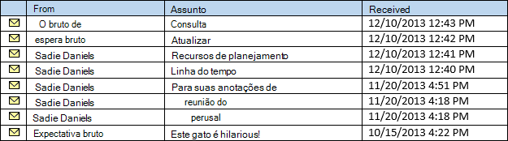

# <a name="perform-grouped-searches-by-using-ews-in-exchange"></a>Executar pesquisas agrupadas usando o EWS em Exchange

Saiba como realizar pesquisas agrupadas em sua API Gerenciada do EWS ou no aplicativo EWS destinado a Exchange.
  
Pesquisas agrupadas são úteis porque elas dão controle sobre como os resultados da pesquisa são organizados. Os resultados da pesquisa organizada podem tornar mais fácil para o aplicativo processar resultados ou exibi-los para um usuário final de maneira gerenciável.
  
O agrupamento funciona colocando todos os itens dentro do conjunto de resultados que tenham o mesmo valor de um campo específico em um grupo. Por exemplo, você pode agrupar seus resultados pelo remetente, e todos os itens da mesma pessoa estarão em um grupo separado, e os itens dentro de cada grupo serão classificação de acordo com a ordem especificada no modo de exibição. Os grupos em si são organizados por um valor agregado com base em um campo escolhido.
  
**Tabela 1. Métodos de API Gerenciada EWS e operações EWS para organizar resultados de pesquisa**

|**Se você quiser...**|**Na API Gerenciada do EWS, use...**|**No EWS, use...**|
|:-----|:-----|:-----|
|Organizar itens com o mesmo valor em uma propriedade específica em seus resultados em grupos  <br/> |[Grouping.GroupOn](https://msdn.microsoft.com/library/microsoft.exchange.webservices.data.grouping.groupon%28v=exchg.80%29.aspx) <br/> |[Elemento FieldURI](https://msdn.microsoft.com/library/24af8e3b-3074-4c8c-8d0a-52446508d044%28Office.15%29.aspx) como filho do [elemento GroupBy](https://msdn.microsoft.com/library/9728619b-4674-4b9d-9f6c-e75c6165966c%28Office.15%29.aspx)  <br/> |
|Classificar itens dentro de cada grupo pelo valor em uma propriedade específica  <br/> |[ItemView.OrderBy](https://msdn.microsoft.com/library/microsoft.exchange.webservices.data.itemview.orderby%28v=exchg.80%29.aspx) <br/> |[Elemento SortOrder](https://msdn.microsoft.com/library/c2413f0b-8c03-46ae-9990-13338b3c53a6%28Office.15%29.aspx)  <br/> |
|Classificar os grupos  <br/> |[Grouping.AggregateOn](https://msdn.microsoft.com/library/microsoft.exchange.webservices.data.grouping.aggregateon%28v=exchg.80%29.aspx) <br/><br/> [Grouping.AggregateType](https://msdn.microsoft.com/library/microsoft.exchange.webservices.data.grouping.aggregatetype%28v=exchg.80%29.aspx) <br/><br/> [Grouping.SortDirection](https://msdn.microsoft.com/library/microsoft.exchange.webservices.data.grouping.sortdirection%28v=exchg.80%29.aspx) <br/> |**Elemento FieldURI** como filho do [elemento AggregateOn](https://msdn.microsoft.com/library/9b0a03f2-3282-46e1-b1a0-cbb9a0fbe9bb%28Office.15%29.aspx)<br/><br/> **Atributo aggregate** no **elemento AggregateOn**<br/><br/>**Atributo Order** no **elemento GroupBy**  <br/> |
   
Vamos passo a passo.
  
## <a name="group-results-by-a-specific-property"></a>Resultados de grupo por uma propriedade específica
<a name="bk_GroupResults"> </a>

A primeira etapa para usar o agrupamento é selecionar uma propriedade ou atributo nos itens no Exchange store, para agrupar por. A API Gerenciada do EWS expõe-as como propriedades de classe nas classes correspondentes, enquanto o EWS as expõe como elementos XML. Você pode escolher qualquer propriedade, incluindo propriedades personalizadas ou estendidas, mas é útil entender como os itens são agrupados com base no valor da propriedade escolhida. 

Todos os itens com o mesmo valor na propriedade que você escolher agrupar serão agrupados. Isso pode parecer óbvio, mas é um detalhe importante. Considere o que acontece se você agrupar por uma propriedade de data/hora, [como Item.DateTimeReceived](https://msdn.microsoft.com/library/microsoft.exchange.webservices.data.item.datetimereceived%28v=exchg.80%29.aspx) na API Gerenciada do EWS ou o [elemento DateTimeReceived](https://msdn.microsoft.com/library/8f489bd4-2434-4d0a-91fe-1b5ba7eb5765%28Office.15%29.aspx) no EWS. A intenção pode ser organizar os resultados em grupos, com cada grupo contendo itens do mesmo dia. No entanto, o agrupamento analisa o valor inteiro, que inclui o tempo. 

O resultado final é que os itens serão agrupados para que os itens recebidos ao mesmo tempo, até o segundo, estão em seus próprios grupos. Os resultados provavelmente serão organizados em um grande número de grupos com um pequeno número de itens em cada grupo. 
  
Para obter um conjunto de resultados com um número menor de grupos e um número maior de itens em cada grupo, escolha uma propriedade que provavelmente tenha um número menor de valores, como [EmailMessage.From](https://msdn.microsoft.com/library/microsoft.exchange.webservices.data.emailmessage.from%28v=exchg.80%29.aspx) ou [Item.Categories](https://msdn.microsoft.com/library/microsoft.exchange.webservices.data.item.categories%28v=exchg.80%29.aspx) na API Gerenciada do EWS, [ou De](https://msdn.microsoft.com/library/5a52d644-3677-4049-874c-12bd5c3080dc%28Office.15%29.aspx) ou [Categorias](https://msdn.microsoft.com/library/d84d4927-b524-4e62-bf3d-1f12fec8c21a%28Office.15%29.aspx) no EWS. A figura a seguir mostra uma lista de emails que aparecem em uma Caixa de Entrada. 
  
**Figura 1. Mensagens em uma Caixa de Entrada**


  
Se você agrupar os itens na Figura 1 pela propriedade **EmailMessage.From,** o resultado será dois grupos, um para mensagens enviadas por Hope Gross e um para mensagens enviadas por Sadie Daniels. 
  
**Figura 2. Mensagens separadas em grupos com base na propriedade From**


  
## <a name="sort-the-items-within-groups"></a>Classificar os itens em grupos
<a name="bk_SortItems"> </a>

Você pode controlar como os itens são organizados em cada grupo usando a [propriedade ItemView.OrderBy](https://msdn.microsoft.com/library/microsoft.exchange.webservices.data.itemview.orderby%28v=exchg.80%29.aspx) na API Gerenciada do EWS ou o [elemento SortOrder](https://msdn.microsoft.com/library/c2413f0b-8c03-46ae-9990-13338b3c53a6%28Office.15%29.aspx) no EWS. A mesma ordenação se aplica a cada grupo. Por exemplo, se você classificar os itens da Figura 1 pela **propriedade Item.DateTimeReceived,** em ordem decrescente, o item recebido mais recentemente de Hope Gross será o primeiro no grupo Hope Gross, e o item recebido mais recentemente de Sadie Daniels será o primeiro no grupo Sadie Daniels. Convenientemente, os grupos na Figura 2 já estão organizados dessa maneira. 
  
## <a name="sort-the-groups"></a>Classificar os grupos
<a name="bk_SortGroups"> </a>

Agora que você tem seus grupos resolvidos, a etapa final é classificar os grupos por conta própria. Como os grupos em si não têm valores específicos, o processo de agrupação precisa atribuir um valor de classificação a cada grupo. Isso é feito pela agregação dos valores de uma propriedade específica dentro de cada grupo, especificada pela propriedade [Grouping.AggregateOn](https://msdn.microsoft.com/library/microsoft.exchange.webservices.data.grouping.aggregateon%28v=exchg.80%29.aspx) na API Gerenciada do EWS ou pelo [elemento FieldURI](https://msdn.microsoft.com/library/24af8e3b-3074-4c8c-8d0a-52446508d044%28Office.15%29.aspx) como filho do elemento [AggregateOn](https://msdn.microsoft.com/library/9b0a03f2-3282-46e1-b1a0-cbb9a0fbe9bb%28Office.15%29.aspx) no EWS. A propriedade [Grouping.AggregateType](https://msdn.microsoft.com/library/microsoft.exchange.webservices.data.grouping.aggregatetype%28v=exchg.80%29.aspx) na API Gerenciada do EWS (ou o atributo **Aggregate** no elemento **AggregateOn** no EWS) especifica qual valor dos itens de cada grupo é atribuído ao valor de classificação do grupo — o maior valor ou o menor valor. Por fim, a ordem de classificação (decrescente ou crescente) é especificada pela propriedade [Grouping.SortDirection](https://msdn.microsoft.com/library/microsoft.exchange.webservices.data.grouping.sortdirection%28v=exchg.80%29.aspx) na API Gerenciada do EWS ou pelo atributo **Order** no elemento [GroupBy](https://msdn.microsoft.com/library/9728619b-4674-4b9d-9f6c-e75c6165966c%28Office.15%29.aspx) no EWS. 
  
Por exemplo, se os grupos da Figura 2 são organizados agregando-se na **propriedade Item.DateTimeReceived,** usando o menor valor e classificação em ordem decrescente, os itens serão retornados na ordem mostrada Na Figura 3. 
  
**Figura 3. Resultados de pesquisa agrupados com os grupos organizados pela propriedade DateTimeReceived**


  
As próximas seções mostram como você pode agrupar e classificar em código.
  
## <a name="example-perform-a-grouped-search-by-using-the-ews-managed-api"></a>Exemplo: executar uma pesquisa agrupada usando a API Gerenciada do EWS
<a name="bk_GroupSearchEWSMA"> </a>

Os seguintes métodos de API Gerenciada do EWS podem usar o agrupamento:
  
- [ExchangeService.FindItems](https://msdn.microsoft.com/library/microsoft.exchange.webservices.data.exchangeservice.finditems%28v=exchg.80%29.aspx)
    
- [Folder.FindItems](https://msdn.microsoft.com/library/microsoft.exchange.webservices.data.folder.finditems%28v=exchg.80%29.aspx)
    
O exemplo a seguir usa o **método ExchangeService.FindItems;** no entanto, as mesmas regras e conceitos se aplicam ao **método Folder.FindItems.** Neste exemplo, um método chamado **GroupItemsByFrom** é definido. Ele tem um [objeto ExchangeService](https://msdn.microsoft.com/library/microsoft.exchange.webservices.data.exchangeservice%28v=exchg.80%29.aspx) e um [objeto WellKnownFolderName](https://msdn.microsoft.com/library/microsoft.exchange.webservices.data.wellknownfoldername%28v=exchg.80%29.aspx) como parâmetros. Ele solicita os primeiros 50 itens na pasta, agrupados pela propriedade **EmailMessage.From,** classificação pela **propriedade Item.DateTimeReceived** em ordem decrescente. Os grupos em si são organizados pelo menor valor da **propriedade Item.DateTimeReceived** em seus itens, em ordem decrescente. 
  
Este exemplo supõe que o objeto **ExchangeService** tenha sido inicializado com valores válidos nas propriedades [Credentials](https://msdn.microsoft.com/library/microsoft.exchange.webservices.data.exchangeservicebase.credentials%28v=exchg.80%29.aspx) e [URL](https://msdn.microsoft.com/library/microsoft.exchange.webservices.data.exchangeservice.url%28v=exchg.80%29.aspx). 
  
```cs
static void GroupItemsByFrom(ExchangeService service, WellKnownFolderName folder)
{
    // Limit the result set to 50 items.
    ItemView view = new ItemView(50);
    view.PropertySet = new PropertySet(ItemSchema.Subject,
                                       ItemSchema.DateTimeReceived,
                                       EmailMessageSchema.From,
                                       ItemSchema.Categories);
    // Item searches do not support Deep traversal.
    view.Traversal = ItemTraversal.Shallow;
    // Specify the sorting done within the groups.
    view.OrderBy.Add(ItemSchema.DateTimeReceived, SortDirection.Descending);
    // Configure grouping.
    Grouping groupByFrom = new Grouping();
    groupByFrom.GroupOn = EmailMessageSchema.From;
    groupByFrom.AggregateOn = ItemSchema.DateTimeReceived;
    groupByFrom.AggregateType = AggregateType.Minimum;
    groupByFrom.SortDirection = SortDirection.Descending;
    try
    {
        GroupedFindItemsResults<Item> results = service.FindItems(folder,
            view, groupByFrom);
        foreach (ItemGroup<Item> group in results.ItemGroups)
        {
            Console.WriteLine("Group: {0}", group.GroupIndex);
            foreach (Item item in group.Items)
            {
                if (item is EmailMessage)
                {
                    EmailMessage message = item as EmailMessage;
                    Console.WriteLine("From: {0}", message.From);
                    Console.WriteLine("Subject: {0}", message.Subject);
                    Console.WriteLine("Id: {0}\n", message.Id.ToString());
                }
            }
        }
    }
    catch (Exception ex)
    {
        Console.WriteLine("Exception while enumerating results: {0}", ex.Message);
    }
}
```

## <a name="example-perform-a-grouped-search-by-using-ews"></a>Exemplo: executar uma pesquisa agrupada usando o EWS
<a name="bk_GroupSearchEWS"> </a>

O exemplo de solicitação a seguir mostra uma solicitação de operação [FindItem](https://msdn.microsoft.com/library/ebad6aae-16e7-44de-ae63-a95b24539729%28Office.15%29.aspx) para os primeiros 50 itens na pasta, agrupados pelo elemento **From,** classificação pelo **elemento DateTimeReceived** em ordem decrescente. Os grupos em si são organizados pelo menor valor de **elemento DateTimeReceived** em seus itens, em ordem decrescente. 
  
```XML
<?xml version="1.0" encoding="utf-8"?>
<soap:Envelope xmlns:xsi="http://www.w3.org/2001/XMLSchema-instance" 
    xmlns:m="https://schemas.microsoft.com/exchange/services/2006/messages" 
    xmlns:t="https://schemas.microsoft.com/exchange/services/2006/types" 
    xmlns:soap="https://schemas.xmlsoap.org/soap/envelope/">
  <soap:Header>
    <t:RequestServerVersion Version="Exchange2007_SP1" />
    <t:TimeZoneContext>
      <t:TimeZoneDefinition Id="Eastern Standard Time" />
    </t:TimeZoneContext>
  </soap:Header>
  <soap:Body>
    <m:FindItem Traversal="Shallow">
      <m:ItemShape>
        <t:BaseShape>IdOnly</t:BaseShape>
        <t:AdditionalProperties>
          <t:FieldURI FieldURI="item:Subject" />
          <t:FieldURI FieldURI="item:DateTimeReceived" />
          <t:FieldURI FieldURI="message:From" />
          <t:FieldURI FieldURI="item:Categories" />
        </t:AdditionalProperties>
      </m:ItemShape>
      <m:IndexedPageItemView MaxEntriesReturned="50" Offset="0" BasePoint="Beginning" />
      <m:GroupBy Order="Descending">
        <t:FieldURI FieldURI="message:From" />
        <t:AggregateOn Aggregate="Minimum">
          <t:FieldURI FieldURI="item:DateTimeReceived" />
        </t:AggregateOn>
      </m:GroupBy>
      <m:SortOrder>
        <t:FieldOrder Order="Descending">
          <t:FieldURI FieldURI="item:DateTimeReceived" />
        </t:FieldOrder>
      </m:SortOrder>
      <m:ParentFolderIds>
        <t:DistinguishedFolderId Id="inbox" />
      </m:ParentFolderIds>
    </m:FindItem>
  </soap:Body>
</soap:Envelope>
```

O servidor retorna a seguinte resposta.
  
```XML
<?xml version="1.0" encoding="utf-8"?>
<s:Envelope xmlns:s="https://schemas.xmlsoap.org/soap/envelope/">
  <s:Header>
    <h:ServerVersionInfo MajorVersion="15" MinorVersion="0" MajorBuildNumber="712" MinorBuildNumber="22" Version="V2_3" 
        xmlns:h="https://schemas.microsoft.com/exchange/services/2006/types" 
        xmlns="https://schemas.microsoft.com/exchange/services/2006/types" 
        xmlns:xsd="http://www.w3.org/2001/XMLSchema" 
        xmlns:xsi="http://www.w3.org/2001/XMLSchema-instance" />
  </s:Header>
  <s:Body xmlns:xsi="http://www.w3.org/2001/XMLSchema-instance" xmlns:xsd="http://www.w3.org/2001/XMLSchema">
    <m:FindItemResponse xmlns:m="https://schemas.microsoft.com/exchange/services/2006/messages" 
      xmlns:t="https://schemas.microsoft.com/exchange/services/2006/types">
      <m:ResponseMessages>
        <m:FindItemResponseMessage ResponseClass="Success">
          <m:ResponseCode>NoError</m:ResponseCode>
          <m:RootFolder IndexedPagingOffset="10" TotalItemsInView="8" IncludesLastItemInRange="true">
            <t:Groups>
              <t:GroupedItems>
                <t:GroupIndex>0</t:GroupIndex>
                <t:Items>
                  <t:Message>
                    <t:ItemId Id="AAMkAGM2..." ChangeKey="CQAAABYA..." />
                    <t:Subject>Planning resources</t:Subject>
                    <t:DateTimeReceived>2013-12-10T17:41:05Z</t:DateTimeReceived>
                    <t:From>
                      <t:Mailbox>
                        <t:Name>Sadie Daniels</t:Name>
                        <t:EmailAddress>/O=FIRST ORGANIZATION/OU=EXCHANGE ADMINISTRATIVE GROUP (FYDIBOHF23SPDLT)/CN=RECIPIENTS/CN=8D84A3F4CBB34D48838A3AECF99795C0-SADIE</t:EmailAddress>
                        <t:RoutingType>EX</t:RoutingType>
                      </t:Mailbox>
                    </t:From>
                  </t:Message>
                  <t:Message>
                    <t:ItemId Id="AAMkAGM2..." ChangeKey="CQAAABYA..." />
                    <t:Subject>Timeline</t:Subject>
                    <t:DateTimeReceived>2013-12-10T17:40:37Z</t:DateTimeReceived>
                    <t:Categories>
                      <t:String>Project</t:String>
                    </t:Categories>
                    <t:From>
                      <t:Mailbox>
                        <t:Name>Sadie Daniels</t:Name>
                        <t:EmailAddress>/O=FIRST ORGANIZATION/OU=EXCHANGE ADMINISTRATIVE GROUP (FYDIBOHF23SPDLT)/CN=RECIPIENTS/CN=8D84A3F4CBB34D48838A3AECF99795C0-SADIE</t:EmailAddress>
                        <t:RoutingType>EX</t:RoutingType>
                      </t:Mailbox>
                    </t:From>
                  </t:Message>
                  <t:Message>
                    <t:ItemId Id="AAMkAGM2..." ChangeKey="CQAAABYA..." />
                    <t:Subject>For your perusal</t:Subject>
                    <t:DateTimeReceived>2013-11-20T21:51:16Z</t:DateTimeReceived>
                    <t:From>
                      <t:Mailbox>
                        <t:Name>Sadie Daniels</t:Name>
                        <t:EmailAddress>/O=FIRST ORGANIZATION/OU=EXCHANGE ADMINISTRATIVE GROUP (FYDIBOHF23SPDLT)/CN=RECIPIENTS/CN=8D84A3F4CBB34D48838A3AECF99795C0-SADIE</t:EmailAddress>
                        <t:RoutingType>EX</t:RoutingType>
                      </t:Mailbox>
                    </t:From>
                  </t:Message>
                  <t:Message>
                    <t:ItemId Id="AAMkAGM2..." ChangeKey="CQAAABYA..." />
                    <t:Subject>meeting notes</t:Subject>
                    <t:DateTimeReceived>2013-11-20T21:18:51Z</t:DateTimeReceived>
                    <t:Categories>
                      <t:String>Blue category</t:String>
                    </t:Categories>
                    <t:From>
                      <t:Mailbox>
                        <t:Name>Sadie Daniels</t:Name>
                        <t:EmailAddress>/O=FIRST ORGANIZATION/OU=EXCHANGE ADMINISTRATIVE GROUP (FYDIBOHF23SPDLT)/CN=RECIPIENTS/CN=8D84A3F4CBB34D48838A3AECF99795C0-SADIE</t:EmailAddress>
                        <t:RoutingType>EX</t:RoutingType>
                      </t:Mailbox>
                    </t:From>
                  </t:Message>
                  <t:Message>
                    <t:ItemId Id="AAMkAGM2..." ChangeKey="CQAAABYA..." />
                    <t:Subject>Meeting notes</t:Subject>
                    <t:DateTimeReceived>2013-11-20T21:18:51Z</t:DateTimeReceived>
                    <t:From>
                      <t:Mailbox>
                        <t:Name>Sadie Daniels</t:Name>
                        <t:EmailAddress>/O=FIRST ORGANIZATION/OU=EXCHANGE ADMINISTRATIVE GROUP (FYDIBOHF23SPDLT)/CN=RECIPIENTS/CN=8D84A3F4CBB34D48838A3AECF99795C0-SADIE</t:EmailAddress>
                        <t:RoutingType>EX</t:RoutingType>
                      </t:Mailbox>
                    </t:From>
                  </t:Message>
                </t:Items>
              </t:GroupedItems>
              <t:GroupedItems>
                <t:GroupIndex>1</t:GroupIndex>
                <t:Items>
                  <t:Message>
                    <t:ItemId Id="AAMkAGM2..." ChangeKey="CQAAABYA..." />
                    <t:Subject>Query</t:Subject>
                    <t:DateTimeReceived>2013-12-10T17:43:15Z</t:DateTimeReceived>
                    <t:From>
                      <t:Mailbox>
                        <t:Name>Hope Gross</t:Name>
                        <t:EmailAddress>/O=FIRST ORGANIZATION/OU=EXCHANGE ADMINISTRATIVE GROUP (FYDIBOHF23SPDLT)/CN=RECIPIENTS/CN=9B55E4100C064D9D8C5F72FF36802ED3-HOPE</t:EmailAddress>
                        <t:RoutingType>EX</t:RoutingType>
                      </t:Mailbox>
                    </t:From>
                  </t:Message>
                  <t:Message>
                    <t:ItemId Id="AAMkAGM2..." ChangeKey="CQAAABYA..." />
                    <t:Subject>Update</t:Subject>
                    <t:DateTimeReceived>2013-12-10T17:42:33Z</t:DateTimeReceived>
                    <t:Categories>
                      <t:String>Project</t:String>
                      <t:String>Blue category</t:String>
                    </t:Categories>
                    <t:From>
                      <t:Mailbox>
                        <t:Name>Hope Gross</t:Name>
                        <t:EmailAddress>/O=FIRST ORGANIZATION/OU=EXCHANGE ADMINISTRATIVE GROUP (FYDIBOHF23SPDLT)/CN=RECIPIENTS/CN=9B55E4100C064D9D8C5F72FF36802ED3-HOPE</t:EmailAddress>
                        <t:RoutingType>EX</t:RoutingType>
                      </t:Mailbox>
                    </t:From>
                  </t:Message>
                  <t:Message>
                    <t:ItemId Id="AAMkAGM2..." ChangeKey="CQAAABYA..." />
                    <t:Subject>This cat is hilarious!</t:Subject>
                    <t:DateTimeReceived>2013-10-15T20:22:12Z</t:DateTimeReceived>
                    <t:From>
                      <t:Mailbox>
                        <t:Name>Hope Gross</t:Name>
                        <t:EmailAddress>/O=FIRST ORGANIZATION/OU=EXCHANGE ADMINISTRATIVE GROUP (FYDIBOHF23SPDLT)/CN=RECIPIENTS/CN=9B55E4100C064D9D8C5F72FF36802ED3-HOPE</t:EmailAddress>
                        <t:RoutingType>EX</t:RoutingType>
                      </t:Mailbox>
                    </t:From>
                  </t:Message>
                </t:Items>
              </t:GroupedItems>
            </t:Groups>
          </m:RootFolder>
        </m:FindItemResponseMessage>
      </m:ResponseMessages>
    </m:FindItemResponse>
  </s:Body>
</s:Envelope>
```

## <a name="version-differences"></a>Diferenças de versão
<a name="bk_VersionDiffs"> </a>

Versões do Exchange começando com a versão principal 15 e terminando com a com build  15.0.775.38 retornam elementos group (do tipo **GroupedItemsType**) no lugar dos elementos [GroupedItems](https://msdn.microsoft.com/library/53170df4-4272-4b37-b23f-cd8e2d4a7396%28Office.15%29.aspx) na resposta SOAP. Se você estiver usando a API Gerenciada do EWS, isso fará com que a coleção [GroupedFindItemsResults.ItemGroups](https://msdn.microsoft.com/library/office/dd633961%28v=exchg.80%29.aspx) contenha 0 objetos. Se você estiver usando o EWS, os elementos **Group** devem ser manipulados como **elementos GroupedItems.** 
  
As versões Exchange a partir da versão principal 15 retornam elementos extras **Group** ou **GroupedItems** com o atributo **xsi:nil** definido como **true** na resposta SOAP. Se você estiver usando a API Gerenciada do EWS, esses elementos extras causarão a acionamento de [um ServiceXmlDeserializationException.](https://msdn.microsoft.com/library/microsoft.exchange.webservices.data.servicexmldeserializationexception%28v=exchg.80%29.aspx) Se você estiver usando o EWS, esses elementos extras devem ser ignorados. 
  
## <a name="see-also"></a>Confira também

- [Pesquisa e EWS no Exchange](search-and-ews-in-exchange.md)    
- [ExchangeService.FindItems](https://msdn.microsoft.com/library/microsoft.exchange.webservices.data.exchangeservice.finditems%28v=exchg.80%29.aspx)    
- [Folder.FindItems](https://msdn.microsoft.com/library/microsoft.exchange.webservices.data.folder.finditems%28v=exchg.80%29.aspx)   
- [Classe grouping](https://msdn.microsoft.com/library/microsoft.exchange.webservices.data.grouping%28v=exchg.80%29.aspx)    
- [Operação FindItem](https://msdn.microsoft.com/library/ebad6aae-16e7-44de-ae63-a95b24539729%28Office.15%29.aspx)
    

