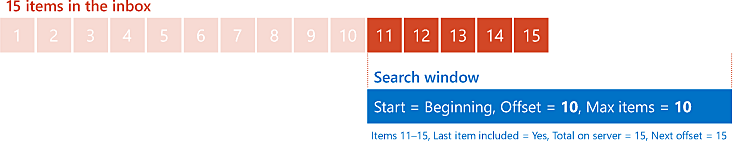
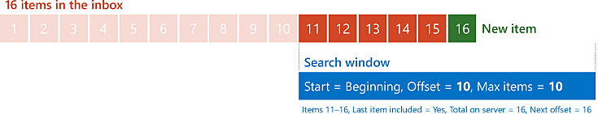
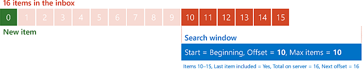

# <a name="perform-paged-searches-by-using-ews-in-exchange"></a>Executar pesquisas paginadas usando o EWS no Exchange

Descubra como realizar pesquisas paginadas na sua API gerenciada EWS ou no aplicativo EWS direcionado para o Exchange.
  
A paginação é um recurso no EWS que permite controlar o tamanho dos resultados de uma pesquisa. Em vez de recuperar todo o conjunto de resultados em uma resposta do EWS, você pode recuperar conjuntos menores em várias respostas do EWS. Por exemplo, considere um usuário com 10.000 mensagens de email na caixa de entrada. Teoricamente, você pode recuperar todos os 10.000 emails em uma resposta muito grande, mas pode querer separá-los em fragmentos gerenciados mais facilmente por razões como largura de banda ou desempenho. A paginação oferece as ferramentas para fazer exatamente isso.
  
> [!NOTE]
> Embora você possa recuperar, teoricamente, os 10.000 itens em uma única solicitação, na verdade isso não é muito provável devido à limitação do EWS. Para saber mais, confira [Limitação do EWS no Exchange](ews-throttling-in-exchange.md). 
  
**Tabela 1. Parâmetros de paginação na API gerenciada do EWS e no EWS**

|**Para configurar ou recuperar o...**|**Na API Gerenciada do EWS, use...**|**No EWS, use...**|
|:-----|:-----|:-----|
|Número máximo de itens ou pastas em uma resposta  <br/> |O parâmetro **pageSize** para o [construtor ItemView](https://msdn.microsoft.com/library/microsoft.exchange.webservices.data.itemview.itemview%28v=exchg.80%29.aspx) ou o [construtor FolderView](https://msdn.microsoft.com/library/microsoft.exchange.webservices.data.folderview.folderview%28v=exchg.80%29.aspx) <br/> Ou  <br/> A propriedade [PagedView.PageSize](https://msdn.microsoft.com/library/microsoft.exchange.webservices.data.pagedview.pagesize%28v=exchg.80%29.aspx)  <br/> |O atributo **MaxEntriesReturned** no elemento [IndexedPageItemView](https://msdn.microsoft.com/library/6d1b0b04-cc35-4a57-bd7a-824136d14fda%28Office.15%29.aspx) ou no elemento [IndexedPageFolderView](https://msdn.microsoft.com/library/c6dac232-244b-4db0-9a15-5e01b8aa7a7d%28Office.15%29.aspx)  <br/> |
|Ponto de partida na lista de itens ou pastas  <br/> |O parâmetro **offsetBasePoint** para o construtor **ItemView** ou o construtor **FolderView**  <br/> Ou  <br/> A propriedade[PagedView.OffsetBasePoint](https://msdn.microsoft.com/library/microsoft.exchange.webservices.data.pagedview.offsetbasepoint%28v=exchg.80%29.aspx)  <br/> |O atributo **BasePoint** no elemento **IndexedPageItemView** ou no elemento **IndexedPageFolderView**  <br/> |
|Deslocamento a partir do ponto de partida  <br/> |O parâmetro **offset** para o construtor **ItemView** ou o construtor **FolderView**  <br/> Ou  <br/> A propriedade[PagedView.Offset](https://msdn.microsoft.com/library/microsoft.exchange.webservices.data.pagedview.offset%28v=exchg.80%29.aspx)  <br/> |O atributo **Offset** no elemento **IndexedPageItemView** ou no elemento **IndexedPageFolderView**  <br/> |
|Número total de resultados no servidor  <br/> |A propriedade [FindItemsResults.TotalCount](https://msdn.microsoft.com/library/dd635348%28v=exchg.80%29.aspx) ou a propriedade [FindFoldersResults.TotalCount](https://msdn.microsoft.com/library/microsoft.exchange.webservices.data.findfoldersresults.totalcount%28v=exchg.80%29.aspx)  <br/> |O atributo **TotalItemsInView** no elemento [RootFolder (FindItemResponseMessage)](https://msdn.microsoft.com/library/187e009f-efaa-42a8-8962-329a645213ab%28Office.15%29.aspx) ou o elemento [RootFolder (FindFolderResponseMessage)](https://msdn.microsoft.com/library/5089c815-663f-46be-bc59-aed9ee20f94a%28Office.15%29.aspx)  <br/> |
|Deslocamento do primeiro item ou pasta não incluída na resposta atual  <br/> |A propriedade [FindItemsResults.NextPageOffset](https://msdn.microsoft.com/library/ee693014%28v=exchg.80%29.aspx) ou a propriedade [FindFoldersResults.NextPageOffset](https://msdn.microsoft.com/library/microsoft.exchange.webservices.data.findfoldersresults.nextpageoffset%28v=exchg.80%29.aspx)  <br/> |O atributo **IndexedPagingOffset** no elemento **RootFolder**  <br/> |
|Indicador de que a resposta inclui o último item ou pasta na lista  <br/> |A propriedade [FindItemsResults.MoreAvailable](https://msdn.microsoft.com/library/dd635477%28v=exchg.80%29.aspx) ou a propriedade [FindFoldersResults.MoreAvailable](https://msdn.microsoft.com/library/microsoft.exchange.webservices.data.findfoldersresults.moreavailable%28v=exchg.80%29.aspx)  <br/> |O atributo **IncludesLastItemInRange** no elemento **RootFolder**  <br/> |
   
## <a name="how-paging-works"></a>Como funciona a paginação
<a name="bk_HowPagingWorks"> </a>

Para entender como funciona a paginação, é útil imaginá-las em uma pasta como painéis alinhados lado a lado em um espaço fora da sua casa. Você pode ver alguns desses painéis por meio de uma janela mágica. Você tem a capacidade de alterar o tamanho da janela (para ver mais ou menos painéis por vez) e para mover a janela (para controlar quais painéis você pode ver). Essa manipulação da janela é paginação. 
  
Ao enviar a solicitação para o servidor Exchange, você especifica o tamanho da janela em termos de número de itens a ser retornado. Defina a posição da janela especificando um ponto inicial (o início da linha ou o fim da linha) e um deslocamento desse ponto inicial, expresso em um número de itens. O início da janela é o número de itens especificado pelo deslocamento do ponto de partida.
  
A paginação fica um pouco mais interessante na resposta do servidor, e como seu aplicativo pode usar essa resposta para modelar a próxima solicitação. O servidor oferece três informações que você pode usar para determinar como configurar sua "janela" para a próxima solicitação: 
  
- Se os resultados na resposta incluem o último item no conjunto de resultados geral no servidor.
    
- O número total de itens no resultado definido no servidor.
    
- Qual o próximo valor de deslocamento deve ser, se você quiser avançar a janela para o próximo item no conjunto de resultados que não está incluído na resposta atual.
    
Vejamos um exemplo simples. Imagine uma caixa de entrada com 15 mensagens. O aplicativo envia uma solicitação inicial para recuperar um máximo de dez itens, começando no início da lista de mensagens (portanto, o deslocamento é zero). O servidor responde com as dez primeiras mensagens e indica que a resposta não inclui o último item, que há um total de 15 itens e que o próximo deslocamento deve ser dez.
  
**Figura 1. Solicitar dez itens com deslocamento zero desde o início de uma lista de 15 itens**


  
Em seguida, o aplicativo reenvia a mesma solicitação para o servidor, com a única alteração sendo o deslocamento para dez. O servidor retorna os últimos cinco itens e indica que a resposta inclui o último item, que há um total de 15 itens e que o próximo deslocamento deve ser 15 (no entanto, você chegou ao fim, por isso, não haverá um deslocamento próximo).
  
**Figura 2. Solicitar dez itens com deslocamento dez desde o início de uma lista de 15 itens**


  
## <a name="design-considerations-for-paging"></a>Considerações de design para paginação
<a name="bk_DesignConsiderations"> </a>

Aproveitar ao máximo a paginação em seu aplicativo exige algumas considerações. Por exemplo, qual é o tamanho da "janela"? O que fazer se os resultados no servidor mudarem enquanto você estiver movendo a "janela"?
  
### <a name="determine-the-size-of-your-window"></a>Determinar o tamanho da janela

Não existe um número único de entradas o qual todos os aplicativos devem usar. Determinar o número ideal para o seu aplicativo depende de vários fatores diferentes. No entanto, é útil lembrar das seguintes orientações:
  
- Por padrão, o Exchange limita o número máximo de itens que podem ser retornados em uma única solicitação para 1000.
    
- Definir o número máximo de entradas para um número maior resulta em enviar menos solicitações para obter todos os itens, ao custo de ter que esperar mais respostas.
    
- Definir o número máximo de entradas para um número menor resulta em tempos de resposta mais rápidos, ao custo de ter que enviar mais solicitações para obter todos os itens.
    
### <a name="handling-changes-to-the-result-set"></a>Processando alterações para o conjunto de resultados

No exemplo anterior simples nesse artigo, o número de itens na caixa de entrada do usuário permanecia constante. No entanto, na realidade, o número de itens em uma caixa de entrada pode ser alterado frequentemente. Novas mensagens podem chegar e os itens podem ser excluídos ou movidos a qualquer momento. Mas como isso afeta a paginação? Modifiquemos o exemplo anterior de cenário para descobrir.
  
Vamos começar novamente com os 15 itens na caixa de entrada do usuário e enviar a mesma solicitação inicial. Como antes, o servidor responde com as dez primeiras mensagens e indica que a resposta não inclui o último item, que há um total de 15 itens e que o próximo deslocamento deve ser dez, conforme mostrado na Figura 1.
  
Agora, enquanto o seu aplicativo processa esses dez itens, uma nova mensagem chega na caixa de entrada e é adicionada ao conjunto de resultados no servidor. O aplicativo reenvia a mesma solicitação para o servidor (somente com o deslocamento definido como 10). Desta vez, o servidor recebe seis itens e indica que há um total de 16 itens no conjunto de resultados.
  
Neste ponto, você deve estar se perguntando se esse isso é realmente um problema. Afinal, você tem 16 itens nas duas respostas, então por que toda essa preocupação? A resposta depende de onde o novo item será posicionado. Se a lista for classificada para que os itens mais antigos (por data/hora de recebimento) sejam os primeiros, não há nenhuma causa para se preocupar com esse cenário. O novo item será posicionado no final da lista e será incluído na segunda resposta.
  
**Figura 3. Solicitar dez itens com deslocamento dez desde o início de uma lista com 16 itens, com o 16º item na lista sendo novo**


  
A história é diferente se a lista for classificada para que os itens mais recentes apareçam primeiro. Nesse caso, o primeiro item na segunda solicitação seria o último item da solicitação anterior mais os cinco itens restantes dos 15 itens originais. Para colocá-lo em termos da nossa janela mágica imaginária, você mudou a posição da janela para 10, mas os próprios painéis também mudaram 1 posição.
  
**Figura 4. Solicitar dez itens com deslocamento dez desde o início de uma lista com 16 itens, com o primeiro item da lista sendo novo**


  
Uma maneira de detectar uma alteração nos resultados no servidor é usar o conceito de um item de âncora. Um item de âncora é um item adicional na resposta que não é processado juntamente com o restante dos resultados, mas é usado para comparar com os próximos resultados para ver se os itens propriamente ditos foram deslocados. Retomando o nosso exemplo, se o aplicativo estiver usando um tamanho de "janela" dez, você, na verdade, define o número máximo de itens a serem retornados para 11. O aplicativo processa os primeiros dez itens na resposta como de costume. Para o último item, você salva o identificador do item como uma âncora e emite a próxima solicitação com um deslocamento dez. Se os dados não forem alterados, o primeiro item na segunda resposta deve ter um identificador de item que corresponda à âncora. Se os identificadores de item não corresponderem, você saberá que os dados foram removidos ou inseridos nas partes da lista que já se encontravam "paginados".
  
Mesmo quando souber que os dados foram alterados, ainda será preciso decidir como reagir. Não há uma única resposta para essa pergunta. Suas ações dependerão da natureza do aplicativo e de quanto será importante capturar todos os itens. Você pode ignorá-la completamente, reiniciar o processo do começo ou controlar novamente e tentar detectar onde ocorreu a alteração.
  
## <a name="example-perform-a-paged-search-by-using-the-ews-managed-api"></a>Exemplo: executar uma pesquisa de paginação usando a API gerenciada do EWS
<a name="bk_PagedSearchEWSMA"> </a>

A paginação é compatível com os seguintes métodos da API gerenciada do EWS:
  
- [ExchangeService.FindFolders](https://msdn.microsoft.com/library/microsoft.exchange.webservices.data.exchangeservice.findfolders%28v=exchg.80%29.aspx)
    
- [ExchangeService.FindItems](https://msdn.microsoft.com/library/microsoft.exchange.webservices.data.exchangeservice.finditems%28v=exchg.80%29.aspx)
    
- [Folder.FindFolders](https://msdn.microsoft.com/library/microsoft.exchange.webservices.data.folder.findfolders%28v=exchg.80%29.aspx)
    
- [Folder.FindFolders](https://msdn.microsoft.com/library/microsoft.exchange.webservices.data.folder.finditems%28v=exchg.80%29.aspx)
    
Se você estiver usando a API gerenciada do EWS, seu aplicativo configurará a paginação com a classe [ItemView](https://msdn.microsoft.com/library/microsoft.exchange.webservices.data.itemview%28v=exchg.80%29.aspx) ou [FolderView](https://msdn.microsoft.com/library/microsoft.exchange.webservices.data.folderview%28v=exchg.80%29.aspx), e receberá informações do servidor em relação à paginação da classe [FindItemsResults](https://msdn.microsoft.com/library/dd635381%28v=exchg.80%29.aspx) ou [FindFoldersResults](https://msdn.microsoft.com/library/microsoft.exchange.webservices.data.findfoldersresults%28v=exchg.80%29.aspx). 
  
O exemplo a seguir recupera todos os itens de uma pasta usando uma pesquisa de paginação que retorna cinco itens em cada resposta. Ele também recupera um item adicional para servir como uma âncora para detectar alterações nos resultados no servidor. 
  
Este exemplo supõe que o objeto **ExchangeService** tenha sido inicializado com valores válidos nas propriedades [Credentials](https://msdn.microsoft.com/library/microsoft.exchange.webservices.data.exchangeservicebase.credentials%28v=exchg.80%29.aspx) e [URL](https://msdn.microsoft.com/library/microsoft.exchange.webservices.data.exchangeservice.url%28v=exchg.80%29.aspx). 
  
```cs
using Microsoft.Exchange.WebServices.Data;
static void PageSearchItems(ExchangeService service, WellKnownFolderName folder)
{
    int pageSize = 5;
    int offset = 0;
    // Request one more item than your actual pageSize.
    // This will be used to detect a change to the result
    // set while paging.
    ItemView view = new ItemView(pageSize + 1, offset);
    view.PropertySet = new PropertySet(ItemSchema.Subject);
    view.OrderBy.Add(ItemSchema.DateTimeReceived, SortDirection.Descending);
    view.Traversal = ItemTraversal.Shallow;
    bool moreItems = true;
    ItemId anchorId = null;
    while (moreItems)
    {
        try
        {
            FindItemsResults<Item> results = service.FindItems(folder, view);
            moreItems = results.MoreAvailable;
            if (moreItems && anchorId != null)
            {
                // Check the first result to make sure it matches
                // the last result (anchor) from the previous page.
                // If it doesn't, that means that something was added
                // or deleted since you started the search.
                if (results.Items.First<Item>().Id != anchorId)
                {
                    Console.WriteLine("The collection has changed while paging. Some results may be missed.");
                }
            }
            if (moreItems)
                view.Offset += pageSize;
                
            anchorId = results.Items.Last<Item>().Id;
            
            // Because you're including an additional item on the end of your results
            // as an anchor, you don't want to display it.
            // Set the number to loop as the smaller value between
            // the number of items in the collection and the page size.
            int displayCount = 0;
            if ((results.MoreAvailable == false && results.Items.Count > pageSize) || (results.Items.Count < pageSize))
            {
                displayCount = results.Items.Count;
            }
            else
            {
                displayCount = pageSize;
            }
            
            for (int i = 0; i < displayCount; i++)
            {
                Item item = results.Items[i];
                Console.WriteLine("Subject: {0}", item.Subject);
                Console.WriteLine("Id: {0}\n", item.Id.ToString());
            }
        }
        catch (Exception ex)
        {
            Console.WriteLine("Exception while paging results: {0}", ex.Message);
        }
    }
}
```

## <a name="example-perform-a-paged-search-by-using-ews"></a>Exemplo: executar uma pesquisa de paginação usando o EWS
<a name="bk_PagedSearchEWS"> </a>

A paginação é compatível com as seguintes operações do EWS:
  
- [FindFolder](https://msdn.microsoft.com/library/7a9855aa-06cc-45ba-ad2a-645c15b7d031%28Office.15%29.aspx)
    
- [FindItem](https://msdn.microsoft.com/library/ebad6aae-16e7-44de-ae63-a95b24539729%28Office.15%29.aspx)
    
Se você estiver usando o EWS, seu aplicativo configura a paginação com o elemento [IndexedPageItemView](https://msdn.microsoft.com/library/6d1b0b04-cc35-4a57-bd7a-824136d14fda%28Office.15%29.aspx) ou [IndexedPageFolderView](https://msdn.microsoft.com/library/c6dac232-244b-4db0-9a15-5e01b8aa7a7d%28Office.15%29.aspx) e recebe informações do servidor de paginação do elemento [RootFolder (FindItemResponseMessage)](https://msdn.microsoft.com/library/187e009f-efaa-42a8-8962-329a645213ab%28Office.15%29.aspx) ou [RootFolder (FindFolderResponseMessage)](https://msdn.microsoft.com/library/5089c815-663f-46be-bc59-aed9ee20f94a%28Office.15%29.aspx). 
  
Neste exemplo de solicitação, uma solicitação **FindItem** é enviada para um máximo de seis itens, começando com um deslocamento de zero do início da lista de itens na caixa de entrada do usuário. 
  
```XML
<?xml version="1.0" encoding="utf-8"?>
<soap:Envelope xmlns:xsi="http://www.w3.org/2001/XMLSchema-instance" 
    xmlns:m="https://schemas.microsoft.com/exchange/services/2006/messages" 
    xmlns:t="https://schemas.microsoft.com/exchange/services/2006/types" 
    xmlns:soap="https://schemas.xmlsoap.org/soap/envelope/">
  <soap:Header>
    <t:RequestServerVersion Version="Exchange2007_SP1" />
    <t:TimeZoneContext>
      <t:TimeZoneDefinition Id="Eastern Standard Time" />
    </t:TimeZoneContext>
  </soap:Header>
  <soap:Body>
    <m:FindItem Traversal="Shallow">
      <m:ItemShape>
        <t:BaseShape>IdOnly</t:BaseShape>
        <t:AdditionalProperties>
          <t:FieldURI FieldURI="item:Subject" />
        </t:AdditionalProperties>
      </m:ItemShape>
      <m:IndexedPageItemView MaxEntriesReturned="6" Offset="0" BasePoint="Beginning" />
      <m:ParentFolderIds>
        <t:DistinguishedFolderId Id="inbox" />
      </m:ParentFolderIds>
    </m:FindItem>
  </soap:Body>
</soap:Envelope>
```

O servidor retorna esta resposta, a qual contém seis itens. A resposta também indica que há um total de oito itens nos resultados no servidor e que o último item na lista de resultados não está presente nesta resposta.
  
```XML
<?xml version="1.0" encoding="utf-8"?>
<s:Envelope xmlns:s="https://schemas.xmlsoap.org/soap/envelope/">
  <s:Header>
    <h:ServerVersionInfo MajorVersion="15" MinorVersion="0" MajorBuildNumber="775" MinorBuildNumber="35" Version="V2_4" 
        xmlns:h="https://schemas.microsoft.com/exchange/services/2006/types" 
        xmlns="https://schemas.microsoft.com/exchange/services/2006/types" 
        xmlns:xsd="http://www.w3.org/2001/XMLSchema" 
        xmlns:xsi="http://www.w3.org/2001/XMLSchema-instance" />
  </s:Header>
  <s:Body xmlns:xsi="http://www.w3.org/2001/XMLSchema-instance" xmlns:xsd="http://www.w3.org/2001/XMLSchema">
    <m:FindItemResponse xmlns:m="https://schemas.microsoft.com/exchange/services/2006/messages" 
        xmlns:t="https://schemas.microsoft.com/exchange/services/2006/types">
      <m:ResponseMessages>
        <m:FindItemResponseMessage ResponseClass="Success">
          <m:ResponseCode>NoError</m:ResponseCode>
          <m:RootFolder IndexedPagingOffset="6" TotalItemsInView="8" IncludesLastItemInRange="false">
            <t:Items>
              <t:Message>
                <t:ItemId Id="AAMkAGM2..." ChangeKey="CQAAABYA..." />
                <t:Subject>Query</t:Subject>
              </t:Message>
              <t:Message>
                <t:ItemId Id="AAMkAGM2..." ChangeKey="CQAAABYA..." />
                <t:Subject>Update</t:Subject>
              </t:Message>
              <t:Message>
                <t:ItemId Id="AAMkAGM2..." ChangeKey="CQAAABYA..." />
                <t:Subject>Planning resources</t:Subject>
              </t:Message>
              <t:Message>
                <t:ItemId Id="AAMkAGM2..." ChangeKey="CQAAABYA..." />
                <t:Subject>Timeline</t:Subject>
              </t:Message>
              <t:Message>
                <t:ItemId Id="AAMkAGM2..." ChangeKey="CQAAABYA..." />
                <t:Subject>For your perusal</t:Subject>
              </t:Message>
              <t:Message>
                <t:ItemId Id="AAMkAGM2..." ChangeKey="CQAAABYA..." />
                <t:Subject>meeting notes</t:Subject>
              </t:Message>
            </t:Items>
          </m:RootFolder>
        </m:FindItemResponseMessage>
      </m:ResponseMessages>
    </m:FindItemResponse>
  </s:Body>
</s:Envelope>
```

Neste exemplo, a mesma solicitação é enviada, mas desta vez, o atributo **Offset** é alterado para cinco, o que indica que o servidor deve retornar no máximo seis itens que começam no deslocamento cinco do começo. 
  
```XML
<?xml version="1.0" encoding="utf-8"?>
<soap:Envelope xmlns:xsi="http://www.w3.org/2001/XMLSchema-instance" 
    xmlns:m="https://schemas.microsoft.com/exchange/services/2006/messages" 
    xmlns:t="https://schemas.microsoft.com/exchange/services/2006/types" 
    xmlns:soap="https://schemas.xmlsoap.org/soap/envelope/">
  <soap:Header>
    <t:RequestServerVersion Version="Exchange2007_SP1" />
    <t:TimeZoneContext>
      <t:TimeZoneDefinition Id="Eastern Standard Time" />
    </t:TimeZoneContext>
  </soap:Header>
  <soap:Body>
    <m:FindItem Traversal="Shallow">
      <m:ItemShape>
        <t:BaseShape>IdOnly</t:BaseShape>
        <t:AdditionalProperties>
          <t:FieldURI FieldURI="item:Subject" />
        </t:AdditionalProperties>
      </m:ItemShape>
      <m:IndexedPageItemView MaxEntriesReturned="6" Offset="5" BasePoint="Beginning" />
      <m:ParentFolderIds>
        <t:DistinguishedFolderId Id="inbox" />
      </m:ParentFolderIds>
    </m:FindItem>
  </soap:Body>
</soap:Envelope>
```

O servidor envia essa resposta, a qual contém três itens. A resposta também indica que o total de número de itens nos resultados no servidor ainda é oito, e que o último item na lista de resultados está presente nessa resposta.
  
```XML
<?xml version="1.0" encoding="utf-8"?>
<s:Envelope xmlns:s="https://schemas.xmlsoap.org/soap/envelope/">
  <s:Header>
    <h:ServerVersionInfo MajorVersion="15" MinorVersion="0" MajorBuildNumber="775" MinorBuildNumber="35" Version="V2_4" 
        xmlns:h="https://schemas.microsoft.com/exchange/services/2006/types" 
        xmlns="https://schemas.microsoft.com/exchange/services/2006/types" 
        xmlns:xsd="http://www.w3.org/2001/XMLSchema" 
        xmlns:xsi="http://www.w3.org/2001/XMLSchema-instance" />
  </s:Header>
  <s:Body xmlns:xsi="http://www.w3.org/2001/XMLSchema-instance" xmlns:xsd="http://www.w3.org/2001/XMLSchema">
    <m:FindItemResponse xmlns:m="https://schemas.microsoft.com/exchange/services/2006/messages" 
    xmlns:t="https://schemas.microsoft.com/exchange/services/2006/types">
      <m:ResponseMessages>
        <m:FindItemResponseMessage ResponseClass="Success">
          <m:ResponseCode>NoError</m:ResponseCode>
          <m:RootFolder IndexedPagingOffset="8" TotalItemsInView="8" IncludesLastItemInRange="true">
            <t:Items>
              <t:Message>
                <t:ItemId Id="AAMkAGM2..." ChangeKey="CQAAABYA..." />
                <t:Subject>meeting notes</t:Subject>
              </t:Message>
              <t:Message>
                <t:ItemId Id="AAMkAGM2..." ChangeKey="CQAAABYA..." />
                <t:Subject>Meeting notes</t:Subject>
              </t:Message>
              <t:Message>
                <t:ItemId Id="AAMkAGM2..." ChangeKey="CQAAABYA..." />
                <t:Subject>This cat is hilarious!</t:Subject>
              </t:Message>
            </t:Items>
          </m:RootFolder>
        </m:FindItemResponseMessage>
      </m:ResponseMessages>
    </m:FindItemResponse>
  </s:Body>
</s:Envelope>
```

## <a name="see-also"></a>Confira também


- [Pesquisa e EWS no Exchange](search-and-ews-in-exchange.md)
    
- [Método ExchangeService.FindFolders](https://msdn.microsoft.com/library/microsoft.exchange.webservices.data.exchangeservice.findfolders%28v=exchg.80%29.aspx)
    
- [Método ExchangeService.FindItems](https://msdn.microsoft.com/library/microsoft.exchange.webservices.data.exchangeservice.finditems%28v=exchg.80%29.aspx)
    
- [Método Folder.FindFolders](https://msdn.microsoft.com/library/microsoft.exchange.webservices.data.folder.findfolders%28v=exchg.80%29.aspx)
    
- [Método Folder.FindFolders](https://msdn.microsoft.com/library/microsoft.exchange.webservices.data.folder.finditems%28v=exchg.80%29.aspx)
    
- [Operação FindFolder](https://msdn.microsoft.com/library/7a9855aa-06cc-45ba-ad2a-645c15b7d031%28Office.15%29.aspx)
    
- [Operação FindItem](https://msdn.microsoft.com/library/ebad6aae-16e7-44de-ae63-a95b24539729%28Office.15%29.aspx)
    
- [Limitação do EWS no Exchange](ews-throttling-in-exchange.md)
    

