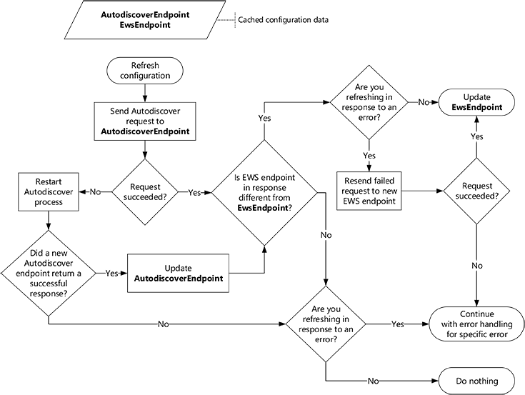

# Atualizar informações de configuração usando a descoberta automática

Saiba como e quando atualizar informações de configuração de sua conexão do Exchange usando a descoberta automática.
  
Quando seu aplicativo EWS é executado pela primeira vez, a descoberta automática oferece uma ótima maneira de coletar as informações que necessárias para se conectar à caixa de correio do usuário do seu Exchange. Mas não de descoberta automática para o primeiro uso. Usando a descoberta automática regularmente pode ajudar a manter o seu aplicativo conectado por habilitá-la para responder às alterações na implantação do Exchange.
  
## Cache de ponto de extremidade de descoberta automática e configurações de EWS

Enquanto nós recomendamos que você use Autodiscover regularmente, como regularmente usá-lo requer algumas considerações. Idealmente, você pode equilibrar a responder rapidamente às mudanças no ambiente contra gerando muito tráfego de rede desnecessário. Quando seu aplicativo obtém uma resposta bem-sucedida de descoberta automática pela primeira vez, você deve salvar as informações a seguir para que você não precisará repetir o processo de descoberta automática, sempre que você enviar uma solicitação EWS.
  
**Tabela 1. Informações cache para solicitações de descoberta automática**

|**Configuração de cache**|**É válido para …**|**Detalhes**|
|:-----|:-----|:-----|
|Ponto de extremidade de descoberta automática    |Desde que ela funciona    |Quando você salva o ponto de extremidade de descoberta automática que retornou uma resposta bem-sucedida, você não precisará repetir o processo de [gerar uma lista de pontos de extremidade de descoberta automática](how-to-generate-a-list-of-autodiscover-endpoints.md) e tentá-los até que você obtenha uma resposta bem-sucedida.   **Observação**: O EWS Managed API não oferece suporte para o armazenamento em cache o ponto de extremidade de descoberta automática.           |
|URL do EWS e qualquer outra configuração recuperados de resposta da descoberta automática    |24 horas    |Salvando a URL do EWS e outras relacionadas configurações, você não precisará [Enviar uma nova solicitação de descoberta automática](how-to-get-user-settings-from-exchange-by-using-autodiscover.md) para cada solicitação EWS ou se o seu aplicativo será reiniciado. No entanto, mesmo se uma URL de EWS funciona para o usuário, um servidor pode estar disponível ou seja mais adequada.   Por exemplo, caixa de correio do usuário pode ter sido movido para um novo servidor de caixa de correio, resultando em um novo ponto de extremidade de EWS preferencial. Recomendamos que você atualizar suas configurações de usuário, enviando uma nova solicitação de descoberta automática após 24 horas terem decorrido desde sua última solicitação de descoberta automática. Neste momento pode ser ajustado para atender aos requisitos do seu aplicativo.    |
   
## Atualizar informações de configuração de cache

Agora que você tem as informações armazenadas em cache, vamos examinar como você pode manter nesse cache atualizados. Recomendamos que você atualizar suas informações de cache quando:
  
- Período de validade da informação expira.
    
- Um [erros relacionados a Conexão](#bk_ConnectionErrors) ocorre. 
    
Para atualizar suas informações de cache, enviar uma solicitação de descoberta automática para um ponto de extremidade de descoberta automática em cache e faça o seguinte:
  
- Se a solicitação tiver êxito, compare o ponto de extremidade EWS na resposta com o ponto de extremidade do EWS armazenado em cache e faça o seguinte:
    
  - Se eles forem diferentes, use o novo ponto de extremidade do EWS. Se você estiver atualizando para recuperar de um erro, repita a solicitação com falha com o novo ponto de extremidade.
    
  - Se eles forem iguais, continue a usar o ponto de extremidade do EWS original. Se você estiver atualizando para recuperar de um erro, manipule o erro conforme apropriado.
    
- Se a solicitação falhar, inicie o [processo de descoberta automática](autodiscover-for-exchange.md) desde o início. Depois de obter uma resposta bem-sucedida, substitua o ponto de extremidade de descoberta automática em cache o ponto de extremidade de descoberta automática que foi bem-sucedida e continuar a usar o novo ponto de extremidade do EWS. Se você não obtiver uma resposta bem-sucedida, continue a usar o ponto de extremidade de descoberta automática original e o ponto de extremidade do EWS. Se você estiver atualizando para recuperar de um erro, manipule o erro conforme apropriado. 
    
A figura a seguir fornece uma representação visual desse processo.
  
**Figura 1. Processo para atualizar as informações de configuração usando a descoberta automática**

  
### Erros de Conexão

Atualizar suas informações de configuração de cache pode ajudar com alguns erros, mas não todos. 
  
**Tabela 2. Erros abordados pela atualização de seu cache**

|**Erro**|**Implementação da API gerenciada de EWS**|**Notes**|
|:-----|:-----|:-----|
|Erros de falha de DNS ou de rede   Exemplo: O nome do Host não pôde ser encontrado.    |[ServiceRemoteException](https://msdn.microsoft.com/library/Microsoft.Exchange.WebServices.Data.ServiceRemoteException.aspx)   |Qualquer erro que indica que o servidor não pôde ser encontrado ou não pôde ser alcançado pode ser resolvido pela tentativa de descoberta automática.    Talvez seu ponto de extremidade do EWS cache deixará de ser válido e descoberta automática pode ser capaz de ponto você para o novo servidor.    |
|Erros de status HTTP   Exemplo: 503 serviço não disponível    |[ServiceRemoteException](https://msdn.microsoft.com/library/Microsoft.Exchange.WebServices.Data.ServiceRemoteException.aspx)   |Erros de status HTTP podem acontecer por vários motivos diferentes.   No entanto, é uma boa ideia para tentar a descoberta automática para ver se um novo ponto de extremidade do EWS está disponível para o usuário.    |
|Códigos de erro EWS    Exemplo: ErrorConnectionFailed   |[ResponseCodeType](https://msdn.microsoft.com/library/Microsoft.Exchange.WebServices.Data.ResponseCodeType.aspx)   | A maioria dos códigos de erro do EWS não garantem a atualizar suas informações de configuração.   No entanto, o seguinte especificamente indica que as informações de configuração precisam ser atualizado: - **ErrorConnectionFailed**  - **ErrorMailboxMoveInProgress**   |
   
## Confira também

- [Descoberta Automática do Exchange](autodiscover-for-exchange.md)  
- [Gerar uma lista de pontos de extremidade de descoberta automática](how-to-generate-a-list-of-autodiscover-endpoints.md)   
- [Obter configurações de usuário do Exchange usando a descoberta automática](how-to-get-user-settings-from-exchange-by-using-autodiscover.md)
    

