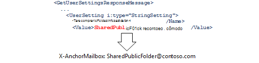
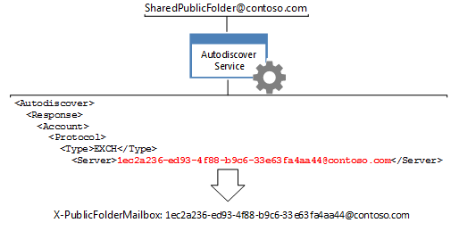

# <a name="route-public-folder-hierarchy-requests"></a><span data-ttu-id="c9805-104">Rotear solicitações de hierarquia de pasta pública</span><span class="sxs-lookup"><span data-stu-id="c9805-104">Route public folder hierarchy requests</span></span>

<span data-ttu-id="c9805-105">Todas as solicitações de informações de pasta pública que exigem o conhecimento da hierarquia de pastas públicas, como mover, atualizar, excluir ou localizar pastas públicas, precisam ser encaminhadas para a caixa de correio de hierarquia de pasta pública padrão para o usuário específico.</span><span class="sxs-lookup"><span data-stu-id="c9805-105">All requests for public folder information that require knowledge of the public folder hierarchy, such as moving, updating, deleting, or finding public folders, need to be routed to the default public folder hierarchy mailbox for the given user.</span></span> <span data-ttu-id="c9805-106">Para encaminhar as solicitações para essa caixa de correio, você precisa definir os cabeçalhos **x-AnchorMailbox** e **x-PublicFolderMailbox** como valores específicos retornados pelo serviço de descoberta automática.</span><span class="sxs-lookup"><span data-stu-id="c9805-106">To route the requests to that mailbox, you need to set the **X-AnchorMailbox** and **X-PublicFolderMailbox** headers to specific values returned by the Autodiscover service.</span></span> 
  
<span data-ttu-id="c9805-107">**Visão geral das pastas públicas**</span><span class="sxs-lookup"><span data-stu-id="c9805-107">**Overview of public folders**</span></span>

|<span data-ttu-id="c9805-108">Cabeçalho</span><span class="sxs-lookup"><span data-stu-id="c9805-108">Header</span></span>|<span data-ttu-id="c9805-109">O que eu preciso?</span><span class="sxs-lookup"><span data-stu-id="c9805-109">What do I need?</span></span>|<span data-ttu-id="c9805-110">Como posso obtê-lo?</span><span class="sxs-lookup"><span data-stu-id="c9805-110">How do I get it?</span></span>|
|:-----|:-----|:-----|
|<span data-ttu-id="c9805-111">**X-AnchorMailbox**</span><span class="sxs-lookup"><span data-stu-id="c9805-111">**X-AnchorMailbox**</span></span> <br/> |<span data-ttu-id="c9805-112">O valor [PublicFolderInformation](https://msdn.microsoft.com/library/dn751006%28v=exchg.150%29.aspx) de uma resposta SOAP de descoberta automática do [GetUserSettings](https://msdn.microsoft.com/library/office/dd877096%28v=exchg.150%29.aspx) , que se torna o valor do cabeçalho **X-AnchorMailbox** .</span><span class="sxs-lookup"><span data-stu-id="c9805-112">The [PublicFolderInformation](https://msdn.microsoft.com/library/dn751006%28v=exchg.150%29.aspx) value from a [GetUserSettings](https://msdn.microsoft.com/library/office/dd877096%28v=exchg.150%29.aspx) Autodiscover SOAP response, which becomes the value of the **X-AnchorMailbox** header.</span></span><br/><br/> <span data-ttu-id="c9805-113"></span><span class="sxs-lookup"><span data-stu-id="c9805-113"></span></span>| <span data-ttu-id="c9805-114">1. envie uma solicitação de **GetUserSetting** com o endereço SMTP da caixa de correio do usuário.</span><span class="sxs-lookup"><span data-stu-id="c9805-114">1. Send a **GetUserSetting** request with the SMTP address for the user's mailbox.</span></span><br/><br/><span data-ttu-id="c9805-115">2. Armazene em cache o valor do elemento **PublicFolderInformation** que o serviço de descoberta automática retorna.</span><span class="sxs-lookup"><span data-stu-id="c9805-115">2. Cache the value of the **PublicFolderInformation** element that the Autodiscover service returns.</span></span> <span data-ttu-id="c9805-116">Isso pode ser um cache de uma chamada de descoberta automática existente em seu código ou uma nova [chamada de API gerenciada do EWS GetUserSettings](#bk_getpfinfoewsma) ou uma [solicitação SOAP GetUserSettings](#bk_getpfinfoews).</span><span class="sxs-lookup"><span data-stu-id="c9805-116">This can be a cached from an existing Autodiscover call in your code, or a new [EWS Managed API GetUserSettings call](#bk_getpfinfoewsma) or a [GetUserSettings SOAP request](#bk_getpfinfoews).</span></span>  <br/><br/><span data-ttu-id="c9805-117">3. Use o elemento **PublicFolderInformation** para preencher o valor do cabeçalho **X-AnchorMailbox** .</span><span class="sxs-lookup"><span data-stu-id="c9805-117">3. Use the **PublicFolderInformation** element to populate the value of the **X-AnchorMailbox** header.</span></span> <span data-ttu-id="c9805-118">O valor do elemento **PublicFolderInformation** é um endereço SMTP.</span><span class="sxs-lookup"><span data-stu-id="c9805-118">The value of the **PublicFolderInformation** element is an SMTP address.</span></span>  <br/> |
|<span data-ttu-id="c9805-119">**X-PublicFolderMailbox**</span><span class="sxs-lookup"><span data-stu-id="c9805-119">**X-PublicFolderMailbox**</span></span> <br/> |<span data-ttu-id="c9805-120">O valor do [servidor](https://msdn.microsoft.com/library/bb204084%28v=exchg.150%29.aspx) de uma [resposta de descoberta automática de Pox](https://msdn.microsoft.com/library/bb204082%28v=exchg.150%29.aspx), que se torna o valor do cabeçalho **X-PublicFolderMailbox** .</span><span class="sxs-lookup"><span data-stu-id="c9805-120">The [Server](https://msdn.microsoft.com/library/bb204084%28v=exchg.150%29.aspx) value from a [POX Autodiscover response](https://msdn.microsoft.com/library/bb204082%28v=exchg.150%29.aspx), which becomes the value of the **X-PublicFolderMailbox** header.</span></span><br/><br/> <span data-ttu-id="c9805-121"></span><span class="sxs-lookup"><span data-stu-id="c9805-121"></span></span>|<span data-ttu-id="c9805-122">1. [chame o serviço de descoberta automática do Pox](#bk_makeautodrequest) usando o endereço de email **X-AnchorMailbox** .</span><span class="sxs-lookup"><span data-stu-id="c9805-122">1. [Call the POX Autodiscover](#bk_makeautodrequest) service using the **X-AnchorMailbox** email address.</span></span>  <br/><br/><span data-ttu-id="c9805-123">2. Use o elemento **Server** retornado pelo serviço de descoberta automática para preencher o valor do cabeçalho **X-PublicFolderMailbox** .</span><span class="sxs-lookup"><span data-stu-id="c9805-123">2. Use the **Server** element returned by the Autodiscover service to populate the value of the **X-PublicFolderMailbox** header.</span></span> <span data-ttu-id="c9805-124">O valor do **X-PublicFolderMailbox** é um endereço SMTP em que o nome de usuário é um GUID.</span><span class="sxs-lookup"><span data-stu-id="c9805-124">The value of the **X-PublicFolderMailbox** is an SMTP address where the username is a GUID.</span></span>  <br/> |

<br/>

<span data-ttu-id="c9805-125">Depois de determinar os valores de cabeçalho, inclua-os [quando fizer solicitações de hierarquia de pastas públicas](#bk_setheadervalues).</span><span class="sxs-lookup"><span data-stu-id="c9805-125">After you have determined the header values, include them [when you make public folder hierarchy requests](#bk_setheadervalues).</span></span>
  
<span data-ttu-id="c9805-126">As etapas neste artigo são específicas para solicitações de hierarquia de pastas públicas.</span><span class="sxs-lookup"><span data-stu-id="c9805-126">The steps in this article are specific to public folder hierarchy requests.</span></span> <span data-ttu-id="c9805-127">Para determinar se sua solicitação é uma hierarquia de pasta pública ou uma solicitação de conteúdo, consulte [Routing Public Folder](public-folder-access-with-ews-in-exchange.md#bk_routing)requests.</span><span class="sxs-lookup"><span data-stu-id="c9805-127">To determine whether your request is a public folder hierarchy or content request, see [Routing public folder requests](public-folder-access-with-ews-in-exchange.md#bk_routing).</span></span>
  
## <a name="determine-the-value-of-the-x-anchormailbox-header-by-using-the-ews-managed-api"></a><span data-ttu-id="c9805-128">Determinar o valor do cabeçalho X-AnchorMailbox usando a API gerenciada do EWS</span><span class="sxs-lookup"><span data-stu-id="c9805-128">Determine the value of the X-AnchorMailbox header by using the EWS Managed API</span></span>
<span data-ttu-id="c9805-129"><a name="bk_getpfinfoewsma"> </a></span><span class="sxs-lookup"><span data-stu-id="c9805-129"><a name="bk_getpfinfoewsma"> </a></span></span>

<span data-ttu-id="c9805-130">Para recuperar o valor de [PublicFolderInformation (POX)](https://msdn.microsoft.com/library/a221aa9e-b4ac-4ec5-aa42-7e2a69e8eaa6%28Office.15%29.aspx) usando a API gerenciada do EWS, você pode armazenar em cache o valor do elemento **PublicFolderInformation** que uma chamada existente para o serviço de descoberta automática retorna ou fazer uma nova chamada.</span><span class="sxs-lookup"><span data-stu-id="c9805-130">To retrieve the [PublicFolderInformation (POX)](https://msdn.microsoft.com/library/a221aa9e-b4ac-4ec5-aa42-7e2a69e8eaa6%28Office.15%29.aspx) value by using the EWS Managed API, you can either cache the value of the **PublicFolderInformation** element that an existing call to the Autodiscover service returns, or make a new call.</span></span> 
  
<span data-ttu-id="c9805-131">Se você estiver fazendo uma nova chamada, poderá [obter as configurações do usuário usando a API gerenciada do EWS](how-to-get-user-settings-from-exchange-by-using-autodiscover.md#bk_Managed)[para obter as configurações do usuário usando a API gerenciada do EWS](how-to-get-user-settings-from-exchange-by-using-autodiscover.md#bk_Managed) para o seu código e, em seguida, chamar o método de exemplo **GetUserSettings** usando o código a seguir, que recupera apenas o valor do elemento **PublicFolderInformation** .</span><span class="sxs-lookup"><span data-stu-id="c9805-131">If you're making a new call, you can [Get user settings by using the EWS Managed API](how-to-get-user-settings-from-exchange-by-using-autodiscover.md#bk_Managed)[Get user settings by using the EWS Managed API](how-to-get-user-settings-from-exchange-by-using-autodiscover.md#bk_Managed) to your code, and then call the **GetUserSettings** sample method by using the following code, which retrieves only the value of the **PublicFolderInformation** element.</span></span> <span data-ttu-id="c9805-132">Inclua o endereço SMTP do usuário da caixa de correio como um parâmetro de entrada.</span><span class="sxs-lookup"><span data-stu-id="c9805-132">Include the SMTP address of the mailbox user as an input parameter.</span></span> 
  
```cs
GetUserSettingsResponse userResponse = GetUserSettings(adservice, "sonyaf@contoso.com", 3, UserSettingName.PublicFolderInformation);
Console.WriteLine("X-AnchorMailbox value for public folder hierarchy requests: {0}", userResponse.Settings[UserSettingName.PublicFolderInformation]);
```

<span data-ttu-id="c9805-133">Depois de executar o código, as seguintes informações são exibidas no console:</span><span class="sxs-lookup"><span data-stu-id="c9805-133">After running the code, the following information is displayed on the console:</span></span>
  
`X-AnchorMailbox for public folder hierarchy requests: SharedPublicFolder@contoso.com`

<span data-ttu-id="c9805-134">Agora que você tem o valor **PublicFolderInformation** , inclua-o como o valor para o cabeçalho X-AnchorMailbox em todas as solicitações de hierarquia de pasta pública.</span><span class="sxs-lookup"><span data-stu-id="c9805-134">Now that you have the **PublicFolderInformation** value, include it as the value for the X-AnchorMailbox header in all public folder hierarchy requests.</span></span> 
  
`X-AnchorMailbox: SharedPublicFolder@contoso.com`

## <a name="determine-the-value-of-the-x-anchormailbox-header-using-soap"></a><span data-ttu-id="c9805-135">Determinar o valor do cabeçalho X-AnchorMailbox usando SOAP</span><span class="sxs-lookup"><span data-stu-id="c9805-135">Determine the value of the X-AnchorMailbox header using SOAP</span></span>
<span data-ttu-id="c9805-136"><a name="bk_getpfinfoews"> </a></span><span class="sxs-lookup"><span data-stu-id="c9805-136"><a name="bk_getpfinfoews"> </a></span></span>

<span data-ttu-id="c9805-137">O exemplo de código a seguir mostra como recuperar o valor **PublicFolderInformation** usando a operação SOAP [GetUserSettings](https://msdn.microsoft.com/library/dd877096%28v=exchg.150%29.aspx) .</span><span class="sxs-lookup"><span data-stu-id="c9805-137">The following code example shows how to retrieve the **PublicFolderInformation** value by using the [GetUserSettings](https://msdn.microsoft.com/library/dd877096%28v=exchg.150%29.aspx) SOAP operation.</span></span> <span data-ttu-id="c9805-138">O usuário da caixa de correio é especificado no elemento [Mailbox](https://msdn.microsoft.com/library/dd877076%28v=exchg.150%29.aspx) e o elemento [RequestedSettings](https://msdn.microsoft.com/library/office/dd877107%28v=exchg.150%29.aspx) limita a resposta para o valor [PublicFolderInformation](https://msdn.microsoft.com/library/dn751006%28v=exchg.150%29.aspx) .</span><span class="sxs-lookup"><span data-stu-id="c9805-138">The mailbox user is specified in the [Mailbox](https://msdn.microsoft.com/library/dd877076%28v=exchg.150%29.aspx) element, and the [RequestedSettings](https://msdn.microsoft.com/library/office/dd877107%28v=exchg.150%29.aspx) element limits the response to the [PublicFolderInformation](https://msdn.microsoft.com/library/dn751006%28v=exchg.150%29.aspx) value.</span></span> 
  
```XML
<?xml version="1.0" encoding="utf-8"?>
<soap:Envelope xmlns:a="https://schemas.microsoft.com/exchange/2010/Autodiscover"
               xmlns:wsa="http://www.w3.org/2005/08/addressing"
               xmlns:xsi="http://www.w3.org/2001/XMLSchema-instance"
               xmlns:soap="https://schemas.xmlsoap.org/soap/envelope/">
  <soap:Header>
    <a:RequestedServerVersion>Exchange2007_SP1</a:RequestedServerVersion>
    <wsa:Action>https://schemas.microsoft.com/exchange/2010/Autodiscover/Autodiscover/GetUserSettings</wsa:Action>
    <wsa:To>https://pod51042.outlook.com/autodiscover/autodiscover.svc</wsa:To>
  </soap:Header>
  <soap:Body>
    <a:GetUserSettingsRequestMessage xmlns:a="https://schemas.microsoft.com/exchange/2010/Autodiscover">
      <a:Request>
        <a:Users>
          <a:User>
            <a:Mailbox>sonyaf@contoso.com</a:Mailbox>
          </a:User>
        </a:Users>
        <a:RequestedSettings>
          <a:Setting>PublicFolderInformation</a:Setting>
        </a:RequestedSettings>
      </a:Request>
    </a:GetUserSettingsRequestMessage>
  </soap:Body>
</soap:Envelope>
```

<span data-ttu-id="c9805-139">A resposta inclui o valor **PublicFolderInformation** .</span><span class="sxs-lookup"><span data-stu-id="c9805-139">The response includes the **PublicFolderInformation** value.</span></span> 
  
```XML
<UserSetting i:type="StringSetting">
    <Name>PublicFolderInformation</Name>
    <Value>SharedPublicFolder@contoso.com</Value>
</UserSetting>
```

<span data-ttu-id="c9805-140">Agora que você tem o valor **PublicFolderInformation** , inclua-o como o valor para o cabeçalho X-AnchorMailbox em todas as solicitações de hierarquia de pasta pública.</span><span class="sxs-lookup"><span data-stu-id="c9805-140">Now that you have the **PublicFolderInformation** value, include it as the value for the X-AnchorMailbox header in all public folder hierarchy requests.</span></span> 
  
`X-AnchorMailbox: SharedPublicFolder@contoso.com`

## <a name="make-an-autodiscover-request-to-determine-the-x-publicfolderinformation-value"></a><span data-ttu-id="c9805-141">Fazer uma solicitação de descoberta automática para determinar o valor X-PublicFolderInformation</span><span class="sxs-lookup"><span data-stu-id="c9805-141">Make an Autodiscover request to determine the X-PublicFolderInformation value</span></span>
<span data-ttu-id="c9805-142"><a name="bk_makeautodrequest"> </a></span><span class="sxs-lookup"><span data-stu-id="c9805-142"><a name="bk_makeautodrequest"> </a></span></span>

<span data-ttu-id="c9805-143">Faça uma solicitação de descoberta automática usando o endereço SMTP **PublicFolderInformation** , que agora está sendo usado como o valor **X-AnchorMailbox** .</span><span class="sxs-lookup"><span data-stu-id="c9805-143">Make an Autodiscover request by using the **PublicFolderInformation** SMTP address, which is now being used as the **X-AnchorMailbox** value.</span></span> <span data-ttu-id="c9805-144">Use o [Exchange 2013: obter as configurações do usuário com](https://code.msdn.microsoft.com/exchange/Exchange-2013-Get-user-7e22c86e) o exemplo de código de descoberta automática para chamar o serviço de descoberta automática, pois ele simplifica o processo de descoberta automática.</span><span class="sxs-lookup"><span data-stu-id="c9805-144">Use the [Exchange 2013: Get user settings with Autodiscover](https://code.msdn.microsoft.com/exchange/Exchange-2013-Get-user-7e22c86e) code sample to call the Autodiscover service because it streamlines the Autodiscover process for you.</span></span> <span data-ttu-id="c9805-145">Este exemplo de código usa os argumentos de linha de comando listados na tabela a seguir para chamar o serviço de descoberta automática do POX no endereço SMTP do **PublicFolderInformation** .</span><span class="sxs-lookup"><span data-stu-id="c9805-145">This code sample uses the command line arguments listed in the following table to call the POX Autodiscover service on the **PublicFolderInformation** SMTP address.</span></span> 
  
|<span data-ttu-id="c9805-146">**Argumento de linha de comando**</span><span class="sxs-lookup"><span data-stu-id="c9805-146">**Command-line argument**</span></span>|<span data-ttu-id="c9805-147">**Descrição**</span><span class="sxs-lookup"><span data-stu-id="c9805-147">**Description**</span></span>|
|:-----|:-----|
|<span data-ttu-id="c9805-148">emailAddress</span><span class="sxs-lookup"><span data-stu-id="c9805-148">emailAddress</span></span>  <br/> |<span data-ttu-id="c9805-149">O endereço SMTP **PublicFolderInformation** .</span><span class="sxs-lookup"><span data-stu-id="c9805-149">The **PublicFolderInformation** SMTP address.</span></span>  <br/> |
|<span data-ttu-id="c9805-150">-skipSOAP</span><span class="sxs-lookup"><span data-stu-id="c9805-150">-skipSOAP</span></span>  <br/> | <span data-ttu-id="c9805-151">Use as solicitações de descoberta automática do POX para este cenário.</span><span class="sxs-lookup"><span data-stu-id="c9805-151">Use POX Autodiscover requests for this scenario.</span></span>  <br/> |
|<span data-ttu-id="c9805-152">-auth authEmailAddress</span><span class="sxs-lookup"><span data-stu-id="c9805-152">-auth authEmailAddress</span></span>  <br/> |<span data-ttu-id="c9805-153">O endereço de email do usuário da caixa de correio, que é usado para autenticação.</span><span class="sxs-lookup"><span data-stu-id="c9805-153">The mailbox user's email address, which is used for authentication.</span></span> <span data-ttu-id="c9805-154">Você será solicitado a inserir a senha do usuário da caixa de correio quando executar o exemplo.</span><span class="sxs-lookup"><span data-stu-id="c9805-154">You will be prompted to enter the mailbox user's password when you run the sample.</span></span>  <br/> |
   
<span data-ttu-id="c9805-155">Por exemplo, quando SharedPublicFolder@contoso.com é o endereço SMTP do elemento **PublicFolderInformation** , e sonyaf@contoso.com é o usuário da caixa de correio, os argumentos de linha de comando devem ter a seguinte aparência.</span><span class="sxs-lookup"><span data-stu-id="c9805-155">For example, when SharedPublicFolder@contoso.com is the SMTP address of the **PublicFolderInformation** element, and sonyaf@contoso.com is the mailbox user, the command-line arguments should look like this.</span></span> 
  
`SharedPublicFolder@contoso.com -skipSOAP -auth sonyaf@contoso.com`

<span data-ttu-id="c9805-156">Quando você executa o **Exchange 2013: obter as configurações de usuário com** o exemplo de descoberta automática, a última resposta de descoberta automática deve ser bem-sucedida e incluir todas as configurações de usuário associadas ao GUID da caixa de correio.</span><span class="sxs-lookup"><span data-stu-id="c9805-156">When you run the **Exchange 2013: Get user settings with Autodiscover** sample, the last Autodiscover response should be successful and include all the user settings associated with the mailbox GUID.</span></span> <span data-ttu-id="c9805-157">O valor do [servidor](https://msdn.microsoft.com/library/bb204084%28v=exchg.150%29.aspx) associado ao elemento do[tipo](https://msdn.microsoft.com/library/office/bb204223%28v=exchg.150%29.aspx) de [protocolo](https://msdn.microsoft.com/library/bb204278%28v=exchg.150%29.aspx)Exch é o valor do cabeçalho **X-PublicFolderInformation** .</span><span class="sxs-lookup"><span data-stu-id="c9805-157">The [Server](https://msdn.microsoft.com/library/bb204084%28v=exchg.150%29.aspx) value associated with the EXCH [Protocol](https://msdn.microsoft.com/library/bb204278%28v=exchg.150%29.aspx)[Type](https://msdn.microsoft.com/library/office/bb204223%28v=exchg.150%29.aspx) element is the **X-PublicFolderInformation** header value.</span></span> 
  
```XML
<Autodiscover xmlns="https://schemas.microsoft.com/exchange/autodiscover/responseschema/2006">
  <Response xmlns="https://schemas.microsoft.com/exchange/autodiscover/outlook/responseschema/2006a">
    …
    <Account>
      <AccountType>email</AccountType>
      <Action>settings</Action>
      <Protocol>
        <Type>EXCH</Type>
        <Server>1ec2a236-ed93-4f88-b9c6-33e63fa4aa44@contoso.com</Server>

```

<span data-ttu-id="c9805-158">Como alternativa, se você não deseja usar o **Exchange 2013: obter as configurações do usuário com** o exemplo de descoberta automática, você pode obter o valor do **servidor** [gerando uma lista de pontos de extremidade de descoberta automática](how-to-generate-a-list-of-autodiscover-endpoints.md)e, em seguida, enviando a seguinte solicitação de descoberta automática Pox para cada URL até receber uma resposta bem-sucedida.</span><span class="sxs-lookup"><span data-stu-id="c9805-158">Alternatively, if you do not want to use the **Exchange 2013: Get user settings with Autodiscover** sample, you can get the **Server** value by [generating a list of Autodiscover endpoints](how-to-generate-a-list-of-autodiscover-endpoints.md), and then sending the following POX Autodiscover request to each URL until you receive a successful response.</span></span> <span data-ttu-id="c9805-159">SharedPublicFolder@contoso.com é o valor do cabeçalho **X-PublicFolderMailbox** .</span><span class="sxs-lookup"><span data-stu-id="c9805-159">SharedPublicFolder@contoso.com is the value of the **X-PublicFolderMailbox** header.</span></span> 
  
```XML
<?xml version="1.0" encoding="utf-8"?>
<Autodiscover xmlns="https://schemas.microsoft.com/exchange/autodiscover/outlook/requestschema/2006">
  <Request>
    <EMailAddress>SharedPublicFolder@contoso.com</EMailAddress>
    <AcceptableResponseSchema>https://schemas.microsoft.com/exchange/autodiscover/outlook/responseschema/2006a</AcceptableResponseSchema>
  </Request>
</Autodiscover>
```

<span data-ttu-id="c9805-160">Para obter mais informações sobre o processo de descoberta automática, consulte [descoberta automática do Exchange](autodiscover-for-exchange.md), [gerar uma lista de pontos de extremidade de descoberta automática](how-to-generate-a-list-of-autodiscover-endpoints.md)e [obter as configurações de usuário do Exchange usando a descoberta automática](how-to-get-user-settings-from-exchange-by-using-autodiscover.md).</span><span class="sxs-lookup"><span data-stu-id="c9805-160">For more information about the Autodiscover process, see [Autodiscover for Exchange](autodiscover-for-exchange.md), [Generate a list of Autodiscover endpoints](how-to-generate-a-list-of-autodiscover-endpoints.md), and [Get user settings from Exchange by using Autodiscover](how-to-get-user-settings-from-exchange-by-using-autodiscover.md).</span></span>
  
## <a name="set-the-values-of-the-x-anchormailbox-and-x-publicfoldermailbox-headers"></a><span data-ttu-id="c9805-161">Definir os valores dos cabeçalhos X-AnchorMailbox e X-PublicFolderMailbox</span><span class="sxs-lookup"><span data-stu-id="c9805-161">Set the values of the X-AnchorMailbox and X-PublicFolderMailbox headers</span></span>
<span data-ttu-id="c9805-162"><a name="bk_setheadervalues"> </a></span><span class="sxs-lookup"><span data-stu-id="c9805-162"><a name="bk_setheadervalues"> </a></span></span>

<span data-ttu-id="c9805-163">Usando o valor do endereço SMTP **PublicFolderInformation** adquirido em [determine o valor do cabeçalho x-ANCHORMAILBOX usando a API gerenciada do EWS](#bk_getpfinfoewsma) ou [determine o valor do cabeçalho x-AnchorMailbox usando SOAP](#bk_getpfinfoews) e o valor do **servidor** adquirido em [fazer uma solicitação de descoberta automática para determinar o valor x-PublicFolderInformation](#bk_makeautodrequest), defina os valores dos cabeçalhos **x-AnchorMailbox** e **X-PublicFolderMailbox** em sua solicitação de conteúdo de pasta pública.</span><span class="sxs-lookup"><span data-stu-id="c9805-163">Using the value of the **PublicFolderInformation** SMTP address acquired in [Determine the value of the X-AnchorMailbox header by using the EWS Managed API](#bk_getpfinfoewsma) or [Determine the value of the X-AnchorMailbox header using SOAP](#bk_getpfinfoews) and the **Server** value acquired in [Make an Autodiscover request to determine the X-PublicFolderInformation value](#bk_makeautodrequest), set the values of **X-AnchorMailbox** and **X-PublicFolderMailbox** headers in your public folder content request.</span></span> 
  
<span data-ttu-id="c9805-164">Por exemplo, dado um endereço SMTP **PublicFolderInformation** de SharedPublicFolder@contoso.com e um valor de **servidor** de 1ec2a236-ed93-4f88-b9c6-33e63fa4aa44@contoso.com, inclua os seguintes cabeçalhos ao fazer chamadas para os seguintes métodos ou operações.</span><span class="sxs-lookup"><span data-stu-id="c9805-164">For example, given a **PublicFolderInformation** SMTP address of SharedPublicFolder@contoso.com and a **Server** value of 1ec2a236-ed93-4f88-b9c6-33e63fa4aa44@contoso.com, include the following headers when making calls to the following methods or operations.</span></span> 
  
`X-AnchorMailbox: SharedPublicFolder@contoso.com` <br/>
`X-PublicFolderMailbox: 1ec2a236-ed93-4f88-b9c6-33e63fa4aa44@contoso.com`

<span data-ttu-id="c9805-165">**Chamadas de pasta pública que exigem os cabeçalhos X-AnchorMailbox e X-PublicFolder**</span><span class="sxs-lookup"><span data-stu-id="c9805-165">**Public folder calls that require the X-AnchorMailbox and X-PublicFolder headers**</span></span>

|<span data-ttu-id="c9805-166">**Métodos da API gerenciada do EWS**</span><span class="sxs-lookup"><span data-stu-id="c9805-166">**EWS Managed API methods**</span></span>|<span data-ttu-id="c9805-167">**Operações do EWS**</span><span class="sxs-lookup"><span data-stu-id="c9805-167">**EWS operations**</span></span>|
|:-----|:-----|
|[<span data-ttu-id="c9805-168">Folder. FindFolders</span><span class="sxs-lookup"><span data-stu-id="c9805-168">Folder.FindFolders</span></span>](https://msdn.microsoft.com/library/microsoft.exchange.webservices.data.folder.findfolders%28v=exchg.80%29.aspx) <br/> [<span data-ttu-id="c9805-169">Pasta. Delete</span><span class="sxs-lookup"><span data-stu-id="c9805-169">Folder.Delete</span></span>](https://msdn.microsoft.com/library/microsoft.exchange.webservices.data.folder.delete%28v=exchg.80%29.aspx) <br/> [<span data-ttu-id="c9805-170">Pasta. Update</span><span class="sxs-lookup"><span data-stu-id="c9805-170">Folder.Update</span></span>](https://msdn.microsoft.com/library/microsoft.exchange.webservices.data.folder.update%28v=exchg.80%29.aspx) <br/> [<span data-ttu-id="c9805-171">Folder. move</span><span class="sxs-lookup"><span data-stu-id="c9805-171">Folder.Move</span></span>](https://msdn.microsoft.com/library/microsoft.exchange.webservices.data.folder.move%28v=exchg.80%29.aspx) <br/> |[<span data-ttu-id="c9805-172">CreateFolder</span><span class="sxs-lookup"><span data-stu-id="c9805-172">CreateFolder</span></span>](https://msdn.microsoft.com/library/6f6c334c-b190-4e55-8f0a-38f2a018d1b3%28Office.15%29.aspx) <br/> [<span data-ttu-id="c9805-173">FindFolder</span><span class="sxs-lookup"><span data-stu-id="c9805-173">FindFolder</span></span>](https://msdn.microsoft.com/library/7a9855aa-06cc-45ba-ad2a-645c15b7d031%28Office.15%29.aspx) <br/> [<span data-ttu-id="c9805-174">DeleteFolder</span><span class="sxs-lookup"><span data-stu-id="c9805-174">DeleteFolder</span></span>](https://msdn.microsoft.com/library/b0f92682-4895-4bcf-a4a1-e4c2e8403979%28Office.15%29.aspx) <br/> [<span data-ttu-id="c9805-175">UpdateFolder</span><span class="sxs-lookup"><span data-stu-id="c9805-175">UpdateFolder</span></span>](https://msdn.microsoft.com/library/3494c996-b834-4813-b1ca-d99642d8b4e7%28Office.15%29.aspx) <br/> [<span data-ttu-id="c9805-176">MoveFolder</span><span class="sxs-lookup"><span data-stu-id="c9805-176">MoveFolder</span></span>](https://msdn.microsoft.com/library/c7233966-6c87-4a14-8156-b1610760176d%28Office.15%29.aspx) <br/> |
   
<span data-ttu-id="c9805-177">Para adicionar esses cabeçalhos usando a API gerenciada do EWS, use o método [HttpHeaders. Add](https://msdn.microsoft.com/library/system.net.http.headers.httpheaders.add%28v=vs.118%29.aspx) .</span><span class="sxs-lookup"><span data-stu-id="c9805-177">To add these headers by using the EWS Managed API, use the [HttpHeaders.Add](https://msdn.microsoft.com/library/system.net.http.headers.httpheaders.add%28v=vs.118%29.aspx) method.</span></span> 
  
```cs
service.HttpHeaders.Add("X-AnchorMailbox", "SharedPublicFolder@contoso.com");service.HttpHeaders.Add("X-PublicFolderMailbox", "1ec2a236-ed93-4f88-b9c6-33e63fa4aa44@contoso.com");
```

<span data-ttu-id="c9805-178">Por exemplo, o código a seguir mostra uma solicitação [FindFolder](https://msdn.microsoft.com/library/7a9855aa-06cc-45ba-ad2a-645c15b7d031%28Office.15%29.aspx) com o cabeçalho **x-AnchorMailbox** e **x-PublicFolderMailbox** definido como os valores recuperados nos exemplos deste artigo.</span><span class="sxs-lookup"><span data-stu-id="c9805-178">For example, the following code shows a [FindFolder](https://msdn.microsoft.com/library/7a9855aa-06cc-45ba-ad2a-645c15b7d031%28Office.15%29.aspx) request with the **X-AnchorMailbox** and **X-PublicFolderMailbox** header set to the values retrieved in the examples in this article.</span></span> 
  
```XML
POST https://outlook.office365.com/EWS/Exchange.asmx HTTP/1.1
Content-Type: text/xml; charset=utf-8
User-Agent: SoapSender1.0
X-AnchorMailbox: SharedPublicFolder@contoso.com
X-PublicFolderMailbox: 1ec2a236-ed93-4f88-b9c6-33e63fa4aa44@contoso.com
Host: outlook.office365.com
Content-Length: 1174
Expect: 100-continue
Connection: Keep-Alive
<?xml version="1.0" encoding="utf-8"?>
<soap:Envelope xmlns:xsi="http://www.w3.org/2001/XMLSchema-instance" xmlns:m="https://schemas.microsoft.com/exchange/services/2006/messages" xmlns:t="https://schemas.microsoft.com/exchange/services/2006/types" xmlns:soap="https://schemas.xmlsoap.org/soap/envelope/">
  <soap:Header>
    <t:RequestServerVersion Version="Exchange2013_SP1" />
  </soap:Header>
  <soap:Body>
    <m:FindFolder Traversal="Shallow">
      <m:FolderShape>
        <t:BaseShape>AllProperties</t:BaseShape>
      </m:FolderShape>
      <m:IndexedPageFolderView MaxEntriesReturned="1" Offset="0" BasePoint="Beginning" />
      <m:Restriction>
        <t:IsEqualTo>
          <t:FieldURI FieldURI="folder:DisplayName" />
          <t:FieldURIOrConstant>
            <t:Constant Value="My Public Contacts" />
          </t:FieldURIOrConstant>
        </t:IsEqualTo>
      </m:Restriction>
      <m:ParentFolderIds>
        <t:FolderId Id="AQEuAAADy/LIWjRCp0GFb0W6aGPbwwEARg5aCLUc8k6wLfl1c0a/2AAAAwIAAAA=" ChangeKey="AQAAABYAAABGDloItRzyTrAt+XVzRr/YAABdo/XB" />
      </m:ParentFolderIds>
    </m:FindFolder>
  </soap:Body>
</soap:Envelope>
```

## <a name="see-also"></a><span data-ttu-id="c9805-179">Confira também</span><span class="sxs-lookup"><span data-stu-id="c9805-179">See also</span></span>

- [<span data-ttu-id="c9805-180">Acesso a pastas públicas com o EWS no Exchange</span><span class="sxs-lookup"><span data-stu-id="c9805-180">Public folder access with EWS in Exchange</span></span>](public-folder-access-with-ews-in-exchange.md)    
- [<span data-ttu-id="c9805-181">Rotear solicitações de conteúdo de pasta pública</span><span class="sxs-lookup"><span data-stu-id="c9805-181">Route public folder content requests</span></span>](how-to-route-public-folder-content-requests.md)    
- [<span data-ttu-id="c9805-182">Obter configurações de usuário usando a API gerenciada do EWS</span><span class="sxs-lookup"><span data-stu-id="c9805-182">Get user settings by using the EWS Managed API</span></span>](how-to-get-user-settings-from-exchange-by-using-autodiscover.md#bk_Managed)
    

