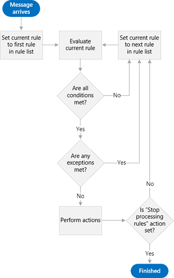
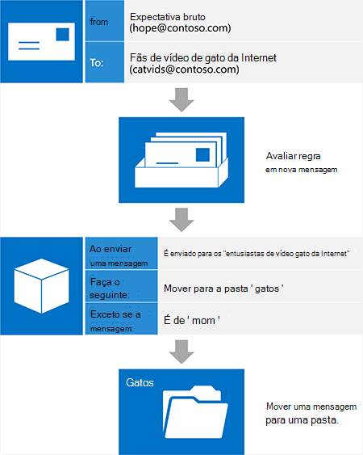

# Gerenciamento de caixa de entrada e EWS no ExchangeInbox management and EWS in Exchange

Descubra como você pode gerenciar sua caixa de entrada na sua API gerenciada de EWS ou aplicativos do EWS usando regras de caixa de entrada e a lista de remetentes bloqueados.Find out how you can manage your Inbox in your EWS Managed API or EWS application by using Inbox rules and the blocked senders list.
  
Caixas de correio do Exchange vêm equipadas com recursos para ajudar os usuários a organizar seus emails de entrada automaticamente.Exchange mailboxes come equipped with features to help users organize their incoming mail automatically. Todos esses recursos operam no servidor sem intervenção do usuário, mas eles atendem a diferentes necessidades.These features all operate on the server without user intervention, but they serve different needs. A API gerenciada de EWS e EWS fornecem acesso a esses recursos, permitindo que os usuários gerenciem suas caixas de entrada.The EWS Managed API and EWS provide access to these features, enabling your users to manage their Inboxes.
  
**Tabela 1. Recursos de gerenciamento de caixa de entrada****Table 1. Inbox management features**

|**Se você quiser …****If you want to…**|**Use …****Use…**|
|:-----|:-----|
|Ação de Take nas mensagens de entrada (por exemplo, movê-las para outra pasta ou excluí-los) com base em critérios específicos (por exemplo, remetente, o assunto ou anexos)Take action on incoming messages (such as moving them to another folder or deleting them) based on specific criteria (such as sender, subject, or attachments)    |Regras de caixa de entradaInbox rules    |
|Excluir todas as mensagens recebidas de um remetente específicoDelete all incoming mail from a particular sender    |Lista de remetentes bloqueadosBlocked Senders List    |
   
## Regras de caixa de entradaInbox rules

Analisando os fatos: não todas as mensagens de email são criadas iguais.Let's face it: not every email message is created equal. Para cada email que um usuário obtém do seu gerente, há um uma lista de distribuição de vídeo de gato Internet que ele ingressou anos atrás e nunca entendeu ao redor para sair.For every email a user gets from his or her manager, there's one from an Internet cat video distribution list he or she joined years ago and never got around to leaving. Vídeos do Internet cat são entretenimento, a quantidade de tráfego que obtém da lista de distribuição pode obter sai do controle e mensagens importantes facilmente pode ser perdida no excesso de email da lista de distribuição em uma caixa de entrada.While Internet cat videos are entertaining, the amount of traffic that distribution list gets can get out of hand, and important messages can easily be lost in the sea of distribution list mail in an Inbox. Muitos usuários ativar às regras de caixa de entrada para ajudar a diminuir a essas mensagens e faça um melhor local para ser de suas caixas de entrada.Many users turn to Inbox rules to help pare down those messages, and make their Inbox a much nicer place to be. Com o Exchange Web Services (EWS), seu aplicativo pode trazer o poder de regras de responsabilidade sua.With Exchange Web Services (EWS), your application can bring the power of rules to bear.
  
A API gerenciada de EWS fornece os métodos [ExchangeService.GetInboxRules](http://msdn.microsoft.com/en-us/library/microsoft.exchange.webservices.data.exchangeservice.getinboxrules%28v=exchg.80%29.aspx) e [ExchangeService.UpdateInboxRules](http://msdn.microsoft.com/en-us/library/microsoft.exchange.webservices.data.exchangeservice.updateinboxrules%28v=exchg.80%29.aspx) para trabalhar com as regras.The EWS Managed API provides the [ExchangeService.GetInboxRules](http://msdn.microsoft.com/en-us/library/microsoft.exchange.webservices.data.exchangeservice.getinboxrules%28v=exchg.80%29.aspx) and [ExchangeService.UpdateInboxRules](http://msdn.microsoft.com/en-us/library/microsoft.exchange.webservices.data.exchangeservice.updateinboxrules%28v=exchg.80%29.aspx) methods for working with rules. EWS fornece as operações de [GetInboxRules](http://msdn.microsoft.com/library/b4b2701a-4a23-4acc-8c75-19f7955ad7ae%28Office.15%29.aspx) e [UpdateInboxRules](http://msdn.microsoft.com/library/f982a237-471e-45c5-a2b5-468cfc53150b%28Office.15%29.aspx) para trabalhar com as regras.EWS provides the [GetInboxRules](http://msdn.microsoft.com/library/b4b2701a-4a23-4acc-8c75-19f7955ad7ae%28Office.15%29.aspx) and [UpdateInboxRules](http://msdn.microsoft.com/library/f982a237-471e-45c5-a2b5-468cfc53150b%28Office.15%29.aspx) operations for working with rules. No entanto, observe que o EWS Managed API e EWS ter as seguintes limitações ao trabalhar com as regras de caixa de entrada:However, note that the EWS Managed API and EWS have the following limitations when working with Inbox rules: 
  
- EWS não consigo acessar ou criar regras de "somente cliente" ou que são definidas no Outlook para executar "em somente este computador".EWS cannot access or create "client-only" rules or rules that are set in Outlook to run "on this computer only".
    
- Para alterar o conjunto atual de regras usando o EWS, você precisa remover as regras do Outlook BLOB, se ele estiver presente.To change the current set of rules by using EWS, you have to remove the Outlook rules BLOB, if it is present. Isso significa que o usando o EWS para modificar as regras exclui todas as regras que foram anteriormente desativadas (disabled) usando o Outlook.This means that using EWS to modify rules deletes any rules that were previously turned off (disabled) by using Outlook. 
    
### Como funcionam as regras?How do rules work?

O mecanismo de regras atua como um gatekeeper à caixa de correio do usuário.The rules engine acts as a gatekeeper to a user's mailbox. Como uma mensagem é recebida na caixa de correio do usuário, mas antes que a mensagem é exibida na caixa de entrada, a mensagem é avaliada em relação a uma lista ordenada de regras.As a message arrives in the user's mailbox, but before the message appears in the Inbox, that message is evaluated against an ordered list of rules. Observe que isso ocorre apenas a hora de chegada e somente na caixa de entrada.Note that this only occurs at arrival time, and only in the Inbox. Essas regras são compostas de três partes: [condições](#bk_Conditions), [exceções](#bk_Exceptions)e [ações](#bk_Actions).These rules are comprised of three parts: [Conditions](#bk_Conditions), [Actions](#bk_Actions), and [Exceptions](#bk_Exceptions).
  
O mecanismo de regras começando com a regra na parte superior da lista de regras, executa as seguintes etapas até alcançar o final da lista de regras:Starting with the rule at the top of the rule list, the rules engine performs the following steps until it reaches the end of the list of rules:
  
1. Verifica a mensagem para determinar se ele atende a todas as condições especificadas na regra.Checks the message to determine whether it meets all the conditions specified in the rule.
    
1. Se ela atender a todas as condições, avaliação continua com a etapa 2.If it meets all the conditions, evaluation continues with step 2.
    
2. Se ele não atender a todas as condições, o mecanismo de regras carrega a próxima regra na lista de regras e inicia novamente na etapa 1.If it does not meet all the conditions, the rules engine loads the next rule in the rule list and starts over at step 1.
    
2. Verifica a mensagem para determinar se ele atende a qualquer uma das exceções especificadas na regra.Checks the message to determine whether it meets any of the exceptions specified in the rule.
    
1. Se ela atender a qualquer uma das exceções, o mecanismo de regras carrega a próxima regra na lista de regras e inicia novamente na etapa 1.If it meets any of the exceptions, the rules engine loads the next rule in the rule list and starts over at step 1.
    
2. Se qualquer uma das exceções não atender, avaliação continua com a etapa 3.If it does not meet any of the exceptions, evaluation continues with step 3.
    
3. Executa as ações especificadas na regra na mensagem.Performs the actions specified in the rule on the message.
    
1. Se a ação de "parar o processamento de mais regras" for especificada, o mecanismo de regras executa todas as ações na mensagem e sai sem avaliar quaisquer regras adicionais em relação a mensagem.If the "stop processing more rules" action is specified, the rules engine performs all the other actions on the message, then exits without evaluating any additional rules against the message.
    
2. Se a ação de "parar o processamento de mais regras" não for especificada, o mecanismo de regras carrega a próxima regra na lista de regras e inicia novamente na etapa 1.If the "stop processing more rules" action is not specified, the rules engine loads the next rule in the rule list and starts over at step 1.
    
A figura a seguir mostra o processo que o mecanismo de regras segue.The following figure shows the process that the rules engine follows.
  
**Figura 1: Visão geral mecanismo de regras****Figure 1: Rules engine overview**

  
### Juntando as partes - partes de uma regraPutting the pieces together - parts of a rule

Imagine que você está concedendo instruções para alguém que estiver designado para organizar seu email de entrada é uma maneira de visualizar as partes de uma regra.One way to visualize the parts of a rule is to imagine that you are giving instructions to someone who is tasked with organizing your incoming email. Você pode dizer para essa pessoa: "quando uma mensagem que chega \<inserir condições aqui\>, faça \<inserir aqui ações\>, a menos que a mensagem \<inserir aqui para exceções\>.You might say to this person: "When a message arrives that \<insert conditions here\>, do \<insert actions here\>, unless the message \<insert exceptions here\>. Vamos examinar mais detalhadamente cada parte.Let's take a closer look at each part.
  
#### CondiçõesConditions

[Condições](http://msdn.microsoft.com/library/f049a48c-9585-43f7-8549-0b8cb19a5eea%28Office.15%29.aspx) descrevem quando uma regra deve ser aplicada.[Conditions](http://msdn.microsoft.com/library/f049a48c-9585-43f7-8549-0b8cb19a5eea%28Office.15%29.aspx) describe when a rule should be applied. Enquanto você pode omitir as condições de uma regra (resultando em uma regra que se aplica a todas as mensagens recebidas), é muito mais comum para regras ter condições que se aplicam a um subconjunto de mensagens de entrada.While you can omit the conditions of a rule (resulting in a rule that applies to every message received), it is far more common for rules to have conditions that apply to a subset of incoming messages. Alguns exemplos são "quando uma mensagem é de Sadie" ou "quando uma mensagem é enviada à lista de distribuição 'Cat vídeo amantes'".Some examples are "when a message is from Sadie" or "when a message is sent to the 'Cat Video Lovers' distribution list". Regras podem ter várias condições.Rules can have multiple conditions. Quando as regras tem mais de uma condição, todas as condições devem ser atendidas para que o mecanismo de regras executar a ação especificada.When rules have more than one condition, all the conditions must be met in order for the rules engine to take the specified action. 
  
#### AçõesActions

[Ações](http://msdn.microsoft.com/library/c5aa96b1-2d8b-422f-8c2f-f118572ab23f%28Office.15%29.aspx) descrevem o que acontece quando uma regra se aplica.[Actions](http://msdn.microsoft.com/library/c5aa96b1-2d8b-422f-8c2f-f118572ab23f%28Office.15%29.aspx) describe what happens when a rule applies. Exemplos são "mover a mensagem para a pasta 'Gatos'" ou "marcar a mensagem com prioridade 'Baixa'".Examples are "move the message to the 'Cats' folder" or "mark the message with 'Low' importance". Regras podem ter várias ações.Rules can have multiple actions. Quando você especificar várias ações para uma regra, todas as ações são executadas quando a regra é aplicada.When you specify multiple actions for a rule, all the actions are performed when the rule is applied. 
  
#### ExceçõesExceptions

[Exceções](http://msdn.microsoft.com/library/7cd63ac2-3441-4ed4-915b-6f90af4b28fc%28Office.15%29.aspx) descrevem quando não deve ser aplicadas a uma regra, mesmo se os critérios especificados nas condições forem atendidos.[Exceptions](http://msdn.microsoft.com/library/7cd63ac2-3441-4ed4-915b-6f90af4b28fc%28Office.15%29.aspx) describe when a rule should not apply, even if the criteria specified in the conditions are met. Exemplos são ", exceto se a mensagem é enviada somente para mim" ou ", exceto se a mensagem for de Mom".Examples are "except if the message is sent only to me" or "except if the message is from Mom". Uma regra pode ter várias exceções.A rule can have multiple exceptions. Quando as regras têm mais de uma exceção e qualquer uma das exceções forem atendidas, a regra não é aplicada.When rules have more than one exception, and any of the exceptions are met, the rule is not applied. 
  
### Exemplo: Herding esses gatosExample: Herding those cats

Vamos dar uma olhada em como seus usuários podem usar as regras para eliminar o tráfego dessa lista de distribuição de vídeo de gato de Internet.Let's take a look at how your users can use rules to eliminate the traffic from that Internet cat video distribution list. Vamos pressupor o seguinte:Let's assume the following:
  
- Essas mensagens são enviadas para uma lista de distribuição chamada "Internet entusiastas de vídeo de gato".These messages are sent to a distribution list called "Internet Cat Video Enthusiasts".
    
- Seus usuários desejam ler essas mensagens eventualmente, elas simplesmente não desejam que elas congestionar suas caixas de entrada.Your users want to read these messages eventually, they just don't want them cluttering their Inbox. Em vez disso, eles seriam arquivá-las em uma pasta chamada "Gatos".They'd rather file them in a folder called "Cats".
    
- Os usuários desejam ler as mensagens enviadas para essa lista de distribuição por seu mãe imediatamente, pois Mom envia os vídeos funniest.Your users want to read messages sent to this distribution list by their mother right away, because Mom sends the funniest videos.
    
Isso instrui o mecanismo de regras a seguir: "quando uma mensagem é recebida ou seja enviada à lista de distribuição 'Internet Cat vídeo entusiastas', movê-lo para a pasta 'Gatos', a menos que a mensagem é de Mom."This tells the rules engine the following: "When a message arrives that is sent to the 'Internet Cat Video Enthusiasts' distribution list, move it to the 'Cats' folder, unless the message is from Mom." 
  
**Tabela 2. Definição de regra****Table 2. Rule definition**

|**Parte da regra****Rule part**|**Valor****Value**|
|:-----|:-----|
|CondiçõesConditions    |Enviado à lista de distribuição 'Internet Cat vídeo entusiastas'Sent to the 'Internet Cat Video Enthusiasts' distribution list    |
|AçõesActions    |Move a mensagem para a pasta 'Gatos'Move the message to the 'Cats' folder    E parar o processamento de mais regrasAND stop processing more rules    |
|ExceçõesExceptions    |A partir de 'Mom'From 'Mom'    |
   
> [!NOTE]
> Observe que "parar o processamento de mais regras" é uma das ações na regra resultante.Notice that "stop processing more rules" is one of the actions in the resulting rule. Em geral é uma boa ideia incluir essa ação para evitar a confusão sobre quais regras de atuam em qualquer mensagem de determinado.In general it's a good idea to include this action to avoid confusion over which rules act on any given message. No entanto, ao omitir esta ação e ordenação corretamente suas regras, é possível conseguir processamento mais avançado de seu email de entrada.However, by omitting this action and properly ordering your rules, you can achieve more advanced processing of your incoming mail. Nesse caso, provavelmente é uma opção de segura que mensagens de vídeo de gato da Internet não exigem muita no caminho de processamento avançado.In this case, it's probably a safe bet that Internet cat video messages don't require much in the way of advanced processing. 
  
Logo depois de criar esta regra, uma nova mensagem vem em.Shortly after creating this rule, a new message comes in. Uma colega de trabalho espero envia uma mensagem à lista de distribuição.A coworker Hope sends a message to the distribution list. Se mentalmente executamos o trabalho do mecanismo de regras, a mensagem atenda a todas as condições (é enviada para 'Internet Cat vídeos entusiastas') e ela atende a nenhuma das exceções (não é de 'Mom'), então a regra será aplicada e a mensagem obtém movida para a pasta 'Gatos'.If we mentally perform the work of the rules engine, the message meets all the conditions (it is sent to 'Internet Cat Videos Enthusiasts'), and it meets none of the exceptions (it isn't from 'Mom'), so the rule applies and the message gets moved to the 'Cats' folder.
  
A figura a seguir mostra como a regra é aplicada a uma mensagem de email de entrada.The following figure shows how the rule is applied to an incoming mail message.
  
**Figura 2. Mensagem de entrada é processada por uma regra****Figure 2. Incoming message is processed by a rule**

  
## Bloquear remetentesBlocking senders

Embora você possa criar uma regra que moverá todas as mensagens de um remetente específico para a pasta Lixo eletrônico, você também pode fazer isso usando a lista de remetentes bloqueados em suas opções de lixo eletrônico.Although you can create a rule that will move all mail from a specific sender to the Junk Mail folder, you can also do this by using the Blocked Senders List in your Junk Email options. Como não há um limite para quantos regras que um usuário pode ter, faz sentido usar a lista de remetentes bloqueados.Because there is a limit to how many rules a user can have, it makes sense to use the Blocked Senders List. Você pode [Adicionar ou remover os endereços de email específicos da lista de remetentes bloqueados](how-to-add-and-remove-email-addresses-from-blocked-senders-list-by-using-ews.md) usando o método de API gerenciada de EWS [ExchangeService.MarkAsJunk](http://msdn.microsoft.com/en-us/library/microsoft.exchange.webservices.data.exchangeservice.markasjunk%28v=exchg.80%29.aspx) ou a operação de EWS [MarkAsJunk](http://msdn.microsoft.com/library/1f71f04d-56a9-4fee-a4e7-d1034438329e%28Office.15%29.aspx) .You can [add or remove specific email addresses from the Blocked Senders List](how-to-add-and-remove-email-addresses-from-blocked-senders-list-by-using-ews.md) by using the [ExchangeService.MarkAsJunk](http://msdn.microsoft.com/en-us/library/microsoft.exchange.webservices.data.exchangeservice.markasjunk%28v=exchg.80%29.aspx) EWS Managed API method or the [MarkAsJunk](http://msdn.microsoft.com/library/1f71f04d-56a9-4fee-a4e7-d1034438329e%28Office.15%29.aspx) EWS operation. Observe que, na ordem para o EWS acessar a lista de remetentes bloqueados, caixa de correio do usuário deve conter uma mensagem de email a partir do endereço de email que você deseja adicionar ou remover.Note that in order for EWS to access the Blocked Senders List, the user's mailbox must contain an email message from the email address that you want to add or remove. 
  
## Nesta seçãoIn this section

- [Gerenciar regras de caixa de entrada usando o EWS no ExchangeManage Inbox rules by using EWS in Exchange](how-to-manage-inbox-rules-by-using-ews-in-exchange.md)
    
- [Adicionar e remover os endereços de email da lista de remetentes bloqueados usando o EWS no ExchangeAdd and remove email addresses from the Blocked Senders List by using EWS in Exchange](how-to-add-and-remove-email-addresses-from-blocked-senders-list-by-using-ews.md)
    
## Confira tambémSee also

- [Develop web service clients for ExchangeDevelop web service clients for Exchange](develop-web-service-clients-for-exchange.md)
    
- [Operação GetInboxRulesGetInboxRules operation](http://msdn.microsoft.com/library/b4b2701a-4a23-4acc-8c75-19f7955ad7ae%28Office.15%29.aspx)
    
- [Operação UpdateInboxRulesUpdateInboxRules operation](http://msdn.microsoft.com/library/f982a237-471e-45c5-a2b5-468cfc53150b%28Office.15%29.aspx)
    
- [Operação MarkAsJunkMarkAsJunk operation](http://msdn.microsoft.com/library/1f71f04d-56a9-4fee-a4e7-d1034438329e%28Office.15%29.aspx)
    

