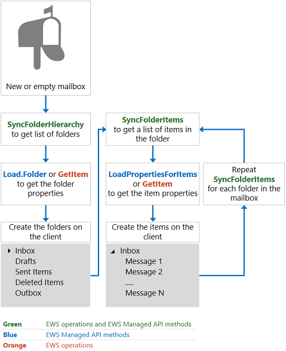
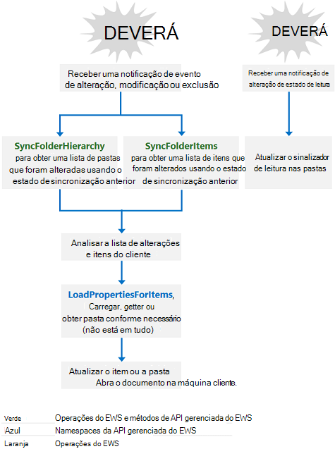

# Sincronização de caixa de correio e EWS no Exchange

Descubra como funciona a sincronização de caixa de correio quando você usa o EWS para acessar o Exchange.
  
O EWS no Exchange usa dois tipos de sincronização para recuperar o conteúdo da caixa de correio e as alterações no conteúdo da caixa de correio:
  
- Sincronização de pastas
    
- Sincronização de item
    
Neste artigo, você aprenderá sobre ambos os tipos de sincronização, como a sincronização funciona, padrões de design de sincronização e práticas recomendadas de sincronização.
  
## Sincronização de pasta e item

A sincronização de pastas sincroniza uma estrutura de pastas ou uma hierarquia de pastas. A sincronização de itens sincroniza os itens em uma pasta. Ao sincronizar itens, você precisa sincronizar cada pasta da caixa de correio de forma independente. Você pode usar o EWS ou a API gerenciada do EWS em seu aplicativo para implementar a sincronização de pastas e de itens.
  
**Tabela 1. Operações do EWS e métodos da API gerenciada do EWS para sincronizar pastas e itens**

|**Operação do EWS**|**Método de API gerenciada do EWS**|
|:-----|:-----|
|[SyncFolderHierarchy](https://msdn.microsoft.com/library/b31916b1-bc6c-4451-a475-b7c5417f752d%28Office.15%29.aspx)   |[Método ExchangeService. SyncFolderHierarchy](https://msdn.microsoft.com/library/microsoft.exchange.webservices.data.exchangeservice.syncfolderhierarchy%28v=exchg.80%29.aspx)   |
|[SyncFolderItems](https://msdn.microsoft.com/library/7f0de089-8876-47ec-a871-df118ceae75d%28Office.15%29.aspx)   |[Método ExchangeService. SyncFolderItems](https://msdn.microsoft.com/library/microsoft.exchange.webservices.data.exchangeservice.syncfolderitems%28v=exchg.80%29.aspx)   |
   
O escopo da sincronização que ocorre difere dependendo se é uma sincronização inicial ou contínua, da seguinte maneira:
  
- Uma sincronização inicial sincroniza todas as pastas ou itens no servidor com o cliente. Após a sincronização inicial, o cliente tem um estado de sincronização que armazena para sincronizações futuras. O estado de sincronização representa todas as alterações no servidor que o servidor comunica para o cliente.
    
- As sincronizações contínuas sincronizam quaisquer itens ou pastas que foram adicionados, excluídos ou alterados desde a sincronização anterior. O servidor usa o estado de sincronização para calcular as alterações a serem relatadas no cliente durante cada um dos loops de sincronização em andamento.
    
Cada método de sincronização ou operação retorna uma lista de alterações, não a pasta ou a mensagem real que foi alterada. As alterações em itens e pastas são relatadas por meio dos seguintes tipos de alteração:
  
- Criar — indica que um novo item ou pasta deve ser criado no cliente.
    
- Atualização — indica que um item ou pasta deve ser alterado no cliente.
    
- Excluir — indica que um item ou pasta deve ser excluído no cliente.
    
- ReadStateChange para EWS ou ReadFlagChange para a API gerenciada do EWS — indica que o estado de leitura do item foi alterado, de não lido para leitura ou leitura para não lido.
    
No Exchange Online, Exchange Online como parte do Office 365 e versões do Exchange a partir do Exchange 2010 SP2, os itens e pastas são retornados na ordem do mais recente para o mais antigo. Nas versões anteriores do Exchange, os itens e pastas são retornados do mais antigo para o mais recente.
  
## Como a sincronização do EWS funciona?

Em resumo, se você estiver sincronizando uma caixa de correio pela primeira vez, use o processo, conforme mostrado na Figura 1. Embora você possa usar outros [padrões de design de sincronização](mailbox-synchronization-and-ews-in-exchange.md#bk_syncpatterns), recomendamos essa abordagem para aplicativos escaláveis.
  
**Figura 1. Padrão de design da sincronização inicial**

  
Se você estiver usando um estado de sincronização existente no cliente para sincronizar uma caixa de correio, recomendamos que você implemente o padrão de design, conforme mostrado na Figura 2. 
  
**Figura 2. Padrão de design de sincronização em andamento**

  
## Padrões de design de sincronização

Você pode usar um dos dois padrões de design de sincronização em seu aplicativo para manter suas caixas de correio atualizadas: sincronização baseada em notificação ou a abordagem somente sincronização.
  
A sincronização baseada em notificação, conforme ilustrado na [Figura 2](mailbox-synchronization-and-ews-in-exchange.md#bk_howdoesitwork), depende de notificações para alertar o cliente para fazer uma chamada para os métodos [SyncFolderItems](https://msdn.microsoft.com/library/microsoft.exchange.webservices.data.exchangeservice.syncfolderitems%28v=exchg.80%29.aspx) ou [SyncFolderHierarchy](https://msdn.microsoft.com/library/microsoft.exchange.webservices.data.exchangeservice.syncfolderhierarchy%28v=exchg.80%29.aspx) da API gerenciada do EWS ou para as operações do EWS [SyncFolderHierarchy](https://msdn.microsoft.com/library/b31916b1-bc6c-4451-a475-b7c5417f752d%28Office.15%29.aspx) ou do [SyncFolderItems](https://msdn.microsoft.com/library/7f0de089-8876-47ec-a871-df118ceae75d%28Office.15%29.aspx) . Esse tipo de sincronização geralmente é recomendado para aplicativos escalonáveis, mas pode não ser a melhor abordagem para todos. A sincronização baseada em notificação tem as seguintes vantagens: 
  
- As notificações são otimizadas para reduzir as chamadas para o banco de dados back-end do Exchange. As filas de eventos e as assinaturas são gerenciadas pelo servidor de caixa de correio (ou pelo servidor de acesso para cliente no Exchange 2010 e no Exchange 2007); no entanto, o gerenciamento de eventos e assinaturas usa menos recursos do que a alternativa, que é mais frequente nas chamadas de sincronização para o banco de dados do Exchange. Além disso, o Exchange tem [políticas de limitação](ews-throttling-in-exchange.md) específicas para notificações e assinaturas, para proteger o consumo de recursos. 
    
No entanto, há também algumas desvantagens em usar a sincronização baseada em notificação:
  
- As notificações são ruidosas porque a maioria dos cenários envolve várias notificações para uma tentativa de usuário. Isso se aplica especialmente à pasta calendário. Por exemplo, quando uma única solicitação de reunião é recebida, várias notificações de item e pasta são criadas, incluindo uma notificação para criar o item e outra para modificar o item. Uma maneira de reduzir essa desvantagem é criar um atraso de alguns segundos em sua [carga](https://msdn.microsoft.com/library/microsoft.exchange.webservices.data.serviceobject.load%28v=exchg.80%29.aspx), [LoadPropertiesForItems](https://msdn.microsoft.com/library/microsoft.exchange.webservices.data.exchangeservice.loadpropertiesforitems%28v=exchg.80%29.aspx), [GetItem](https://msdn.microsoft.com/library/exchange/aa565934%28v=exchg.150%29.aspx.aspx)ou chamada [GetFolder](https://msdn.microsoft.com/library/exchange/aa580274%28v=exchg.150%29.aspx.aspx) . No caso de uma solicitação de reunião, se você tiver feito chamadas para a operação **GetItem** imediatamente, poderá ter uma chamada para criar o item e outra para modificar o item. Em vez disso, ao atrasar a chamada, você pode chamar a operação **GetItem** uma vez e obter as alterações que abrangem a criação e a modificação do item ao mesmo tempo. 
    
- As notificações são enfileiradas no servidor de caixa de correio e as assinaturas são salvas no servidor de caixa de correio. Se o servidor de caixa de correio que gerencia a assinatura não estiver disponível, você perderá as novas notificações, sua caixa de correio não sincronizará e você terá que reinscrever-se nas notificações.
    
- Você precisará planejar estratégias de mitigação no caso de falha na notificação. Dessa forma, a segunda abordagem, o padrão de design somente de sincronização, é mais resiliente que a sincronização baseada em notificação, pois só exige que o cliente Mantenha o estado de sincronização, não há problemas com a afinidade com o servidor de caixa de correio Gerenciando a assinatura.
    
Se implementado conforme recomendado, o padrão de design da assinatura baseada em notificação se baseia em: 
  
- Notificações para determinar *quando* os dados foram alterados. 
    
- Os métodos **SyncFolderHierarchy** ou **SyncFolderItems** da API gerenciada do EWS ou as operações do EWS **SyncFolderHierarchy** ou do **SyncFolderItems** para determinar *o que* foi alterado, otimizando o número de eventos de sincronização retornados. Um novo item foi criado, atualizado ou excluído? Isso é tudo o que você precisa saber desses métodos, não confie neles para a lista de propriedades das alterações. (Não faça uma chamada **GetItem** ou **LoadPropertiesForItems** em todos os itens ou pastas retornados). 
    
- Usando os métodos **Load** ou **LoadPropertiesForItems** na API gerenciada do EWS, ou a operação do EWS **GetItem** para determinar *como* os dados foram alterados e para recuperar as propriedades do servidor conforme necessário, organizar as solicitações em lote com base na quantidade de dados que será retornado. Isso é seguido por uma comparação das propriedades no cliente e aquelas que simplesmente retornam do servidor e, por fim, a criação, a exclusão ou a modificação do item ou pasta no cliente. 
    
A abordagem somente sincronização depende inteiramente dos métodos da API gerenciada do **SyncFolderItems** e do **SyncFolderHierarchy** EWS, ou das operações **SyncFolderHierarchy** ou **SyncFolderItems** do EWS, que podem ser chamadas continuamente ou como um evento com tempo. Também há prós e contras para essa opção. A abordagem somente sincronização é mais resistente porque o estado de sincronização é armazenado no nível da caixa de correio no cliente e um relacionamento exclusivo entre o estado de sincronização e qualquer servidor de caixa de correio que mantém a assinatura de notificação não é necessário. A abordagem de sincronização pode sobreviver a um failover de caixa de correio devido à sua independência do servidor de caixa de correio. No entanto, a abordagem de sincronização aumenta a latência do usuário, pois os itens são sincronizados em tempo hábil ou intermitentes, não em tempo real quando os itens chegam. Essa abordagem também é mais cara, porque você está fazendo chamadas para o banco de dados do Exchange quando é possível que nenhuma alteração tenha ocorrido. 
  
## Práticas recomendadas de sincronização

Para aplicativos altamente escaláveis, recomendamos que você aplique as seguintes práticas recomendadas para sincronizar caixas de correio em seu aplicativo:
  
- Ao chamar o método **SyncFolderItems** ou **SyncFolderHierarchy** da API gerenciada do EWS, use o valor _IdOnly_ para o parâmetro _PropertySet_ , ou ao usar as operações EWS **SyncFolderHierarchy** ou **SyncFolderItems** use o valor **IdOnly** para o valor [BaseShape](https://msdn.microsoft.com/library/42c04f3b-abaa-4197-a3d6-d21677ffb1c0%28Office.15%29.aspx) para reduzir as chamadas para o banco de dados do Exchange. Quanto mais propriedades você solicitar no conjunto de propriedades da chamada **SyncFolderItems** ou **SyncFolderHierarchy** , mais chamadas de backend serão criadas. Uma nova chamada RPC é feita para todos os valores de propriedade solicitados, enquanto apenas uma chamada RPC é feita para recuperar todos os **ItemIds** de uma solicitação, não importa o número de resultados a serem relatados. Portanto, uma solicitação **IdOnly** resulta em uma chamada de banco de dados, enquanto uma solicitação de conjunto de propriedades para o assunto e o remetente resulta em três chamadas de banco de dados: uma para o **assunto**, uma para o **remetente**e outra para o **ItemId**.
    
- Não chame o EWS **Managed API ou** os métodos **LoadPropertiesForItems** , ou as operações EWS **GetItem** ou **GetFolder** , em todos os itens em uma resposta de sincronização. Em vez disso, analise os resultados; Procure alterações que não exijam que todas as propriedades sejam recuperadas, como as alterações no estado de leitura. Se uma resposta incluir uma alteração no estado de leitura, basta atualizar o sinalizador no cliente e você concluiu; Não é necessário obter todas as propriedades do item. E certifique-se de não duplicar o esforço fazendo alterações originadas do mesmo cliente. Por exemplo, se a resposta de sincronização inclui a exclusão de um item e a exclusão ocorreu no cliente local, você não precisa excluir a mensagem novamente ou obter todas as propriedades desse item. 
    
- Evite ficar limitado, fazendo o seguinte:
    
  - Quando você chamar o método **LoadPropertiesForItems** da API gerenciada do EWS ou a operação do EWS **GetItem** para obter os itens em um lote, não faça o lote de itens em excesso na sua solicitação; caso contrário, você pode ter [limitado](ews-throttling-in-exchange.md). Recomendamos que você inclua 10 itens por lote.
    
  - Não faça muitas solicitações por um tempo muito curto. Isso também causará limitação e aumentará o tempo de resposta, em vez de reduzi-lo. 
    
  - Se você estiver em lotes, todos os itens com os mesmos valores para os atributos **ID** e **ChangeKey** do elemento [FolderId](https://msdn.microsoft.com/library/00d14e3e-4365-4f21-8f88-eaeea73b9bf7%28Office.15%29.aspx) serão incluídos em lote. 
    
  - Se você ficar limitado, interrompa o envio de solicitações. Reenviar solicitações prolongará o esforço de recuperação. Em vez disso, aguarde o tempo de desativação para expirar e tente enviar novamente as solicitações de sincronização.
    
- Dependendo do tipo de evento de [notificação](notification-subscriptions-mailbox-events-and-ews-in-exchange.md#bk_eventtypes) recebido: 
    
  - Para eventos **NewMail** ou **modificados** , chame o método **SyncFolderItems** da API gerenciada do EWS ou a operação do EWS **SyncFolderItems** porque as notificações não fornecem um **ChangeKey**e as notificações não chamam as alterações de estado de leitura.
    
  - Para eventos **excluídos** , se a assinatura de notificação estava ativa antes da sincronização anterior, basta excluir o evento localmente. Você não precisa chamar o método **SyncFolderItems** da API gerenciada do EWS ou a operação do EWS **SyncFolderItems** imediatamente após a exclusão. 
    
  - Se um evento **modificado** foi causado por uma alteração no estado de leitura, não chame o método **LoadPropertiesForItems** da API gerenciada do EWS ou a operação do EWS **GetItem** , basta alterar o sinalizador no item. 
    
- Ao sincronizar dados de calendário, prossiga da seguinte maneira:
    
  - Use uma abordagem semelhante à sincronização baseada em notificação. Como o **SyncFolderItem** não inclui nenhuma lógica de calendário, use o método [FindAppointments](https://msdn.microsoft.com/library/dd633767%28v=exchg.80%29.aspx) da API gerenciada do EWS ou a [operação EWS FindItem](https://msdn.microsoft.com/library/ebad6aae-16e7-44de-ae63-a95b24539729%28Office.15%29.aspx) com o elemento [CalendarView](https://msdn.microsoft.com/library/a4a953b8-0710-416c-95ef-59e51eba9982%28Office.15%29.aspx) para exibir compromissos entre duas datas e, em seguida, chamar o método **LoadPropertiesForItems** da API gerenciada do EWS ou a operação do EWS **GetItem** para recuperar as propriedades do item do calendário. 
    
  - Não sondar usando o método **FindAppointments** da API gerenciada do EWS ou a operação do EWS **FindItem** com um elemento **CalendarView** . 
    
- Ao sincronizar pastas de pesquisa:
    
  - Use uma abordagem semelhante à sincronização baseada em notificação. 
    
  - Use notificações para determinar quando os dados são alterados.
    
  - Como não é possível usar o **SyncFolderItem** em uma pasta de pesquisa, use um método [FindItems](https://msdn.microsoft.com/library/microsoft.exchange.webservices.data.exchangeservice.finditems%28v=exchg.80%29.aspx) de API gerenciada do EWS e de uma página, ou a operação do EWS **FindItem** com o elemento [FractionalPageItemView](https://msdn.microsoft.com/library/4111afec-35e7-4c6f-b291-9bbba603f633%28Office.15%29.aspx) e [SortOrder](https://msdn.microsoft.com/library/c2413f0b-8c03-46ae-9990-13338b3c53a6%28Office.15%29.aspx) definido, para determinar o que foi alterado. 
    
  - Use o método **LoadPropertiesForItems** da API gerenciada do EWS ou a operação do EWS **GetItem** para recuperar dados. 
    
## Sincronização filtrada

O método **SyncFolderItems** da API gerenciada do EWS e a operação do EWS **SyncFolderItems** permitem que você ignore itens específicos, com base em seus ItemIds, definindo o parâmetro _ignoreItemIds_ na API gerenciada do EWS ou o elemento [ignore](https://msdn.microsoft.com/library/7789eec5-ceec-43f2-84d5-d0d15b734076%28Office.15%29.aspx) no EWS. Isso é ideal quando, por exemplo, as pessoas começam a responder a todos para uma mensagem de email enviada para todos na empresa. 
  
Você pode estar imaginando, posso filtrar minhas notificações (e, portanto, apenas acionar a sincronização) se as propriedades específicas forem alteradas? Embora isso pareça razoável, porque as assinaturas de notificação são baseadas no tipo de alteração (criar, atualizar, excluir) e não na propriedade que está sendo atualizada, você não pode filtrar notificações dessa forma. Em vez disso, você pode fazer o seguinte:
  
- Use o padrão de design de assinatura baseado em notificação.
    
- Chame os métodos **SyncFolderItems** e **SyncFolderHierarchy** da API gerenciada do EWS repetidamente com o parâmetro _PropertySet_ definido como _IdOnly_ para tornar o estado de sincronização atual. Ou se estiver usando o EWS, chame as operações **SyncFolderHierarchy** e **SyncFolderItems** repetidamente com o valor **BaseShape** definido como **IdOnly**. 
    
- Descartar a resposta (não analisá-la ou fazer qualquer comparação de propriedade).
    
- Use o método **FindItems** da API gerenciada do EWS ou a operação do EWS **FindItem** e classifique e a página para preencher previamente os itens no escopo filtrado que você se preocupa. 
    
- Use seu estado de sincronização para continuar a chamar o método **SyncFolderItems** da API gerenciada do EWS ou a operação do EWS **SyncFolderItems** , mas apenas monitorar as alterações no conjunto de itens filtrados. Se novos itens forem criados, você terá que ver se os novos itens estão dentro do seu escopo filtrado. 
    
## Nesta seção

- [Sincronizar pastas usando o EWS no Exchange](how-to-synchronize-folders-by-using-ews-in-exchange.md)
    
- [Sincronizar itens usando o EWS no Exchange](how-to-synchronize-items-by-using-ews-in-exchange.md)
    
- [Como lidar com erros relacionados à sincronização no EWS no Exchange](handling-synchronization-related-errors-in-ews-in-exchange.md)
    
## Confira também

- [Develop web service clients for Exchange](develop-web-service-clients-for-exchange.md)
    
- [Método SyncFolderItems](https://msdn.microsoft.com/library/microsoft.exchange.webservices.data.exchangeservice.syncfolderitems%28v=exchg.80%29.aspx)
    
- [Método SyncFolderHierarchy](https://msdn.microsoft.com/library/microsoft.exchange.webservices.data.exchangeservice.syncfolderhierarchy%28v=exchg.80%29.aspx)
    
- [Operação SyncFolderHierarchy](https://msdn.microsoft.com/library/b31916b1-bc6c-4451-a475-b7c5417f752d%28Office.15%29.aspx)
    
- [Operação SyncFolderItems](https://msdn.microsoft.com/library/7f0de089-8876-47ec-a871-df118ceae75d%28Office.15%29.aspx)
    

