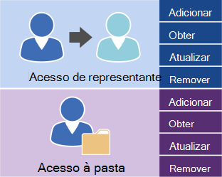

# Gerenciando o acesso do usuário usando o EWS no Exchange

Descubra quais são as opções de gerenciamento de acesso à conta de usuário para o seu servidor Exchange.
  
Os serviços Web do Exchange (EWS) e a API gerenciada do EWS fornecem um número limitado de operações que você pode usar para gerenciar contas no Exchange Online, o Exchange Online como parte do Office 365 ou uma versão do Exchange a partir do Exchange 2013. Você pode usar as operações mostradas na figura a seguir para gerenciar representantes e definir permissões de acesso de pasta para outras contas. 
  
**Operações do EWS para acesso de representante e pasta**

  
Se seu aplicativo precisar de controle adicional sobre as contas em um servidor do Exchange, você pode usar os cmdlets do Shell de gerenciamento do Exchange para gerenciar as contas. Você pode chamar os cmdlets do Shell de gerenciamento do Exchange executando um dos seguintes procedimentos:
  
- Escrever um aplicativo usando C# ou Visual Basic que chama os cmdlets do Shell de gerenciamento do Exchange. Você pode examinar o código de exemplo na [documentação da API do Shell de gerenciamento do Exchange](../management/exchange-management-shell.md) para saber como chamar um cmdlet. 
    
- Usando os scripts do Windows PowerShell e do Windows PowerShell para chamar os cmdlets do Shell de gerenciamento do Exchange. Você pode encontrar uma lista completa do [PowerShell do Exchange Server (Shell de gerenciamento do Exchange)](https://docs.microsoft.com/powershell/exchange/exchange-server/exchange-management-shell?view=exchange-ps), juntamente com exemplos que mostram como usá-los. 
    
## Também consulte

- [Configurando o aplicativo EWS](setting-up-your-ews-application.md)   
- [Cmdlets do Exchange 2013](https://docs.microsoft.com/powershell/exchange/?view=exchange-ps)  
    

