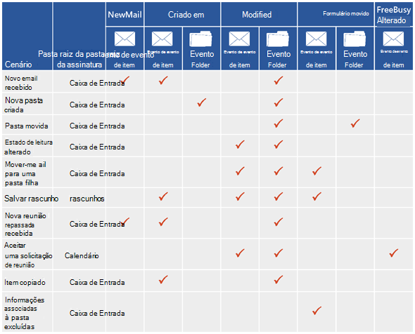
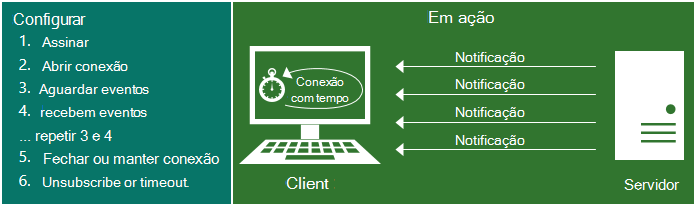
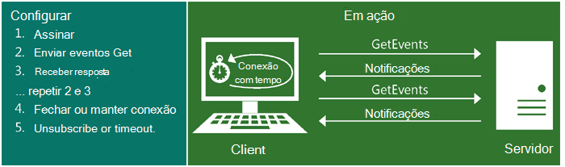
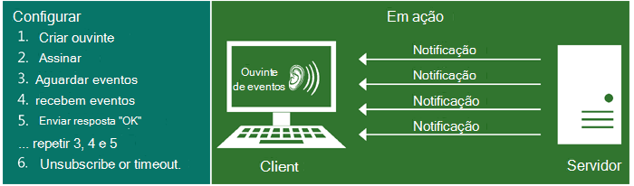

# Inscrições de notificação, eventos de caixa de correio e EWS no ExchangeNotification subscriptions, mailbox events, and EWS in Exchange

Saiba mais sobre inscrições de notificação e evento de caixa de correio no EWS no Exchange.Find out about notification subscriptions and mailbox event in EWS in Exchange.
  
Você pode usar a API gerenciada de EWS e os serviços Web do Exchange (EWS) para inscrever-se para receber notificações quando ocorrem eventos em uma caixa de correio ou em uma ou mais das pastas em uma caixa de correio.You can use both the EWS Managed API and Exchange Web Services (EWS) to subscribe to receive notifications when events occur in a mailbox, or in one or more of the folders in a mailbox. Existem três tipos de assinatura: streaming notificações, recebam notificações e notificações de push.Three subscription types are available: streaming notifications, pull notifications, and push notifications. Cada um desses tipos de assinatura usa diferentes técnicas para receber ou recuperar as notificações.Each of these subscription types uses different techniques to receive or retrieve the notifications.
  
## Obtendo notificações - quais são minhas opções?Getting notifications - what are my options?

EWS inclui três tipos de assinatura que funcionam de forma independente para notificar o cliente de alterações no servidor.EWS includes three subscription types that work independently to notify the client of changes on the server. Não importa qual tipo de assinatura que você escolher, você vai têm acesso a todos os mesmos eventos de notificação no final - é apenas uma questão de como conectá-los.No matter which subscription type you choose, you'll have access to all the same notification events in the end - it's just a matter of how you get them.
  
**Tabela 1. Tipos de assinatura****Table 1. Subscription types**

|**Opção****Option**|**Descrição****Description**|**É certo para mim?****Is it right for me?**|
|:-----|:-----|:-----|
|Notificações de fluxo contínuoStreaming notifications    |Notificações enviadas pelo servidor por meio de uma conexão que permanece aberta por um período de tempo especificado.Notifications that are sent by the server through a connection that remains open for a specified period of time.    |Notificações de streaming geralmente são recomendadas para a maioria dos aplicativos.Streaming notifications are generally recommended for most applications. Eles são semelhantes às notificações de recepção e envio e oferecem o melhor dos dois mundos.They're similar to pull and push notifications, and offer the best of both worlds. Depois de estabelecer sua assinatura de notificação, a conexão permanecerá aberta para até 30 minutos permitir que o servidor as notificações por push para o cliente.After you establish your notification subscription, the connection remains open for up to 30 minutes to allow the server to push notifications back to the client. Não há necessidade para solicitar atualizações, como faria com uma inscrição de recepção e você não precisa criar um aplicativo de escuta do serviço web como você faria com uma inscrição de envio.No need to request updates, like you would with a pull subscription, and you don't have to create a web service listener application like you would with a push subscription.    |
|Notificações de recepçãoPull notifications    |Notificações que solicitou (ou extraídas) pelo cliente.Notifications that are requested (or pulled) by the client.    |Notificações de recepção são geralmente mais apropriadas para clientes menos rígidos, onde o cliente não é confiável conectado à rede.Pull notifications are generally most appropriate for loosely coupled clients, where the client is not reliably connected to the network. Notificações de recepção podem criar o excesso de tráfego entre o cliente e o servidor porque o cliente está enviando solicitações frequentes no servidor para recuperar as notificações e nem todas as solicitações resultam em notificações recuperadas.Pull notifications can create excess traffic between the client and the server because the client is sending frequent requests to the server to retrieve notifications, and not all requests result in notifications retrieved.    |
|Push notificationsPush notifications    |Notificações que são enviadas (ou enviadas) pelo servidor para um cliente web service através de um endereço de retorno de chamada.Notifications that are sent (or pushed) by the server to a client-side web service via a callback address.    |Geralmente, as notificações por push fornecem para a menor latência de notificação que as notificações de recepção e são adequadas para a ligação estreita clientes para o qual o servidor tem acesso confiável e o cliente for IP endereçável.Generally, push notifications provide for smaller notification latency than pull notifications and are suited for tightly coupled clients to which the server has reliable access and the client is IP addressable. No entanto, as notificações por push tem saído favorecer desde o advento do streaming notificações no Exchange 2010.However, push notifications have fallen out of favor since the advent of streaming notifications in Exchange 2010. Se possível, recomendamos que você use as notificações de streaming em vez de notificações de push no futuro.If possible, we recommend that you use streaming notifications instead of push notifications going forward. As notificações por push exigem que você escreva um aplicativo de escuta, que é onde as notificações são enviadas para.Push notifications require that you write a listener application, which is where the notifications are pushed to. Isso tem um pequeno benefício sobre notificações de recepção em que ele reduz o tráfego de transmissão, mas ele adiciona sobrecarga exigindo um aplicativo separado.This has a slight benefit over pull notifications in that it reduces wire traffic, but it adds overhead by requiring a separate application.    |
   
## Quais eventos EWS pode assinar para?What EWS events can I subscribe to?

Os tipos de eventos do EWS que clientes assinam são definidos pela enumeração [EventType](http://msdn.microsoft.com/en-us/library/microsoft.exchange.webservices.data.eventtype%28v=exchg.80%29.aspx) para a API gerenciada de EWS ou o elemento [EventType](http://msdn.microsoft.com/library/04b70f9e-c226-4130-958e-0db0275cf58b%28Office.15%29.aspx) para o EWS.The types of EWS events that clients subscribe to are defined by the [EventType](http://msdn.microsoft.com/en-us/library/microsoft.exchange.webservices.data.eventtype%28v=exchg.80%29.aspx) enumeration for the EWS Managed API or the [EventType](http://msdn.microsoft.com/library/04b70f9e-c226-4130-958e-0db0275cf58b%28Office.15%29.aspx) element for EWS. Os eventos EWS a seguir estão disponíveis para a assinatura:The following EWS events are available for subscription: 
  
- NewMail — Uma nova mensagem chegou na caixa de entrada.NewMail — A new message arrived in the Inbox.
    
- Excluído — Uma mensagem era difícil excluído da caixa de entrada.Deleted — A message was hard deleted from the Inbox. Para saber mais sobre as notificações de item excluído, consulte [Excluindo itens usando o EWS no Exchange](deleting-items-by-using-ews-in-exchange.md) e [receber notificações de eventos de caixa de correio relacionadas a exclusão do EWS no Exchange](pull-notifications-for-ews-deletion-related-mailbox-events-in-exchange.md).To learn more about deleted item notifications, see [Deleting items by using EWS in Exchange](deleting-items-by-using-ews-in-exchange.md) and [Pull notifications for EWS deletion-related mailbox events in Exchange](pull-notifications-for-ews-deletion-related-mailbox-events-in-exchange.md).
    
- Modificado — Um item ou pasta foi alterada.Modified — An item or folder was changed.
    
- Movido — Um item ou pasta foi movida.Moved — An item or folder was moved. 
    
- Copiada — Um item ou pasta foi copiada.Copied — An item or folder was copied.
    
- Criada — Um item ou pasta foi criada.Created — An item or folder was created. 
    
- FreeBusyChanged — Informações de disponibilidade do usuário foi alteradas.FreeBusyChanged — A user's free busy information has been changed.
    
Outro tipo de evento do EWS, o evento de Status, é definido pelo elemento [EventType](http://msdn.microsoft.com/en-us/library/microsoft.exchange.webservices.data.eventtype%28v=exchg.80%29.aspx) , mas você não assinar este evento.Another EWS event type, the Status event, is defined by the [EventType](http://msdn.microsoft.com/en-us/library/microsoft.exchange.webservices.data.eventtype%28v=exchg.80%29.aspx) element, but you don't subscribe to this event. Em vez disso, ele é enviado pelo servidor para verificar o status do cliente para notificações de push e de fluxo contínuo apenas.Instead, it's sent by the server to check the status of the client for streaming and push notifications only. O cliente precisa responder a este evento necessidades ou o tempo limite de cliente.The client needs to respond to this event needs or the client will time out. 
  
Uma ação do usuário único frequentemente resulta na criação de várias notificações.A single user action often results in the creation of multiple notifications. Para ilustrar isso, a figura a seguir mostra alguns cenários comuns e as notificações criadas para cada um deles.To illustrate this, the following figure shows some common scenarios and the notifications created for each one. Configurações do cliente tem um impacto sobre as notificações recebidas, para que isso não é uma lista completa de todas as opções de configuração e notificações resultantes.Client settings have an impact on the notifications received, so this is not an exhaustive list of all the configuration options and resulting notifications.
  
**Figura 1. Tipos de evento retornados pela inscrições de notificação****Figure 1. Event types returned by notification subscriptions**

  
Figura 1 simplifica o processo de notificação.Figure 1 simplifies the notification process. Na realidade, várias notificações (até mesmo várias notificações do mesmo tipo) podem ser criadas para uma ação de usuário único.In reality, multiple notifications (even multiple notifications of the same type) can be created for a single user action. Por exemplo, no caso de uma operação de movimentação de pasta, três eventos de pasta são criados: um para a pasta que está sendo modificada, um para a pasta pai antiga e outro para a nova pasta pai.For example, in the case of a folder move operation, three folder events are created: one for the folder being modified, one for the old parent folder, and one for the new parent folder. Porque numerosos eventos podem ser disparados para uma única operação, recomendamos que você [Crie um tempo de espera de alguns segundos em suas operações de sincronização](mailbox-synchronization-and-ews-in-exchange.md#bk_bestpractices), para que você sincronizará apenas quando a ação for concluída, em vez de parcialmente até a operação.Because numerous events can be fired for a single operation, we recommend that you [build a wait time of a few seconds into your synchronization operations](mailbox-synchronization-and-ews-in-exchange.md#bk_bestpractices), so that you only synchronize when the action is complete, instead of partway through the operation.
  
Também é importante perceber que as definições de configuração que cada usuário escolhe afetará a qual as notificações são criadas.It's also important to realize that the configuration settings that each user chooses will affect which notifications are created. Por exemplo, dados de ocupado livre de alguns dos usuários serão atualizados automaticamente e o evento FreeBusyChanged é criado quando uma nova solicitação de reunião é recebida, mesmo antes que eles tenha lido o item.For example, some users' free busy data is updated automatically and the FreeBusyChanged event is created when a new meeting request is received, even before they've read the item. Para outros usuários, dados ocupados livres não estão atualizados e o evento FreeBusyChanged não for criado até depois que a reunião foi aceita.For other users, free busy data isn't updated and the FreeBusyChanged event isn't created until after the meeting has been accepted. Essas configurações podem ter um impacto considerável sobre as notificações criadas pelo servidor.These settings can have a considerable impact on the notifications created by the server.
  
## Como funcionam as notificações de EWS?How do EWS notifications work?

Notificações de EWS são manipuladas por assinatura.EWS notifications are handled on a subscription basis. Geralmente, há uma inscrição por caixa de correio e na assinatura de caixa de correio você pode se inscrever para algumas ou todas as pastas.Typically there's one subscription per mailbox, and within the mailbox subscription you can subscribe to some or all folders. Você decide qual tipo de notificação para assinar (streaming, pull ou push) e que tipo de eventos você gostaria de receber (NewMail, criado, Deleted, modificado, etc.) e, em seguida, você pode criar uma assinatura.You decide what kind of notification to subscribe to (streaming, pull, or push) and what kind of events you'd like to receive (NewMail, Created, Deleted, Modified, etc.), and then you create a subscription. Os eventos do EWS, em seguida, são enviados assincronamente do servidor de caixa de correio para o cliente.The EWS events are then sent asynchronously from the mailbox server to the client. (Lição de histórico: eventos são síncronos no Exchange 2007 - e eventos são armazenados no servidor de acesso para cliente no Exchange 2010, mas não mais!).(History lesson: events are synchronous in Exchange 2007 - and events are stored on the Client Access server in Exchange 2010, but no more!).
  
Dependendo do tipo de assinatura que você tem, das maneiras em que as notificações são enviadas para o cliente variam.Depending on the type of subscription you have, the ways in which the notifications are sent to the client vary. Esta seção descreve como cada tipo de assinatura funciona em mais detalhes.This section describes how each type of subscription works in more detail.
  
### Notificações de streaming do EWSEWS streaming notifications

Notificações de streaming dependem de um deslocado solicitação get, no servidor para manter uma conexão de assinatura streaming aberta, para que todos os eventos que ocorrem durante a conexão está ativo são transmitidos para o cliente imediatamente.Streaming notifications rely on a hanging get request on the server to keep a streaming subscription connection open, so that any events that occur while the connection is active are streamed to the client immediately. Várias notificações podem ser enviadas ao longo de uma conexão único e o permanece conexão aberta até que o intervalo expirar, ou para um máximo de 30 minutos.Multiple notifications can be sent over the course of a single connection, and the connection stays open until the interval expires, or for a maximum of 30 minutes. Depois que a conexão expira, o cliente envia o deslocado novamente a solicitação get.After the connection expires, the client sends the hanging get request again. A Figura 2 mostra como streaming assinaturas e notificações de streaming funcionam.Figure 2 shows how streaming subscriptions and streaming notifications work.
  
**Figura 2. Visão geral de notificação de streaming****Figure 2. Streaming notification overview**

  
Para obter informações sobre a criação de notificações de streaming, consulte [notificações de fluxo sobre eventos de caixa de correio usando o EWS no Exchange](how-to-stream-notifications-about-mailbox-events-by-using-ews-in-exchange.md).For information about creating streaming notifications, see [Stream notifications about mailbox events by using EWS in Exchange](how-to-stream-notifications-about-mailbox-events-by-using-ews-in-exchange.md).
  
### Notificações de recepção EWSEWS pull notifications

Notificações de recepção baseiam-se no cliente solicitando as notificações em um intervalo que gerencia o cliente.Pull notifications rely on the client asking for the notifications on an interval that the client manages. Isso pode resultar em respostas GetEvents com nenhuma notificação.This can result in GetEvents responses with no notifications. A Figura 3 mostra como notificações de recepção e inscrições de recepção funcionam.Figure 3 shows how pull subscriptions and pull notifications work.
  
**Figura 3. Visão geral de notificação de recepção****Figure 3. Pull notification overview**

  
Para obter informações sobre a criação de notificações de recepção, consulte [notificações de recepção sobre eventos de caixa de correio usando o EWS no Exchange](how-to-pull-notifications-about-mailbox-events-by-using-ews-in-exchange.md).For information about creating pull notifications, see [Pull notifications about mailbox events by using EWS in Exchange](how-to-pull-notifications-about-mailbox-events-by-using-ews-in-exchange.md).
  
### Notificações de push do EWSEWS push notifications

As notificações por push contam com o servidor de envio de notificações de volta para o cliente.Push notifications rely on the server pushing notifications back to the client. Não há tráfego somente se houver uma notificação.There's only traffic if there's a notification. Figura 4 mostra como inscrições de envio e notificações por push trabalham.Figure 4 shows how push subscriptions and push notifications work.
  
**Figura 4. Visão geral de notificação de push****Figure 4. Push notification overview**

  
Se você estiver usando [as notificações por push com o Exchange 2010](http://msdn.microsoft.com/library/db1f8523-fa44-483f-bdb6-ab5939b52eee%28Office.15%29.aspx), considere a atualização do seu aplicativo para [usar notificações de streaming](http://code.msdn.microsoft.com/exchange/Exchange-2013-Set-push-82738cc5), para que você não precisa de um aplicativo separado para receber os eventos.If you are using [push notifications with Exchange 2010](http://msdn.microsoft.com/library/db1f8523-fa44-483f-bdb6-ab5939b52eee%28Office.15%29.aspx), consider upgrading your application to [use streaming notifications](http://code.msdn.microsoft.com/exchange/Exchange-2013-Set-push-82738cc5), so that you don't need a separate application to receive the events.
  
## Como se inscrever para notificações?How do I subscribe to notifications?

Dependendo do tipo de assinatura que você gostaria de criar, você tem um número de opções à sua escolha para a assinatura de notificações.Depending on the type of subscription you'd like to create, you have a number of options to choose from for subscribing to notifications.
  
**Tabela 2. Operações e métodos para a assinatura de notificações****Table 2. Operations and methods for subscribing to notifications**

|**Tipo de assinatura****Subscription type**|**Operação do EWS****EWS operation**|**Métodos de API gerenciada de EWS****EWS Managed API methods**|**O que ele faz****What it does**|
|:-----|:-----|:-----|:-----|
|StreamingStreaming    |[Inscrever-se a operaçãoSubscribe operation](http://msdn.microsoft.com/library/f17c3d08-c79e-41f1-ba31-6e41e7aafd87%28Office.15%29.aspx)   |[Método ExchangeService.BeginSubscribeToStreamingNotificationsExchangeService.BeginSubscribeToStreamingNotifications method](http://msdn.microsoft.com/en-us/library/microsoft.exchange.webservices.data.exchangeservice.beginsubscribetostreamingnotifications%28v=exchg.80%29.aspx)   [Método ExchangeService.BeginSubscribeToStreamingNotificationsOnAllFoldersExchangeService.BeginSubscribeToStreamingNotificationsOnAllFolders method](http://msdn.microsoft.com/en-us/library/microsoft.exchange.webservices.data.exchangeservice.beginsubscribetostreamingnotificationsonallfolders%28v=exchg.80%29.aspx)   [Método ExchangeService.SubscribeToStreamingNotificationsOnAllFoldersExchangeService.SubscribeToStreamingNotificationsOnAllFolders method](http://msdn.microsoft.com/en-us/library/microsoft.exchange.webservices.data.exchangeservice.subscribetostreamingnotifications%28v=exchg.80%29.aspx)   |Cria uma solicitação para assinar notificações de fluxo contínuo.Creates a request to subscribe to streaming notifications.    |
|RecepçãoPull    |[Inscrever-se a operaçãoSubscribe operation](http://msdn.microsoft.com/library/f17c3d08-c79e-41f1-ba31-6e41e7aafd87%28Office.15%29.aspx)   |[Método ExchangeService.BeginSubscribeToPullNotificationsExchangeService.BeginSubscribeToPullNotifications method](http://msdn.microsoft.com/en-us/library/microsoft.exchange.webservices.data.exchangeservice.beginsubscribetopullnotifications%28v=exchg.80%29.aspx)   [Método ExchangeService.BeginSubscribeToPullNotificationsOnAllFoldersExchangeService.BeginSubscribeToPullNotificationsOnAllFolders method](http://msdn.microsoft.com/en-us/library/microsoft.exchange.webservices.data.exchangeservice.beginsubscribetopullnotificationsonallfolders%28v=exchg.80%29.aspx)   [Método ExchangeService.SubscribeToPullNotificationsExchangeService.SubscribeToPullNotifications method](http://msdn.microsoft.com/en-us/library/microsoft.exchange.webservices.data.exchangeservice.subscribetopullnotifications%28v=exchg.80%29.aspx)   [Método ExchangeService.SubscribeToPullNotificationsOnAllFoldersExchangeService.SubscribeToPullNotificationsOnAllFolders method](http://msdn.microsoft.com/en-us/library/microsoft.exchange.webservices.data.exchangeservice.subscribetopullnotificationsonallfolders%28v=exchg.80%29.aspx)   |Cria uma solicitação para assinar notificações de recepção.Creates a request to subscribe to pull notifications.    |
|PushPush    |[Inscrever-se a operaçãoSubscribe operation](http://msdn.microsoft.com/library/f17c3d08-c79e-41f1-ba31-6e41e7aafd87%28Office.15%29.aspx)   |[Método ExchangeService.BeginSubscribeToPushNotifications sobrecarregadoExchangeService.BeginSubscribeToPushNotifications overloaded method](http://msdn.microsoft.com/en-us/library/microsoft.exchange.webservices.data.exchangeservice.beginsubscribetopushnotifications%28v=exchg.80%29.aspx)   [Método de sobrecarga de ExchangeService.BeginSubscribeToPushNotificationsOnAllFoldersExchangeService.BeginSubscribeToPushNotificationsOnAllFolders overload method](http://msdn.microsoft.com/en-us/library/microsoft.exchange.webservices.data.exchangeservice.beginsubscribetopushnotificationsonallfolders%28v=exchg.80%29.aspx)   [Método ExchangeService.SubscribeToPushNotifications sobrecarregadoExchangeService.SubscribeToPushNotifications overloaded method](http://msdn.microsoft.com/en-us/library/microsoft.exchange.webservices.data.exchangeservice.subscribetopushnotifications%28v=exchg.80%29.aspx)   [Método ExchangeService.SubscribeToPushNotificationsOnAllFolders sobrecarregadoExchangeService.SubscribeToPushNotificationsOnAllFolders overloaded method](http://msdn.microsoft.com/en-us/library/microsoft.exchange.webservices.data.exchangeservice.subscribetopushnotificationsonallfolders%28v=exchg.80%29.aspx)   |Cria uma solicitação para assinar notificações por push.Creates a request to subscribe to push notifications.    |
   
## Como posso obter eventos EWS?How do I get EWS events?

Depois que a assinatura é criada, o modo no qual os eventos reais são enviados para o cliente depende do tipo de assinatura.After the subscription is created, the way in which the actual events are sent to the client depends on the subscription type. 
  
Para notificações de fluxo contínuo, uma conexão streaming de assinatura deve ser criado e, em seguida, a assinatura é adicionada para a conexão.For streaming notifications, a streaming subscription connection must be created, and then the subscription is added to the connection. Você pode ler mais sobre esse processo em [notificações de fluxo sobre eventos de caixa de correio usando o EWS no Exchange](how-to-stream-notifications-about-mailbox-events-by-using-ews-in-exchange.md).You can read more about this process in [Stream notifications about mailbox events by using EWS in Exchange](how-to-stream-notifications-about-mailbox-events-by-using-ews-in-exchange.md). 
  
Para notificações de recepção, o objeto de inscrição foi inicializado quando a assinatura foi criada, portanto, você tem apenas chamar o método **GetEvent** ou a operação para recuperar os eventos do servidor.For pull notifications, the subscription object was initialized when the subscription was created, so you just have to call the **GetEvent** method or operation to retrieve the events from the server. Você pode ler mais sobre isso em [receber notificações sobre eventos de caixa de correio usando o EWS no Exchange](how-to-pull-notifications-about-mailbox-events-by-using-ews-in-exchange.md).You can read more about this in [Pull notifications about mailbox events by using EWS in Exchange](how-to-pull-notifications-about-mailbox-events-by-using-ews-in-exchange.md). 
  
A tabela a seguir lista as operações e classes exigidas para recuperar eventos.The following table lists the operations and classes required to retrieve events. 
  
**Tabela 3. Elementos e classes para criar uma conexão e Obtendo eventos****Table 3. Elements and classes for creating a connection and getting events**

|**Tipo de assinatura****Subscription type**|**Operação do EWS****EWS operation**|**Método API gerenciada de EWS****EWS Managed API method**|**O que ele faz****What it does**|
|:-----|:-----|:-----|:-----|
|StreamingStreaming    |[Operação GetStreamingEventsGetStreamingEvents operation](http://msdn.microsoft.com/library/8da95423-72bc-4034-90a8-162eedcd059b%28Office.15%29.aspx)   |[Método StreamingSubscriptionConnection.AddSubscriptionStreamingSubscriptionConnection.AddSubscription method](http://msdn.microsoft.com/en-us/library/microsoft.exchange.webservices.data.streamingsubscriptionconnection.addsubscription%28v=exchg.80%29.aspx)   |Cria um deslocado solicitação get no servidor, o que é respondida quando ocorrem eventos.Creates a hanging get request on the server, which is responded to when events occur.    |
|RecepçãoPull    |[Operação GetEventsGetEvents operation](http://msdn.microsoft.com/library/f268efe5-9a1a-41a2-b6a6-51fcde7720a1%28Office.15%29.aspx)   |[Método PullSubscription.GetEventsPullSubscription.GetEvents method](http://msdn.microsoft.com/en-us/library/microsoft.exchange.webservices.data.pullsubscription.getevents%28v=exchg.80%29.aspx)   |Obtém recebam eventos de notificação do servidor.Gets pull notification events from the server.    |
|PushPush    |Não aplicável.Not applicable.    |Não aplicável.Not applicable.    |As notificações por push são enviadas automaticamente ao ouvinte de serviço da web (a URL de retorno de chamada especificado na solicitação de assinatura).Push notifications are automatically sent to the web service listener (the callback URL specified in the subscription request). Nenhuma operações ou métodos adicionais precisam ser chamado.No additional methods or operations need to be called.    |
   
## Como cancelar a notificações?How do I unsubscribe to notifications?

A tabela a seguir lista as maneiras em que você pode cancelar a cada tipo de assinatura.The following table lists the ways in which you can unsubscribe to each type of subscription.
  
**Tabela 4. Operações e métodos para cancelar a assinatura de notificações****Table 4. Operations and methods for unsubscribing to notifications**

|**Tipo de assinatura****Subscription type**|**EWS****EWS**|**API gerenciada do EWS****EWS Managed API**||
|:-----|:-----|:-----|:-----|
|StreamingStreaming    |[Cancelar a operaçãoUnsubscribe operation](http://msdn.microsoft.com/library/994a9d2b-1501-4804-90f0-12bd914496ec%28Office.15%29.aspx)   |[Método StreamingSubscription.BeginUnsubscribeStreamingSubscription.BeginUnsubscribe method](http://msdn.microsoft.com/en-us/library/microsoft.exchange.webservices.data.streamingsubscription.beginunsubscribe%28v=exchg.80%29.aspx)   [Método StreamingSubscription.EndUnsubscribeStreamingSubscription.EndUnsubscribe method](http://msdn.microsoft.com/en-us/library/microsoft.exchange.webservices.data.streamingsubscription.endunsubscribe%28v=exchg.80%29.aspx)   [Método StreamingSubscription.UnsubscribeStreamingSubscription.Unsubscribe method](http://msdn.microsoft.com/en-us/library/microsoft.exchange.webservices.data.streamingsubscription.unsubscribe%28v=exchg.80%29.aspx)   ||
|RecepçãoPull    |[Cancelar a operaçãoUnsubscribe operation](http://msdn.microsoft.com/library/994a9d2b-1501-4804-90f0-12bd914496ec%28Office.15%29.aspx)   |[Método PullSubscription.BeginUnsubscribePullSubscription.BeginUnsubscribe method](http://msdn.microsoft.com/en-us/library/microsoft.exchange.webservices.data.pullsubscription.beginunsubscribe%28v=exchg.80%29.aspx)   [Método PullSubscription.EndUnsubscribePullSubscription.EndUnsubscribe method](http://msdn.microsoft.com/en-us/library/microsoft.exchange.webservices.data.pullsubscription.endunsubscribe%28v=exchg.80%29.aspx)   [Método PullSubscription.UnsubscribePullSubscription.Unsubscribe method](http://msdn.microsoft.com/en-us/library/microsoft.exchange.webservices.data.pullsubscription.unsubscribe%28v=exchg.80%29.aspx)   ||
|PushPush    |Retornar o **cancelamento da assinatura** no elemento [StatusFrequency](http://msdn.microsoft.com/library/917474e2-a426-4166-b825-53783a41dad4%28Office.15%29.aspx) do [SendNotificationResponseMessage](http://msdn.microsoft.com/library/2c6d681b-67ac-4331-bc6b-a2e709b638e3%28Office.15%29.aspx)Return **Unsubscribe** in the [StatusFrequency](http://msdn.microsoft.com/library/917474e2-a426-4166-b825-53783a41dad4%28Office.15%29.aspx) element of the [SendNotificationResponseMessage](http://msdn.microsoft.com/library/2c6d681b-67ac-4331-bc6b-a2e709b638e3%28Office.15%29.aspx)   |Não aplicável.Not applicable. Permitir que o tempo limite de inscrição em vez disso.Let the subscription time out instead.    ||
   
Como alternativa, você pode permitir que cada um do tempo limite de assinaturas.Alternatively, you can let each of the subscriptions time out. 
  
**Tabela 5. Tempos limites de assinatura****Table 5. Subscription time-outs**

|**Tipo de assinatura****Subscription type**|**Valor de tempo limite no EWS****Timeout value in EWS**|**Valor de tempo limite da API gerenciada do EWS****Timeout value in the EWS Managed API**|**Manipulação de tempo limite****Timeout handling**|
|:-----|:-----|:-----|:-----|
|StreamingStreaming    |Elemento [ConnectionTimeout](http://msdn.microsoft.com/library/14da68a0-bcca-4281-a774-47644baa4ee9%28Office.15%29.aspx)[ConnectionTimeout](http://msdn.microsoft.com/library/14da68a0-bcca-4281-a774-47644baa4ee9%28Office.15%29.aspx) element    | parâmetro de *tempo de vida* do construtor [StreamingSubscriptionConnection](http://msdn.microsoft.com/en-us/library/microsoft.exchange.webservices.data.streamingsubscriptionconnection.streamingsubscriptionconnection%28v=exchg.80%29.aspx)*lifetime*  parameter of the [StreamingSubscriptionConnection](http://msdn.microsoft.com/en-us/library/microsoft.exchange.webservices.data.streamingsubscriptionconnection.streamingsubscriptionconnection%28v=exchg.80%29.aspx) constructor    |Para a API gerenciada de EWS, depois o valor de tempo limite, o evento [OnDisconnect](http://msdn.microsoft.com/en-us/library/microsoft.exchange.webservices.data.streamingsubscriptionconnection.ondisconnect%28v=exchg.80%29.aspx) é gerado.For the EWS Managed API, after the timeout value elapses, the [OnDisconnect](http://msdn.microsoft.com/en-us/library/microsoft.exchange.webservices.data.streamingsubscriptionconnection.ondisconnect%28v=exchg.80%29.aspx) event is raised. Se o método [StreamingSubscriptionConnection.Open](http://msdn.microsoft.com/en-us/library/microsoft.exchange.webservices.data.streamingsubscriptionconnection.open%28v=exchg.80%29.aspx) não for chamado, a conexão será fechada.If the [StreamingSubscriptionConnection.Open](http://msdn.microsoft.com/en-us/library/microsoft.exchange.webservices.data.streamingsubscriptionconnection.open%28v=exchg.80%29.aspx) method is not called, the connection is closed.    Para o EWS, depois o valor de tempo limite, a mensagem [GetUserConfigurationResponse](http://msdn.microsoft.com/library/5e418c91-c836-4de0-a80d-f0dad0c684d7%28Office.15%29.aspx) retorna um valor de [ConnectionStatus](http://msdn.microsoft.com/library/4300f9d6-8bf9-48c2-9f07-d80197864e17%28Office.15%29.aspx) fechado.For EWS, after the timeout value elapses, the [GetUserConfigurationResponse](http://msdn.microsoft.com/library/5e418c91-c836-4de0-a80d-f0dad0c684d7%28Office.15%29.aspx) message returns a [ConnectionStatus](http://msdn.microsoft.com/library/4300f9d6-8bf9-48c2-9f07-d80197864e17%28Office.15%29.aspx) value of Closed.    |
|RecepçãoPull    |Elemento de [tempo limite](http://msdn.microsoft.com/library/c2e1ca5a-6667-4f6f-aac4-89de33bddc54%28Office.15%29.aspx)[Timeout](http://msdn.microsoft.com/library/c2e1ca5a-6667-4f6f-aac4-89de33bddc54%28Office.15%29.aspx) element    | parâmetro de *tempo limite* do método [SubscribeToPullNotification](http://msdn.microsoft.com/en-us/library/microsoft.exchange.webservices.data.exchangeservice.subscribetopullnotifications%28v=exchg.80%29.aspx)*timeout*  parameter of the [SubscribeToPullNotification](http://msdn.microsoft.com/en-us/library/microsoft.exchange.webservices.data.exchangeservice.subscribetopullnotifications%28v=exchg.80%29.aspx) method    |Depois que o valor de tempo limite estiver esgotado, o servidor exclui a assinatura.After the timeout value elapses, the server deletes the subscription.    |
|PushPush    |Elemento [StatusFrequency](http://msdn.microsoft.com/library/917474e2-a426-4166-b825-53783a41dad4%28Office.15%29.aspx)[StatusFrequency](http://msdn.microsoft.com/library/917474e2-a426-4166-b825-53783a41dad4%28Office.15%29.aspx) element    | *frequência* de parâmetro do método [SubscribeToPushNotification](http://msdn.microsoft.com/en-us/library/microsoft.exchange.webservices.data.exchangeservice.subscribetopushnotifications%28v=exchg.80%29.aspx)*frequency*  parameter of the [SubscribeToPushNotification](http://msdn.microsoft.com/en-us/library/microsoft.exchange.webservices.data.exchangeservice.subscribetopushnotifications%28v=exchg.80%29.aspx) method    |Se o servidor não recebe uma resposta a uma notificação de push ou ping de status, ele repete enviando a notificação várias vezes, antes de parar o envio de notificações.If the server does not receive a response to a push notification or status ping, it retries sending the notification several times before it stops sending the notifications. Para obter mais informações, consulte [StatusFrequency](http://msdn.microsoft.com/library/917474e2-a426-4166-b825-53783a41dad4%28Office.15%29.aspx).For more information, see [StatusFrequency](http://msdn.microsoft.com/library/917474e2-a426-4166-b825-53783a41dad4%28Office.15%29.aspx).    |
   
## Pode limitar o assinaturas?Can I limit subscriptions?

Em uma implantação local, você pode limitar o número de inscrições por usuário com o [parâmetro de limitação de EwsMaxSubscriptions](ews-throttling-in-exchange.md) da diretiva de limitação.In an on-premises deployment, you can limit the number of subscriptions per user with the [EwsMaxSubscriptions throttling parameter](ews-throttling-in-exchange.md) of the throttling policy. Essa diretiva pode ser aplicada a todos os usuários ou apenas determinados usuários.That policy can be applied to all users or just specific users. **EwsMaxSubscriptions** política de limitação não é configurável para o Exchange Online.The **EwsMaxSubscriptions** throttling policy is not configurable for Exchange Online. 
  
## Nesta seçãoIn this section

- [Notificações de fluxo sobre eventos de caixa de correio usando o EWS no ExchangeStream notifications about mailbox events by using EWS in Exchange](how-to-stream-notifications-about-mailbox-events-by-using-ews-in-exchange.md)
    
- [Receber notificações sobre eventos de caixa de correio usando o EWS no ExchangePull notifications about mailbox events by using EWS in Exchange](how-to-pull-notifications-about-mailbox-events-by-using-ews-in-exchange.md)
    
- [Manter a afinidade entre um grupo de assinaturas e o servidor de caixa de correio no ExchangeMaintain affinity between a group of subscriptions and the Mailbox server in Exchange](how-to-maintain-affinity-between-group-of-subscriptions-and-mailbox-server.md)
    
- [Tratando erros relacionados a notificação no EWS no ExchangeHandling notification-related errors in EWS in Exchange](handling-notification-related-errors-in-ews-in-exchange.md)
    
## Confira tambémSee also

- [Develop web service clients for ExchangeDevelop web service clients for Exchange](develop-web-service-clients-for-exchange.md)
- [Referência de serviços Web do ExchangeWeb services reference for Exchange](../web-service-reference/web-services-reference-for-exchange.md)
- [Start using web services in ExchangeStart using web services in Exchange](start-using-web-services-in-exchange.md)
- [Sincronização de caixa de correio e EWS no ExchangeMailbox synchronization and EWS in Exchange](mailbox-synchronization-and-ews-in-exchange.md)
- [Aplicativo de amostra de notificação de pushPush Notification Sample Application](http://msdn.microsoft.com/library/db1f8523-fa44-483f-bdb6-ab5939b52eee%28Office.15%29.aspx)
    

