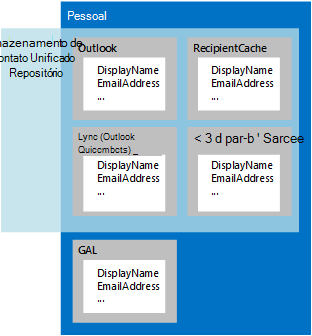

# Pessoas e contatos no EWS no Exchange

Saiba mais sobre como trabalhar com contatos, usando a API gerenciada de EWS ou EWS no Exchange, o repositório unificado de contatos e personagens. 
  
Os contatos são itens no Exchange que armazenam informações sobre um indivíduo, grupo ou organização. Contatos podem incluir nomes e endereços de email e outras informações, incluindo endereços de mensagens Instantâneas, endereços físicos, aniversários, informações sobre a família e uma foto ou imagem que representa o contato.
  
Informações de contato são armazenadas em um destes dois locais:
  
- Serviços de domínio Active Directory (AD DS), se o contato estiver dentro da organização.
    
- A pasta de contatos ou outra pasta na caixa de correio de um usuário, se o contato estiver fora da organização.
    
Vários itens de contato pode representar um único indivíduo. Para ajudar a reunir esses itens de contato diferente, o Exchange usa personagens. Uma *pessoa* é uma agregação de informações de contato para o mesmo indivíduo de fontes diferentes. Além para informações de contato no Exchange, personagens podem também ser agregadas de informações no cache de destinatário para a caixa de correio, uma pasta oculta para contatos de mensagens Instantâneas chamado QuickContacts e de fontes de dados de terceiros. O repositório unificado de contatos no Exchange permite que os clientes de mensagens Instantâneas usar esta agregação; a única diferença é que o repositório unificado de contatos não agregam informações do AD DS, conforme mostrado na Figura 1. 
  
**Figura 1. Fontes de informações de contato para personagens e para o repositório unificado de contatos**

  
**Tabela 1. Métodos de API gerenciada de EWS e operações de EWS trabalhe com contatos**

|**Se você quiser …**|**Use este método API gerenciada de EWS**|**Use esta operação EWS**|
|:-----|:-----|:-----|
|Criar um novo contato    |Criar um novo objeto de [contato](http://msdn.microsoft.com/en-us/library/office/microsoft.exchange.webservices.data.contact%28v=exchg.80%29.aspx) e usar [Contact.Save](http://msdn.microsoft.com/en-us/library/office/microsoft.exchange.webservices.data.contact.save%28v=exchg.80%29.aspx)   |[CreateItem](http://msdn.microsoft.com/library/417e994b-0a17-4c24-9527-04796b80b029%28Office.15%29.aspx)   |
|Copiar um contato    |[Contact.Copy](http://msdn.microsoft.com/en-us/library/office/microsoft.exchange.webservices.data.contact.copy%28v=exchg.80%29.aspx)   |[CopyItem](http://msdn.microsoft.com/library/bcc68f9e-d511-4c29-bba6-ed535524624a%28Office.15%29.aspx)   |
|Mover um contato    |[Contact.Move](http://msdn.microsoft.com/en-us/library/office/microsoft.exchange.webservices.data.contact.move%28v=exchg.80%29.aspx)   |[MoveItem](http://msdn.microsoft.com/library/dcf40fa7-7796-4a5c-bf5b-7a509a18d208%28Office.15%29.aspx)   |
|Atualizar um contato existente    |[Contact.Bind](http://msdn.microsoft.com/en-us/library/office/microsoft.exchange.webservices.data.contact.bind%28v=exchg.80%29.aspx) e [Contact.Update](http://msdn.microsoft.com/en-us/library/office/microsoft.exchange.webservices.data.contact.update%28v=exchg.80%29.aspx)   |[UpdateItem](http://msdn.microsoft.com/library/298fdd71-a83d-4407-9728-4f0a8e2d857c%28Office.15%29.aspx)   |
|Excluir um contato    |[Contact.Bind](http://msdn.microsoft.com/en-us/library/office/microsoft.exchange.webservices.data.contact.bind%28v=exchg.80%29.aspx) e [Contact.Delete](http://msdn.microsoft.com/en-us/library/office/microsoft.exchange.webservices.data.contact.delete%28v=exchg.80%29.aspx)   |[DeleteItem](http://msdn.microsoft.com/library/3e26c416-fa12-476e-bfd2-5c1f4bb7b348%28Office.15%29.aspx)   |
|Procurar um contato    |[ExchangeService.FindItems](http://msdn.microsoft.com/en-us/library/office/microsoft.exchange.webservices.data.exchangeservice.finditems%28v=exchg.80%29.aspx)   |[FindItem](http://msdn.microsoft.com/library/ebad6aae-16e7-44de-ae63-a95b24539729%28Office.15%29.aspx)   |
|Pesquisa de pessoas    |N/A    |[FindPeople](http://msdn.microsoft.com/library/446106b7-ff2d-4107-90c1-29f4d38ba128%28Office.15%29.aspx)   |
|Expandir um grupo de distribuição    |[ExchangeService.ExpandGroup](http://msdn.microsoft.com/en-us/library/office/microsoft.exchange.webservices.data.exchangeservice.expandgroup%28v=exchg.80%29.aspx)   |[ExpandDL](http://msdn.microsoft.com/library/1f7837e7-9eff-4e10-9577-c40f7ed6af94%28Office.15%29.aspx)   |
|Resolver um nome ambíguo    |[ExchangeService.ResolveName](http://msdn.microsoft.com/en-us/library/office/microsoft.exchange.webservices.data.exchangeservice.resolvename%28v=exchg.80%29.aspx)   |[ResolveNames](http://msdn.microsoft.com/library/6b4eb4b3-9ad6-4804-a09f-7e20cfea4dbb%28Office.15%29.aspx)   |
|Obtenha uma pessoa    |N/A    |[GetPersona](http://msdn.microsoft.com/library/e2146df0-53d0-4caf-9758-b600bbc14b6a%28Office.15%29.aspx)   |
|Trabalhar com fotos de contatos    |[Contact.SetContactPicture](http://msdn.microsoft.com/en-us/library/office/microsoft.exchange.webservices.data.contact.setcontactpicture%28v=exchg.80%29.aspx), [Contact.GetContactPictureAttachment](http://msdn.microsoft.com/en-us/library/office/microsoft.exchange.webservices.data.contact.getcontactpictureattachment%28v=exchg.80%29.aspx)ou [Contact.RemoveContactPicture](http://msdn.microsoft.com/en-us/library/office/microsoft.exchange.webservices.data.contact.setcontactpicture%28v=exchg.80%29.aspx)   |[GetUserPhoto](http://msdn.microsoft.com/library/f6e8143d-4235-428e-8f9c-ab6e9b1cfa6e%28Office.15%29.aspx) ou [GetAttachment](http://msdn.microsoft.com/library/24d10a15-b942-415e-9024-a6375708f326%28Office.15%29.aspx)   |
   
## Personagens

Até recentemente, contatos comumente foram armazenados em um único local — normalmente, em um cliente de email. Atualmente, está ficando mais comuns para armazenar os contatos em várias localidades diferentes, como em um telefone, em um site de rede social, em uma pasta de contatos, uma caixa de correio do Exchange, ou no serviço de diretório da organização. Com a proliferação de informações de contato, é possível que vários contatos que representam a mesma pessoa contenham informações diferentes; Por exemplo, um contato pode incluir um número de telefone comercial e outro um número de telefone pessoal ou um contato armazenado em uma pasta de contatos pode ter um nome diferente que o contato para a mesma pessoa que está armazenado no seu telefone.
  
No Exchange Online, Exchange Online como parte do Office 365 e versões de local do Exchange, começando com o Exchange 2013, contatos de fontes diferentes que representam a mesma pessoa estão associados uma outra, semelhante à maneira como as mensagens de email são agregados em conversas, por meio de uma ID de link comuns. Quando as informações de contato agregadas são retornadas por um servidor Exchange, ela inclui um conjunto de atributos para cada contato, como uma pasta de origem, um nome de exibição, uma ID e uma ID de fonte. A soma dos atributos retornados e propriedades é conhecida como uma pessoa e o conjunto de propriedades retornado é conhecido como a [forma da pessoa](http://msdn.microsoft.com/library/61d87cd5-3270-40d1-bab7-d0d5bf938607%28Office.15%29.aspx).
  
Porque as informações que constitui uma pessoa não estão armazenadas em um único local e como essa informação pode ser alterado a qualquer momento, uma pessoa é criada apenas quando você faz uma solicitação a um servidor Exchange. Você pode usar a operação de EWS [FindPeople](http://msdn.microsoft.com/library/446106b7-ff2d-4107-90c1-29f4d38ba128%28Office.15%29.aspx) para fazer uma solicitação de pesquisa da pessoa. Sua solicitação pode incluir uma ordem de classificação e pode ser filtrada de acordo com uma cadeia de caracteres de consulta para ajudá-lo a encontrar a pessoa correta pedidos e filtrando os resultados. Por exemplo, é possível recuperar o nome para exibição e um conjunto de todos os endereços de email que estão associados um contato específico da pasta Contatos, uma conta do Hotmail, uma conta LinkedIn e o serviço de diretório da empresa ou é possível recuperar um conjunto de todos os personagens que ter endereços de mensagens Instantâneas. A vinculação de contatos em personagens é automática com base em um algoritmo que reconhece uma relação entre contatos armazenados em vários dispositivos. 
  
> [!NOTE]
> A API gerenciada EWS não implementa essa funcionalidade. 
  
**Tabela 2. Operações do EWS para trabalhar com personagens**

|**Nome da operação**|**Descrição**|
|:-----|:-----|
|[FindPeople](http://msdn.microsoft.com/library/446106b7-ff2d-4107-90c1-29f4d38ba128%28Office.15%29.aspx)   |Retorna todos os personagens disponíveis a partir de uma pasta de contatos especificados ou recupera contatos que correspondem a uma cadeia de caracteres de consulta especificada.    |
|[GetPersona](http://msdn.microsoft.com/library/e2146df0-53d0-4caf-9758-b600bbc14b6a%28Office.15%29.aspx)   |Retorna um conjunto de propriedades associadas a uma pessoa específica, como endereços de todas as mensagens Instantâneas ou exibir nomes para uma ID de pessoa especificado.    |
   
Você pode usar as operações **GetPersona** e **FindPeople** para recuperar informações de contato de várias fontes de maneira eficiente. Como todos os itens relacionados a uma pessoa são associados uma ID de link, você pode usar essas operações em uma ampla variedade de aplicativos que usam dados do contato. Eis alguns exemplos: 
  
- Um aplicativo de telefone celular que usa a operação **GetPersona** quando um usuário chama um contato e, em seguida, oferece os números de telefone adicionais para chamar se ninguém responde. 
    
- Um aplicativo que usa a operação **FindPeople** para verificar as mensagens de caixa de entrada para os endereços de email determinar se eles são encontrados em uma pessoa existente. Endereços que já estão associados uma pessoa não podem ser usados para criar todas as comunicações recentes de vendas potenciais ou lista com a pessoa representada por essa pessoa. 
    
- [Um aplicativo de email para Outlook](mail-apps-for-outlook-and-ews-in-exchange.md) que oferece saudações diferentes com base em se a correspondência é formal ou informal. Saudações formais são fornecidas pelos nomes para exibição do serviço de diretório e saudações informais vêm do nome de exibição que se origina de contatos de redes sociais. 
    
## Repositório unificado de contatos

Personagens não estão apenas limitadas a um cliente de email. Se você estiver desenvolvendo um cliente de mensagens Instantâneas, você pode pedir para si mesmo qualquer um ou todos os seguintes itens:
  
- Como provisionar o Lync aplicativos de cliente com um conjunto padrão de itens de contato de mensagens Instantâneas?
    
- Como gerenciar o contato de mensagens Instantâneas e listas de grupo?
    
- Como gerenciar o acesso para cliente Lync personalizado aos contatos de mensagens Instantâneas e grupos de mensagens Instantâneas?
    
O repositório unificado de contatos funciona nos bastidores no Exchange para agregar dados de contato do Exchange e outras fontes em uma única entidade, ou uma pessoa. Embora as operações de EWS que você usa para acessar o repositório unificado de contatos são específicas para contatos de mensagens Instantâneas, você pode usar o repositório unificado de contatos no Exchange para funcionar com personagens em todos os tipos de aplicativos. Tenha em mente que o repositório unificado de contatos não podem acessar os dados de contato do AD DS.
  
Contatos de mensagens Instantâneas são armazenados em uma pasta oculta chamada QuickContacts. Você pode usar as operações **AddNewImContactToGroup** e **AddImContactToGroup** para adicionar contatos a grupos que são armazenados nessa pasta oculta. E como você pode usar o repositório unificado de contatos para contatos de mensagens Instantâneas de grupo, você pode acessar e atualizar os grupos de contatos mais facilmente. 
  
> [!NOTE]
> A API gerenciada EWS não implementa essa funcionalidade. 
  
**Tabela 3. Operações do EWS para acessar o repositório unificado de contatos**

|**Nome da operação**|**Descrição**|
|:-----|:-----|
|[AddNewImContactToGroup](http://msdn.microsoft.com/library/0cb5525f-faa3-48f1-9551-df55ffc26f46%28Office.15%29.aspx)   |Adiciona um novo contato de mensagem Instantânea a um grupo de mensagens Instantâneas, até um máximo de contatos de 1000.    |
|[AddImContactToGroup](http://msdn.microsoft.com/library/376acc42-2684-4596-aca1-82a4a10865c9%28Office.15%29.aspx)   |Adiciona um contato de mensagens Instantâneas existente a um grupo de mensagens Instantâneas, até um máximo de contatos de 1000.    |
|[AddImGroup](http://msdn.microsoft.com/library/6df6e504-b7c8-4773-b10f-ffa5defac229%28Office.15%29.aspx)   |Adiciona um novo grupo de mensagens Instantâneas, até um máximo de 64 grupos.    |
|[AddDistributionGroupToImList](http://msdn.microsoft.com/library/5aa9bec8-71cf-4a6e-8ec8-b4965b40fd4a%28Office.15%29.aspx)   |Adiciona um novo grupo de distribuição a um grupo de mensagens Instantâneas, até um máximo de 64 grupos.    |
|[GetImItemList](http://msdn.microsoft.com/library/e31d14e1-0c1f-4b69-98b7-157d59c13698%28Office.15%29.aspx)   |Recupera uma lista de grupos de mensagens Instantâneas e personagens contatos de mensagens Instantâneas.    |
|[GetImItems](http://msdn.microsoft.com/library/51186691-46d2-4d5c-b8bc-4ee2bb20fbe7%28Office.15%29.aspx)   |Recupera informações sobre grupos específicos de mensagens Instantâneas e mensagens Instantâneas entre em contato com personagens.    |
|[RemoveContactFromImList](http://msdn.microsoft.com/library/28ec96c3-45af-48ff-9f17-718a527dc0ad%28Office.15%29.aspx)   |Remove um contato de um grupo de mensagens Instantâneas.    |
|[RemoveImContactFromGroup](http://msdn.microsoft.com/library/a190bbec-c71b-4e6a-880b-55854c724d8c%28Office.15%29.aspx)   |Remove um contato de mensagens Instantâneas de um grupo de mensagens Instantâneas.    |
|[RemoveDistributionGroupFromImList](http://msdn.microsoft.com/library/252bddf2-98b6-4824-b548-2fba2bda5384%28Office.15%29.aspx)   |Remove um grupo de distribuição de um grupo de mensagens Instantâneas.    |
|[RemoveImGroup](http://msdn.microsoft.com/library/5e788016-68e0-4a3f-9243-03f6b6c6b389%28Office.15%29.aspx)   |Remove um grupo de mensagens Instantâneas.    |
|[SetImGroup](http://msdn.microsoft.com/library/2d48aa07-8152-4c3d-a519-061253e80174%28Office.15%29.aspx)   |Altera o nome de exibição de um grupo de mensagens Instantâneas.    |
   
## Nesta seção

- [Contatos de processo em lotes, usando o EWS no Exchange](how-to-process-contacts-in-batches-by-using-ews-in-exchange.md)
    
- [Resolver nomes de ambíguos, usando o EWS no Exchange 2013](how-to-resolve-ambiguous-names-by-using-ews-in-exchange-2013.md)
    
- [Obtenha as fotos de usuários usando o EWS no Exchange](how-to-get-user-photos-by-using-ews-in-exchange.md)
    
## Confira também

- [Develop web service clients for Exchange](develop-web-service-clients-for-exchange.md)
    
- [Start using web services in Exchange](start-using-web-services-in-exchange.md)
    
- [Visão geral de design de cliente do EWS do Exchange](ews-client-design-overview-for-exchange.md)
    

