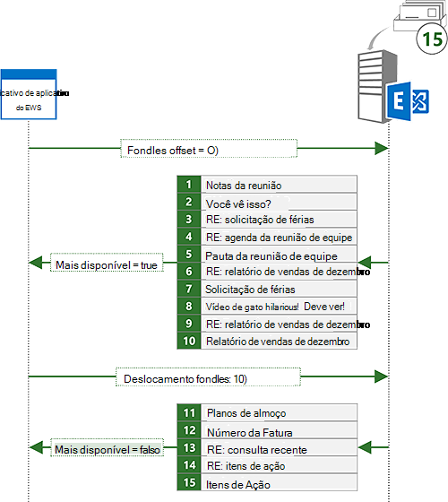
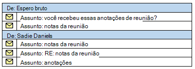

# <a name="search-and-ews-in-exchange"></a><span data-ttu-id="c1aea-103">Pesquisa e EWS no Exchange</span><span class="sxs-lookup"><span data-stu-id="c1aea-103">Search and EWS in Exchange</span></span>

<span data-ttu-id="c1aea-104">Descubra como pesquisar por itens no Exchange usando a API gerenciada de EWS ou EWS.</span><span class="sxs-lookup"><span data-stu-id="c1aea-104">Find out how to search for items in Exchange by using the EWS Managed API or EWS.</span></span>
  
<span data-ttu-id="c1aea-105">Significa este som está familiarizado?</span><span class="sxs-lookup"><span data-stu-id="c1aea-105">Does this sound familiar?</span></span> <span data-ttu-id="c1aea-106">Você está iniciando finalmente desse projeto que você tiver sido colocando por semanas e você precisa de informações sobre o projeto que seu gerente enviado a você em semanas de email atrás.</span><span class="sxs-lookup"><span data-stu-id="c1aea-106">You're finally starting that project you've been putting off for weeks, and you need information about the project that your manager sent you in email weeks ago.</span></span> <span data-ttu-id="c1aea-107">Sua caixa de entrada possui centenas ou talvez milhares de mensagens.</span><span class="sxs-lookup"><span data-stu-id="c1aea-107">Your Inbox has hundreds or perhaps thousands of messages in it.</span></span> <span data-ttu-id="c1aea-108">O que você faz?</span><span class="sxs-lookup"><span data-stu-id="c1aea-108">What do you do?</span></span> <span data-ttu-id="c1aea-109">Você percorrer seu email verificação cada assunto e o remetente até que você encontrá-lo?</span><span class="sxs-lookup"><span data-stu-id="c1aea-109">Do you scroll through your email scanning each subject and sender until you find it?</span></span> <span data-ttu-id="c1aea-110">Ou, você usa o recurso de pesquisa em seu cliente de email favorito como zero rapidamente no que você precisa?</span><span class="sxs-lookup"><span data-stu-id="c1aea-110">Or do you use the search feature in your favorite email client to quickly zero in on what you need?</span></span>
  
<span data-ttu-id="c1aea-111">Pesquisa relativamente é um recurso de obrigatórios para qualquer cliente de email.</span><span class="sxs-lookup"><span data-stu-id="c1aea-111">Search is arguably a must-have feature for any email client.</span></span> <span data-ttu-id="c1aea-112">Mas a pesquisa pode ser usada para habilitar muito mais do que apenas os usuários procurem suas caixas de correio.</span><span class="sxs-lookup"><span data-stu-id="c1aea-112">But search can be used for a lot more than just enabling users to search their mailbox.</span></span> <span data-ttu-id="c1aea-113">Seu aplicativo precisa processar compromissos que ocorram dentro de períodos de tempo específico?</span><span class="sxs-lookup"><span data-stu-id="c1aea-113">Does your app need to process appointments that fall within specific time windows?</span></span> <span data-ttu-id="c1aea-114">Talvez você precisa enviar relatórios sobre todos os itens de tarefa com um status específico ou mova todos os contatos com um nome de empresa específica para uma pasta diferente.</span><span class="sxs-lookup"><span data-stu-id="c1aea-114">Maybe you need to report on all task items with a specific status, or move all contacts with a specific company name to a different folder.</span></span> <span data-ttu-id="c1aea-115">Pesquisa pode ajudar com todos esses requisitos.</span><span class="sxs-lookup"><span data-stu-id="c1aea-115">Search can help with all of these requirements.</span></span>
  
## <a name="search-basics"></a><span data-ttu-id="c1aea-116">Noções básicas da pesquisa</span><span class="sxs-lookup"><span data-stu-id="c1aea-116">Search basics</span></span>
<span data-ttu-id="c1aea-117"><a name="bk_SearchBasics"> </a></span><span class="sxs-lookup"><span data-stu-id="c1aea-117"></span></span>

<span data-ttu-id="c1aea-118">A API gerenciada de EWS e o EWS oferecem dois métodos básicos para especificar uma pesquisa.</span><span class="sxs-lookup"><span data-stu-id="c1aea-118">The EWS Managed API and EWS offer two basic methods for specifying a search.</span></span> <span data-ttu-id="c1aea-119">Você pode usar um [filtro de pesquisa](how-to-use-search-filters-with-ews-in-exchange.md) ou uma [cadeia de caracteres de consulta](how-to-perform-an-aqs-search-by-using-ews-in-exchange.md).</span><span class="sxs-lookup"><span data-stu-id="c1aea-119">You can use a [search filter](how-to-use-search-filters-with-ews-in-exchange.md) or a [query string](how-to-perform-an-aqs-search-by-using-ews-in-exchange.md).</span></span> <span data-ttu-id="c1aea-120">O método usado depende do intuito da sua pesquisa.</span><span class="sxs-lookup"><span data-stu-id="c1aea-120">The method you use depends on the intent behind your search.</span></span>
  
<span data-ttu-id="c1aea-121">**Tabela 1. Cenários para filtros de pesquisa e consultas de pesquisa**</span><span class="sxs-lookup"><span data-stu-id="c1aea-121">**Table 1. Scenarios for search filters and search queries**</span></span>

|<span data-ttu-id="c1aea-122">**Se você quiser …**</span><span class="sxs-lookup"><span data-stu-id="c1aea-122">**If you want to…**</span></span>|<span data-ttu-id="c1aea-123">**Use um …**</span><span class="sxs-lookup"><span data-stu-id="c1aea-123">**Use a…**</span></span>|<span data-ttu-id="c1aea-124">**Notes**</span><span class="sxs-lookup"><span data-stu-id="c1aea-124">**Notes**</span></span>|
|:-----|:-----|:-----|
|<span data-ttu-id="c1aea-125">Limitar a pesquisa a uma propriedade específica ou um conjunto de propriedades</span><span class="sxs-lookup"><span data-stu-id="c1aea-125">Limit your search to a specific property or set of properties</span></span>  <br/> |<span data-ttu-id="c1aea-126">Filtro de pesquisa</span><span class="sxs-lookup"><span data-stu-id="c1aea-126">Search filter</span></span>  <br/> |<span data-ttu-id="c1aea-127">Os filtros de pesquisa fornecem o melhor nível de controle sobre quais propriedades são pesquisadas.</span><span class="sxs-lookup"><span data-stu-id="c1aea-127">Search filters provide the best level of control over which properties are searched.</span></span> <span data-ttu-id="c1aea-128">Embora as cadeias de caracteres de consulta podem direcionar um conjunto limitado de propriedades usando a sintaxe de consulta avançada (AQS), filtros de pesquisa podem direcionar qualquer propriedade.</span><span class="sxs-lookup"><span data-stu-id="c1aea-128">Although query strings can target a limited set of properties by using Advanced Query Syntax (AQS), search filters can target any property.</span></span>  <br/> |
|<span data-ttu-id="c1aea-129">Criar pesquisas com vários critérios</span><span class="sxs-lookup"><span data-stu-id="c1aea-129">Create searches with multiple criteria</span></span>  <br/> |<span data-ttu-id="c1aea-130">Filtro de pesquisa</span><span class="sxs-lookup"><span data-stu-id="c1aea-130">Search filter</span></span>  <br/> |<span data-ttu-id="c1aea-131">Com os filtros de pesquisa, vários critérios de pesquisa podem ser Unidos junto com lógica ANDs ou ORs, permitindo pesquisas como "assunto contém 'Notas de reunião' e o remetente é igual a 'Sadie Daniels'".</span><span class="sxs-lookup"><span data-stu-id="c1aea-131">With search filters, multiple search criteria can be joined together with logical ANDs or ORs, allowing for searches like "subject contains 'Meeting Notes' AND sender equals 'Sadie Daniels'".</span></span> <span data-ttu-id="c1aea-132">Embora as cadeias de caracteres de consulta também podem ingressar em vários critérios de pesquisa, eles são limitados ao conjunto de propriedades suportadas pelo cadeias de caracteres de consulta.</span><span class="sxs-lookup"><span data-stu-id="c1aea-132">Although query strings can also join multiple search criteria, they are limited to the set of properties supported by query strings.</span></span>  <br/> |
|<span data-ttu-id="c1aea-133">Propriedades personalizadas de pesquisa</span><span class="sxs-lookup"><span data-stu-id="c1aea-133">Search custom properties</span></span>  <br/> |<span data-ttu-id="c1aea-134">Filtro de pesquisa</span><span class="sxs-lookup"><span data-stu-id="c1aea-134">Search filter</span></span>  <br/> |<span data-ttu-id="c1aea-135">Filtros de pesquisa podem direcionar propriedades personalizadas.</span><span class="sxs-lookup"><span data-stu-id="c1aea-135">Search filters can target custom properties.</span></span> <span data-ttu-id="c1aea-136">Cadeias de caracteres de consulta de pesquisa não propriedades personalizadas.</span><span class="sxs-lookup"><span data-stu-id="c1aea-136">Query strings do not search custom properties.</span></span>  <br/> |
|<span data-ttu-id="c1aea-137">Realizar uma pesquisa diferencia maiusculas de minúsculas das propriedades de cadeia de caracteres</span><span class="sxs-lookup"><span data-stu-id="c1aea-137">Perform a case sensitive search of string properties</span></span>  <br/> |<span data-ttu-id="c1aea-138">Filtro de pesquisa</span><span class="sxs-lookup"><span data-stu-id="c1aea-138">Search filter</span></span>  <br/> |<span data-ttu-id="c1aea-139">As pesquisas de cadeia de caracteres de consulta não diferenciam maiusculas de minúsculas.</span><span class="sxs-lookup"><span data-stu-id="c1aea-139">Query string searches are not case sensitive.</span></span>  <br/> |
|<span data-ttu-id="c1aea-140">O modo de contenção ao pesquisar propriedades de cadeia de caracteres de controle</span><span class="sxs-lookup"><span data-stu-id="c1aea-140">Control the containment mode when searching string properties</span></span>  <br/> |<span data-ttu-id="c1aea-141">Filtro de pesquisa</span><span class="sxs-lookup"><span data-stu-id="c1aea-141">Search filter</span></span>  <br/> |<span data-ttu-id="c1aea-142">As pesquisas de cadeia de caracteres de consulta são sempre pesquisas de subsequência.</span><span class="sxs-lookup"><span data-stu-id="c1aea-142">Query string searches are always substring searches.</span></span> <span data-ttu-id="c1aea-143">Se você precisar procurar prefixos específicos ou exigem correspondências exatas, um filtro de pesquisa é a melhor opção.</span><span class="sxs-lookup"><span data-stu-id="c1aea-143">If you need to search for specific prefixes, or require exact matches, a search filter is the best choice.</span></span>  <br/> |
|<span data-ttu-id="c1aea-144">Procurar pastas</span><span class="sxs-lookup"><span data-stu-id="c1aea-144">Search for folders</span></span>  <br/> |<span data-ttu-id="c1aea-145">Filtro de pesquisa</span><span class="sxs-lookup"><span data-stu-id="c1aea-145">Search filter</span></span>  <br/> |<span data-ttu-id="c1aea-146">EWS não suporta procurando pastas com uma cadeia de caracteres de consulta.</span><span class="sxs-lookup"><span data-stu-id="c1aea-146">EWS does not support searching for folders with a query string.</span></span>  <br/> |
|<span data-ttu-id="c1aea-147">Crie uma pasta de pesquisa</span><span class="sxs-lookup"><span data-stu-id="c1aea-147">Create a search folder</span></span>  <br/> |<span data-ttu-id="c1aea-148">Filtro de pesquisa</span><span class="sxs-lookup"><span data-stu-id="c1aea-148">Search filter</span></span>  <br/> |<span data-ttu-id="c1aea-149">EWS não oferece suporte a criação de pastas de pesquisa com uma cadeia de caracteres de consulta.</span><span class="sxs-lookup"><span data-stu-id="c1aea-149">EWS does not support creating search folders with a query string.</span></span>  <br/> |
|<span data-ttu-id="c1aea-150">Pesquisa em todas as propriedades normalmente utilizadas</span><span class="sxs-lookup"><span data-stu-id="c1aea-150">Search across all commonly used properties</span></span>  <br/> |<span data-ttu-id="c1aea-151">Cadeia de caracteres de consulta</span><span class="sxs-lookup"><span data-stu-id="c1aea-151">Query string</span></span>  <br/> |<span data-ttu-id="c1aea-152">Cadeias de caracteres de consulta que não contêm AQS pesquisará entre todas as propriedades comumente usadas.</span><span class="sxs-lookup"><span data-stu-id="c1aea-152">Query strings that do not contain AQS will search across all commonly used properties.</span></span> <span data-ttu-id="c1aea-153">Por exemplo, um valor de cadeia de caracteres de consulta de "Mack Chaves" retornará todas as mensagens enviadas por Mack Chaves, bem como todas as mensagens que tenham "Mack Chaves" no corpo ou no assunto.</span><span class="sxs-lookup"><span data-stu-id="c1aea-153">For example, a query string value of "Mack Chaves" will return all messages sent by Mack Chaves as well as any messages that have "Mack Chaves" in the body or subject.</span></span>  <br/> |
|<span data-ttu-id="c1aea-154">Construir uma pesquisa com base na entrada do usuário simples</span><span class="sxs-lookup"><span data-stu-id="c1aea-154">Construct a search based on simple user input</span></span>  <br/> |<span data-ttu-id="c1aea-155">Cadeia de caracteres de consulta</span><span class="sxs-lookup"><span data-stu-id="c1aea-155">Query string</span></span>  <br/> |<span data-ttu-id="c1aea-156">Uma cadeia de caracteres de consulta é uma excelente opção para permitir que um usuário final fazer uma pesquisa rápida, digitando em uma cadeia de caracteres simple.</span><span class="sxs-lookup"><span data-stu-id="c1aea-156">A query string is a great choice for allowing an end user to do a quick search by typing in a simple string.</span></span> <span data-ttu-id="c1aea-157">Como uma pesquisa de cadeia de caracteres de consulta inclui todas as propriedades comumente usadas, os resultados conterá todos os itens que contenham os termos de pesquisa do usuário.</span><span class="sxs-lookup"><span data-stu-id="c1aea-157">Because a query string search includes all commonly used properties, the results will contain any items that contain the user's search terms.</span></span>  <br/> |
   
### <a name="using-a-search-filter"></a><span data-ttu-id="c1aea-158">Usando um filtro de pesquisa</span><span class="sxs-lookup"><span data-stu-id="c1aea-158">Using a search filter</span></span>

<span data-ttu-id="c1aea-159">Filtros de pesquisa lhe oferece uma ampla gama de opções de pesquisa e o maior grau de controle sobre como a pesquisa é realizada.</span><span class="sxs-lookup"><span data-stu-id="c1aea-159">Search filters give you a wide range of search options and the greatest degree of control over how the search is performed.</span></span> <span data-ttu-id="c1aea-160">Você pode usar filtros de pesquisa para realizar pesquisas de comparação e de igualdade básica, mas você também pode pesquisar dentro o conteúdo das propriedades de cadeia de caracteres ou fazer comparações de bitmask.</span><span class="sxs-lookup"><span data-stu-id="c1aea-160">You can use search filters to perform basic equality and comparison searches, but you can also search within the contents of string properties or do bitmask comparisons.</span></span>
  
<span data-ttu-id="c1aea-161">Por exemplo, você pode pesquisar o conteúdo do assunto de itens usando a classe [SearchFilter.ContainsSubstring](http://msdn.microsoft.com/en-us/library/microsoft.exchange.webservices.data.searchfilter.containssubstring%28v=exchg.80%29.aspx) na API gerenciada do EWS.</span><span class="sxs-lookup"><span data-stu-id="c1aea-161">For example, you can search the contents of the subject of items by using the [SearchFilter.ContainsSubstring](http://msdn.microsoft.com/en-us/library/microsoft.exchange.webservices.data.searchfilter.containssubstring%28v=exchg.80%29.aspx) class in the EWS Managed API.</span></span> <span data-ttu-id="c1aea-162">Neste exemplo, um filtro de pesquisa é criado para pesquisar o assunto a subcadeia de caracteres "notas de reunião," ignora maiusculas / minúsculas.</span><span class="sxs-lookup"><span data-stu-id="c1aea-162">In this example, a search filter is created to search the subject for the substring "meeting notes", ignoring case.</span></span> 
  
```cs
SearchFilter.ContainsSubstring subjectFilter = new SearchFilter.ContainsSubstring(ItemSchema.Subject,
    "meeting notes", ContainmentMode.Substring, ComparisonMode.IgnoreCase);
```

<span data-ttu-id="c1aea-163">Você também pode pesquisar contra propriedades personalizadas.</span><span class="sxs-lookup"><span data-stu-id="c1aea-163">You can also search against custom properties.</span></span> <span data-ttu-id="c1aea-164">Neste exemplo, a propriedade personalizada **ItemIndex** é pesquisada para valores maiores que 3.</span><span class="sxs-lookup"><span data-stu-id="c1aea-164">In this example, the custom property **ItemIndex** is searched for values greater than 3.</span></span> 
  
```cs
Guid MyAppGuid = new Guid("{AA3DF801-4FC7-401F-BBC1-7C93D6498C2E}");
ExtendedPropertyDefinition customPropDefinition =
    new ExtendedPropertyDefinition(MyAppGuid, "ItemIndex", MapiPropertyType.Integer); 
SearchFilter.IsGreaterThan customPropFilter =
    new SearchFilter.IsGreaterThan(customPropDefinition, 3);
```

<span data-ttu-id="c1aea-165">Você também pode combinar vários filtros de pesquisa para criar pesquisas mais complexas.</span><span class="sxs-lookup"><span data-stu-id="c1aea-165">You can also combine multiple search filters to create more complex searches.</span></span> <span data-ttu-id="c1aea-166">Por exemplo, você pode combinar os dois filtros anteriores com um AND lógico, usando a classe [SearchFilter.SearchFilterCollection](http://msdn.microsoft.com/en-us/library/microsoft.exchange.webservices.data.searchfilter.searchfiltercollection%28v=exchg.80%29.aspx) .</span><span class="sxs-lookup"><span data-stu-id="c1aea-166">For example, you can combine the previous two filters with a logical AND by using the [SearchFilter.SearchFilterCollection](http://msdn.microsoft.com/en-us/library/microsoft.exchange.webservices.data.searchfilter.searchfiltercollection%28v=exchg.80%29.aspx) class.</span></span> 
  
```cs
SearchFilter.SearchFilterCollection compoundFilter =
    new SearchFilter.SearchFilterCollection(LogicalOperator.And, subjectFilter, customPropFilter);
```

### <a name="using-a-query-string"></a><span data-ttu-id="c1aea-167">Usando uma cadeia de caracteres de consulta</span><span class="sxs-lookup"><span data-stu-id="c1aea-167">Using a query string</span></span>

<span data-ttu-id="c1aea-168">Cadeias de caracteres de consulta fornecem uma abordagem diferente para pesquisar.</span><span class="sxs-lookup"><span data-stu-id="c1aea-168">Query strings provide a different approach to search.</span></span> <span data-ttu-id="c1aea-169">Você tem menos controle sobre os campos que são pesquisados e como a pesquisa é executada quando você usa uma pesquisa de cadeia de caracteres de consulta.</span><span class="sxs-lookup"><span data-stu-id="c1aea-169">You have less control over the fields that are searched and how the search is performed when you use a query string search.</span></span> <span data-ttu-id="c1aea-170">Não que é uma coisa ruim!</span><span class="sxs-lookup"><span data-stu-id="c1aea-170">Not that that's a bad thing!</span></span> <span data-ttu-id="c1aea-171">Em alguns casos, talvez você queira convertida de uma rede mais ampla, por assim dizer.</span><span class="sxs-lookup"><span data-stu-id="c1aea-171">In some cases, you might want to cast a wider net, so to speak.</span></span>
  
<span data-ttu-id="c1aea-172">Por exemplo, você pode pesquisar "notas de reunião" usando o método de API gerenciada de EWS [ExchangeService.FindItems](http://msdn.microsoft.com/en-us/library/jj223808%28v=exchg.80%29.aspx) .</span><span class="sxs-lookup"><span data-stu-id="c1aea-172">For example, you can search for "meeting notes" by using the [ExchangeService.FindItems](http://msdn.microsoft.com/en-us/library/jj223808%28v=exchg.80%29.aspx) EWS Managed API method.</span></span> 
  
```cs
FindItemsResults<Item> results = service.FindItems(folder, "meeting notes", view);
```

<span data-ttu-id="c1aea-173">Se você comparar os resultados da pesquisa para os resultados do exemplo pesquisa **SearchFilter.ContainsSubstring** anteriormente, esta pesquisa irá conter mais resultados.</span><span class="sxs-lookup"><span data-stu-id="c1aea-173">If you compare the results of this search to the results of the **SearchFilter.ContainsSubstring** search example earlier, this search will contain more results.</span></span> <span data-ttu-id="c1aea-174">A pesquisa de filtro de pesquisa retornará apenas os itens que possuem as "observações de reunião" no assunto, enquanto esta pesquisa irá retornar itens que tenham "anotações de reunião" no assunto, corpo e outros campos.</span><span class="sxs-lookup"><span data-stu-id="c1aea-174">The search filter search will return only items that have "meeting notes" in the subject, while this search will return items that have "meeting notes" in the subject, body, and other fields.</span></span> 
  
<span data-ttu-id="c1aea-175">Vamos analisar como você pode refinar a cadeia de caracteres de consulta para obter os resultados que você vê do filtro de pesquisa mais próximo.</span><span class="sxs-lookup"><span data-stu-id="c1aea-175">Let's take a look at how you can refine the query string to get closer to the results you see from the search filter.</span></span> <span data-ttu-id="c1aea-176">Usando AQS, você pode limitar a pesquisa para o assunto.</span><span class="sxs-lookup"><span data-stu-id="c1aea-176">Using AQS, you can limit your search to the subject.</span></span>
  
```cs
FindItemsResults<Item> results = service.FindItems(folder, "subject:meeting notes", view);
```

<span data-ttu-id="c1aea-177">Isso é mais próximo, mas os resultados são ainda não exatamente iguais.</span><span class="sxs-lookup"><span data-stu-id="c1aea-177">This is closer, but the results are still not quite the same.</span></span> <span data-ttu-id="c1aea-178">Quando você usa uma cadeia de caracteres de consulta com várias palavras, você receberá correspondências mesmo se as palavras não estão na ordem especificada, ou mesmo se elas não estiverem adjacentes entre si.</span><span class="sxs-lookup"><span data-stu-id="c1aea-178">When you use a query string with multiple words, you will get matches even if the words are not in the order you specify, or even if they're not adjacent to each other.</span></span> <span data-ttu-id="c1aea-179">Com a sequência de consulta "Observações do assunto: reunião", você irá obter correspondências para "notas de reunião", "Observações da reunião" e assim por diante.</span><span class="sxs-lookup"><span data-stu-id="c1aea-179">With the query string "subject:meeting notes", you will get matches for "meeting notes", "notes from the meeting", and so on.</span></span> <span data-ttu-id="c1aea-180">Para refinar ainda mais, você poderá dispor os termos de pesquisa em aspas duplas para indicar que você deseja apenas essa frase.</span><span class="sxs-lookup"><span data-stu-id="c1aea-180">To further refine, you can wrap the search terms in double quotes to indicate that you want that phrase only.</span></span>
  
```cs
FindItemsResults<Item> results = service.FindItems(folder, "subject:\"meeting notes\"", view);
```

## <a name="requesting-specific-properties-in-search-results"></a><span data-ttu-id="c1aea-181">Solicitando propriedades específicas nos resultados da pesquisa</span><span class="sxs-lookup"><span data-stu-id="c1aea-181">Requesting specific properties in search results</span></span>
<span data-ttu-id="c1aea-182"><a name="bk_RequestSpecific"> </a></span><span class="sxs-lookup"><span data-stu-id="c1aea-182"></span></span>

<span data-ttu-id="c1aea-183">Por padrão, os resultados da pesquisa irá conter todas as propriedades nos itens que correspondem a pesquisa.</span><span class="sxs-lookup"><span data-stu-id="c1aea-183">By default, search results will contain all properties on the items that match the search.</span></span> <span data-ttu-id="c1aea-184">Em alguns casos, isso pode ser o que você deseja, mas na maioria dos casos seu aplicativo requer apenas um conjunto distinto de propriedades.</span><span class="sxs-lookup"><span data-stu-id="c1aea-184">In some cases this might be what you want, but in most cases your application only requires a discrete set of properties.</span></span> <span data-ttu-id="c1aea-185">Nesse caso, você deve limitar o conjunto de propriedades que são retornados para somente as propriedades de seu aplicativo precisa.</span><span class="sxs-lookup"><span data-stu-id="c1aea-185">In this case, you should limit the set of properties that are returned to only the properties your application needs.</span></span> <span data-ttu-id="c1aea-186">No exemplo a seguir, a classe [ItemView](http://msdn.microsoft.com/en-us/library/microsoft.exchange.webservices.data.itemview%28v=exchg.80%29.aspx) é usada para limitar as propriedades retornadas para o assunto, data/hora recebido e identificação dos itens.</span><span class="sxs-lookup"><span data-stu-id="c1aea-186">In the following example, the [ItemView](http://msdn.microsoft.com/en-us/library/microsoft.exchange.webservices.data.itemview%28v=exchg.80%29.aspx) class is used to limit the returned properties to the subject, date/time received, and ID of the items.</span></span> 
  
```cs
ItemView view = new ItemView(10);
// Creating a new PropertySet with this constructor includes 
// ItemSchema.Id.
view.PropertySet = new PropertySet(ItemSchema.Subject, ItemSchema.DateTimeReceived);
```

## <a name="controlling-search-depth"></a><span data-ttu-id="c1aea-187">Controlando a profundidade de pesquisa</span><span class="sxs-lookup"><span data-stu-id="c1aea-187">Controlling search depth</span></span>
<span data-ttu-id="c1aea-188"><a name="bk_SearchDepth"> </a></span><span class="sxs-lookup"><span data-stu-id="c1aea-188"></span></span>

<span data-ttu-id="c1aea-189">A definição de passagem no modo de exibição controla a profundidade e o escopo da pesquisa.</span><span class="sxs-lookup"><span data-stu-id="c1aea-189">Setting the traversal on the view controls the depth and scope of the search.</span></span> 
  
<span data-ttu-id="c1aea-190">**Tabela 2. Valores de passagem de pesquisa**</span><span class="sxs-lookup"><span data-stu-id="c1aea-190">**Table 2. Search traversal values**</span></span>

|<span data-ttu-id="c1aea-191">**Valor de passagem**</span><span class="sxs-lookup"><span data-stu-id="c1aea-191">**Traversal value**</span></span>|<span data-ttu-id="c1aea-192">**Aplica-se a**</span><span class="sxs-lookup"><span data-stu-id="c1aea-192">**Applies to**</span></span>|<span data-ttu-id="c1aea-193">**Descrição**</span><span class="sxs-lookup"><span data-stu-id="c1aea-193">**Description**</span></span>|
|:-----|:-----|:-----|
|<span data-ttu-id="c1aea-194">Raso</span><span class="sxs-lookup"><span data-stu-id="c1aea-194">Shallow</span></span>  <br/> |<span data-ttu-id="c1aea-195">Itens e pastas</span><span class="sxs-lookup"><span data-stu-id="c1aea-195">Items and Folders</span></span>  <br/> |<span data-ttu-id="c1aea-196">Pesquisas superficiais são limitadas para direcionar os filhos da pasta que estão sendo pesquisados.</span><span class="sxs-lookup"><span data-stu-id="c1aea-196">Shallow searches are limited to direct children of the folder being searched.</span></span>  <br/> |
|<span data-ttu-id="c1aea-197">Profundo</span><span class="sxs-lookup"><span data-stu-id="c1aea-197">Deep</span></span>  <br/> |<span data-ttu-id="c1aea-198">Pastas e itens (somente com pastas de pesquisa)</span><span class="sxs-lookup"><span data-stu-id="c1aea-198">Items (only with search folders) and Folders</span></span>  <br/> |<span data-ttu-id="c1aea-199">Pesquisas de profundidade recursivamente pesquisar a pasta que estão sendo pesquisados e as subpastas.</span><span class="sxs-lookup"><span data-stu-id="c1aea-199">Deep searches recursively search the folder being searched and subfolders.</span></span>  <br/> |
|<span data-ttu-id="c1aea-200">Associados</span><span class="sxs-lookup"><span data-stu-id="c1aea-200">Associated</span></span>  <br/> |<span data-ttu-id="c1aea-201">Items</span><span class="sxs-lookup"><span data-stu-id="c1aea-201">Items</span></span>  <br/> |<span data-ttu-id="c1aea-202">Pesquisas associadas incluem apenas os itens associados da pasta que estão sendo pesquisados.</span><span class="sxs-lookup"><span data-stu-id="c1aea-202">Associated searches only include associated items from the folder being searched.</span></span> <span data-ttu-id="c1aea-203">Itens associados são itens ocultos dentro da pasta.</span><span class="sxs-lookup"><span data-stu-id="c1aea-203">Associated items are hidden items within the folder.</span></span>  <br/> |
|<span data-ttu-id="c1aea-204">SoftDeleted</span><span class="sxs-lookup"><span data-stu-id="c1aea-204">SoftDeleted</span></span>  <br/> |<span data-ttu-id="c1aea-205">Itens e pastas</span><span class="sxs-lookup"><span data-stu-id="c1aea-205">Items and Folders</span></span>  <br/> |<span data-ttu-id="c1aea-206">Esse tipo de passagem foi preterido.</span><span class="sxs-lookup"><span data-stu-id="c1aea-206">This traversal type is deprecated.</span></span> <span data-ttu-id="c1aea-207">Pesquisas de SoftDeleted incluem apenas os itens que estão no dumpster.</span><span class="sxs-lookup"><span data-stu-id="c1aea-207">SoftDeleted searches only include items that are in the dumpster.</span></span> <span data-ttu-id="c1aea-208">O dumpster foi substituída pela [pasta itens recuperáveis](https://docs.microsoft.com/en-us/exchange/policy-and-compliance/recoverable-items-folder/recoverable-items-folder) no Exchange Online, o Exchange Online como parte do Office 365 e versões do Exchange, começando com o Exchange 2010.</span><span class="sxs-lookup"><span data-stu-id="c1aea-208">The dumpster has been replaced by the [Recoverable Items Folder](https://docs.microsoft.com/en-us/exchange/policy-and-compliance/recoverable-items-folder/recoverable-items-folder) in Exchange Online, Exchange Online as part of Office 365, and versions of Exchange starting with Exchange 2010.</span></span>  <br/> |
   
## <a name="managing-search-results"></a><span data-ttu-id="c1aea-209">Gerenciando os resultados da pesquisa</span><span class="sxs-lookup"><span data-stu-id="c1aea-209">Managing search results</span></span>
<span data-ttu-id="c1aea-210"><a name="bk_ManageSearchResults"> </a></span><span class="sxs-lookup"><span data-stu-id="c1aea-210"></span></span>

<span data-ttu-id="c1aea-211">A API gerenciada de EWS e EWS também permitem que você altere como os resultados da pesquisa são retornados.</span><span class="sxs-lookup"><span data-stu-id="c1aea-211">The EWS Managed API and EWS also allow you to change how your search results are returned.</span></span> <span data-ttu-id="c1aea-212">Você pode usar os modos de exibição para especificar quais propriedades são incluídas nos resultados da, classificar os resultados e os resultados para obter apenas novamente um número de resultados por resposta de página.</span><span class="sxs-lookup"><span data-stu-id="c1aea-212">You can use views to specify which properties are included in the results, sort results, and page your results to only get back a set number of results per response.</span></span> <span data-ttu-id="c1aea-213">Você também pode agrupar resultados por valores de campo específicos e a profundidade de uma pesquisa de controle, especificando um tipo de passagem.</span><span class="sxs-lookup"><span data-stu-id="c1aea-213">You can also group results by specific field values and control the depth of a search by specifying a traversal type.</span></span> <span data-ttu-id="c1aea-214">Finalmente, você pode usar as pastas de pesquisa para criar pesquisas persistentes que são atualizadas dinamicamente à medida que novos itens chegam.</span><span class="sxs-lookup"><span data-stu-id="c1aea-214">Finally, you can use search folders to create persistent searches that are updated dynamically as new items arrive.</span></span>
  
### <a name="sorting"></a><span data-ttu-id="c1aea-215">Classificação</span><span class="sxs-lookup"><span data-stu-id="c1aea-215">Sorting</span></span>

<span data-ttu-id="c1aea-216">Você pode obter o servidor para retornar resultados classificados, o que facilitam exibir ou processar itens na ordem.</span><span class="sxs-lookup"><span data-stu-id="c1aea-216">You can get the server to return sorted results, which can make it easier to display or process items in order.</span></span> <span data-ttu-id="c1aea-217">Neste exemplo, os resultados serão classificados pela data/hora recebida, com os itens mais recentes sendo primeiro.</span><span class="sxs-lookup"><span data-stu-id="c1aea-217">In this example, the results will be sorted by the date/time received, with the newest items being first.</span></span>
  
```cs
view.OrderBy.Add(ItemSchema.DateTimeReceived, SortDirection.Descending);
```

### <a name="paging"></a><span data-ttu-id="c1aea-218">Paginação</span><span class="sxs-lookup"><span data-stu-id="c1aea-218">Paging</span></span>

<span data-ttu-id="c1aea-219">Quando você envia uma solicitação de pesquisa usando o EWS Managed API ou o EWS, você pode especificar um tamanho de modo de exibição, que controla o número máximo de itens retornados.</span><span class="sxs-lookup"><span data-stu-id="c1aea-219">When you send a search request by using the EWS Managed API or EWS, you specify a view size, which controls the maximum number of items returned.</span></span> <span data-ttu-id="c1aea-220">No entanto, o número de itens no servidor que correspondem sua pesquisa pode ser maior que o tamanho do modo de exibição.</span><span class="sxs-lookup"><span data-stu-id="c1aea-220">However, the number of items on the server that match your search might be larger than the view size.</span></span> <span data-ttu-id="c1aea-221">Nesse caso, o servidor indica que mais itens estão disponíveis.</span><span class="sxs-lookup"><span data-stu-id="c1aea-221">In this case, the server indicates that more items are available.</span></span> <span data-ttu-id="c1aea-222">Você pode [usar a paginação para repetir a pesquisa](how-to-perform-paged-searches-by-using-ews-in-exchange.md) e obtenha o próximo conjunto de resultados.</span><span class="sxs-lookup"><span data-stu-id="c1aea-222">You can [use paging to repeat your search](how-to-perform-paged-searches-by-using-ews-in-exchange.md) and get the next set of results.</span></span> 
  
<span data-ttu-id="c1aea-223">Por exemplo, você pode enviar uma solicitação de pesquisa com um tamanho de modo de exibição de 10.</span><span class="sxs-lookup"><span data-stu-id="c1aea-223">For example, you can send a search request with a view size of 10.</span></span> <span data-ttu-id="c1aea-224">Pode haver 15 itens no servidor que corresponde à sua pesquisa, mas você só receberá novamente os primeiros 10, juntamente com um indicador (o [FindItemsResults\<TItem\>. MoreAvailable](http://msdn.microsoft.com/en-us/library/dd635477%28v=exchg.80%29.aspx) propriedade se você estiver usando a API gerenciada de EWS) que não existem mais resultados no servidor.</span><span class="sxs-lookup"><span data-stu-id="c1aea-224">There might be 15 items on the server that match your search, but you will only get back the first 10, along with an indicator (the [FindItemsResults\<TItem\>.MoreAvailable](http://msdn.microsoft.com/en-us/library/dd635477%28v=exchg.80%29.aspx) property if you're using the EWS Managed API) that there are more results on the server.</span></span> <span data-ttu-id="c1aea-225">Em seguida, você pode enviar a mesma pesquisa com um deslocamento de 10 pedir os próximos 10 itens que correspondam à sua pesquisa.</span><span class="sxs-lookup"><span data-stu-id="c1aea-225">You can then send the same search with an offset of 10 to ask for the next 10 items that match your search.</span></span> <span data-ttu-id="c1aea-226">O servidor retornará os itens restantes de cinco.</span><span class="sxs-lookup"><span data-stu-id="c1aea-226">The server will return the remaining five items.</span></span> 
  
<span data-ttu-id="c1aea-227">**Figura 1. Exemplo de pesquisa paginados**</span><span class="sxs-lookup"><span data-stu-id="c1aea-227">**Figure 1. Paged search example**</span></span>


  
### <a name="grouping"></a><span data-ttu-id="c1aea-231">Agrupamento</span><span class="sxs-lookup"><span data-stu-id="c1aea-231">Grouping</span></span>

 <span data-ttu-id="c1aea-232">Exchange permite aos resultados de pesquisa de grupo por um campo específico.</span><span class="sxs-lookup"><span data-stu-id="c1aea-232">Exchange enables you to group search results by a specific field.</span></span> <span data-ttu-id="c1aea-233">Isso pode ajudar a dividir os resultados da pesquisa em conjuntos mais gerenciáveis.</span><span class="sxs-lookup"><span data-stu-id="c1aea-233">This can help break up search results into more manageable sets.</span></span> <span data-ttu-id="c1aea-234">Por exemplo, você pode procurar "notas de reunião" e agrupar os resultados por remetente.</span><span class="sxs-lookup"><span data-stu-id="c1aea-234">For example, you can search for "meeting notes" and group the results by sender.</span></span> <span data-ttu-id="c1aea-235">Conforme mostrado na figura a seguir, os itens retornados serão separados em grupos, com todos os itens que correspondem aos critérios do mesmo remetente em um grupo, todos os itens correspondentes do remetente outra em outro grupo e assim por diante.</span><span class="sxs-lookup"><span data-stu-id="c1aea-235">As shown in the following figure, the items returned will be separated into groups, with all the items that match the criteria from the same sender in one group, all the matching items from another sender in another group, and so on.</span></span> 
  
<span data-ttu-id="c1aea-236">**Figura 2. Resultados de pesquisa, agrupados por remetente**</span><span class="sxs-lookup"><span data-stu-id="c1aea-236">**Figure 2. Search results grouped by sender**</span></span>


  
## <a name="search-folders"></a><span data-ttu-id="c1aea-238">Pastas de pesquisa</span><span class="sxs-lookup"><span data-stu-id="c1aea-238">Search folders</span></span>
<span data-ttu-id="c1aea-239"><a name="bk_SearchFolders"> </a></span><span class="sxs-lookup"><span data-stu-id="c1aea-239"></span></span>

<span data-ttu-id="c1aea-240">Com uma pesquisa regular, a pesquisa é executada, os resultados são retornados ao seu aplicativo para processamento e a pesquisa deixa de existir.</span><span class="sxs-lookup"><span data-stu-id="c1aea-240">With a regular search, the search is executed, the results are returned to your application for processing, and the search ceases to exist.</span></span> <span data-ttu-id="c1aea-241">Pastas de pesquisa fornecem uma maneira de fazer uma pesquisa persistentes.</span><span class="sxs-lookup"><span data-stu-id="c1aea-241">Search folders provide a way to make a search persistent.</span></span> <span data-ttu-id="c1aea-242">Isso é uma opção excelente para pesquisas que você sabe que você desejará executar várias vezes.</span><span class="sxs-lookup"><span data-stu-id="c1aea-242">This is a great option for searches that you know you will want to execute multiple times.</span></span> <span data-ttu-id="c1aea-243">Em vez de executá-lo a mesma pesquisa repetidamente, fazendo com que o servidor avaliar a pesquisa a partir do zero cada vez, uma pasta de pesquisa faz com que uma pesquisa sempre ativado, permitindo que o servidor atualizar o resultado existente definido como itens são adicionados à ou removidos do escopo da pesquisa.</span><span class="sxs-lookup"><span data-stu-id="c1aea-243">Rather than executing the same search repeatedly, causing the server to evaluate the search from scratch each time, a search folder makes a search always on, allowing the server to update the existing result set as items are added to or removed from the search scope.</span></span> <span data-ttu-id="c1aea-244">Act de pastas de pesquisa, como pastas regulares, em que eles aparecem como pastas que possuem itens neles.</span><span class="sxs-lookup"><span data-stu-id="c1aea-244">Search folders act like regular folders, in that they appear as folders that have items in them.</span></span> <span data-ttu-id="c1aea-245">A diferença é que somente os itens contidos na pasta são aquelas que correspondem aos critérios de pesquisa que estão associados a pasta.</span><span class="sxs-lookup"><span data-stu-id="c1aea-245">The difference is that the only items contained in the folder are those that match the search criteria that are associated with the folder.</span></span> <span data-ttu-id="c1aea-246">Depois que uma pasta de pesquisa é criada, o seu aplicativo pode obter atualizados resultados da pesquisa apenas verificando o conteúdo da pasta.</span><span class="sxs-lookup"><span data-stu-id="c1aea-246">After a search folder is created, your application can get up-to-date results of the search just by checking the contents of the folder.</span></span>
  
<span data-ttu-id="c1aea-247">Criar uma pasta de pesquisa é simple quando tiver dominado Criando filtros de pesquisa.</span><span class="sxs-lookup"><span data-stu-id="c1aea-247">Creating a search folder is simple when you've mastered creating search filters.</span></span> <span data-ttu-id="c1aea-248">No exemplo a seguir, uma pasta de pesquisa é criada para mostrar todos os emails com o assunto que contém as "observações de reunião".</span><span class="sxs-lookup"><span data-stu-id="c1aea-248">In the following example, a search folder is created to show all email with a subject that contains "meeting notes".</span></span>
  
```cs
static void CreateSearchFolder(ExchangeService service)
{
    SearchFilter.ContainsSubstring subjectFilter = new SearchFilter.ContainsSubstring(ItemSchema.Subject,
        "meeting notes", ContainmentMode.Substring, ComparisonMode.IgnoreCase);
    SearchFolder searchFolder = new SearchFolder(service);
    searchFolder.DisplayName = "Meeting Notes";
    searchFolder.SearchParameters.RootFolderIds.Add(WellKnownFolderName.Inbox);
    searchFolder.SearchParameters.Traversal = SearchFolderTraversal.Deep;
    searchFolder.SearchParameters.SearchFilter = subjectFilter;
    searchFolder.Save(WellKnownFolderName.SearchFolders);
}
```

## <a name="in-this-section"></a><span data-ttu-id="c1aea-249">Nesta seção</span><span class="sxs-lookup"><span data-stu-id="c1aea-249">In this section</span></span>
<span data-ttu-id="c1aea-250"><a name="bk_InThisSection"> </a></span><span class="sxs-lookup"><span data-stu-id="c1aea-250"></span></span>

- [<span data-ttu-id="c1aea-251">Use os filtros de pesquisa com o EWS no Exchange</span><span class="sxs-lookup"><span data-stu-id="c1aea-251">Use search filters with EWS in Exchange</span></span>](how-to-use-search-filters-with-ews-in-exchange.md)
    
- [<span data-ttu-id="c1aea-252">Executar uma pesquisa AQS, usando o EWS no Exchange</span><span class="sxs-lookup"><span data-stu-id="c1aea-252">Perform an AQS search by using EWS in Exchange</span></span>](how-to-perform-an-aqs-search-by-using-ews-in-exchange.md)
    
- [<span data-ttu-id="c1aea-253">Realizar pesquisas paginadas utilizando o EWS no Exchange</span><span class="sxs-lookup"><span data-stu-id="c1aea-253">Perform paged searches by using EWS in Exchange</span></span>](how-to-perform-paged-searches-by-using-ews-in-exchange.md)
    
- [<span data-ttu-id="c1aea-254">Realizar pesquisas de agrupadas usando o EWS no Exchange</span><span class="sxs-lookup"><span data-stu-id="c1aea-254">Perform grouped searches by using EWS in Exchange</span></span>](how-to-perform-grouped-searches-by-using-ews-in-exchange.md)
    
- [<span data-ttu-id="c1aea-255">Trabalhar com pastas de pesquisa usando o EWS no Exchange</span><span class="sxs-lookup"><span data-stu-id="c1aea-255">Work with search folders by using EWS in Exchange</span></span>](how-to-work-with-search-folders-by-using-ews-in-exchange.md)
    
## <a name="see-also"></a><span data-ttu-id="c1aea-256">Confira também</span><span class="sxs-lookup"><span data-stu-id="c1aea-256">See also</span></span>


- [<span data-ttu-id="c1aea-257">Develop web service clients for Exchange</span><span class="sxs-lookup"><span data-stu-id="c1aea-257">Develop web service clients for Exchange</span></span>](develop-web-service-clients-for-exchange.md)
    
- [<span data-ttu-id="c1aea-258">Pasta itens recuperáveis</span><span class="sxs-lookup"><span data-stu-id="c1aea-258">Recoverable Items Folder</span></span>](https://docs.microsoft.com/en-us/exchange/policy-and-compliance/recoverable-items-folder/recoverable-items-folder)
    
- [<span data-ttu-id="c1aea-259">ExchangeService.FindItems</span><span class="sxs-lookup"><span data-stu-id="c1aea-259">ExchangeService.FindItems</span></span>](http://msdn.microsoft.com/en-us/library/microsoft.exchange.webservices.data.exchangeservice.finditems%28v=exchg.80%29.aspx)
    
- [<span data-ttu-id="c1aea-260">Parâmetros de política de limitação que afetam o EWS operações de pesquisa</span><span class="sxs-lookup"><span data-stu-id="c1aea-260">Throttling policy parameters that affect EWS search operations</span></span>](ews-throttling-in-exchange.md#bk_ThrottlingSearch)
    

