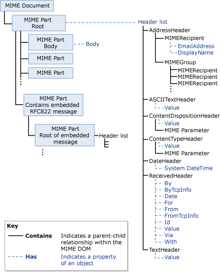
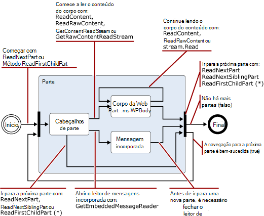
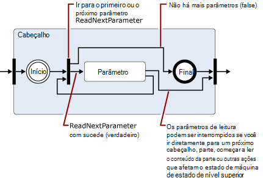
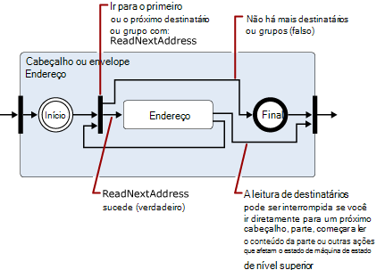
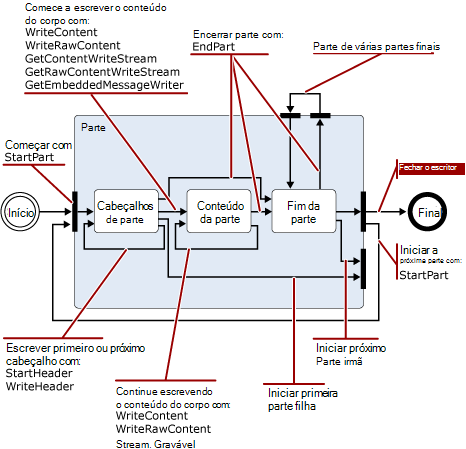
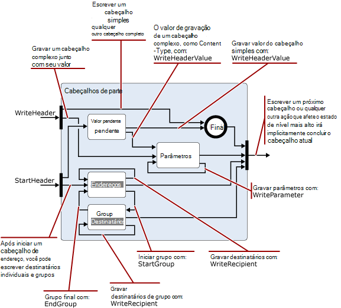

# Lendo e modificando mensagens no pipeline de transporte do Exchange 2013

Conheça as classes do .NET Framework que você pode usar em seu Exchange 2013 agentes de transporte para ler, gravar e modificar as mensagens.
  
**Aplica-se a:** Exchange Server 2013
  
- Classes usadas para leitura, gravação ou modificar mensagens
- Namespace codificadores
- namespace do iCalendar
- Namespace MIME
- Namespace TextConverters
- Namespace TNEF
- namespace vCard
  
Como as mensagens que passam pelo pipeline de transporte, o agente de transporte pode leitura, gravação e converter o conteúdo de mensagens entre os formatos de dados diferentes. Por exemplo, você pode ler e gravar dados MIME, identificar mensagens de entrada que estão no Uuencoded ou formato Quoted-printable (qp) e, em seguida, convert-los para um padrão usado pela sua organização, ou ler e salve as informações de calendário ou contato associado mensagens de entrada. 
  
Você também pode identificar o conteúdo que representa uma ameaça de segurança e mover ou excluir o conteúdo ou as mensagens que contêm-los; Por exemplo, removendo links em uma mensagem HTML.
  
Este artigo fornece informações sobre as classes do .NET Framework que você pode usar para ler, gravar e modificar as mensagens.
  
> [!CAUTION]
> Muitas das propriedades e parâmetros na conversão de conteúdo APIs permite que valores grandes o suficiente para causar problemas de desempenho, incluindo negação de serviço. Quando você usa os APIs de conversão de conteúdo em um agente de transporte, você deve implementar os limites nos tamanhos de valor de propriedade e o parâmetro suportado ao ler ou gravar para limitar o consumo de recursos por seu agente. 

## Classes usadas para leitura, gravação ou modificar mensagens

A tabela a seguir lista as classes do .NET Framework que você pode usar para ler, gravar e modificar as mensagens de email.
  
**Namespaces de processamento de mensagem do .NET framework**

|**Namespace do .NET framework**|**Aulas**|
|:-----|:-----|
|[Microsoft.Exchange.Data.Mime.Encoders](https://msdn.microsoft.com/library/Microsoft.Exchange.Data.Mime.Encoders.aspx)   |Contém as classes na memória de codificação e decodificação, uma classe de fluxo de codificador que aceita uma das classes codificador ou decodificador contidas em uma enumeração associada, e a classe de base [ByteEncoder](https://msdn.microsoft.com/library/Microsoft.Exchange.Data.Mime.Encoders.ByteEncoder.aspx) e classe de exceção [ByteEncoderException](https://msdn.microsoft.com/library/Microsoft.Exchange.Data.Mime.Encoders.ByteEncoderException.aspx) para os codificadores e decodificadores.    |
|[Microsoft.Exchange.Data.ContentTypes.iCalendar](https://msdn.microsoft.com/library/Microsoft.Exchange.Data.ContentTypes.iCalendar.aspx)   |Contém os tipos que permitem leitura e gravação de fluxos de dados que contêm informações de calendário. Inclui um calendário leitor e gravador, um objeto exception, um objeto de recorrência e estruturas e enumerações que ajudam você retornam informações de propriedade sobre itens de calendário.    |
|[Microsoft.Exchange.Data.Mime](https://msdn.microsoft.com/library/Microsoft.Exchange.Data.Mime.aspx)   |Contém as classes, estruturas, enumerações e representantes que você pode usar para criar, ler, gravar, atravessar, codificar e decodificar dados MIME. Inclui um leitor de fluxo e gravador que dá a você somente de encaminhamento acesso de leitura e gravação para fluxos de dados MIME, bem como os métodos baseados em DOM e classes que você pode usar em documentos MIME.    |
|[Microsoft.Exchange.Data.TextConverters](https://msdn.microsoft.com/library/Microsoft.Exchange.Data.TextConverters.aspx)   |Contém as classes, estruturas, enumerações e representantes que permitam ler e gravar um fluxo de dados e realizar conversões entre tipos de dados específicos; Por exemplo, HTML para formato Rich Text (RTF). Conversores de texto permitem que você alterar o formato de um fluxo de documento de um formulário para outro, bem como remover seletivamente os elementos de um documento que pode representar um risco de segurança.    |
|[Microsoft.Exchange.Data.ContentTypes.Tnef](https://msdn.microsoft.com/library/Microsoft.Exchange.Data.ContentTypes.Tnef.aspx)   |Contém um leitor de fluxo somente de encaminhamento e autor, uma classe de exceção e estruturas e enumerações que facilitam a ler e gravar dados TNEF Transport Neutral Encapsulation Format ().    |
|[Microsoft.Exchange.Data.ContentTypes.vCard](https://msdn.microsoft.com/library/Microsoft.Exchange.Data.ContentTypes.vCard.aspx)   |Contém um leitor de fluxo somente de encaminhamento e autor, uma classe de exceção e estruturas e enumerações que facilitam a leitura e gravação de dados de contato vCard formatada.    |
   
## Namespace codificadores

O namespace codificadores contém as classes na memória de codificação e decodificação. Elas são herdadas da classe base [ByteEncoder](https://msdn.microsoft.com/library/Microsoft.Exchange.Data.Mime.Encoders.ByteEncoder.aspx) . Classes codificar e decodificar para Base64, BinHex, Quoted-printable (qp) e Unix-to-Unix (Uu). As seguintes classes são usadas na memória de codificação e decodificação: 
  
- [Base64Encoder](https://msdn.microsoft.com/library/Microsoft.Exchange.Data.Mime.Encoders.Base64Encoder.aspx)
    
- [Base64Decoder](https://msdn.microsoft.com/library/Microsoft.Exchange.Data.Mime.Encoders.Base64Decoder.aspx)
    
- [BinHexEncoder](https://msdn.microsoft.com/library/Microsoft.Exchange.Data.Mime.Encoders.BinHexEncoder.aspx)
    
- [BinHexDecoder](https://msdn.microsoft.com/library/Microsoft.Exchange.Data.Mime.Encoders.BinHexDecoder.aspx)
    
- [QPEncoder](https://msdn.microsoft.com/library/Microsoft.Exchange.Data.Mime.Encoders.QPEncoder.aspx)
    
- [QPDecoder](https://msdn.microsoft.com/library/Microsoft.Exchange.Data.Mime.Encoders.QPDecoder.aspx)
    
- [UUEncoder](https://msdn.microsoft.com/library/Microsoft.Exchange.Data.Mime.Encoders.UUEncoder.aspx)
    
- [UUDecoder](https://msdn.microsoft.com/library/Microsoft.Exchange.Data.Mime.Encoders.UUDecoder.aspx)
    
Os codificadores e decodificadores herdam da classe base [ByteEncoder](https://msdn.microsoft.com/library/Microsoft.Exchange.Data.Mime.Encoders.ByteEncoder.aspx) e usam a classe de exceção de [ByteEncoderException](https://msdn.microsoft.com/library/Microsoft.Exchange.Data.Mime.Encoders.ByteEncoderException.aspx) para tratamento de erros. 
  
Além disso, o namespace contém a classe [MacBinaryHeader](https://msdn.microsoft.com/library/Microsoft.Exchange.Data.Mime.Encoders.MacBinaryHeader.aspx) , que identifica os arquivos MacBinary codificado e lê seu cabeçalho do arquivo associado. 
  
Finalmente, a classe de [EncoderStream](https://msdn.microsoft.com/library/Microsoft.Exchange.Data.Mime.Encoders.EncoderStream.aspx) executa uma conversão em um fluxo de dados, em vez de um objeto na memória. Esta classe aceita uma das classes codificador ou decodificador e qualquer leituras ou gravações de acordo com a enumeração [EncoderStreamAccess](https://msdn.microsoft.com/library/Microsoft.Exchange.Data.Mime.Encoders.EncoderStreamAccess.aspx) associada. 
  
## namespace do iCalendar

O namespace do iCalendar fornece um leitor somente de encaminhamento e gravador para os dados do iCalendar, além das classes para criação, acessando e modificando iCalendar fluxos e estruturas de suportadas.
  
As classes [CalendarReader](https://msdn.microsoft.com/library/Microsoft.Exchange.Data.ContentTypes.iCalendar.CalendarReader.aspx) e [CalendarWriter](https://msdn.microsoft.com/library/Microsoft.Exchange.Data.ContentTypes.iCalendar.CalendarWriter.aspx) são usadas para ler e gravar dados de fluxo de iCalendar. 
  
O CalendarReader leva um legíveis [Stream](https://msdn.microsoft.com/library/System.IO.Stream.aspx) como um argumento para seus construtores. Em seguida, você pode usar os métodos [ReadFirstChildComponent](https://msdn.microsoft.com/library/Microsoft.Exchange.Data.ContentTypes.iCalendar.CalendarReader.ReadFirstChildComponent.aspx) , [ReadNextSiblingComponent](https://msdn.microsoft.com/library/Microsoft.Exchange.Data.ContentTypes.iCalendar.CalendarReader.ReadNextSiblingComponent.aspx) e [ReadNextComponent](https://msdn.microsoft.com/library/Microsoft.Exchange.Data.ContentTypes.iCalendar.CalendarReader.ReadNextComponent.aspx) sequencialmente acessem os componentes do iCalendar no fluxo de dados. Com base no valor que você definiu para a propriedade [ComplianceMode](https://msdn.microsoft.com/library/Microsoft.Exchange.Data.ContentTypes.iCalendar.CalendarReader.ComplianceMode.aspx) , erros no stream iCalendar fará com que uma exceção a ser lançada ou fará com que a propriedade [ComplianceStatus](https://msdn.microsoft.com/library/Microsoft.Exchange.Data.ContentTypes.iCalendar.CalendarReader.ComplianceStatus.aspx) a ser definido como um valor diferente [compatível](https://msdn.microsoft.com/library/Microsoft.Exchange.Data.ContentTypes.iCalendar.CalendarComplianceStatus.Compliant.aspx) . Você pode verificar esta propriedade para descobrir algum problema com os dados recebidos do iCalendar. 
  
A classe [CalendarWriter](https://msdn.microsoft.com/library/Microsoft.Exchange.Data.ContentTypes.iCalendar.CalendarWriter.aspx) tem um gravável [Stream](https://msdn.microsoft.com/library/System.IO.Stream.aspx) como um argumento para seus construtores. 
  
## Namespace MIME

O namespace MIME fornece classes que permitem que você criar, acessar e modificar documentos MIME. Você pode trabalhar com documentos MIME usando tanto um método baseado em DOM ou stream.
  
### Classe de MimeDocument e o DOM de MIME

A classe [MimeDocument](https://msdn.microsoft.com/library/Microsoft.Exchange.Data.Mime.MimeDocument.aspx) permite o acesso de DOM a um documento MIME. Usar objetos desse tipo quando você tem a memória disponível para carregar um DOM todo e você devem ter acesso aleatório aos cabeçalhos e conteúdo da mensagem. 
  
Você pode carregar dados para um objeto [MimeDocument](https://msdn.microsoft.com/library/Microsoft.Exchange.Data.Mime.MimeDocument.aspx) usando os métodos [GetLoadStream](https://msdn.microsoft.com/library/Microsoft.Exchange.Data.Mime.MimeDocument.GetLoadStream.aspx) ou [carregar](https://msdn.microsoft.com/library/Microsoft.Exchange.Data.Mime.MimeDocument.Load.aspx) . Em seguida, você pode percorrer a hierarquia de DOM e criar, modificar ou remover dados MIME. Depois que você modificou os dados MIME, você pode escrevê-la usando um dos métodos [WriteTo](https://msdn.microsoft.com/library/Microsoft.Exchange.Data.Mime.MimeNode.WriteTo.aspx) um stream. 
  
A figura a seguir mostra a estrutura de dados dentro de um objeto [MimeDocument](https://msdn.microsoft.com/library/Microsoft.Exchange.Data.Mime.MimeDocument.aspx) . 
  
**Figura 1. Estrutura dos objetos MimeDocument**

  
### Baseada em fluxo de análise de MIME e classes MimeReader e MimeWriter

As classes [MimeReader](https://msdn.microsoft.com/library/Microsoft.Exchange.Data.Mime.MimeReader.aspx) e [MimeWriter](https://msdn.microsoft.com/library/Microsoft.Exchange.Data.Mime.MimeWriter.aspx) habilitar o acesso somente de encaminhamento para fluxos MIME. Use essas classes quando você não precisará alterar os dados MIME que exige dados que já foram lidos ou gravados. Por exemplo, se você quiser imprimir mensagens que atendam a um formato predefinido, a classe [MimeWriter](https://msdn.microsoft.com/library/Microsoft.Exchange.Data.Mime.MimeWriter.aspx) pode ser ideal. 
  
A classe de [MimeDocument](https://msdn.microsoft.com/library/Microsoft.Exchange.Data.Mime.MimeDocument.aspx) encapsula DOM. As classes [MimeReader](https://msdn.microsoft.com/library/Microsoft.Exchange.Data.Mime.MimeReader.aspx) e [MimeWriter](https://msdn.microsoft.com/library/Microsoft.Exchange.Data.Mime.MimeWriter.aspx) representam computadores de estado. Sua alteração estados com base na entrada recebidas e os métodos de chamada. Ilustrações de 2 a 5 são diagramas de transição de estado simplificada que mostram, para o objeto [MimeReader](https://msdn.microsoft.com/library/Microsoft.Exchange.Data.Mime.MimeReader.aspx) , quais métodos são válidos para chamar a partir de cada estado e o estado que resultarão. 
  
Para usar esses diagramas, siga as setas de um estado para o próximo, observando as chamadas de método ou que causam o estado alterar valores de retorno. No primeiro diagrama, por exemplo, suponha que você está no início do fluxo ao qual pertence o MimeReader que você criou. Para obter o estado de cabeçalhos de parte, ligue para um dos [ReadNextPart](https://msdn.microsoft.com/library/Microsoft.Exchange.Data.Mime.MimeReader.ReadNextPart.aspx) ou [ReadFirstChildPart](https://msdn.microsoft.com/library/Microsoft.Exchange.Data.Mime.MimeReader.ReadFirstChildPart.aspx) , nesta ordem. Se houver cabeçalhos (ou seja, se o MIME é bem formado), você entrará no estado de cabeçalhos de parte. Caso contrário, uma exceção será lançada. 
  
**Figura 2. Diagrama de transição do estado simplificado para objetos MimeReader**

  
> [!NOTE]
> Ilustrações 3, 4 e 5 expandir estados mostrados em cada um dos diagramas anteriores. 
  
**Figura 3. Expansão do estado de cabeçalhos de parte da Figura 2**

  
**Figura 4. Expansão do estado do cabeçalho da Figura 3 quando um parâmetro foi encontrado em um cabeçalho**

  
> [!NOTE]
> O estado representado por Figura 5 é recursiva, se for encontrado um grupo de endereços, você pode usar a propriedade [GroupRecipientReader](https://msdn.microsoft.com/library/Microsoft.Exchange.Data.Mime.MimeAddressReader.GroupRecipientReader.aspx) para ler os endereços no grupo. 
  
**Figura 5. Expansão do estado do cabeçalho da Figura 3 quando um endereço ou um grupo de endereços é encontrado**

  
Ilustrações 6 e 7 Mostrar diagramas de transição do estado simplificada para o objeto [MimeWriter](https://msdn.microsoft.com/library/Microsoft.Exchange.Data.Mime.MimeWriter.aspx) . 
  
> [!NOTE]
> Figura 7 expande o estado de cabeçalhos de parte mostrado na Figura 6. 
  
**Figura 6. Diagrama de transição do estado simplificado para objetos MimeWriter**

  
**Figura 7. Expansão do estado de cabeçalhos de parte da Figura 6**

  
## Namespace TextConverters

O namespace TextConverters contém tipos que oferecem suporte a conversão do conteúdo de mensagens de email. Esses tipos podem executar a conversão de página de código, remover HTML que não é seguro e realizar outras transformações em corpos de mensagem de email. O namespace [Microsoft.Exchange.Data.TextConverters](https://msdn.microsoft.com/library/Microsoft.Exchange.Data.TextConverters.aspx) inclui as seguintes classes que derivem da classe abstrata [TextConverter](https://msdn.microsoft.com/library/Microsoft.Exchange.Data.TextConverters.TextConverter.aspx) : 
  
- [EnrichedToHtml](https://msdn.microsoft.com/library/Microsoft.Exchange.Data.TextConverters.EnrichedToHtml.aspx)
    
- [EnrichedToText](https://msdn.microsoft.com/library/Microsoft.Exchange.Data.TextConverters.EnrichedToText.aspx)
    
- [HtmlToEnriched](https://msdn.microsoft.com/library/Microsoft.Exchange.Data.TextConverters.HtmlToEnriched.aspx)
    
- [HtmlToHtml](https://msdn.microsoft.com/library/Microsoft.Exchange.Data.TextConverters.HtmlToHtml.aspx)
    
- [HtmlToRtf](https://msdn.microsoft.com/library/Microsoft.Exchange.Data.TextConverters.HtmlToRtf.aspx)
    
- [HtmlToText](https://msdn.microsoft.com/library/Microsoft.Exchange.Data.TextConverters.HtmlToText.aspx)
    
- [RtfCompressedToRtf](https://msdn.microsoft.com/library/Microsoft.Exchange.Data.TextConverters.RtfCompressedToRtf.aspx)
    
- [RtfToHtml](https://msdn.microsoft.com/library/Microsoft.Exchange.Data.TextConverters.RtfToHtml.aspx)
    
- [RtfToRtf](https://msdn.microsoft.com/library/Microsoft.Exchange.Data.TextConverters.RtfToRtf.aspx)
    
- [RtfToRtfCompressed](https://msdn.microsoft.com/library/Microsoft.Exchange.Data.TextConverters.RtfToRtfCompressed.aspx)
    
- [RtfToText](https://msdn.microsoft.com/library/Microsoft.Exchange.Data.TextConverters.RtfToText.aspx)
    
- [TextToHtml](https://msdn.microsoft.com/library/Microsoft.Exchange.Data.TextConverters.TextToHtml.aspx)
    
- [TextToRtf](https://msdn.microsoft.com/library/Microsoft.Exchange.Data.TextConverters.TextToRtf.aspx)
    
- [TextToText](https://msdn.microsoft.com/library/Microsoft.Exchange.Data.TextConverters.TextToText.aspx)
    
Esses conversores de texto permitem que você alterar o formato de um fluxo de documento ou remover os elementos que não estejam protegidos contra um documento HTML. Essas classes podem ser usadas por si só para executar uma conversão usando uma única chamada para um dos métodos Convert na classe base [TextConverter](https://msdn.microsoft.com/library/Microsoft.Exchange.Data.TextConverters.TextConverter.aspx) , ou eles podem ser passados para um construtor do conversor, que usa para executar convertidas leituras ou gravações. 
  
A funcionalidade herdada da classe base é útil para executar conversões quando você tem espaço suficiente para armazenar o documento original e o arquivo convertido de saída, ou quando você deseja armazenar os resultados da conversão. O método **Convert** leva a entrada e saída fluxos, leitores de texto ou criadores de texto e converte o conteúdo de entrada para a saída associada. 
  
Também é incluída no namespace são os seguintes leitor de texto, escritor e classes de fluxo:
  
- [ConverterReader](https://msdn.microsoft.com/library/Microsoft.Exchange.Data.TextConverters.ConverterReader.aspx) — derivados **System.IO.TextReader**. 
    
- [ConverterWriter](https://msdn.microsoft.com/library/Microsoft.Exchange.Data.TextConverters.ConverterWriter.aspx) — derivado de **System.IO.TextWriter**. 
    
- [ConverterStream](https://msdn.microsoft.com/library/Microsoft.Exchange.Data.TextConverters.ConverterStream.aspx) — derivados **System.IO.Stream**. 
    
Essas são usadas para executar conversões quando você não tem espaço para armazenar o original ou seu resultado convertido, quando você recebe a entrada de ou envia a saída para um fluxo ou quando você deseja que a saída apenas para fins de indexação ou de pesquisa e, portanto, não quiser armazenar o resultado de uma conversão.
  
## Namespace TNEF

O namespace de Tnef contém as classes e tipos que habilitam a leitura baseada em fluxo somente de encaminhamento e gravação de dados TNEF. TNEF é um formato de dados que é usado para encapsular propriedades MAPI para clientes que não podem interpretar MAPI.
  
As classes [TnefReader](https://msdn.microsoft.com/library/Microsoft.Exchange.Data.ContentTypes.Tnef.TnefReader.aspx) e [TnefWriter](https://msdn.microsoft.com/library/Microsoft.Exchange.Data.ContentTypes.Tnef.TnefWriter.aspx) fornecem a funcionalidade principal no namespace [Microsoft.Exchange.Data.ContentTypes.Tnef](https://msdn.microsoft.com/library/Microsoft.Exchange.Data.ContentTypes.Tnef.aspx) . 
  
A classe [TnefReader](https://msdn.microsoft.com/library/Microsoft.Exchange.Data.ContentTypes.Tnef.TnefReader.aspx) tem um stream legível como um argumento para seus construtores. Você use o método [ReadNextAttribute](https://msdn.microsoft.com/library/Microsoft.Exchange.Data.ContentTypes.Tnef.TnefReader.ReadNextAttribute.aspx) sequencialmente leiam os atributos no stream TNEF. Depois que você leu um atributo, você pode acessar informações sobre o atributo usando qualquer uma das propriedades somente leitura no objeto [TnefReader](https://msdn.microsoft.com/library/Microsoft.Exchange.Data.ContentTypes.Tnef.TnefReader.aspx) , além de obter um [TnefPropertyReader](https://msdn.microsoft.com/library/Microsoft.Exchange.Data.ContentTypes.Tnef.TnefPropertyReader.aspx) para ler a propriedade atual. Você pode acessar também diretamente o atributo atual usando o método [ReadAttributeRawValue](https://msdn.microsoft.com/library/Microsoft.Exchange.Data.ContentTypes.Tnef.TnefReader.ReadAttributeRawValue.aspx) . 
  
A classe [TnefWriter](https://msdn.microsoft.com/library/Microsoft.Exchange.Data.ContentTypes.Tnef.TnefWriter.aspx) tem um gravável [Stream](https://msdn.microsoft.com/library/System.IO.Stream.aspx) como um argumento para seus construtores. A classe [TnefWriter](https://msdn.microsoft.com/library/Microsoft.Exchange.Data.ContentTypes.Tnef.TnefWriter.aspx) fornece várias maneiras para gravar dados para este fluxo. 
  
## namespace vCard

O namespace de vCard contém as classes, estruturas e enumerações usados para ler e gravar as informações de contato contidas em uma mensagem de email que está no formato vCard dados. O namespace contém um leitor de contato e autor, uma classe de exceção, um leitor de propriedade, um leitor de parâmetro e enumerações que permitem que você leia os dados de vCard associados a uma mensagem de email de suporte.
  
## Confira também

- [Agentes de transporte no Exchange](transport-agents-in-exchange-2013.md)  
- [Transporte conceitos de agente no Exchange 2013](transport-agent-concepts-in-exchange-2013.md) 
- [Referência de agente de transporte do Exchange 2013](transport-agent-reference-for-exchange-2013.md)
- [Tipos de mídia MIME](http://www.iana.org/assignments/media-types)
    

