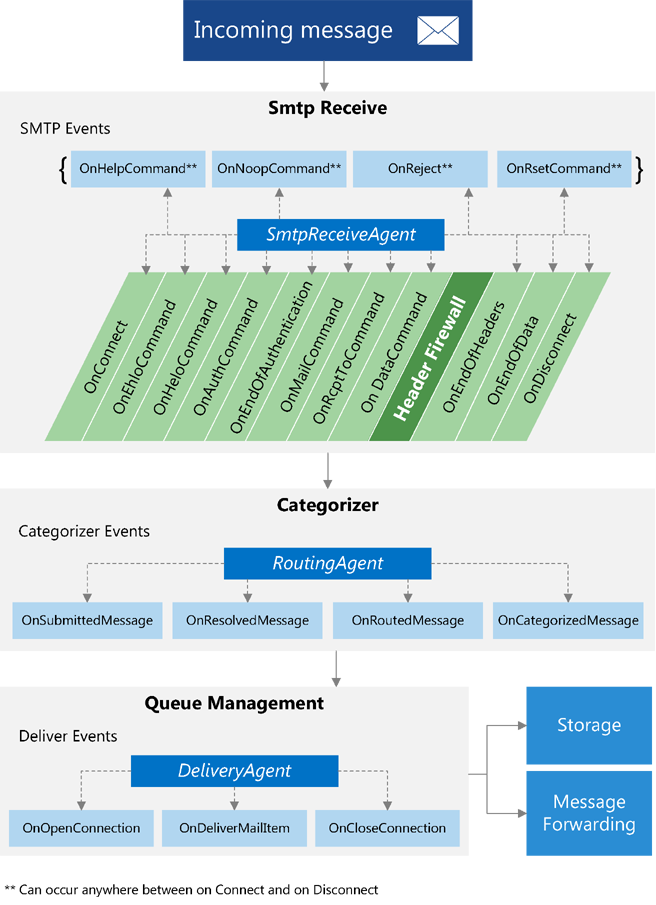
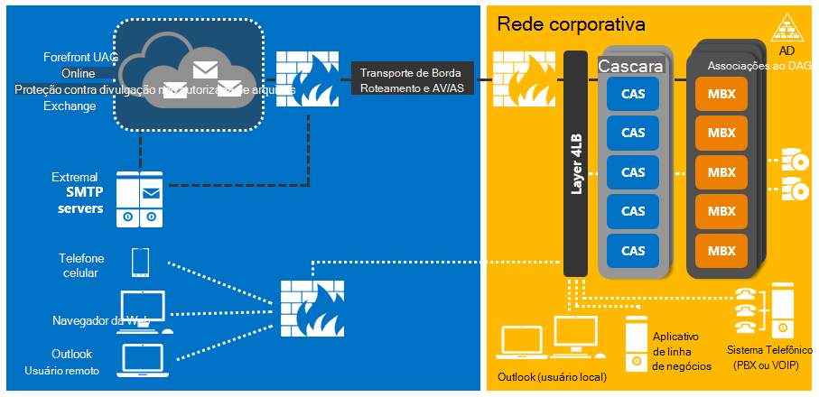
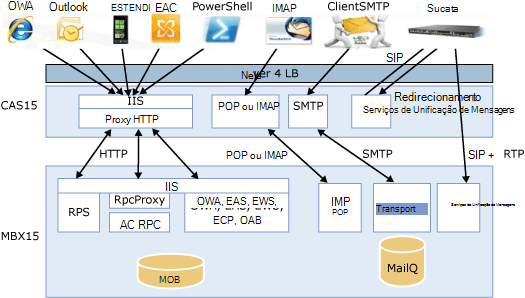

# Transporte conceitos de agente no Exchange 2013

Encontre informações sobre como arquitetura de função de transporte agente pipeline e o servidor no Exchange 2013 afetam desenvolvimento de agente de transporte e as classes que você pode usar para desenvolver agentes de transporte. 
  
**Aplica-se a:** Exchange Server 2013 
  
Você pode usar a biblioteca de classes fornecida com o Exchange Server 2013 para implementar os agentes de transporte que se registrar para eventos e execute ações em mensagens transmitidas através do pipeline de transporte. Você também pode usar os agentes de transporte para modificar as mensagens e converter o conteúdo. 
  
Este artigo fornece informações sobre agentes de transporte e a arquitetura do pipeline de transporte. É importante entender a arquitetura do pipeline de transporte, para que você pode modificar o comportamento de transporte para atender às necessidades da sua organização. Este artigo também fornece informações sobre alterações na arquitetura do Exchange 2013 que afetam os agentes de transporte e as classes que você pode usar para desenvolver agentes de transporte. 
  
## Agentes de transporte no pipeline de transporte

Agentes de transporte são derivados de uma das três classes a seguir:
  
- [SmtpReceiveAgent](https://msdn.microsoft.com/library/Microsoft.Exchange.Data.Transport.Smtp.SmtpReceiveAgent.aspx)
- [RoutingAgent](https://msdn.microsoft.com/library/Microsoft.Exchange.Data.Transport.Routing.RoutingAgent.aspx)
- [DeliveryAgent](https://msdn.microsoft.com/library/Microsoft.Exchange.Data.Transport.Delivery.DeliveryAgent.aspx)
    
O pipeline de transporte refere-se para o fluxo de dados de mensagem dentro dos limites de uma organização do Exchange 2013. O pipeline consiste nos serviços listados na tabela a seguir.
  
**Tabela 1. Serviços do pipeline de transporte**

|**Serviço**|**Descrição**|**Classes suportadas**|
|:-----|:-----|:-----|
|Transporte de Front-End    |É executado em todos os [servidores de acesso para cliente](http://technet.microsoft.com/en-us/library/dd298114%28v=exchg.150%29.aspx) e atua como um proxy sem estado para todo entrado e saído SMTP o tráfego externo para a organização do Exchange 2013. O serviço Front End Transport não inspecionar o conteúdo da mensagem ou localmente todas as mensagens da fila. Ele se comunica com o serviço de transporte em um [servidor de caixa de correio](http://technet.microsoft.com/en-us/library/jj150491%28v=exchg.150%29.aspx).    |[SmtpReceiveAgent](https://msdn.microsoft.com/library/Microsoft.Exchange.Data.Transport.Smtp.SmtpReceiveAgent.aspx)   |
|Transporte    |É executado em todos os servidores de caixa de correio e é semelhante à função de [servidor de transporte de Hub](http://technet.microsoft.com/en-us/library/bb123494%28v=exchg.141%29.aspx) no Exchange Server 2010. O serviço de transporte roteia mensagens entre si e os serviços de transporte de caixa de correio e transporte de Front End. Esse serviço não se comunicar diretamente com bancos de dados de caixa de correio.    |[SmtpReceiveAgent](https://msdn.microsoft.com/library/Microsoft.Exchange.Data.Transport.Smtp.SmtpReceiveAgent.aspx)   [RoutingAgent](https://msdn.microsoft.com/library/Microsoft.Exchange.Data.Transport.Routing.RoutingAgent.aspx)   [DeliveryAgent](https://msdn.microsoft.com/library/Microsoft.Exchange.Data.Transport.Delivery.DeliveryAgent.aspx)   |
|Transporte de caixa de correio    |É executado em todos os servidores de caixa de correio e consiste em dois serviços separados: envio de transporte de caixa de correio e o fornecimento de transporte de caixa de correio. Entrega de transporte de caixa de correio recebe mensagens de SMTP do serviço de transporte e conecta-se ao banco de dados de caixa de correio usando uma chamada de procedimento remoto (RPC) do Exchange para entregar a mensagem. Envio de transporte de caixa de correio se conecta ao banco de dados de caixa de correio usando RPC para recuperar mensagens e envia as mensagens por meio do SMTP para o serviço de transporte.    |Nenhum.    |
   
### Eventos de transporte

Para implementar agentes de transporte, primeiro registrar um evento e, em seguida, dê uma ação quando esse evento é acionado. Cada um dos tipos de três operador pode se inscrever para um conjunto diferente de eventos.
  
A figura a seguir mostra onde no transporte do pipeline de transporte agentes podem registrar eventos.
  
**Figura 1. Eventos de transporte**

  
Quando uma mensagem entra pipeline de transporte, um agente de transporte derivado da classe [SmtpReceiveAgent](https://msdn.microsoft.com/library/Microsoft.Exchange.Data.Transport.Smtp.SmtpReceiveAgent.aspx) pode atuar na mensagem durante qualquer um dos eventos SMTP que o agente de registrado. Um operador derivado da classe [RoutingAgent](https://msdn.microsoft.com/library/Microsoft.Exchange.Data.Transport.Routing.RoutingAgent.aspx) pode atuar em qualquer um dos quatro eventos categorizador que ele foi registrado para. Um operador derivado da classe [DeliveryAgent](https://msdn.microsoft.com/library/Microsoft.Exchange.Data.Transport.Delivery.DeliveryAgent.aspx) pode atuar em uma mensagem durante a qualquer um dos eventos de entrega que ele foi registrado para. 
  
## Agentes de transporte e funções de servidor

Alterações na arquitetura da função de servidor no Exchange 2013 afetam agentes de transporte e o que fazer seus agentes de transporte. Exchange 2013 inclui as seguintes funções de servidor:
  
- Servidor de caixa de correio — protocolos inclui acesso para cliente, o serviço de transporte, bancos de dados de caixa de correio e componentes de Unificação de mensagens. O servidor de caixa de correio comunica-se diretamente com os serviços de domínio Active Directory (AD DS), servidores de acesso para cliente e clientes de email, como o Outlook.
    
- Servidor de acesso para cliente — fornece autenticação, o redirecionamento de limitado, serviços de proxy e protocolos de acesso do cliente, como HTTP, POP, IMAP e SMTP.
    
- Servidor de transporte de borda — roteia e-mail e sair de uma organização. Normalmente, os servidores de transporte de borda sit no perímetro de uma topologia do Exchange.
    
Essa estrutura consolidada reduz o número de servidores que precisam ser implantados em um ambiente do Exchange 2013. Os administradores não é mais necessário implantar servidores de acesso para cliente e transporte de Hub em cada site do Active Directory que inclua um servidor de caixa de correio e eles não precisam mais atualizar todas as funções de servidor a fim de aproveitar a nova funcionalidade.
  
Essas alterações para a arquitetura da função de servidor podem afetar onde no pipeline de seu agente pode responder a eventos. Se você tiver criado os agentes de transporte para versões do Exchange anteriores ao Exchange 2013, certifique-se de revisar as alterações de arquiteturais para determinar se é necessário fazer alterações em seus agentes.
  
A figura a seguir mostra como as alterações de arquitetura no Exchange 2013 resultarem em um pipeline de transporte simplificada, consolidada. Nessa figura, os servidores de acesso para cliente são rotulados CAS. E os servidores de caixa de correio são rotulados MBX.
  
**Figura 2. Arquitetura de função de servidor do Exchange 2013**

  
A figura a seguir mostra as interações entre as funções de servidor do Exchange 2013.
  
**Figura 3. Interações de servidor acesso para cliente e caixa de correio**

  
Para obter mais informações sobre alterações na arquitetura da função de servidor Exchange 2013, consulte [arquitetura do Exchange 2013](http://technet.microsoft.com/en-us/library/jj150540%28v=exchg.150%29.aspx#BKMK_Arch) em [What's New in Exchange 2013](http://technet.microsoft.com/en-us/library/jj150540%28v=exchg.150%29.aspx). 
  
## Classes de agente de transporte

A classe que seu agente de transporte deriva determina os eventos para os quais o agente pode registrar. Seu agente normalmente conterá uma classe de agente, um alocador de agente, um ou mais manipuladores de eventos e o código que executa as ações que você deseja que seu agente assuma.
  
A tabela a seguir lista as classes do qual derivar para cada tipo de agente.
  
**Tabela 2. Classes de agente**

||||
|:-----|:-----|:-----|
|Tipo de agente    |Classe base de fábrica    |Classe de base do agente    |
|Recebimento SMTP    |[SmtpReceiveAgentFactory](https://msdn.microsoft.com/library/Microsoft.Exchange.Data.Transport.Smtp.SmtpReceiveAgentFactory.aspx)   |[SmtpReceiveAgent](https://msdn.microsoft.com/library/Microsoft.Exchange.Data.Transport.Smtp.SmtpReceiveAgent.aspx)   |
|Roteamento    |[RoutingAgentFactory](https://msdn.microsoft.com/library/Microsoft.Exchange.Data.Transport.Routing.RoutingAgentFactory.aspx)   |[RoutingAgent](https://msdn.microsoft.com/library/Microsoft.Exchange.Data.Transport.Routing.RoutingAgent.aspx)   |
|Entrega    |[DeliveryAgentFactory\<Manager\>](https://msdn.microsoft.com/library/Microsoft.Exchange.Data.Transport.Delivery.DeliveryAgentFactory`1.aspx)   |[DeliveryAgent](https://msdn.microsoft.com/library/Microsoft.Exchange.Data.Transport.Delivery.DeliveryAgent.aspx)   |
   
Essas classes base de fábrica e agente fornecem propriedades e métodos que você pode usar para acessar mensagens e eventos de transporte. Implementar classes em seu agente que herdam essas classes. Na classe derivada de fábrica agente, substitua o método **CreateAgent** para que ele retorna uma nova instância da sua classe de agente. 
  
Argumentos passados para os eventos podem conter uma instância da classe [EmailMessage](https://msdn.microsoft.com/library/Microsoft.Exchange.Data.Transport.Email.EmailMessage.aspx) , que você pode usar para alterar as propriedades e o conteúdo da mensagem subjacente. Nem todas as informações de mensagem estão disponíveis em cada evento. Você deve determinar qual agente e qual evento é melhor para a tarefa que você deseja realizar. 
  
Os seguintes namespaces contêm tipos que você pode usar para ler, gravar e modificar as mensagens no pipeline de transporte:
  
- [Microsoft.Exchange.Data.Mime.Encoders](https://msdn.microsoft.com/library/Microsoft.Exchange.Data.Mime.Encoders.aspx)
    
- [Microsoft.Exchange.Data.ContentTypes.iCalendar](https://msdn.microsoft.com/library/Microsoft.Exchange.Data.ContentTypes.iCalendar.aspx)
    
- [Microsoft.Exchange.Data.Mime](https://msdn.microsoft.com/library/Microsoft.Exchange.Data.Mime.aspx)
    
- [Microsoft.Exchange.Data.ContentTypes.Tnef](https://msdn.microsoft.com/library/Microsoft.Exchange.Data.ContentTypes.Tnef.aspx)
    
- [Microsoft.Exchange.Data.ContentTypes.vCard](https://msdn.microsoft.com/library/Microsoft.Exchange.Data.ContentTypes.vCard.aspx)
    
Após você escrever o agente de transporte, você [instalar e gerenciar seu agente](http://technet.microsoft.com/en-us/library/bb125175%28v=exchg.150%29.aspx) usando o Shell de gerenciamento do Exchange. Para obter mais informações, consulte [Creating agentes de transporte do Exchange 2013](creating-transport-agents-for-exchange-2013.md). 
  
## Confira também

- [Agentes de transporte no Exchange](transport-agents-in-exchange-2013.md)    
- [Referência de agente de transporte do Exchange 2013](transport-agent-reference-for-exchange-2013.md)   
- [Lendo e modificando mensagens no pipeline de transporte do Exchange 2013](reading-and-modifying-messages-in-the-exchange-2013-transport-pipeline.md)    
- [What's New in Exchange 2013](http://technet.microsoft.com/en-us/library/jj150540%28v=exchg.150%29.aspx)   
- [Arquitetura de função de servidor do Exchange 2013](http://blogs.technet.com/b/exchange/archive/2013/01/23/exchange-2013-server-role-architecture.aspx)    
- [Caixa de correio e servidores de acesso para cliente](http://technet.microsoft.com/en-us/library/jj150519%28v=exchg.150%29.aspx)   
- [Fluxo de email do Exchange Server 2013](http://technet.microsoft.com/en-us/library/aa996349.aspx)
- [Roteamento do Exchange Server 2013 Mail](http://technet.microsoft.com/en-us/library/aa998825%28v=exchg.150%29.aspx)   
- [PowerShell do Exchange Server (Shell de gerenciamento do Exchange)](https://docs.microsoft.com/en-us/powershell/exchange/exchange-server/exchange-management-shell?view=exchange-ps)
    

